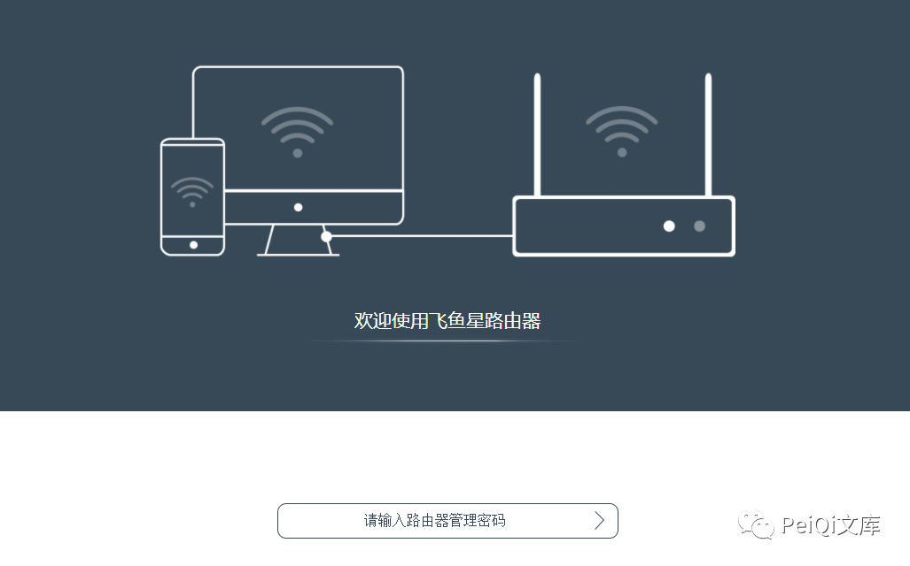
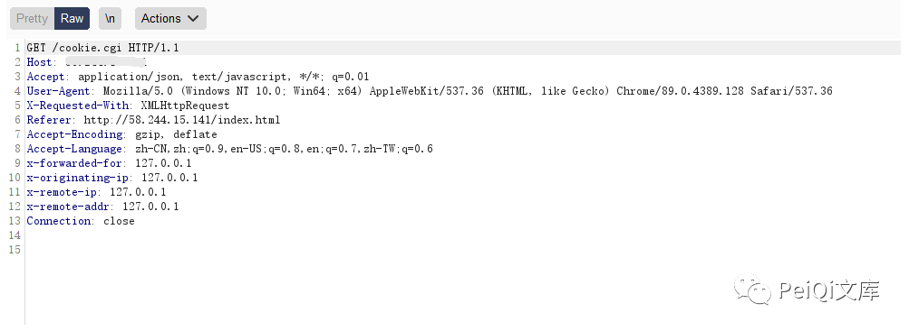
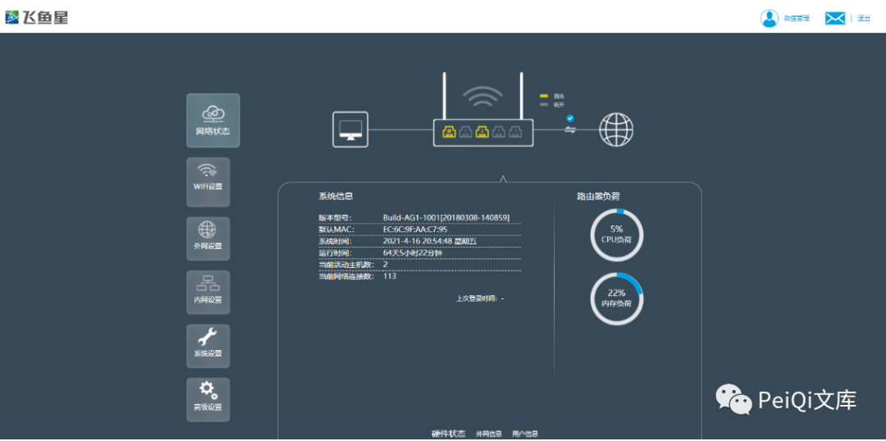

# 飞鱼星 家用智能路由 cookie-cgi 权限绕过

> 指纹字段校订（2026-10-04）：本文原归档明确标为 FOFA 的完整表达式已记入 `fofa`；原残缺 `fofa_unverified` 值逐字保存在 `previous_fofa_unverified`。后文关于该字段残缺的旧说明只描述校订前状态。查询用于产品检索，不证明资产受影响。

<!-- article-review:devices:begin -->
## 技术校订与证据边界（2026-10-02）

- 产品/组件：飞鱼星家用智能路由
- 本文讨论：cookie.cgi检查被Drop后的页面访问
- 版本、权限与配置前提：index.html、拦截请求，未列固件
- 资料类型：前端登录限制绕过摘要；本次仅核对归档正文，未执行 PoC、未请求目标，未把原作者的“复现成功”继承为本库验证结果

### 逐项校订

- 页面可见被称已获管理员权限，缺服务器受限操作证据
- 凡请求cookie.cgi的多款产品都能绕过是无版本泛化；fofa残缺
- 已落实的文本修订：残缺指纹退出可执行索引并保留原值。上列仍描述旧文问题时，以此落实项及下列限定为准；修订不代表运行验证

### 操作风险与恢复

- 本篇未提供足以确认无副作用的完整验证流程；应依正文所述配置、权限与交互前提评估，不能把通告或截图当成可直接运行的检测脚本

### 待核与来源

- API授权与产品跨版范围待核验
- 引用图片未查看，截图内容及有效性待核验
- 文内原始链接和图片引用继续保留；未检查图片像素、未下载或执行外部附件。版本边界、修复/在野状态及厂商归属若缺一手依据，均不能视为本次已确认
- 下方保留原技术正文与载荷；其中历史时间表述和成功主张应按本节限定阅读
<!-- article-review:devices:end -->


<meta name="referrer" content="no-referrer"/>

> 本文由 [简悦 SimpRead](http://ksria.com/simpread/) 转码， 原文地址 [mp.weixin.qq.com](https://mp.weixin.qq.com/s/ARCZIR2C40KSu8SjLMYHSw)


**一****：漏洞描述🐑**

**飞鱼星 家用智能路由存在权限绕过，通过 Drop 特定的请求包访问未授权的管理员页面**

**二:  漏洞影响🐇**

**飞鱼星 家用智能路由**

**三:  漏洞复现🐋**

```
FOFA: title="飞鱼星家用智能路由"
```

**登录页面如下**  



**访问 index.html 时会请求 cookie.cgi**

```
http://xxx.xxx.xxx.xxx/index.html
```

**页面抓包 Drop 掉 cookie.cgi**



****跳转后台获取了权限****



```
其中很多产品都存在请求 cookie.cgi，同样的方法可以绕过  
```

 ****四:  关于文库🦉****

**在线文库：**

**http://wiki.peiqi.tech**

**Github：**

**https://github.com/PeiQi0/PeiQi-WIKI-POC**

**（文库暂时关闭一段时间，敏感问题解决后再次开放~）**

最后
--

> 下面就是文库的公众号啦，更新的文章都会在第一时间推送在交流群和公众号
> 
> 想要加入交流群的师傅公众号点击交流群加我拉你啦~
> 
> 别忘了 Github 下载完给个小星星⭐

公众号

**同时知识星球也开放运营啦，希望师傅们支持支持啦🐟**

**知识星球里会持续发布一些漏洞公开信息和技术文章~**


**由于传播、利用此文所提供的信息而造成的任何直接或者间接的后果及损失，均由使用者本人负责，文章作者不为此承担任何责任。**

**PeiQi 文库 拥有对此文章的修改和解释权如欲转载或传播此文章，必须保证此文章的完整性，包括版权声明等全部内容。未经作者允许，不得任意修改或者增减此文章内容，不得以任何方式将其用于商业目的。**

---

> 来源：MrWQ/vulnerability-paper（https://github.com/MrWQ/vulnerability-paper）
