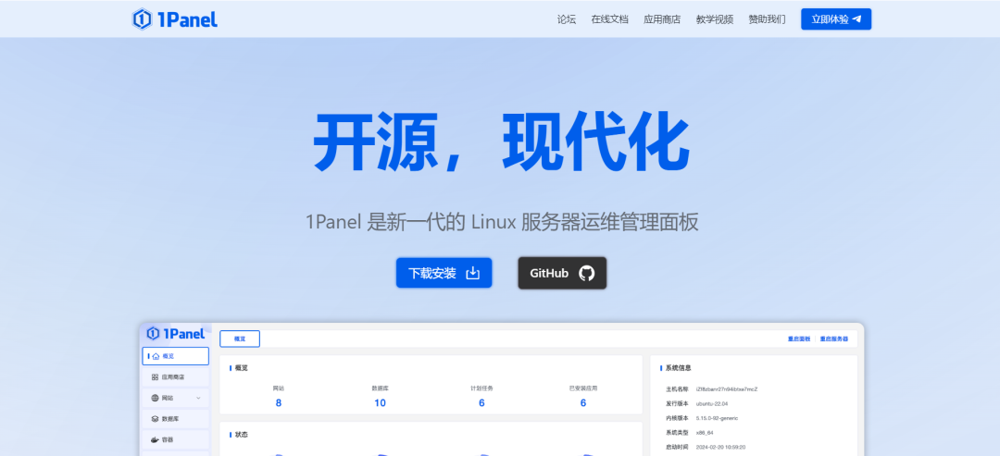

# 漏洞预警 | 1Panel跨站脚本漏洞

<!-- vulwiki-editorial:start -->
## 校订与适用边界

- 适用前提：previewOnly rendering;<=2.0.16 and<=1.10.33-lts claimed; attacker input/victim role unspecified
- 证据范围：Short XSS description but asserts command execution without chain evidence

### 尚未解决的证据缺口

以下限制仍适用于后文历史材料；相关版本、结果或修复结论不能据此视为已验证：

- XSS/browser script execution conflated with server RCE; document any privileged UI/action chain or narrow impact
- No fixed release/advisory link despite 'fixed' claim
- Duplicate product names and broken heading syntax

本页为文本校订，未执行代码、PoC 或目标请求；原图仅保留引用，未据此确认复现成功。
<!-- vulwiki-editorial:end -->

## 技术正文与历史材料

浅安
                    浅安  浅安安全   2026-03-16 00:02  
  
**0x00 漏洞编号**  
- # CVE-2026-23525  
  
**0x01 危险等级**  
- 中危  
  
**0x02 漏洞概述**  
  
1Panel是一个开源的Linux服务器运维管理面板。  
  
  
  
**0x03 漏洞详情**  
###   
  
**CVE-2026-23525**  
  
**漏洞类型：**  
跨站脚本  
  
**影响：**  
执行任意命令  
  
**简述：**  
1Panel存在跨站脚本漏洞，由于该服务器MdEditor组件在启用previewOnly属性时对内容清理不足，攻击者可利用该漏洞实现远程代码执行。  
  
**0x04 影响版本**  
- 1Panel 1Panel <= v2.0.16  
  
- 1Panel 1Panel <= v1.10.33-lts  
  
**0x05 POC状态**  
- 未公开  
  
****  
**0x06****修复建议**  
  
**目前官方已发布漏洞修复版本，建议用户升级到安全版本****：**  
  
https://1panel.cn/  
  
  
  

---

> 来源：gelusus/wxvl（微信公众号漏洞文章自动归档，原文见文首链接）
