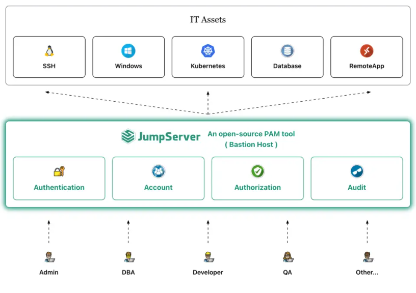

# CVE-2025-27095：JumpServer 中的令牌盗窃漏洞导致 Kubernetes 集群遭受未经授权的访问

<!-- vulwiki-editorial:start -->
## 校订与适用边界

- 适用前提：Authenticated low-privilege user authorized to Kubernetes session; writable kubeconfig and outbound callback
- 证据范围：Explains token leakage by redirecting configured API server; impact explicitly token-RBAC-dependent

### 尚未解决的证据缺口

以下限制仍适用于后文历史材料；相关版本、结果或修复结论不能据此视为已验证：

- Missing all affected/fixed version boundaries and primary advisory
- Clarify exposure of credentials versus intended session permissions; RCE only potential per cluster rights
- Placeholder webhook URL malformed with spaces; avoid interpreting as actual proof

本页为文本校订，未执行代码、PoC 或目标请求；原图仅保留引用，未据此确认复现成功。
<!-- vulwiki-editorial:end -->

## 技术正文与历史材料

 TtTeam   2025-05-05 00:30  
  
开源特权访问管理（PAM）平台 JumpServer 被曝存在新漏洞（CVE-2025-27095），多个版本受影响。该漏洞可通过令牌泄漏引发对 Kubernetes 集群的攻击风险。作为广泛应用于通过 Web 浏览器保障 SSH、RDP、Kubernetes、数据库及 RemoteApp 环境访问安全的平台，JumpServer 在处理 Kubernetes 会话时存在缺陷，致使经过身份验证的低权限用户有机可乘。公告显示，此类用户能够利用 Kubernetes 会话中的漏洞获取 Kubernetes 集群令牌 —— 其具体攻击路径为，低权限用户可访问定义与 Kubernetes API 通信方式的 kubeconfig 文件，通过修改该文件将 API 调用重定向至攻击者控制的外部服务器，进而窃取集群访问令牌，对 Kubernetes 集群安全构成严重威胁。  
  
  
  
只需几个简单的步骤即可利用此漏洞：  
- 在 JumpServer 的 Web 界面中创建一个 Kubernetes 会话。  
  
- 编辑 kubeconfig 文件，将 Kubernetes API 服务器地址替换为攻击者的端点（例如，https ://webhook.site/ ...）。  
  
- 运行标准 kubectl 命令（例如，kubectl get -v 10 pod）以使用修改后的 kubeconfig 发送请求。  
  
- 拦截请求，该请求现在包含集群令牌并直接传输到攻击者的服务器。  
  
一旦获得，被盗的令牌可以被重新用于对 Kubernetes API 进行身份验证——根据分配的权限，这可能导致权限提升、数据盗窃、配置篡改，甚至集群内的远程代码执行。  
  

---

> 来源：gelusus/wxvl（微信公众号漏洞文章自动归档，原文见文首链接）
