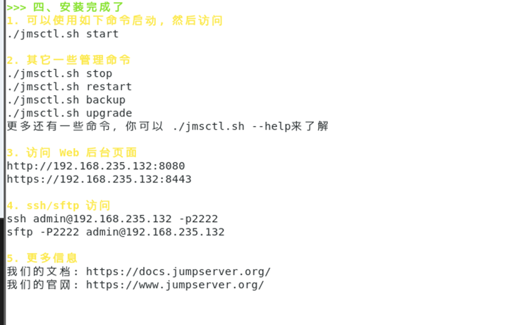
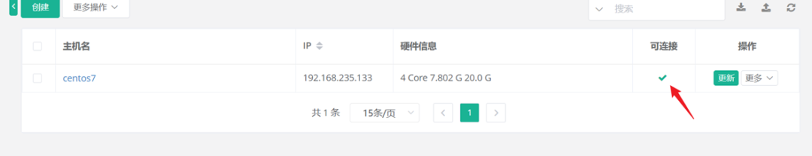
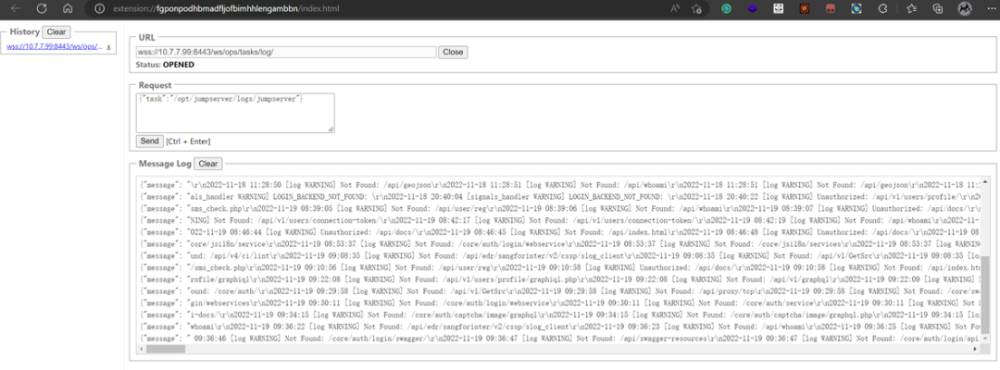
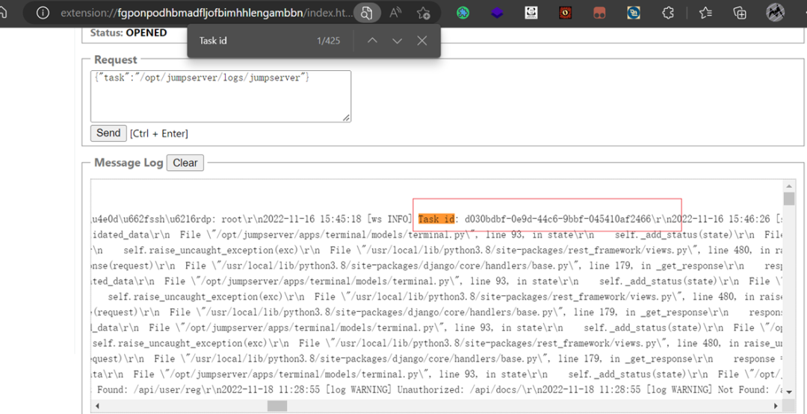
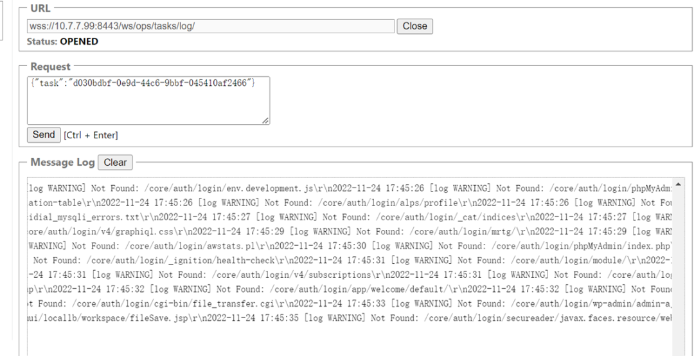
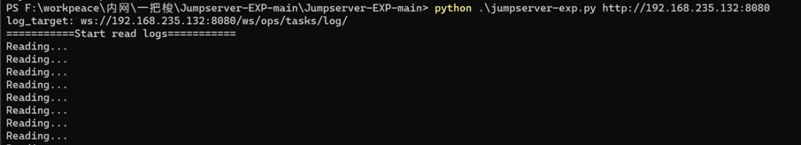
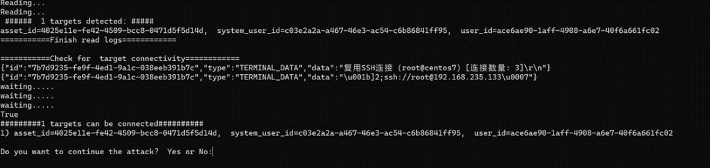
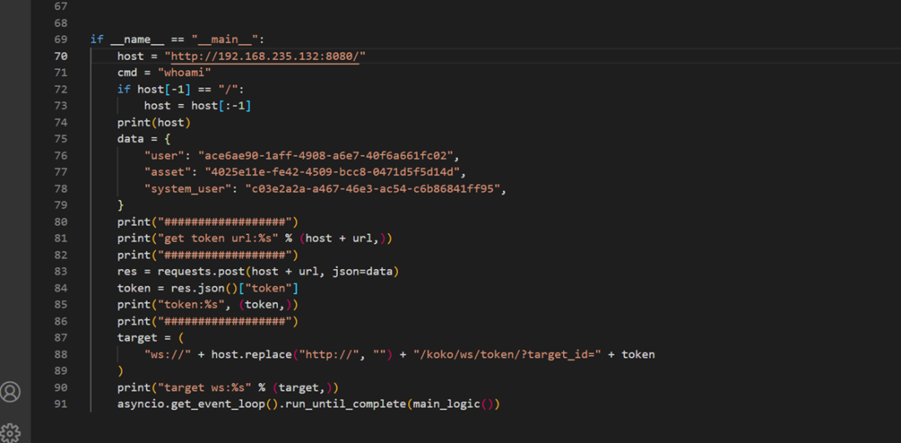
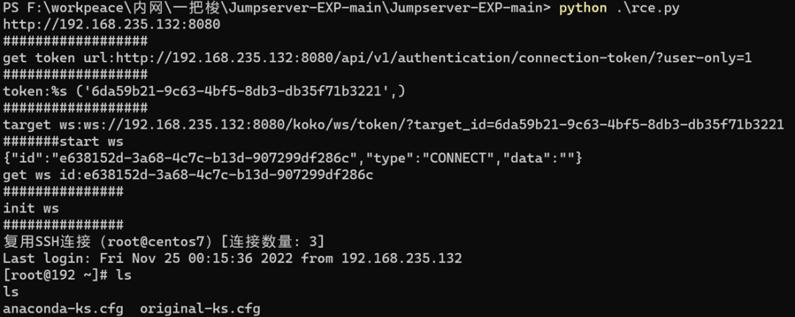

# Jumpserver 未授权访问漏洞

<!-- vulwiki-editorial:start -->
## 校订与适用边界

- 适用前提：LabCentOS7/JumpServer2.6.1, configured asset, IDs in logs; branches not bounded
- 证据范围：Distinct task-log traversal and stale-task discussion; no full RCE script retained

### 尚未解决的证据缺口

以下限制仍适用于后文历史材料；相关版本、结果或修复结论不能据此视为已验证：

- Claim requires administrator currently logged in conflicts with other articles' persistent UUID/log model; verify actual expiry condition
- Primary issue authorization bypass, not merely cached SSH password
- Deployment blog appears title only/no actionable URL; scripts screenshot-only
- Retain independent lab/stale-log evidence; do not wholesale merge by same chain

本页为文本校订，未执行代码、PoC 或目标请求；原图仅保留引用，未据此确认复现成功。
<!-- vulwiki-editorial:end -->

## 技术正文与历史材料

<meta name="referrer" content="no-referrer"/>

> 本文由 [简悦 SimpRead](http://ksria.com/simpread/) 转码， 原文地址 [mp.weixin.qq.com](https://mp.weixin.qq.com/s/wjeB1ZQFbZxzeEkPAP6M0w)

**点击蓝字 关注我们**

MNTMDEV

**1**

**漏洞原理**

Vulnerability Theory

jumpserver 在 web 终端自动登录时缓存了登录密码。根据日志泄露此次 task 的 system_user、user、asset 字段，能模拟到 jumpserver 服务器登录过的资产，即复用 ssh 登录。

**2**

**受影响版本**

Affected Version

< v2.6.2  
< v2.5.4  
< v2.4.5  
= v1.5.9

**3**

**环境搭建**

Environment

实验环境使用 centos 7 系统，内存建议 8g 以上，jumpserver 应用以 docker 容器的形式进行部署。

```
cd /opt
wget https://github.com/jumpserver/installer/releases/download/v2.6.1/jumpserver-installer-v2.6.1.tar.gz
tar -xf jumpserver-installer-v2.6.1.tar.gz
cd jumpserver-installer-v2.6.1
export DOCKER_IMAGE_PREFIX=docker.mirrors.ustc.edu.cn
./jmsctl.sh install

```



使用./jmsctl.sh start 命令可以直接启动服务，初始的账户密码为 admin/admin。

需要添加一个资产，可参考下面的博客。

jumpserver 部署及添加资产_$ 疯狂的程序员的博客 - 程序员宅基地_jumpserver 添加资产 - 程序员宅基地 (cxyzjd.com)

简单来说，需要添加以下用户 / 资产：

1. 资产管理 - 系统用户 添加登录 ssh 的用户 设置为自动登录

2. 资产管理 - 管理用户 jumpserver 相关管理信息推送用户

3. 资产管理 - 资产列表 新增一个 jumpserver 能访问的机器。

4. 权限管理 - 资产授权 创建已有资产的授权管理

如果最终达到如图所示的效果，能够访问了即代表成功。



会话管理 - web 终端连接该资产。

**4**

**利用**

Exploitation

通过 websocket 发送如下请求报文：

```
ws://xx.xx.xx.xx:8080/ws/ops/tasks/log/
{"task":"/opt/jumpserver/logs/jumpserver"}

```



在返回的信息中搜索 Task id 用于进一步查看该 id 的详细信息。

```
{"task":"dc0533d8-078a-47c0-b554-01f368a89a19"}

```



日志内容可能过期，过期考虑找其他的 id。比如下图中在查询该 Task id 时就返回了 Not found 的结果。



在实战中运气足够好，正好赶上管理员登陆了系统未退出，就可以在日志中获取到 system_user、user、asset 这三个字段，则可以 RCE。

**5**

**一把梭系列**

Automatic Exploitation

对于利用过程，读者可以用脚本做 websocket 发包的实现。在理解机制后，即使自己手搓实现，难度也是有手就行啦。

这里在传入参数后，程序会构造请求读取各个 task 的内容。



在这里，成功读取到了我们所需要的重要字段。

```
asset_id=4025e11e-fe42-4509-bcc8-0471d5f5d14d, 
system_user_id=c03e2a2a-a467-46e3-ac54-c6b86841ff95,
user_id=ace6ae90-1aff-4908-a6e7-40f6a661fc02

```



替换 rce 脚本中的 host ，user，system user asset 字段即可使用该 system_user 的身份进行 rce。



运行 rce 脚本之后，从结果可以看到成功完成了命令执行。




**皮**

**卓**

屑阿姨

Aunt Wang

微信号｜MNTMDEV

作者｜花浅凉薄

---

> 来源：MrWQ/vulnerability-paper（https://github.com/MrWQ/vulnerability-paper）
