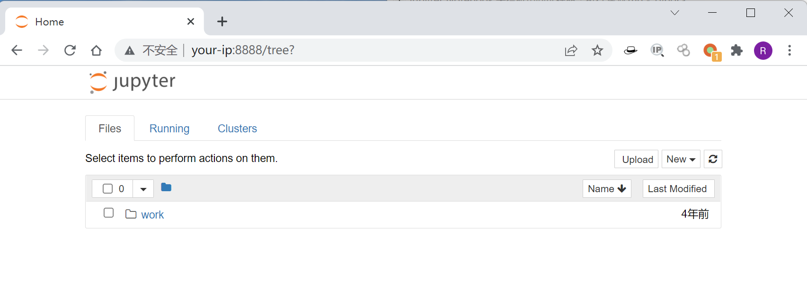
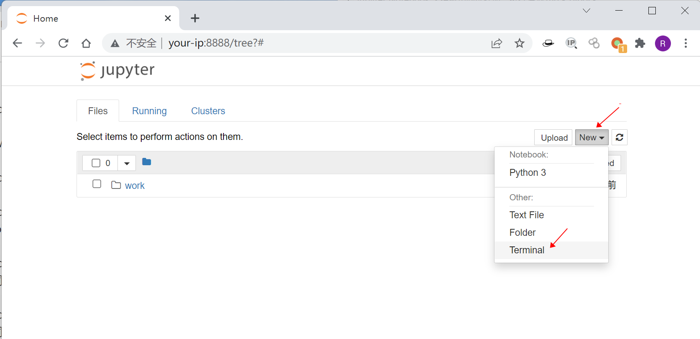
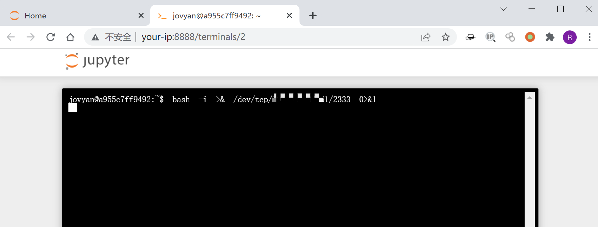
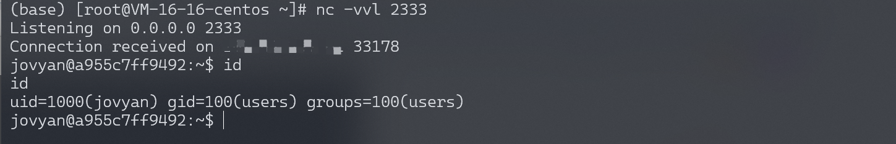

# Jupyter Notebook 未授权访问远程命令执行漏洞

> 版本字段校订（2026-10-04）：误填的版本字段原值逐字保存到对应 `previous_*` 字段。当前值区分正文声称的影响范围、实验环境与尚未知的范围；后文对该元数据误填的旧说明只描述校订前状态，未据此升级来源结论。

<!-- vulwiki-editorial:start -->
## 校订与适用边界

- 适用前提：Unauthenticated publicly reachable notebook with terminal execution enabled; unspecified version/config
- 证据范围：UI terminal is intended functionality when authenticated; security issue is exposure/configuration

### 本次正文校订

- 按实际内容修正 1 处代码围栏语言标记，保留其中方法与请求内容。

### 尚未解决的证据缺口

以下限制仍适用于后文历史材料；相关版本、结果或修复结论不能据此视为已验证：

- 'No password' alone is insufficient prerequisite description; account for token/other authentication settings
- Do not treat every Jupyter version as vulnerable; version metadata merely product name
- Exact vulnerable config and image/compose source absent
- Commands/results only screenshots; expected authority scope is notebook service user

### 操作风险与资料使用

- 含反向连接或交互式命令执行方法：会产生出站连接和子进程；目标、监听端与网络须在授权隔离范围内，结束后关闭会话并核对遗留进程。

本页为文本校订，未执行代码、PoC 或目标请求；原图仅保留引用，未据此确认复现成功。
<!-- vulwiki-editorial:end -->

## 技术正文与历史材料

## 漏洞描述

Jupyter Notebook（此前被称为 IPython notebook）是一个交互式笔记本，支持运行 40 多种编程语言。

如果管理员未为Jupyter Notebook配置密码，将导致未授权访问漏洞，游客可在其中创建一个console并执行任意Python代码和命令。

## 漏洞影响

```
Jupyter Notebook
```

## 网络测绘

```
app="Jupyter-Notebook" && body="Terminal"
```

## 环境搭建

Vulhub运行测试环境：

```shell
docker-compose up -d
```

运行后，访问`http://your-ip:8888`将看到Jupyter Notebook的Web管理界面，并没有要求填写密码。



## 漏洞复现

访问目标, 点击new→Terminal即可创建一个控制台，可以直接执行任意命令：



执行命令并反弹shell：



监听2333端口，成功接收反弹shell：



---

> 来源：Threekiii/Vulnerability-Wiki（https://github.com/Threekiii/Vulnerability-Wiki）
