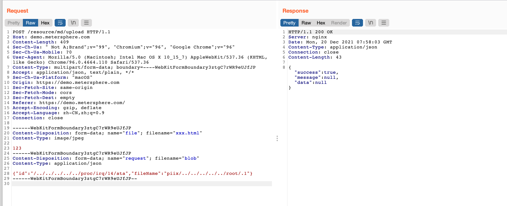

# MeterSphere v1.15.4 resource/md/upload 未授权任意文件写入

本文是对官方仓库公开 issue、原请求截图和固定版本代码的原创中文核对。维护过程仅阅读资料，未向来源示例站点发送请求，未部署或运行 MeterSphere，也未执行漏洞载荷。

## 版本、身份和影响边界

rainmanzzz 于 2021-12-20 在 MeterSphere 官方仓库报告 v1.15.4 的 `/resource/md/upload` 可被未登录用户用于向任意目录上传文件，并声称已在项目演示站点观察到向 `/root/.1` 写入成功。原报告进一步提出写 cron 可转成命令执行，但没有给出 cron 触发的完整请求和执行结果。因此本文标题与已核对事实限定为文件写入，不把原报告标题的 RCE 自动当作本库验证结论。

本次固定 v1.15.4 为提交 `a1b8953b29593b58c98d11badb7cfc78a5920ff8`。其[ShiroUtils.java 第 16–18 行](https://github.com/metersphere/metersphere/blob/a1b8953b29593b58c98d11badb7cfc78a5920ff8/backend/src/main/java/io/metersphere/commons/utils/ShiroUtils.java#L16-L18)将 `/resource/**` 加入 `anon` 链；[ShiroConfig.java 第 34–55 行](https://github.com/metersphere/metersphere/blob/a1b8953b29593b58c98d11badb7cfc78a5920ff8/backend/src/main/java/io/metersphere/config/ShiroConfig.java#L34-L55)表明该配置适用于 local SSO，未配置时也匹配。不能将这一审查结果无条件扩展到所有外置网关和 SSO 部署。

写入权限继承应用进程；普通账户不能凭这个接口自动取得 root 文件系统权限。源截图的 Linux 路径及特殊中间目录也不是每台机器都存在。

## 固定代码对应

[ResourceController.java 第 12–20 行](https://github.com/metersphere/metersphere/blob/a1b8953b29593b58c98d11badb7cfc78a5920ff8/backend/src/main/java/io/metersphere/controller/ResourceController.java#L12-L20)接收 `multipart/form-data`，包含名为 `request` 的 JSON 部分和名为 `file` 的文件部分。`MdUploadRequest` 只有字符串字段 `id`、`fileName`，没有自身校验注解。

[ResourceService.java 第 21–23 行](https://github.com/metersphere/metersphere/blob/a1b8953b29593b58c98d11badb7cfc78a5920ff8/backend/src/main/java/io/metersphere/service/ResourceService.java#L21-L23)把两个用户字段用下划线连接：

```java
    public void mdUpload(MdUploadRequest request, MultipartFile file) {
        FileUtils.uploadFile(file, FileUtils.MD_IMAGE_DIR, request.getId() + "_" + request.getFileName());
    }
```

[FileUtils.java 第 26 行及第 173–190 行](https://github.com/metersphere/metersphere/blob/a1b8953b29593b58c98d11badb7cfc78a5920ff8/backend/src/main/java/io/metersphere/commons/utils/FileUtils.java#L173-L190)中基础目录是 `/opt/metersphere/data/image/markdown`，以 `testDir + "/" + name` 拼接路径并创建 `FileOutputStream`。这个调用链未见将最终 canonical path 限制回 Markdown 图片目录的检查。打开 FileOutputStream 可能截断已有文件，因此不能把它称作“只新增，不覆盖”。

## 原作者的完整请求图片

下图是 issue 原附件的原始字节，已下载并以原尺寸查看。它完整保留请求行、所有可见头部、空行、multipart 两个部分及响应，没有遮盖、替换或裁剪：



图中可见：

- 请求为 `POST /resource/md/upload HTTP/1.1`，没有 Cookie 或 Authorization 头；Host、Origin、Referer 为作者当时使用的演示站点
- `file` 部分的原文件名为 `xxx.html`，Content-Type 声称 `image/jpeg`，实际内容是 `123`
- `request` 部分是 JSON；`id` 中的目录穿越路径以 `/proc/irq/14/ata` 结尾，`fileName` 以 `piix/` 开始，再使用父目录段指向 `root/.1`。结合代码中的下划线拼接，原示例依赖 `ata_piix` 这一中间目录及其路径解析条件
- 图中响应为 HTTP 200，JSON 显示 `success: true`，`message` 和 `data` 为 null。图片自身没有目标文件的回读或文件系统画面；“文件位于 /root/.1”是 issue 作者的文字报告，不能仅由成功 JSON 独立证明

原请求的 Content-Length 为 409，本库未重新计算或修改它。截图保留完整目录穿越字节，本文的文字说明没有用新构造请求替代原 PoC。

若按资料在授权实验环境对照，需同时观察上传返回值和最终文件内容/位置，并确认服务运行账户与中间目录，而不是把 `success: true` 当成路径穿越已证明。此处描述证据要求，不表示维护者执行过。

## 修复核对

维护者在 [issue 回复](https://github.com/metersphere/metersphere/issues/8653#issuecomment-1008541129)称“v1.16以上版本已修复”。本次固定 v1.16.0 为 `b4ed25de1e264a7d0c961ce254c35bf61e2ce917`，其 [ShiroUtils.java 第 16–18 行](https://github.com/metersphere/metersphere/blob/b4ed25de1e264a7d0c961ce254c35bf61e2ce917/backend/src/main/java/io/metersphere/commons/utils/ShiroUtils.java#L16-L18)已将原 `/resource/**` 匿名规则收窄为 `/resource/md/get/`。这为“上传端点不再沿原广泛规则匿名开放”提供代码依据。

但 v1.16.0 的 `mdUpload` 路径拼接及 `FileUtils.uploadFile` 本身仍保持原样；本文不据“已关闭匿名边界”宣称认证后任意路径问题也经过了完整修复验证。升级应使用厂商当前受支持且包含安全修复的版本，不能把 2021 年的最低版本当作当前安全基线。

## 静态防投毒、资源与审阅范围

本条采用人工可读的原 HTTP 请求图片，没有引入 PoC 安装器、扫描器、依赖安装命令、工作流或二进制程序。固定 v1.15.4 上审阅了 ResourceController、MdUploadRequest、ResourceService、ShiroConfig、ShiroUtils 相关鉴权入口和 FileUtils 上传函数；固定 v1.16.0 对照了相同路径。只读代码检查没有执行上传或示例里的文件路径。

入口内的文件写入和覆盖是漏洞本身及 PoC 的直接作用，未发现该选定请求另行下载代码、回连外传、建立持久化账户或破坏性清理的动作。本文没有把整个 MeterSphere 所有依赖、其他接口或部署脚本称作已审计。

图片原始 URL 为 `https://user-images.githubusercontent.com/26007706/146804566-36ca34f5-76a6-41d6-8d5f-56b6e7dedcee.png`，大小 313175 字节，SHA-256 为 `f57a0366678a28e330181b7fe7cfc0aa4e07c98b0d07e883e1b3c9c7e358154f`。正文只加载库内相对图片，没有远程图片依赖。

## 来源

- [MeterSphere issue 8653](https://github.com/metersphere/metersphere/issues/8653)：原作者报告、v1.15.4 测试声明、请求图片及修复讨论
- [固定 v1.15.4 源码](https://github.com/metersphere/metersphere/tree/a1b8953b29593b58c98d11badb7cfc78a5920ff8)：入口、字段、匿名链和文件写入路径
- [固定 v1.16.0 源码](https://github.com/metersphere/metersphere/tree/b4ed25de1e264a7d0c961ce254c35bf61e2ce917)：匿名规则变化及仍保留的路径拼接边界

核对日期：2026-10-05。未由这份 issue 擅自分配 CVE/CNVD 编号。

