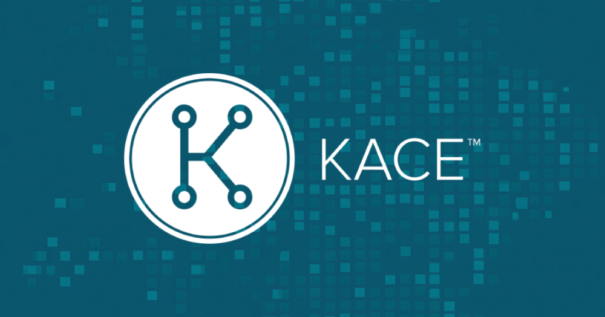

# Quest KACE SMA 漏洞 CVE-2025-32975：一个未修复工具漏洞，为 60 家机构敞开入侵大门

<!-- vulwiki-editorial:start -->
## 校订与适用边界

- 适用前提：Network-accessible SSO authentication path; no account required per report; versions absent
- 证据范围：Incident/supply-chain impact narrative, no technical reproduction

### 尚未解决的证据缺口

以下限制仍适用于后文历史材料；相关版本、结果或修复结论不能据此视为已验证：

- Title 'unfixed vulnerability' conflicts with body vendor patch availableMay2025; distinguish unpatched deployment
- 2026May date vs repeated10months afterMay2025 is inconsistent without incident date
- 12000 exposed devices all vulnerable asserted without source/methodology; exposure not automatically vulnerability
- No affected/fixed versions, vendor patch or IOC report links
- Preserve victim attribution as sourced allegations and avoid reproducing stolen credentials

### 操作风险与资料使用

- 含反向连接或交互式命令执行方法：会产生出站连接和子进程；目标、监听端与网络须在授权隔离范围内，结束后关闭会话并核对遗留进程。

本页为文本校订，未执行代码、PoC 或目标请求；原图仅保留引用，未据此确认复现成功。
<!-- vulwiki-editorial:end -->

## 技术正文与历史材料

鹏鹏同学
                    鹏鹏同学  黑猫安全   2026-05-14 00:45  
  
  
  
CVE-2025-32975 是 **Quest KACE SMA**  
 终端管理平台的高危漏洞。一旦被利用，可影响企业内所有受托管系统。  
  
Quest KACE SMA 是一款本地部署型终端管理平台，用于软件部署、漏洞补丁推送及设备管控。因其处于运维核心枢纽地位，成为黑客高价值攻击目标；一旦平台被攻陷，所有受托管终端都将面临暴露风险。  
  
网络安全研究平台 Hunt.io 发布的报告指出：**“CVE-2025-32975 是 KACE SMA 单点登录认证机制中的高危认证绕过漏洞，CVSS 评分满分 10.0 分。**  
 该漏洞允许**无授权、网络可达**  
的攻击者冒充合法用户（含管理员账号），全程无需任何账号凭据。”  
  
阅读这类安全事件报告时，常会有一种无奈感：攻击者无需高超的技术，只需足够耐心，坐等企业疏于打补丁即可。  
  
CVE-2025-32975 的事件本质正是如此：Quest KACE 系统管理设备是数千家企业 IT 团队通用运维工具，可统一管理软件分发、补丁推送与终端管控。这类核心运维平台一旦被攻陷，受影响的绝不只是平台自身所属企业，而是该平台所托管的**全部下游机构**  
。  
  
该漏洞风险等级拉满，CVSS 给到满分 10.0。Quest 官方早在 2025 年 5 月就发布了修复补丁，然而时隔十个月，仍有大量设备未更新，遭到攻击者批量利用。  
  
本次事件的特殊警示意义，不只在于数据泄露本身，更在于攻击者后续留下的低级失误。攻击者攻陷波士顿地区数十家机构的托管服务提供商 HIQ 后，竟将全套攻击工具包存放至一台**目录无密码保护**  
的服务器上。Hunt.io 的全网扫描系统在其作案三天后就直接捕获到这份公开文件，存放于普通明文 HTTP 服务器中，任何人都能随意访问浏览。  
  
报告补充说明：“这份 308MB 的工具包包含 219 个文件，覆盖完整入侵生命周期，内含反弹 Shell、双向 C2 文件服务器、账号创建工具、SMB 凭据喷洒工具、WMI 内网探测工具，以及可实现持久隐蔽内网接入的自定义 TCP 多路复用 SOCKS5 隧道。”  
  
这绝非业余攻击者的随机作案：工具包架构规整、功能完备，覆盖专业入侵全流程 —— 从初始 Shell 接入，到搭建隐蔽持久的内网通信通道一应俱全。  
  
此次泄露的数据量级更令人警醒。攻击者从 KACE 设备中导出一份 512MB 的数据库备份，里面完整包含 HIQ 公司全部 IT 业务核心数据：员工账号、客户清单、服务工单；工单记录涉及警察局、学校、医疗机构及地方政府部门的运维业务详情。  
  
Hunt.io 表示：“外泄的 MariaDB 数据库备份中，可查到**60 余家知名客户机构**  
的托管终端信息，涵盖执法机关、政府单位、医疗、教育及私营企业多个领域。”  
  
这 60 余家机构本身并未部署和使用 KACE 平台，只是这家托管服务商的下游客户。这正是**供应链安全风险**  
的典型写照：企业自身安全防护做到滴水不漏，仍可能因信任的第三方服务商未及时修补漏洞，最终自身信息被打包泄露。  
  
工具包痕迹还显示，除 HIQ 之外，攻击者至少已攻陷另外两家目标。一份探测脚本中硬编码留存了某印尼保险公司账号凭据，说明该凭据早已从更早的入侵中窃取，被留作后续内网横向移动复用。  
  
攻击者为隐匿行踪，使用了洋葱浏览器 Tor 及加密通讯软件；两份 Windows 快捷方式文件的元数据显示，其作案环境部署在一台租用的 Windows Server 2019 虚拟服务器上，主机名为系统自动生成，属于典型的作案即用即弃的临时服务器。  
  
Hunt.io 扫描数据显示：目前全网仍有**超过 12000 台 K1000 设备暴露在公网**  
，通过标准及非标端口对外放行，且版本均停留在补丁发布前的高危版本。  
  
数量高达一万两千台。事实证明，仅仅把服务改到**非标准端口**  
，完全无法规避被全网扫描探测。  
  
本次事件的警示非常直白：一款满分高危认证绕过漏洞，暴露在公网的运维管理平台上**放任十个月不补丁**  
，最终导致 60 余家下游执法、医疗、教育及政府机构无辜被牵连泄露，而这些机构本身从未接触过这款漏洞软件。攻击者工具包技术成熟，但初始入侵门槛极低 —— 等同于一扇不上锁的登录入口，坐等黑客随意闯入。  
  
若企业正在使用 KACE SMA，官方补丁自 2025 年 5 月就已发布，关键只在于：**是否已经完成补丁部署**  
。  
  
研究人员同时已发布本次事件的**入侵特征指标（IoC）**  
。  
  
  

---

> 来源：gelusus/wxvl（微信公众号漏洞文章自动归档，原文见文首链接）
