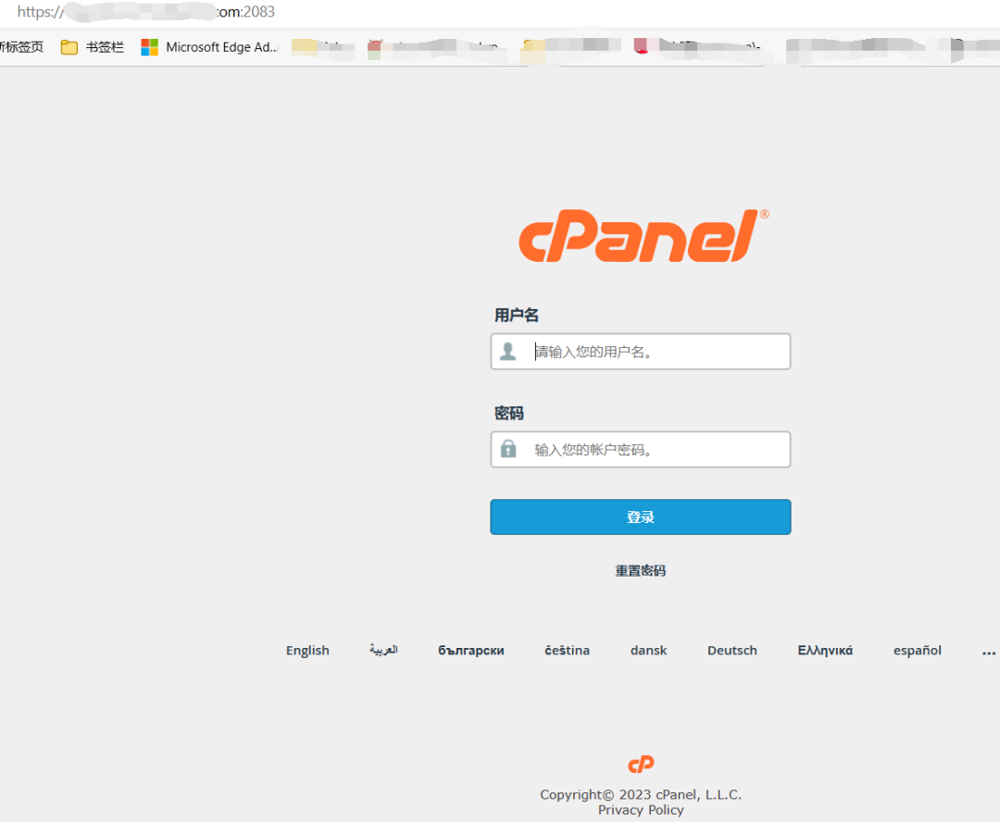
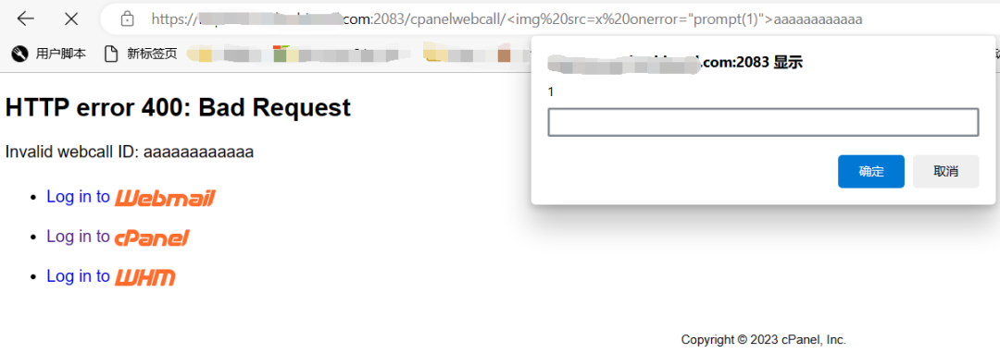

# cPanel XSS漏洞分析研究（CVE-2023-29489 ）

<!-- vulwiki-editorial:start -->
## 校订与适用边界

- 适用前提：Unauthenticated payload delivery;victim browser interaction;webcall route reachable via hosting frontend;branch-specific versions
- 证据范围：Error-message encoding omission with source snippets and payloads;no response headers in text

### 尚未解决的证据缺口

以下限制仍适用于后文历史材料；相关版本、结果或修复结论不能据此视为已验证：

- Perl snippet 'ordo' and YAML '-method:GET'/indentation malformed
- Top-level affected<11.109.9999.116 conflicts with fixed older branches;structure per branch
- Unqualified any-path routing claim overstates explicit /cpanelwebcall prefix condition
- ProductPHP/LinuxBSD boilerplate needs verification against actual Perl cpsrvd component
- Missing victim interaction/browser context;no explicit original advisory

本页为文本校订，未执行代码、PoC 或目标请求；原图仅保留引用，未据此确认复现成功。
<!-- vulwiki-editorial:end -->

## 技术正文与历史材料

 蚁景网安   2025-02-20 08:31  
  
## 前言  
  
由于传播、利用此文所提供的信息而造成的任何直接或者间接的后果及损失，均由使用者本人负责，文章作者、公众号及平台不为此承担任何责任。  
  
如果文章中的漏洞出现敏感内容产生了部分影响，请及时联系作者，望谅解。  
## 一、漏洞原理  
### 漏洞简述  
  
cPanel 是一套在网页寄存业中最享负盛名的商业软件，是基于于 Linux 和 BSD 系统及以 PHP 开发且性质为闭源软件；提供了足够强大和相当完整的主机管理功能，诸如：Webmail 及多种电邮协议、网页化 FTP 管理、SSH 连线、数据库管理系统、DNS 管理等远端网页式主机管理软件功能。  
  
该漏洞可以无身份验证情况下利用，无论cPanel管理端口2080, 2082, 2083, 2086是否对外开放  
### 漏洞影响范围  
  
**供应商**：cPanel  
  
**产品**：cPanel  
  
**确认受影响版本**：< 11.109.9999.116  
  
**修复版本**：11.109.9999.116, 11.108.0.13, 11.106.0.18, and 11.102.0.31  
### 漏洞分析  
  
本漏洞的漏洞点来自系统中涉及交互的关键变量未进行转义或过滤处理，导致攻击者可以构造恶意代码作为输入进行利用。  
  
Httpd.pm：  
```
elsif (0==rindex( $doc_path,'/cpanelwebcall/',0)){

# First 15 chars are “/cpanelwebcall/”
    _serve_cpanelwebcall(
        $self->get_server_obj(),
substr( $doc_path,15),
);
}
```  
  
上述代码说明任何路径均会被路由到，包括目录后的字符部分。  
  
其中涉及函数_serve_cpanelwebcall：  
```
sub _serve_cpanelwebcall ( $server_obj, $webcall_uri_piece ) {
    require Cpanel::Server::WebCalls;
    my $out = Cpanel::Server::WebCalls::handle($webcall_uri_piece);

    $server_obj->respond_200_ok_text($out);
    
    return;

}
```  
  
其中局部变量out为handle函数的返回值，是参数webcall_uri_piece的处理结果。  
```
sub handle ($request) {

my $id = extract_id_from_request($request);
substr( $request,0,length $id )=q<>;

Cpanel::WebCalls::ID::is_valid($id)ordo{
die _http_invalid_params_err("Invalid webcall ID: $id");
    };
```  
  
handle函数主要先从request提取id，之后根据id情况进行处理  
```
sub _http_invalid_params_err ($why) {
    return Cpanel::Exception::create_raw( 'cpsrvd::BadRequest', $why );
}
```  
  
_http_invalid_params_err函数主要是返回错误信息  
  
进一步分析发现Httpd::ErrorPage下的 message_html变量未做任何处理，可被该漏洞利用  
### 补丁部分  
  
在最新版本cPanel可以看到针对该漏洞进行修复  
  
Cpanel/Server/Handlers/Httpd/ErrorPage.pm：  
```
++ use Cpanel::Encoder::Tiny               (); 

... omitted for brevity ...

++ $var{message_html} = Cpanel::Encoder::Tiny::safe_html_encode_str( $var{message_html} );
```  
## 二、漏洞复现实战  
### 漏洞复现  
  
首先以某个cPanel target为例  
  
  
  
cPanel资产  
  
之后根据POC进行复现  
  
**POC**：  
```
http://example.com/cpanelwebcall/aaaaaaaaaaaa
http://example.com:2082/cpanelwebcall/aaaaaaaaaaaa
http://example.com:2086/cpanelwebcall/aaaaaaaaaaaa
```  
  
注：其他端口也有可能存在该漏洞  
```
requests:
  -method:GET
path:
-'{{BaseURL}}/cpanelwebcall/aaaaaaaaaaaa'
matchers:
-type:word
words:
- ''
```  
  
执行POC  
  
  
  
XSS POC执行情况  
### 漏洞修复  
  
建议更新至版本11.109.9999.116、 11.108.0.13 、11.106.0.18 和 11.102.0.31  
  
启用cPanel 自动更新功能  
## 结束语  
  
本文主要介绍了CVE-2023-29489 cPanel XSS漏洞的原理分析及复现过程，漏洞主要由于涉及交互的关键变量未进行转义或过滤处理，从而造成攻击者可以在无身份验证情况下进行利用。  
  
  
  
学习  
网安实战技能课程，戳  
“阅读原文“  
  


---

> 来源：gelusus/wxvl（微信公众号漏洞文章自动归档，原文见文首链接）
