# Nginxwebui后台命令执行审计

<!-- vulwiki-editorial:start -->
## 校订与适用边界

- 适用前提：Authenticated backend; tested3.9.8;3.9.9 applicability inferred not tested; filesystem/service permissions
- 证据范围：Five distinct audit paths, mostly source/request/result screenshots; retain independent research

### 尚未解决的证据缺口

以下限制仍适用于后文历史材料；相关版本、结果或修复结论不能据此视为已验证：

- Do not elevate speculative3.9.9 applicability to confirmed affected range
- All relevant code and requests mostly image-only; extract text before canonical reuse
- Command execution mislabeled 'code execution' merely because Runtime.exec is used
- Text says $(IFS), later${IFS}; distinguish typo and actual tested input
- SSH login via writable authorized_keys depends SSH settings/service UID; not automatic universal root
- Remediation list is concatenated, typo-heavy and relies on blacklist snippets; prefer vendor patch/validated canonical path containment
- No CVE/fixed build/commit mapping; separate intended admin functionality from privilege boundary failure

本页为文本校订，未执行代码、PoC 或目标请求；原图仅保留引用，未据此确认复现成功。
<!-- vulwiki-editorial:end -->

## 技术正文与历史材料

uname  黑伞安全   2024-04-03 17:56  
  
本文首发先知：https://xz.aliyun.com/t/14227  
## 前言  
  
半年前，审计过一次这套代码，那时候想着后台有命令执行的功能点，就没关注rce，审计了一些别的水洞。这次hookdd没事，说审计了一个rce，说一起看看，所以这次就只看rce，最后就有个以下几个洞。本次使用的3.9.8版本，但是刚刚更新了3.9.9，不过看描述，并没有修复一下几个点，应该都可以使用。  
#### 0x01 zip自解压  
  
com.cym.controller.adminPage.MainController#upload  
  
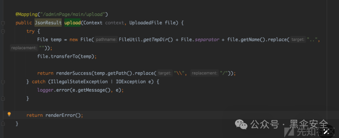  
  
功能比较简单，可以看见把tmpdir+'/'+文件名拼接，然后保存进去，没有限制后缀，其实限制不限制都能r掉。其中FileUtil.getTmpDir()会获取系统的临时目录，mac系统为  
  
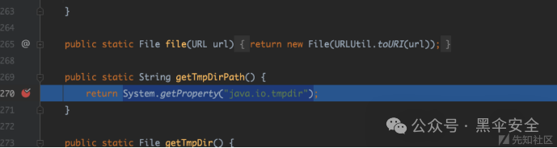  
  
ubuntu系统的临时目录为/tmp。  
  
对应的前端功能点  
  
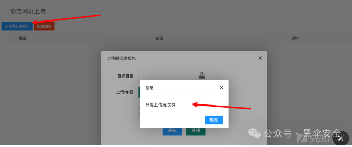  
  
前端这里是限制了zip上传，但是我们看后端是没有判断的，直接会把上传的文件放到临时目录。  
  
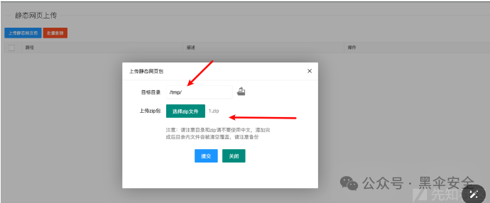  
  
当我们选择好目录时，他会调用com.cym.controller.adminPage.WwwController#addOver进行处理  
  
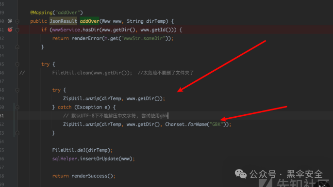  
  
可以看到，我们能控制解压目录，以及需要解压的文件，最后调用zip进行解压。那么其实很简单了，TmpDir()我们知道，文件名知道，我们只需要上传一个ssh密钥到.ssh目录下就可以了。  
#### 复现  
  
先选择要上传的zip文件  
  
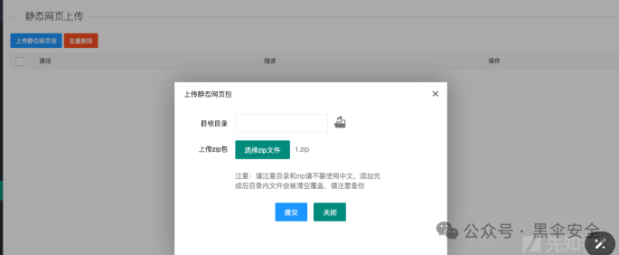  
  
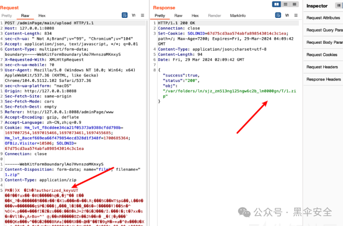  
  
可以看到以及上传到tmp目录，这是macos的，ubuntu在/tmp下  
  
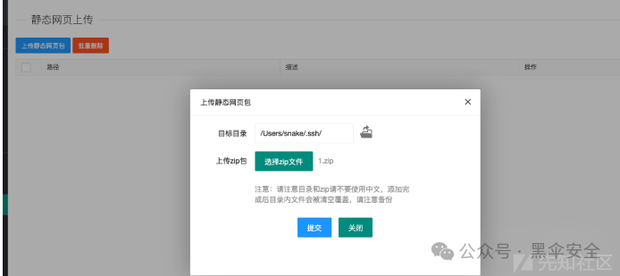  
  
选择好ssh目录。  
  
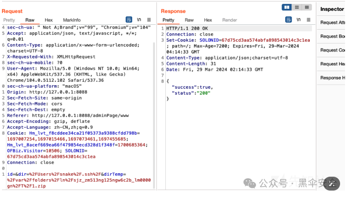  
  
对应数据包。  
  
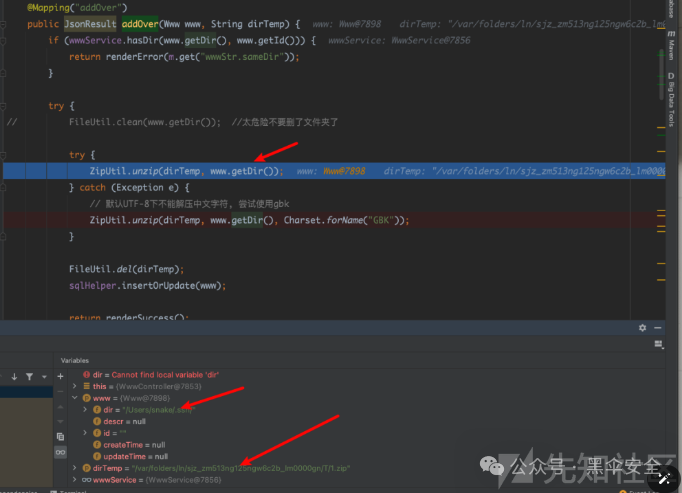  
  
最后直接调用zip解压到ssh目录  
  
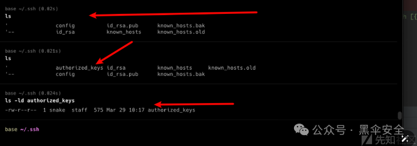  
  
成功解压到ssh  
  
最后也是使用公钥直接登录  
### 0x02 zip目录穿越  
  
上面那种方法，其实只能打一次，因为在zip解压的时候会在数据库查询，钥匙已经同目录穿过，会抛出异常。  
  
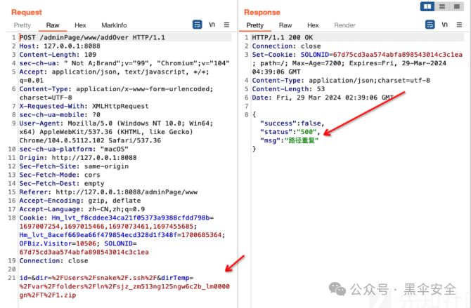  
  
com.cym.controller.adminPage.WwwController#addOver  
  
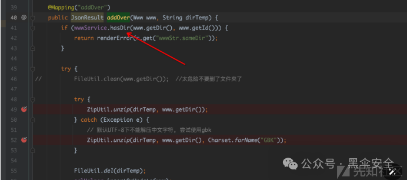  
  
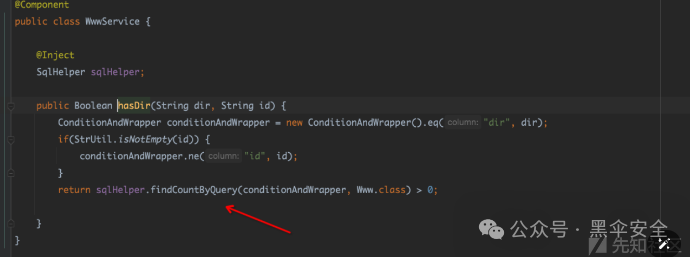  
  
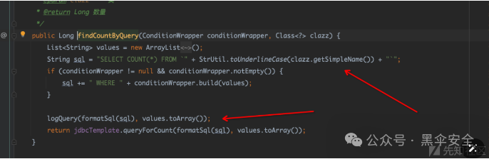  
  
这里可以清楚得看到，会在sql里面查询上传目录是否存在，存在就抛出异常。这里有两种解决办法，第一种就是传入ssh的id，使其能正常修改目录的文件内容  
  
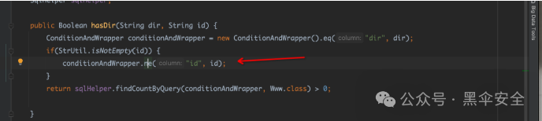  
  
id可以直接f12获得，  
  
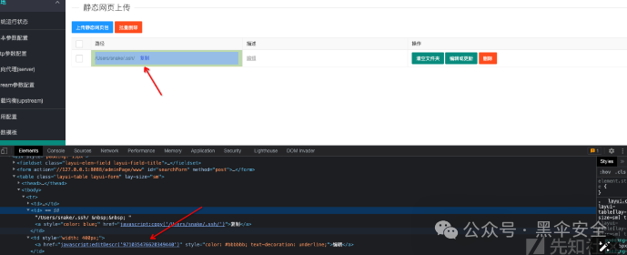  
  
填入后就可以正常穿  
  
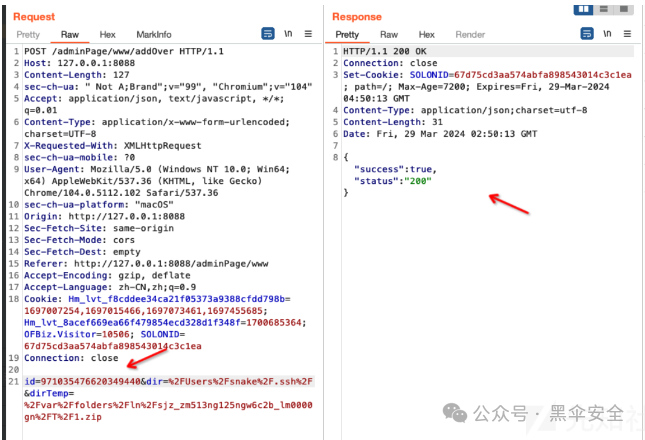  
  
第二种就比较暴力cn.hutool.core.util.ZipUtil#unzip(java.util.zip.ZipFile, java.io.File, long)  
  
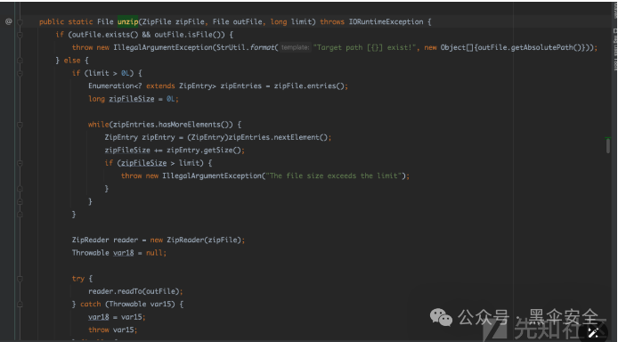  
  
zipentry没有对../过滤。zip解压时是没有对zip目录穿越进行过滤的，所以可以利用zip目录穿越来传文件，dir保证是没有使用过的就行。  
#### 复现  
  
上传zip_slip.zip  
  
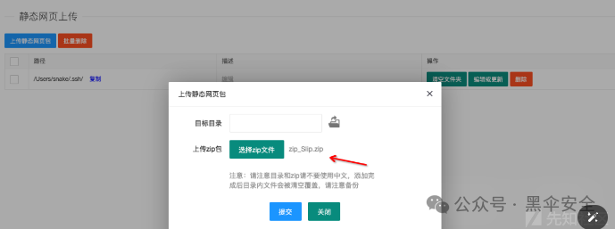  
  
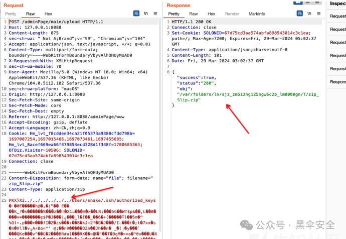  
  
得到路径  
  
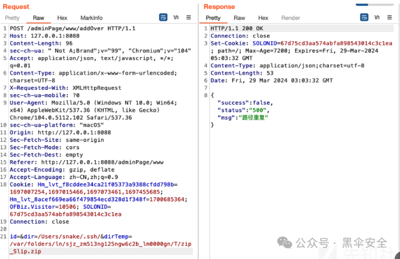  
  
上传时显示路径重复，这时我们dir任意写一个本地存在的目录，确保数据库没有就行。  
  
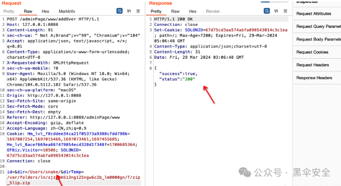  
  
最后成功上传。  
  
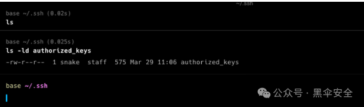  
  
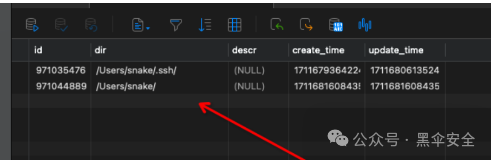  
  
数据库里面的状态。  
### 0x03 runcmd绕过造成命令执行  
  
com.cym.controller.adminPage.ConfController#runCmd  
  
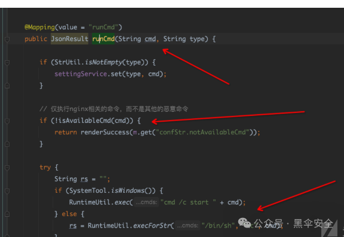  
  
可以看到穿进来的cmd先进行过滤，在进行拼接执行。com.cym.controller.adminPage.ConfController#isAvailableCmd  
  
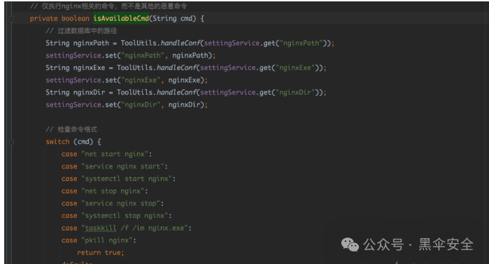  
  
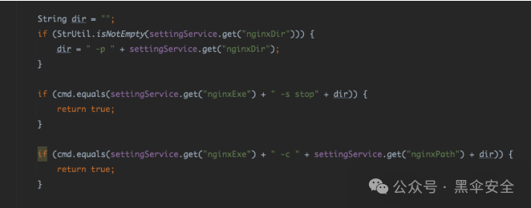  
  
可以先读取nginxPath、nginxExe、nginxDir三个值，首先判断在不在case里面，不在就进入if，主要就是判断cmd和settingService.get("nginxExe") + " -c " + settingService.get("nginxPath") + dir是不是想等，不想等就不执行，想等就执行com.cym.controller.adminPage.ConfController#saveCmd  
  
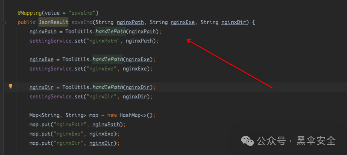  
  
而刚好这三个值我们可自由控制。  
  
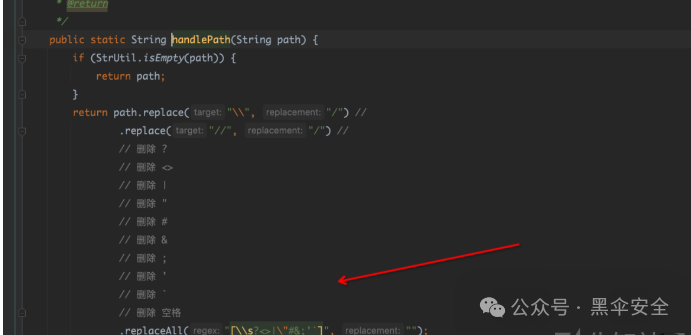  
  
它会对传值进行过滤，其实看看很好绕过。linux用$(IFS)代替空格就行，win用powershell.exe(calc) 就行  
#### 复现  
  
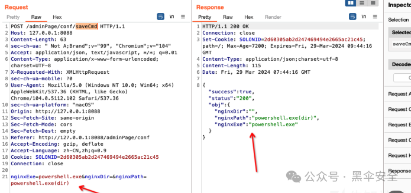  
  
先修改两个值  
  
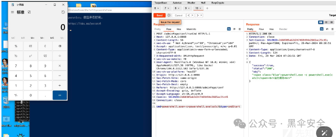  
  
成功执行  
  
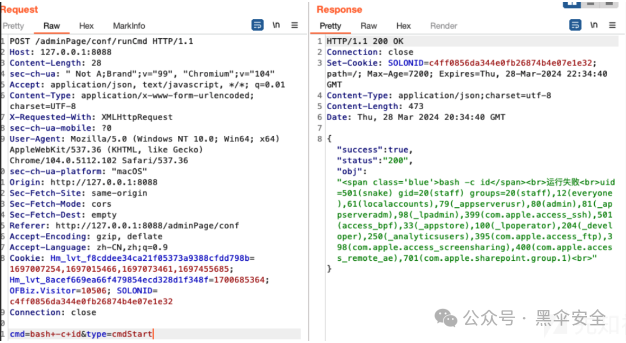  
  
可以执行。  
  
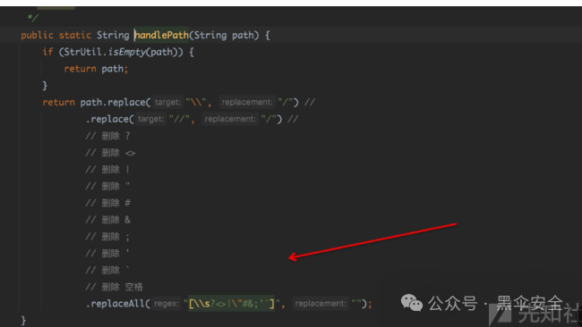  
  
由于有过滤，所以我们可以把reserveshell写进文件，在用bash来执行就好。利用前面分析得，上传点自动缓存到tem目录，ubuntu为/tmp目录.。强烈建议不要用macos这傻逼每个shell环境里面var/folders/ln/sjz_zm513ng125ngw6c2b_lm0000gn都不一样。  
  
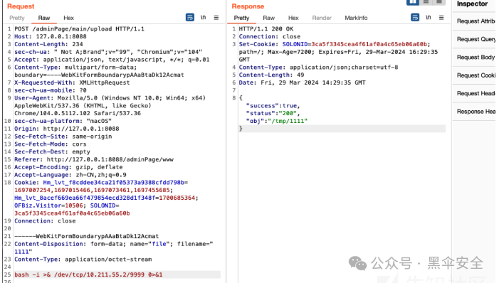  
  
换ubuntu后，成功rce  
  
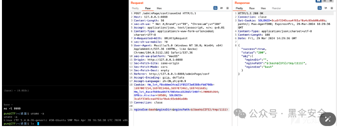  
### 0x04 reload 代码执行  
  
com.cym.controller.adminPage.ConfController#reload  
  
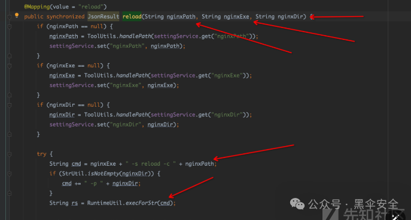  
  
没什么好说的，全可控，没有过滤。然后拼接，进行执行。cn.hutool.core.util.RuntimeUtil#exec(java.lang.String...)  
  
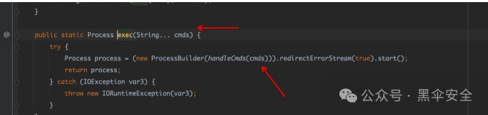  
  
最后会调用到这里，和上面不同，这里是代码执行  
#### 复现  
  
生成java格式代码执行  
  
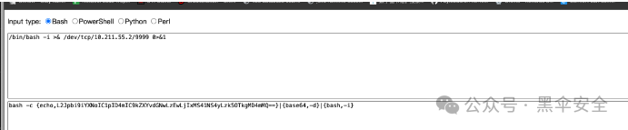  
  
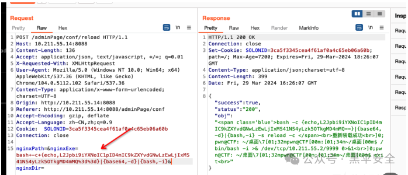  
  
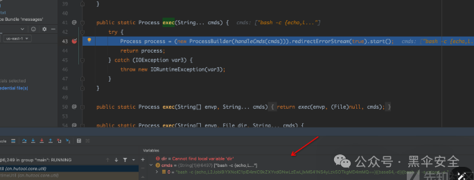  
  
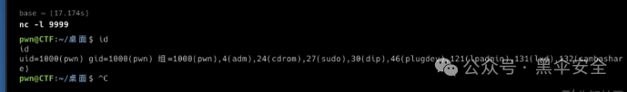  
  
成功获取shell  
### 0x05 check 代码执行  
  
com.cym.controller.adminPage.ConfController#check  
  
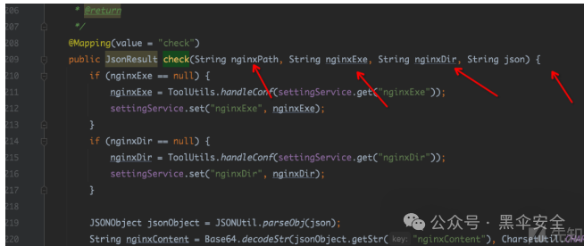  
  
同理，全可控，且没过滤最后会走到execforstr(),然后造成代码执行  
  
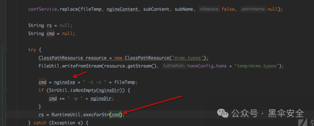  
  
我们只需要对nginxExe赋值就行，json保持默认，其余不填即可  
#### 复现  
  
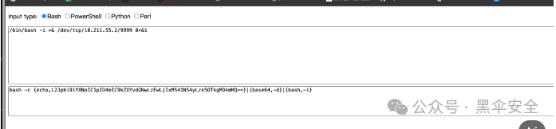  
  
生成java反弹payload  
  
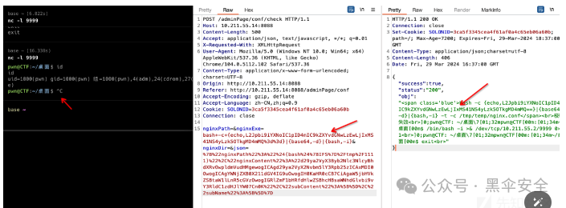  
  
成功rce  
#### 修复建议  
  
1.过于linux空字符，如${IFS}等2.转义命令中的所有shell元字符，shell元字符包括 #&;`,|*?~<>^()[]{}$\。3.不使用时禁用相应命令，bash，sh，dash等直接创建shell的命令。4.检查 Zip 压缩包中使用 ZipEntry.getName() 获取的文件名中是否包含 ../ 或者 ..。5.严格判断输入，nginxpath、nginxeExe，nginxdir，其中path和dir应检查是否为目录，nginxExe可开启白名单，活着直接写死。6.文件上传建议采取后端校验，存储到tem目录时建议检查../以及文件后缀名。7.zip解压目录建议用户不可控，直接写死  
  
  
如果你是一个长期主义者，欢迎加入我的知识星球,我们一起冲，一起学。每日都会更新，精细化运营，微信识别二维码付费即可加入，如不满意，72 小时内可在 App 内无条件自助退款。  
  
  
  
  

---

> 来源：gelusus/wxvl（微信公众号漏洞文章自动归档，原文见文首链接）
