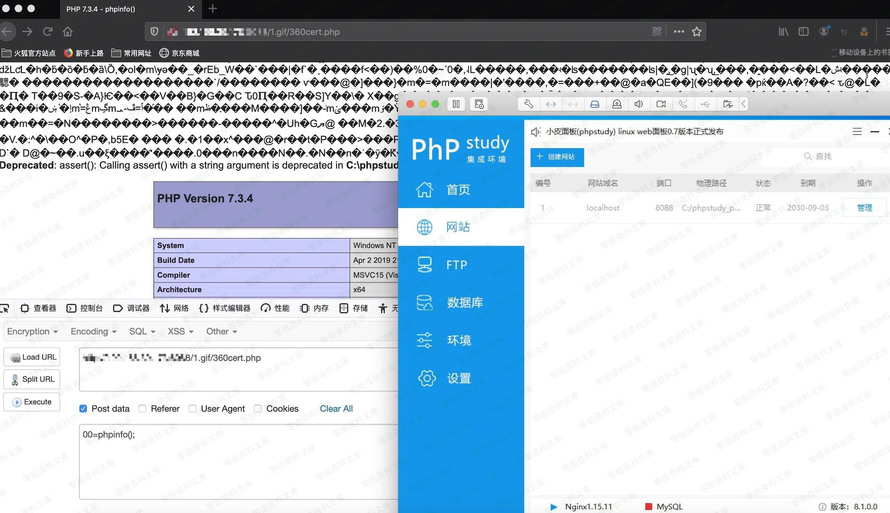

# Phpstudy nginx 解析漏洞

<!-- vulwiki-editorial:start -->
## 校订与适用边界

- 适用前提：Windows only;<=8.1.0.7;fileupload and parsing config
- 证据范围：Summary/version plus one image;no textual request/response or source

### 尚未解决的证据缺口

以下限制仍适用于后文历史材料；相关版本、结果或修复结论不能据此视为已验证：

- Short duplicate candidate of71;preserve only if unique image evidence exists
- No precise configuration/rootcause/fix;do not generalize nginx flaw
- Actual reproduction cannot be assessed without image view

本页为文本校订，未执行代码、PoC 或目标请求；原图仅保留引用，未据此确认复现成功。
<!-- vulwiki-editorial:end -->

## 技术正文与历史材料

一、漏洞简介
------------

phpStudy 存在 nginx
解析漏洞，攻击者能够利用上传功能，将包含恶意代码的合法文件类型上传至服务器，从而造成任意代码执行的影响。

该漏洞仅存在于phpStudy Windows版，Linux版不受影响。

二、漏洞影响
------------

phpstudy: \<=8.1.0.7

三、复现过程
------------

