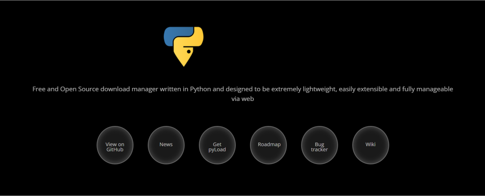

# 漏洞预警 | pyLoad远程代码执行漏洞

<!-- vulwiki-editorial:start -->
## 校订与适用边界

- 适用前提：0.5.0 claimed;upload privileges/destination/execution conditions unstated
- 证据范围：Generic unrestricted upload-to-RCE summary;official GHSA linked but no text evidence

### 尚未解决的证据缺口

以下限制仍适用于后文历史材料；相关版本、结果或修复结论不能据此视为已验证：

- POC heading links advisory;distinguish actual PoC availability
- Specify authenticated upload rights and exact affected dev/release builds from advisory
- No fixed version despite claim fixed
- Remove empty headings/broken bold formatting

本页为文本校订，未执行代码、PoC 或目标请求；原图仅保留引用，未据此确认复现成功。
<!-- vulwiki-editorial:end -->

## 技术正文与历史材料

浅安  浅安安全   2024-01-13 08:00  
  
**0x00 漏洞编号**  
- # CVE-2023-47890  
  
**0x01 危险等级**  
- 高危  
  
**0x02 漏洞概述**  
  
pyLoad是一个用纯Python编写的免费开源下载管理器。它是一个轻量级的工具，旨在简化和优化下载文件的过程。  
  
  
  
**0x03 漏洞详情**  
###   
###   
  
**CVE-2023-47890**  
  
**漏洞类型：**  
远程代码执行****  
  
**影响：**  
  
执行任意代码  
  
****  
  
**简述：**  
pyLoad 0.5.0中存在远程代码执行漏洞，容易受到无限制文件上传的攻击，攻击者通过远程执行脚本能够在操作系统上执行任意命令。  
###   
  
**0x04 影响版本**  
- pyLoad 0.5.0  
  
**0x05****POC**  
  
https://github.com/pyload/pyload/security/advisories/GHSA-h73m-pcfw-25h2  
  
**仅供安全研究与学习之用，若将工具做其他用途，由使用者承担全部法律及连带责任，作者及发布****者**  
**不承担任何法律及连带责任。**  
  
**0x06****修复建议**  
  
**目前官方已发布漏洞修复版本，建议用户升级到安全版本****：**  
  
https://pyload.net/  
  
  

---

> 来源：gelusus/wxvl（微信公众号漏洞文章自动归档，原文见文首链接）
