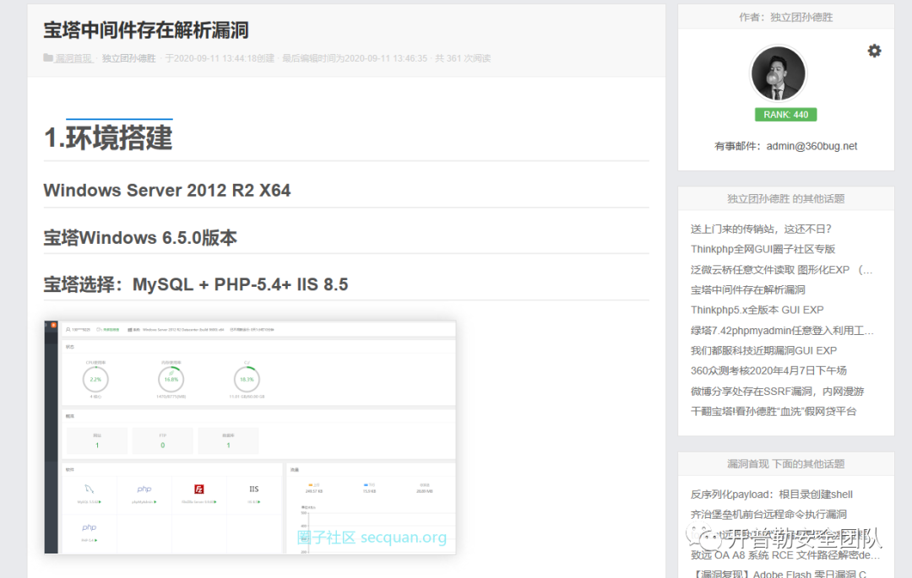
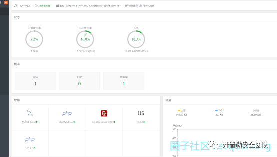
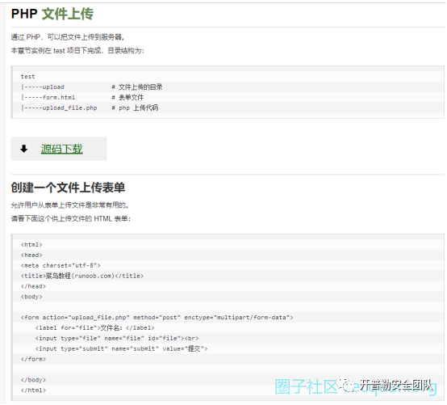
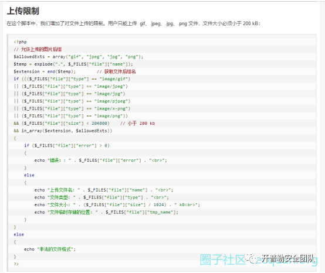
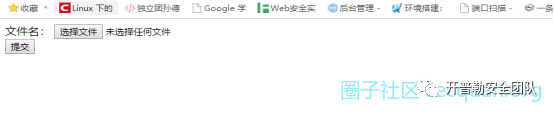
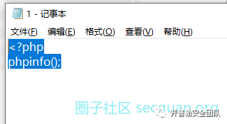
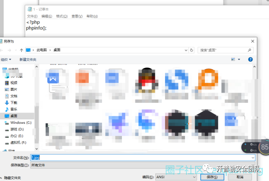
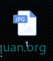
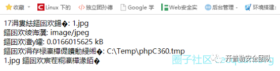
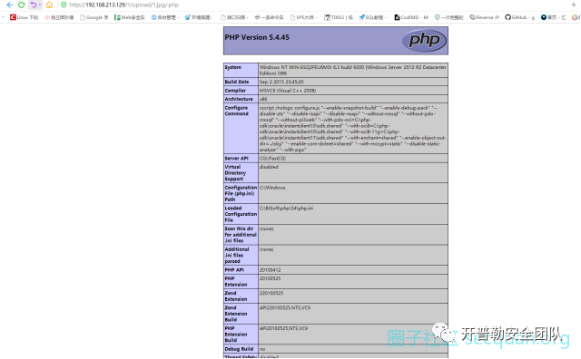

# 宝塔历史版本存在 IIS 中间件解析漏洞

<!-- vulwiki-editorial:start -->
## 校订与适用边界

- 适用前提：WindowsServer2012R2;panel<=6.5 claimed;IIS8.5/PHP5.4;uploaddemo permits imageextension
- 证据范围：Upload disguised PHP then /.php suffix;needs handler/path-info settings to attribute rootcause

### 尚未解决的证据缺口

以下限制仍适用于后文历史材料；相关版本、结果或修复结论不能据此视为已验证：

- P0 platform claim 'Linux as long as IIS8.5' is inconsistent with named WindowsIIS environment
- Conclusion says arbitraryfileupload but demonstrated gap is uploaded image parsed asPHP;separate primitives
- No exact vulnerable handlerconfig or fixedpanelversion
- Every line promoted to heading/bold;rawPHP not fenced
- Screenshots alone show output; no textual HTTP evidence

本页为文本校订，未执行代码、PoC 或目标请求；原图仅保留引用，未据此确认复现成功。
<!-- vulwiki-editorial:end -->

## 技术正文与历史材料

<meta name="referrer" content="no-referrer"/>

> 本文由 [简悦 SimpRead](http://ksria.com/simpread/) 转码， 原文地址 [mp.weixin.qq.com](https://mp.weixin.qq.com/s/25ncF8PuXh4Aob49TPFfbw)

**https://www.secquan.org/BugWarning/1071470**

****

**1. 环境搭建**
===========

**Windows Server 2012 R2 X64**
------------------------------

**范围：宝塔 Windows <= 6.5    或 liunx 只要有 IIS8.5 这个中间件的版本**
-------------------------------------------------------

**宝塔选择：MySQL + PHP-5.4+ IIS 8.5**
---------------------------------

****

**源码使用公开的 PHP 上传源码:**
=====================

**https://www.runoob.com/wp-content/uploads/2013/08/runoob-file-uplaod-demo.zip**
---------------------------------------------------------------------------------

**已做白名单限制，仅允许上传 .gif、.jpeg、.jpg、.png 文件，文件大小必须小于 200 kB**
---------------------------------------------------------

**  
**

**2. 漏洞复现**
===========

**配置好网站以后：**
------------

****

**本地写一个**
---------

**<?php  
phpinfo();**

****

**另存为. jpg 格式**
---------------

**  
**

**直接上传文件，不需要做任何修改：**
--------------------

**  
**

**访问上传文件地址：**
-------------

****

**在 upload/1.jpg 后面加 /.php**
----------------------------

****

**成功验证存在任意文件上传漏洞！**
-------------------

**（特此声明，本篇文章为原创文章！如要转载请标明来源！）**

  

  

扫码关注不迷路

简历请投递 admin@360bug.net

开普勒安全团队欢迎你

‍

---

> 来源：MrWQ/vulnerability-paper（https://github.com/MrWQ/vulnerability-paper）
