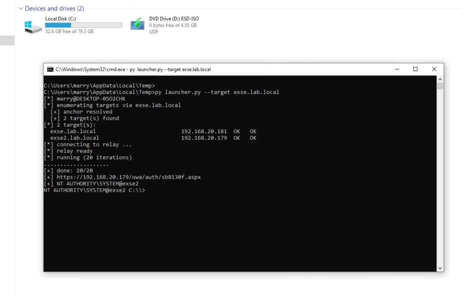
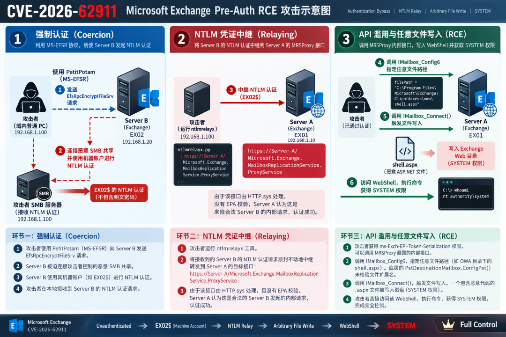
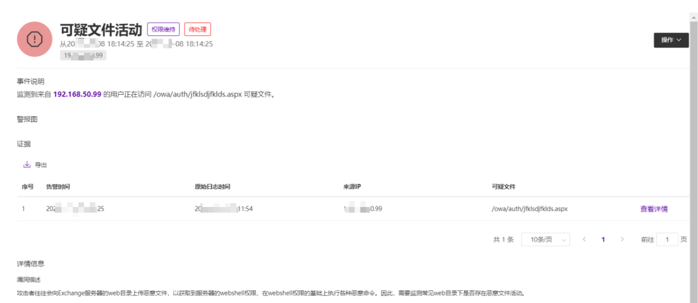

# Exchange 预授权 RCE ：CVE-2026-62911 深度剖析与企业级防御实战

<!-- vulwiki-editorial:start -->
## 校订与适用边界

- 适用前提：Internal network coercion/relay and another Exchange machine or equivalent token-serialization rights; service endpoint exposure
- 证据范围：Coherent high-level relay-to-file-write narrative but no upstream advisory/research/PoC links or build matrix

### 尚未解决的证据缺口

以下限制仍适用于后文历史材料；相关版本、结果或修复结论不能据此视为已验证：

- Opening 'only internal access' overstates prerequisites subsequently requiring privileged machine-account relay
- Writing process SYSTEM does not by itself establish webshell execution identity; execution context needs separate evidence
- No affected/fixed builds, KB or source links despite precise CVE/CVSS/Pwn2Own assertions
- Separate promotional ITDR claims from neutral analysis

### 操作风险与资料使用

- 含落盘脚本或账户创建：会留下持久状态。记录本次生成的路径或账户，测试后清理这些对象并撤销关联令牌；不要删除既有业务对象。

本页为文本校订，未执行代码、PoC 或目标请求；原图仅保留引用，未据此确认复现成功。
<!-- vulwiki-editorial:end -->

## 技术正文与历史材料

原创 网星安全
                    网星安全  网星安全   2026-09-10 03:18  
  
  
  
SECURITY RESEARCH · EXCHANGE  
  
CVE-2026-62911  
是一个经典的“通过强制认证-中继实现认证绕过”漏洞。与常规的 Exchange 后台提权不同，攻击者无需任何有效凭证，只要身处内网环境，就能直接拿下 Exchange 服务器的 SYSTEM 权限。  
  
01  
   
漏洞背景：Pwn2Own 上的高光时刻与 MB VRED 团队的漏洞挖掘  
VULNERABILITY BACKGROUND  
  
在 2026 年初的 Pwn2Own 柏林站上，知名安全研究员 Orange Tsai 再次将目光锁定在了 Microsoft Exchange Server 上，并成功验证了一个高危的预授权远程代码执行（Pre-Auth RCE）漏洞。该漏洞随后被微软在 2026 年 8 月的补丁星期二中修复，并分配了编号 **CVE-2026-62911**  
（CVSS 3.1 评分 8.0）。  
  
CVE-2026-62911 的独特之处在于，它展示了一条被微软历次修补遗漏的罕见攻击路径。MB VRED 团队在 Pwn2Own 结束后，基于公开的有限信息逆向推演出了完整的攻击链条，并在补丁发布后公开了他们的研究过程。  
  
  
  
图 1 · 漏洞利用验证效果  
  
02  
   
漏洞原理：MRSProxy 与未设防的 HTTP.sys  
ROOT CAUSE ANALYSIS  
  
要理解这个漏洞，我们需要关注 Exchange 的两个核心组件和机制：  
  
**2.1 邮件箱复制服务代理（MRSProxy）**  
  
MRSProxy（Mailbox Replication Proxy Service）是一个用于跨服务器移动邮箱的 WCF 服务。它通过   
MSExchangeMailboxReplication.exe  
 进程独立运行，并享有 **SYSTEM**  
 权限。  
  
**2.2 身份验证保护盲区**  
  
Exchange 暴露了两个 MRSProxy 的 HTTPS 端点：  
  
●   
/EWS/MRSProxy.svc  
：由 IIS 托管，通常默认关闭，并且受到“扩展保护（Extended Protection, EPA）”的保护，能有效防御 NTLM Relay。  
  
●   
/Microsoft.Exchange.MailboxReplicationService.ProxyService  
：**漏洞的根源就在这里。**  
该端点绕过了 IIS，直接由底层 HTTP.sys 驱动托管。它接受 Windows Negotiate 身份验证，但并没有强制校验通道绑定令牌（Channel Binding Tokens）。  
  
**2.3 权限校验**  
  
虽然缺乏 EPA 保护，但该端点并非任何人都能访问。代码逻辑（  
MRSProxyAuthorizationManager.GetPrincipal()  
）要求连接的身份必须具备   
ms-Exch-EPI-Token-Serialization  
 扩展权限。在域环境中，只有 Exchange 服务器的机器账户才默认拥有此权限。  
  
KEY POINT  
  
因此，攻击者的目标很明确：窃取另一台 Exchange 服务器的机器账户身份，中继给目标 Exchange 服务器的无保护接口。  
  
整个攻击链需要至少两台 Exchange 服务器（我们假设为 Server A 和 Server B），或者攻击者具备强制其他拥有相应权限机器账户认证的能力。目前 GitHub 上已有公开的 PoC 代码。  
  
03  
   
攻击过程解析：从强制认证到 SYSTEM 权限  
ATTACK CHAIN  
  
  
  
图 2 · CVE-2026-62911 攻击链示意图  
  
整个攻击过程可以拆解为三个关键环节：  
  
**环节一：强制认证（Coercion）**  
  
攻击者身处内网（例如通过钓鱼控制了一台域内普通 PC）。攻击者使用类似   
PetitPotam  
（MS-EFSR 协议）的工具，向 Server B 发起请求。  
  
●   
EfsRpcEncryptFileSrv  
 迫使 Server B 尝试连接攻击者控制的恶意 SMB 共享。  
  
● Server B 会使用其机器账户（如   
EX02$  
）进行 NTLM 认证。  
  
**环节二：NTLM 凭证中继（Relaying）**  
  
攻击者在自己的机器上运行   
ntlmrelayx  
 工具。  
  
● 当 Server B 的认证请求到达时，攻击者不进行验证，而是将该请求“原封不动”地中继转发到 Server A 的目标接口：  
https://Server-A/Microsoft.Exchange.MailboxReplicationService.ProxyService  
。  
  
● 由于该接口直接由 HTTP.sys 处理，没有 EPA 校验，Server A 认为这是合法的 Server B 发起的内部请求，认证成功。  
  
**环节三：API 滥用与任意文件写入（RCE）**  
  
通过认证后，攻击者在 Server A 上拥有了   
ms-Exch-EPI-Token-Serialization  
 权限，可以调用 MRSProxy 暴露的内部接口。  
  
**1. 定位写入目标：**  
攻击者调用   
IMailbox_Config6  
 API。在底层的   
PstDestinationMailbox.ConfigPst()  
 方法中，存在一个致命缺陷——它允许将 PST 文件导出到任意路径，且不校验文件扩展名。  
  
**2. 写入 WebShell：**  
攻击者将目标路径指向 Exchange 的 Web 目录（例如 OWA 目录），并将文件扩展名设置为   
.aspx  
。  
  
**3. 触发写入：**  
随后调用   
IMailbox_Connect()  
 方法。一个包含恶意代码的   
.aspx  
 文件（通常是一个伪装成 PST 格式，但包含有效 ASP.NET 代码的大体积文件）被直接写入磁盘。  
  
**4. 执行命令：**  
攻击者直接访问该 WebShell，由于写入操作是 SYSTEM 权限的进程完成的，WebShell 同样享有 SYSTEM 权限，至此完成完全控制。  
  
04  
   
Exchange 防御  
DETECTION & RESPONSE  
  
**ITDR 平台**  
  
ITDR（身份威胁检测与响应）平台是中安网星推出的针对身份威胁检测与响应高级威胁分析平台。主要围绕 Identity 及 Infrastructure 为核心进行防护，涵盖主流身份基础设施及集权设施，围绕从攻击的事前加固、事中监测，事后阻断出发，产品的设计思路覆盖攻击者活动的全生命周期。  
  
目前 ITDR 平台针对 CVE-2026-62911 攻击已经实现实时监测：  
  
  
  
图 3 · ITDR 平台针对可疑文件活动的实时监测  
  
  
**针对 Exchange 场景特有的能力**  
  
  
01  
主动风险探测  
  
可以针对 Exchange 的**漏洞、基线等风险进行主动探测**  
，发现 Exchange 是否存在历史漏洞及错误的风险配置项。  
  
02  
CVE 利用实时监测  
  
针对 **CVE 漏洞的利用进行实时监测**  
。目前已覆盖对 Exchange 历史漏洞的实时攻击检测，确保在针对 Exchange 的漏洞攻击发生时能够发现攻击行为。  
  
03  
Exchange 功能滥用监测  
  
针对 **Exchange 功能滥用进行实时监测**  
，如委托查看其他用户邮件、恶意导出邮件、危险角色分配等；在攻击者获取 Exchange 权限并利用自身功能进行后渗透时，可实时监控其攻击行为。  
  
04  
蜜罐账户主动诱捕  
  
通过设置**蜜罐 Exchange 邮箱账户**  
，对攻击者进行主动诱捕，更主动地发现可疑攻击行为。  
  

---

> 来源：gelusus/wxvl（微信公众号漏洞文章自动归档，原文见文首链接）
