# Microsoft Exchange 远程代码执行漏洞复现 (CVE-2020-17144) 东塔网络安全学院的博客 - CSDN 博客

<!-- vulwiki-editorial:start -->
## 校订与适用边界

- 适用前提：Authenticated user;2010SP3RU31 listed; labWindows2008R2
- 证据范围：Extensive setup and compilation walkthrough; author explicitly reports no command output/uncertain shell connection

### 尚未解决的证据缺口

以下限制仍适用于后文历史材料；相关版本、结果或修复结论不能据此视为已验证：

- Do not mark reproduced-success: author explicitly says shell had no output/may not connect
- Influence section lists RU31 without range or fixed build
- Repair advice 'install security software' not vulnerability-specific; add actual patch reference
- Strip tracking/ephemeral parameters from very long WeChat URL and CSDN search-link insertion
- Installation-only images and unavailable result images limit evidence

本页为文本校订，未执行代码、PoC 或目标请求；原图仅保留引用，未据此确认复现成功。
<!-- vulwiki-editorial:end -->

## 技术正文与历史材料

<meta name="referrer" content="no-referrer"/>

> 本文由 [简悦 SimpRead](http://ksria.com/simpread/) 转码， 原文地址 [blog.csdn.net](https://blog.csdn.net/m0_48520508/article/details/111934211)

**0x00 简介**
===========

Microsoft Exchange Server 2010 可让 IT 专业人士感到更加可靠、灵活，使用户体验更加的良好，并且可以增强对业务通信的保护。

灵活可靠: Exchange Server 2010 可让您根据自己公司的独特需求灵活地进行部署，并通过一种简化方式帮助您的用户不间断地使用电子邮件。

从任意位置访问: 使用 Exchange Server 2010，您的用户可以从几乎所有平台、Web 浏览器或设备安全自如地使用其所有通信工具（电子邮件、语音邮件、即时消息，等等），从而完成更多工作。

**0x01 漏洞概述**
=============

在微软最新发布的 12 月安全更新中公布了一个存在于 Microsoft Exchange Server2010 中的远程代码执行漏洞（CVE-2020-17144），官方定级 Important。漏洞是由程序未正确校验 cmdlet 参数引起。经过身份验证的攻击者利用该漏洞可实现远程代码执行。

该漏洞和 CVE-2020-0688 类似，也需要登录后才能利用，不过在利用时无需明文密码，只要具备 NTHash 即可。除了常规邮件服务与 OWA 外，EWS 接口也提供了利用所需的方法。漏洞的功能点本身还具备持久化功能。

**0x02 影响版本**
=============

Microsoft Exchange Server 2010 Service Pack 3 Update Rollup 31

**0x03 环境搭建**
=============

一. Windows 2008 R2 安装 Exchange Server 2010 需要确定一下先决条件

1.AD 域环境，域和林的功能级别必须是 windows server 2003 或更高

2…NET Framework 3.5.1 SP1IIS 及其多个角色服务

3.HTTP 代理上的 RPC

4.AD DC 和 AD LDS 工具

5. 应用程序服务器

6.Microsoft Filter Pack

安装包下载地址：

链接：https://pan.baidu.com/s/1u5bwtj-vRqWOu8b1TutGiQ

提取码：dota

1.1、windows2008R2 安装 AD 域环境

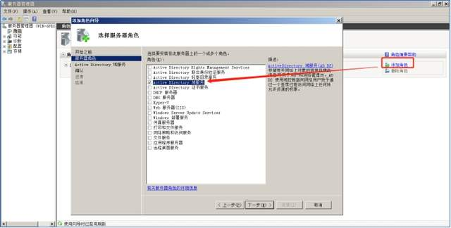

1.2 安装完成后点击域服务安装向导

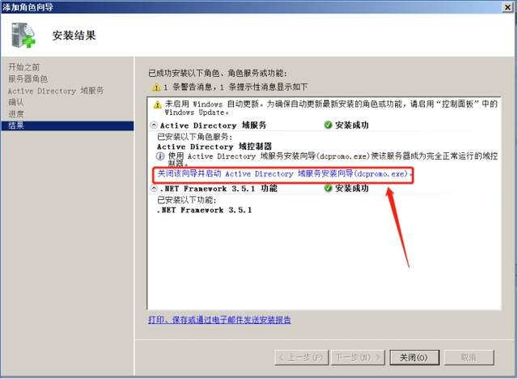

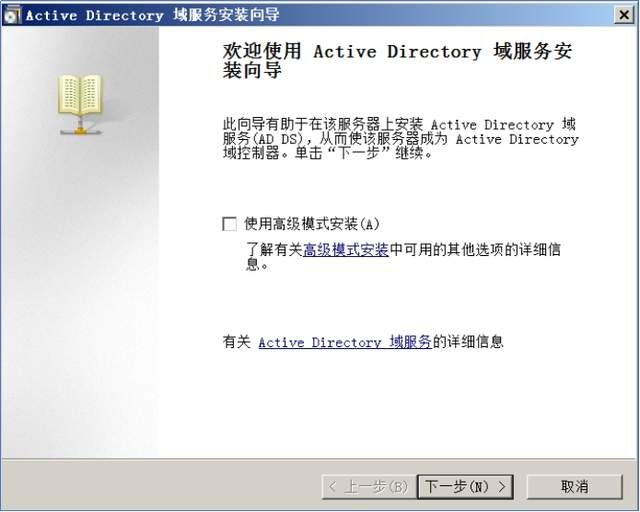

1.3 点击下一步，点击在新林中新建域。

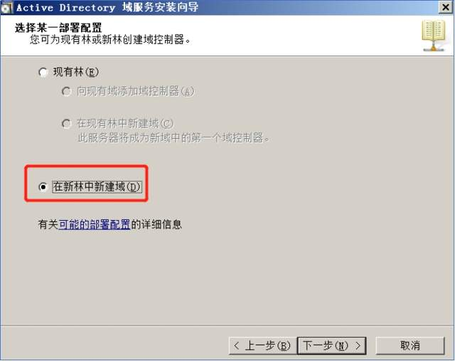

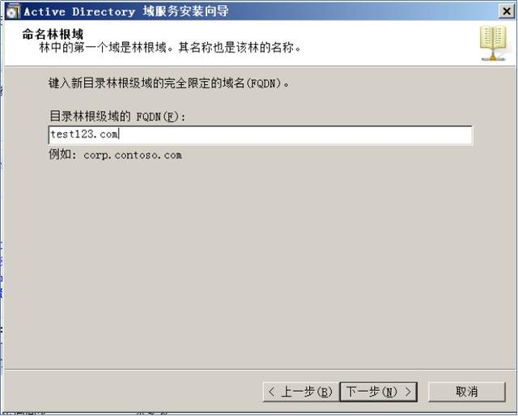

1.4 选择 windows 2008 R2

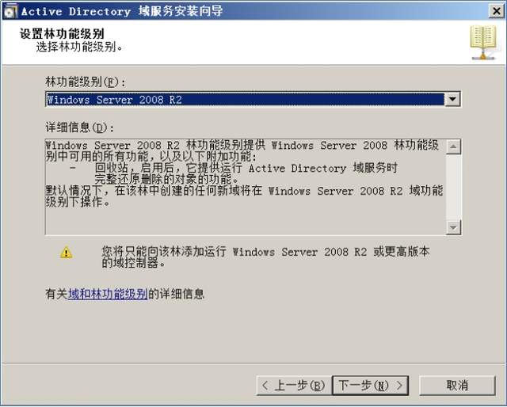

这里选择是

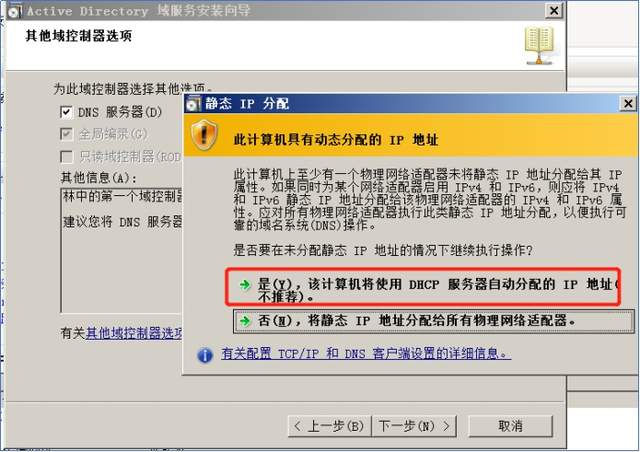

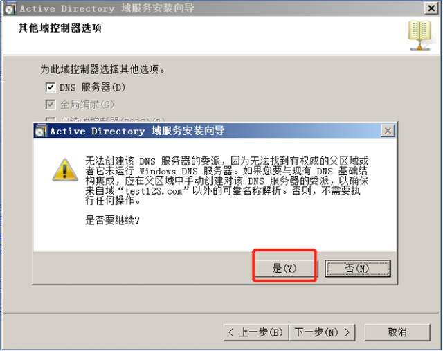

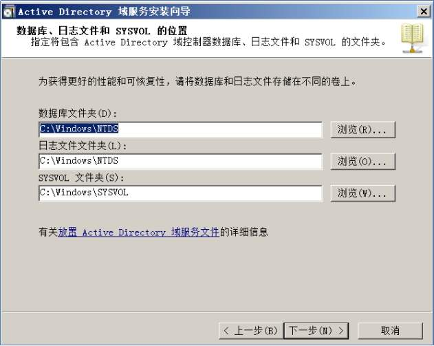

下一步直到安装完成

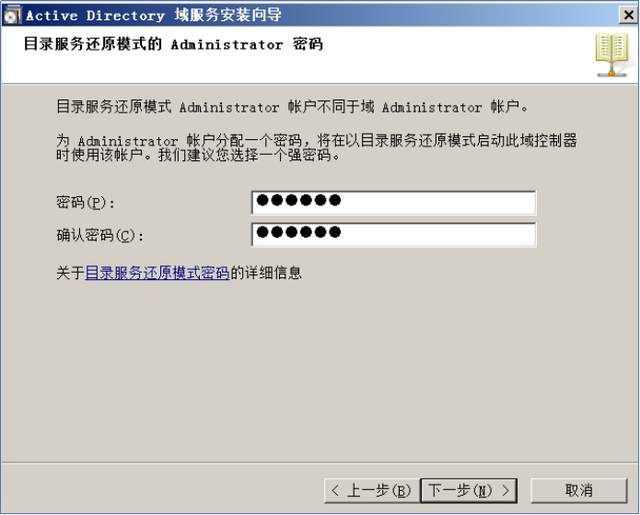

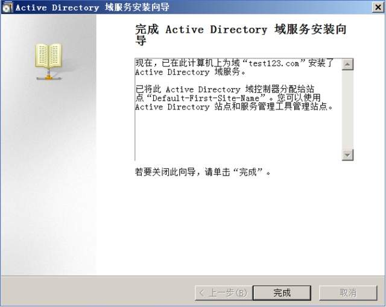

2.1、安装. NET Framework 3.5.1 、IIS 及其多个角色服务

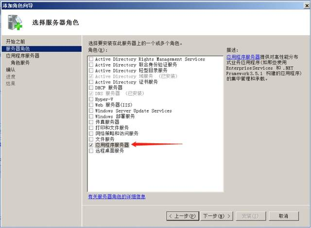

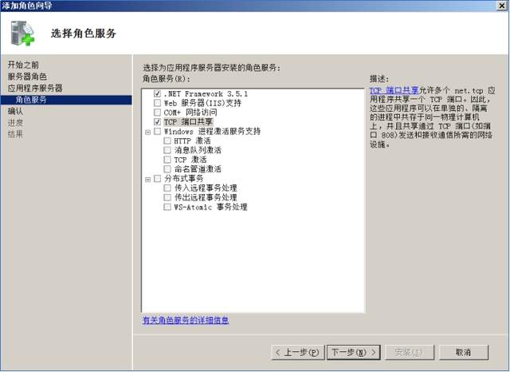

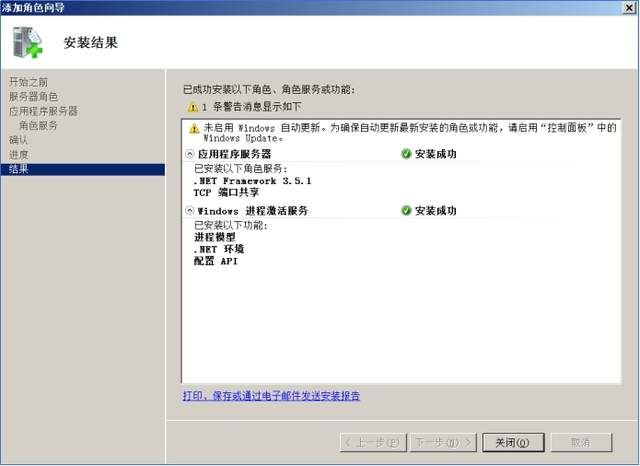

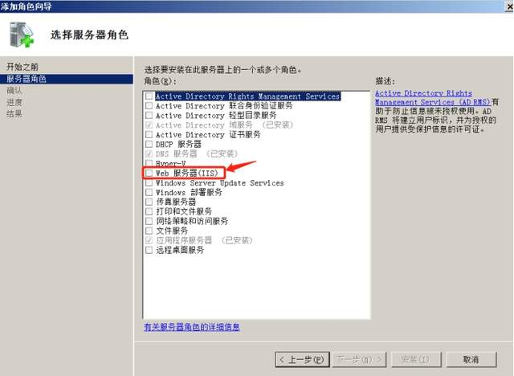

2.2、选中如下图所示的所有 Exchange 必须的角色服务，然后下一步

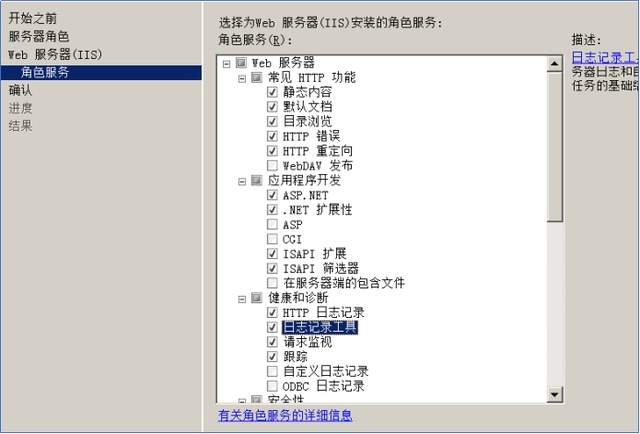

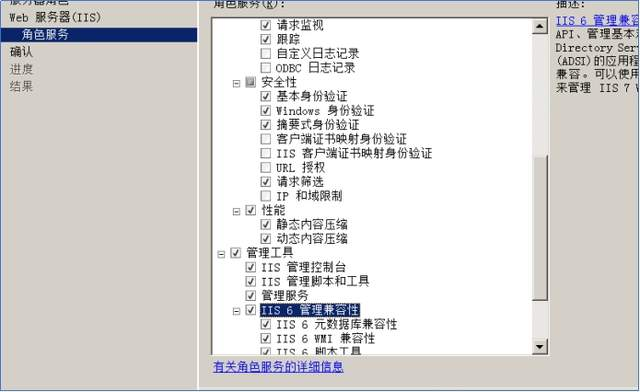

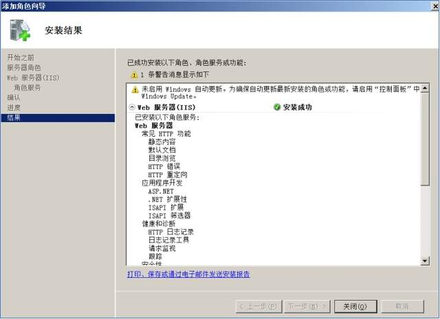

3.1、安装 HTTP 代理上的 RPC

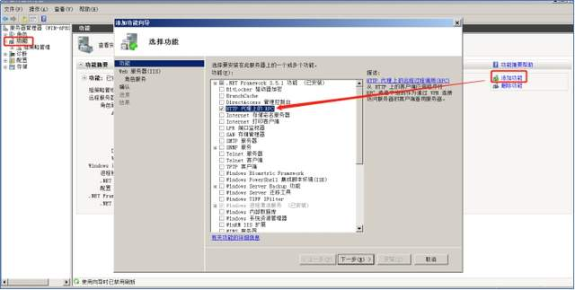

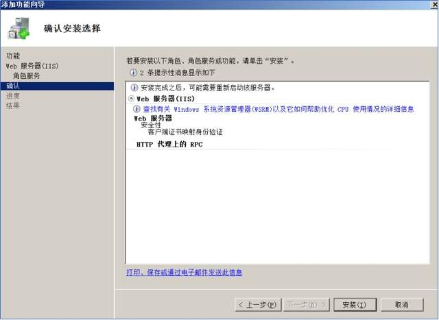

4.1、安装 AD DS 和 AD LDS 工具

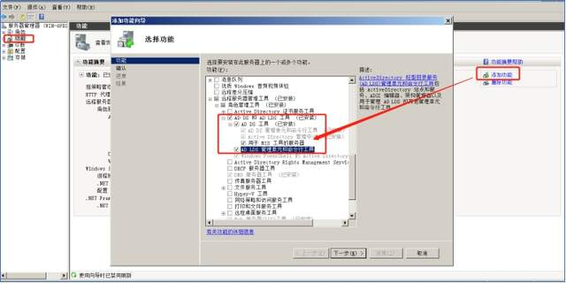

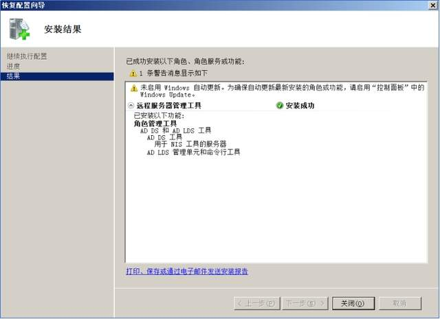

5.1、安装 “应用程序服务器 “角色

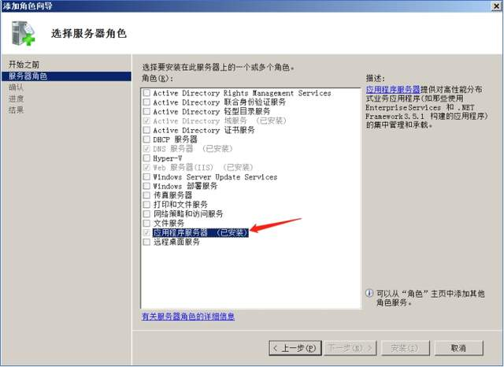

6.1、安装 Microsoft Filter Pack，点击下一步即可

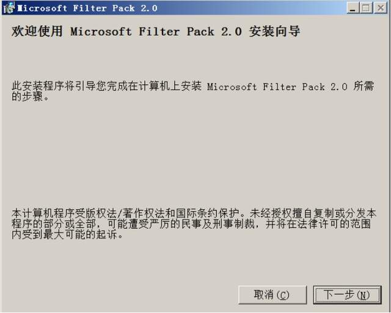

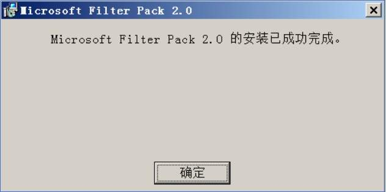

二、安装 Exchange 的条件准备完毕后开始安装 Exchange 2010

1、运行 Exchange2010-SP3-x64.exe 提前完成后，进入提取目录，运行 setup.exe

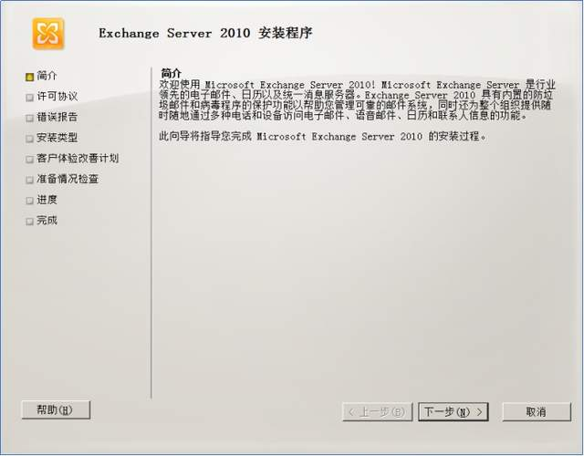

2. 安装时选择典型安装

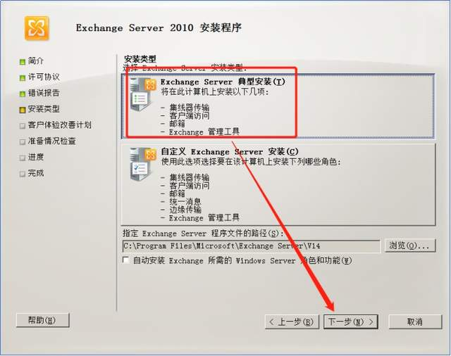

3. 下一步安装

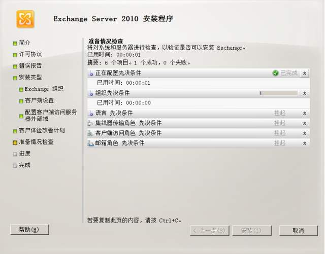

4. 在准备情况检查这一项没有出错的话，就可以直接安装完成

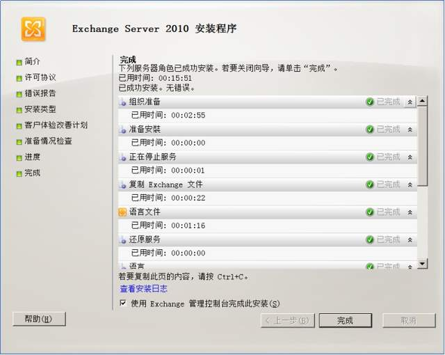

5、安装完成后在 [powershell](https://so.csdn.net/so/search?q=powershell&spm=1001.2101.3001.7020) 输入以下内容，然后在本地访问 127.0.0.1/owa

Set-Service NetTcpPortSharing -StartupType Automatic

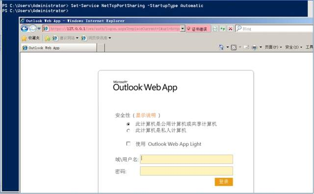

6、在本机访问 https://xxx.xxx.xx.xx/owa，查看以下页面安装完成

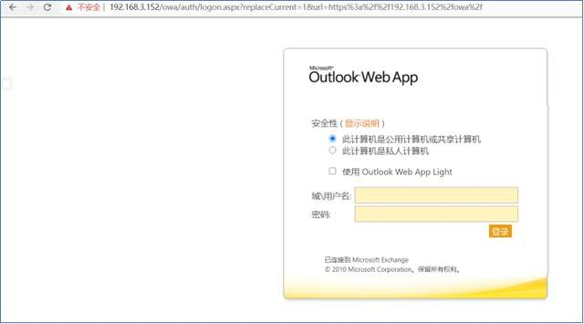

**0x04 漏洞复现**
=============

1. 本次漏洞复现使用 github 上脚本进行漏洞复现。

下载地址：https://github.com/Airboi/CVE-2020-17144-EXP

2. 下载完成后使用 Visual Studio 进行编译成可执行的 exe 文件

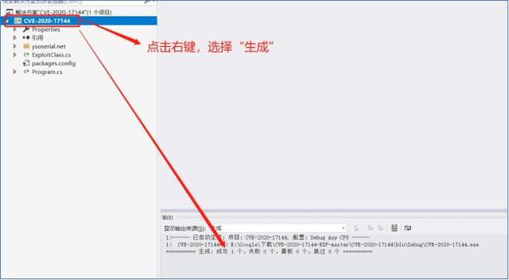

3. 在 bin 目录下的 Debug 目录下生成. exe 的可执行文件

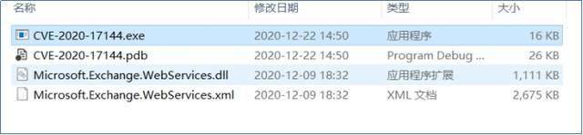

4. 在 cmd 命令中运行. exe 文件

CVE-2020-17144.exe your-ip 用户名 密码

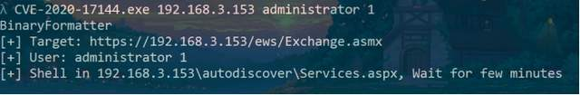

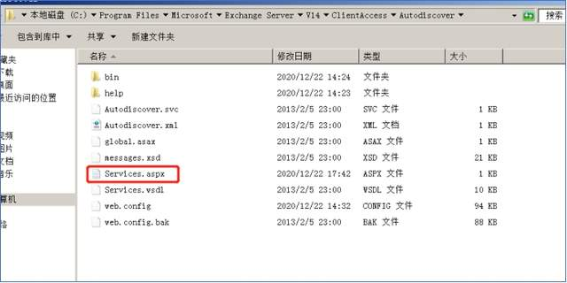

5. 执行可以看到写入了 shell，使用 K8Ladon 工具连接 shell。

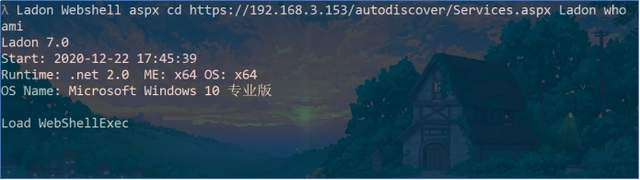

6. 我这里不知是啥原因没有回显，还是没有连上 shell，可以自己测试一下

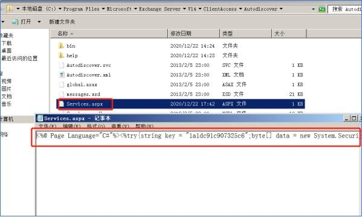

**0x05 修复建议**
=============

1. 建议升级至最新版本

2. 下载安全防护软件

参考链接：https://mp.weixin.qq.com/s?__biz=MzU5NjA0ODAyNg==&mid=2247484324&idx=1&sn=f3c8e8b37386e4ca8e7d65ed059ba0c4&chksm=fe69e251c91e6b476a26d5296152153b5d279d61cc78a6abf91001fd1d15d50f18c3944c884a&scene=126&sessionid=1608521158&key=032c59c0a43519d159f58e3ddbdf9a4f22f4b5f6de472ffb622cc9bbb5922e25bf20bf89928225fb7094f5ec307fcf3db24d356336d7081b3146a18a8508ac16589d79c3e6ef43d31ce8d1d05e5a6cb97aa87121903c9115f3b5ecfe85a23089a7c2fd9def86e59614a2b466d1187d87cd65edbe87e40fa2f3587c3d1f2b47b4&ascene=1&uin=MjExMzQ5OTU0NA%3D%3D&devicetype=Windows+10+x64&version=6300002f&lang=zh_CN&exportkey=A%2FMi0SWv7TyhMLihi1rfRe8%3D&pass_ticket=nGG1z%2BnLMzm8%2F%2FVIQpbkOytO59crshu1nx6DmKyMbxjesQ8ypSPy6YiXuyKi9boi&wx_header=0

---

> 来源：MrWQ/vulnerability-paper（https://github.com/MrWQ/vulnerability-paper）
