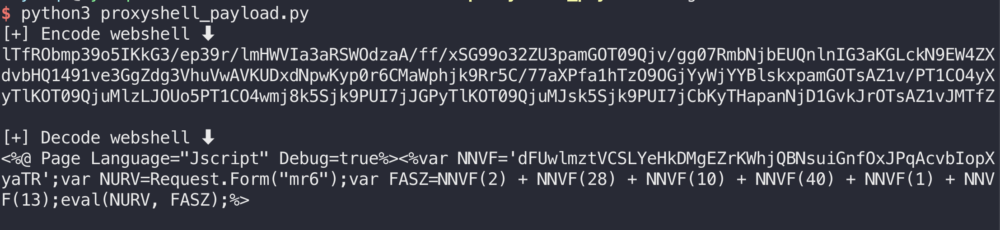
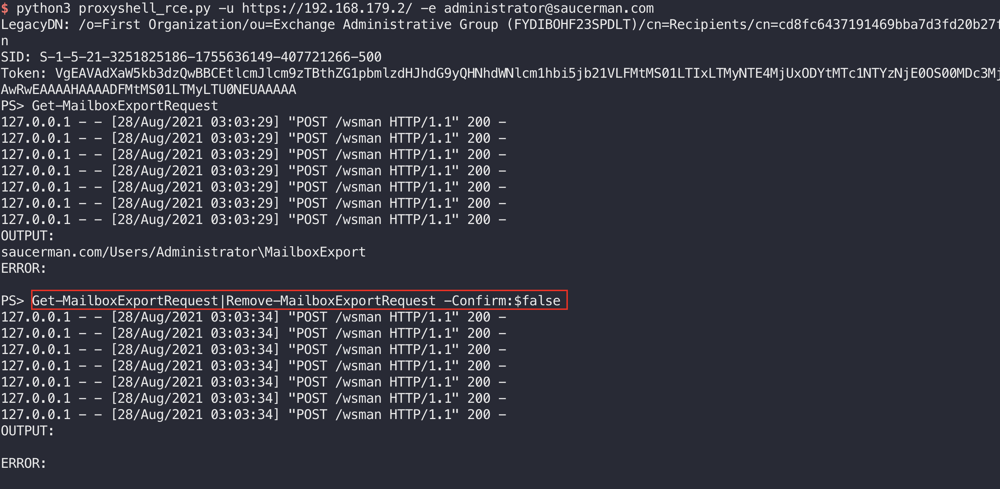
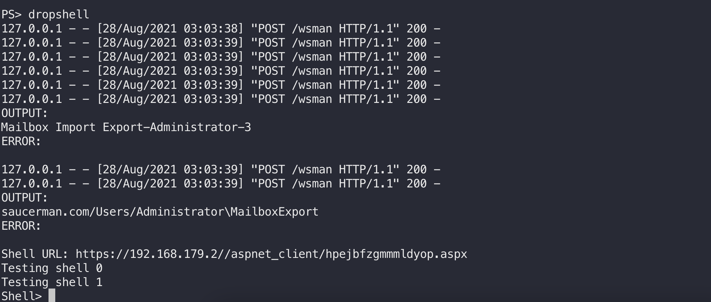
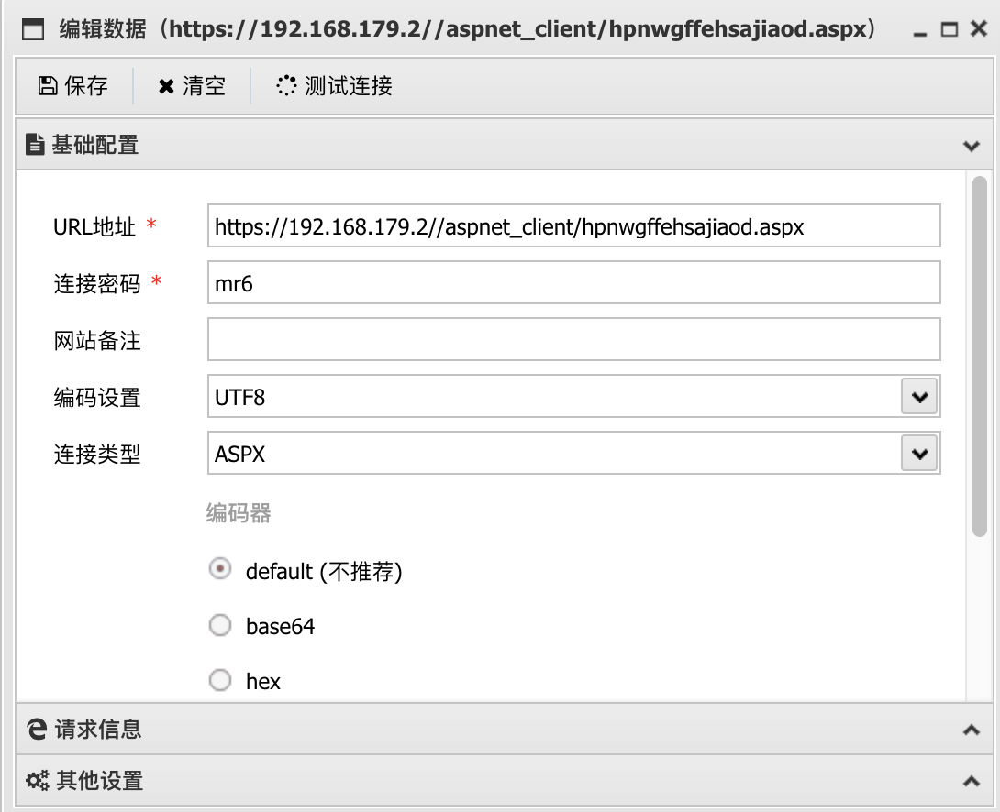
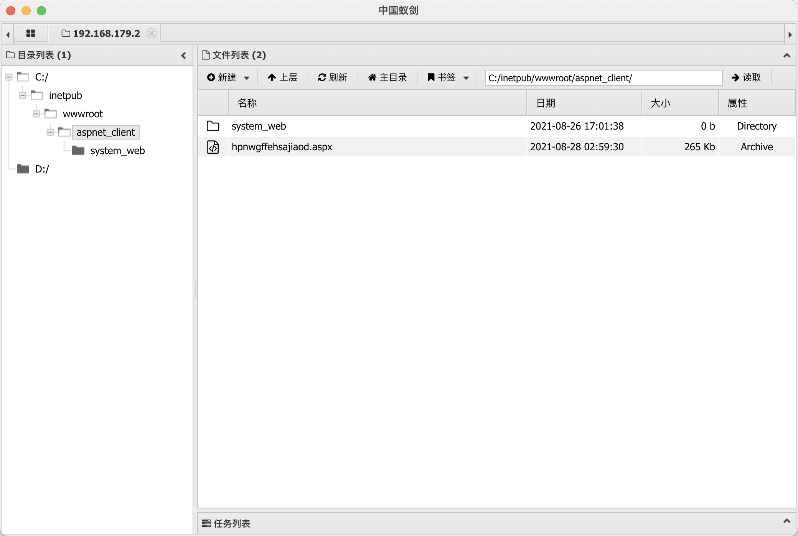

# ProxyShell Microsoft Exchange CVE-2021-34473 远程代码执行

<!-- vulwiki-editorial:start -->
## 校订与适用边界

- 适用前提：Same as mail17
- 证据范围：Entire narrative/links/images identical to mail17 apart from heading/source frontmatter

### 尚未解决的证据缺口

以下限制仍适用于后文历史材料；相关版本、结果或修复结论不能据此视为已验证：

- Confirmed same-source duplicate of mail17; consolidate one canonical article
- Same unpinned line314,2010 range and export-cleanup caveats

### 操作风险与资料使用

- 含落盘脚本或账户创建：会留下持久状态。记录本次生成的路径或账户，测试后清理这些对象并撤销关联令牌；不要删除既有业务对象。

本页为文本校订，未执行代码、PoC 或目标请求；原图仅保留引用，未据此确认复现成功。
<!-- vulwiki-editorial:end -->

## 技术正文与历史材料

<meta name="referrer" content="no-referrer"/>

> 本文由 [简悦 SimpRead](http://ksria.com/simpread/) 转码， 原文地址 [saucer-man.com](https://saucer-man.com/information_security/776.html)

> 1. 漏洞描述今年的 Blackhat 演讲中，Orange Tsai 对其在上一阶段对 Microsoft Exchange Server 进行的安全研究进行了分享，除了前一段时间已经公开的 proxyl...

> 文章最后更新时间为：2021 年 08 月 29 日 23:42:32

今年的 Blackhat 演讲中，Orange Tsai 对其在上一阶段对 Microsoft Exchange Server 进行的安全研究进行了分享，除了前一段时间已经公开的 proxylogon，还带来了 ProxyShell 等漏洞的有关具体细节。

其中包括

*   CVE-2021-34473 Microsoft Exchange ACL 绕过漏洞
*   CVE-2021-34523 Microsoft Exchange 权限提升漏洞
*   CVE-2021-31207 Microsoft Exchange 授权任意文件写入漏洞。

攻击者可通过组合这些漏洞在未经身份验证的情况下远程接管目标服务器。

Microsoft Exchange Server 2010  
Microsoft Exchange Server 2013  
Microsoft Exchange Server 2016  
Microsoft Exchange Server 2019

环境搭建参考 [https://saucer-man.com/information_security/748.html#cl-3](https://saucer-man.com/information_security/748.html#cl-3)

利用步骤如下：

1.  首先使用 SSRF 漏洞，请求 AutoDiscover 服务，获取 legacyDn
2.  将 legacyDn 作为参数，访问 mapi/emsmdb 接口，能够获得用户对应的 sid
3.  在 Header 中使用 SerializedSecurityContext，指定用户身份进行 EWS 调用操作

直接使用脚本来进行攻击：

1. 首先需要生成一个 webshell：

下载 [https://github.com/Ridter/proxyshell_payload](https://github.com/Ridter/proxyshell_payload) ，在 proxyshell_payload.py 中，修改末尾的 webshell 变量，将其替换为蚁剑的 webshell

然后运行得到 payload（encode 部分）：

[](../../.resource/remote/299c66275cd7407183056900ce7b2b5fef9b267c4d4e11c6e2653419fcf156fa.png "2021-08-27T19:01:05.png")

2.exp 攻击

下载 [https://github.com/dmaasland/proxyshell-poc](https://github.com/dmaasland/proxyshell-poc) ，然后安装依赖，将上一步得到的 payload，复制到 proxyshell_rce.py 的 314 行。

运行程序后，依次输入：

```
Get-MailboxExportRequest
Get-MailboxExportRequest|Remove-MailboxExportRequest -Confirm:$false
dropshell

```

如下图所示：

[](../../.resource/remote/40ea572d9620f628aeb99091d89047584094fa7e14e2ca85ce8c0b424519e054.png "2021-08-27T19:04:04.png")

[](../../.resource/remote/aa0d053c781c1de6631378a77384984581480b9f5fbd83f0b61c1fddd796168d.png "2021-08-27T19:04:16.png")

文件成功上传，下面用蚁剑直接链接 shell 即可。（这里需要忽略 https 证书）

[](../../.resource/remote/452957224165a4983644830e180120935c9c465bb95c3e0433dcd7fbc1a38beb.png "2021-08-27T19:05:12.png")

[](../../.resource/remote/32e64ddabba3b6f12a8a918bb35d3bfee98e35438e2b00b219fac3b65f9f4a28.png "2021-08-27T19:05:29.png")

当前微软官方已发布以上漏洞受影响版本的安全补丁，强烈建议受影响的用户尽快安装安全补丁进行防护。建议受影响用户通过以下链接进行手动更新：  
[https://msrc.microsoft.com/update-guide/vulnerability/CVE-2021-34473](https://msrc.microsoft.com/update-guide/vulnerability/CVE-2021-34473)  
[https://msrc.microsoft.com/update-guide/vulnerability/CVE-2021-34523](https://msrc.microsoft.com/update-guide/vulnerability/CVE-2021-34523)  
[https://msrc.microsoft.com/update-guide/vulnerability/CVE-2021-31207](https://msrc.microsoft.com/update-guide/vulnerability/CVE-2021-31207)

*   [https://nox.qianxin.com/article/301](https://nox.qianxin.com/article/301)
*   [https://mp.weixin.qq.com/s/-qJh2u0mbrKWxWNCZgOrVw](https://mp.weixin.qq.com/s/-qJh2u0mbrKWxWNCZgOrVw)
*   [https://mp.weixin.qq.com/s/aEnoBvibp-gkt3qtcOXqAw](https://mp.weixin.qq.com/s/aEnoBvibp-gkt3qtcOXqAw)

[](../../.resource/remote/1da177ec6a411755f01b24ba166a994e7e22dab28aca169c2db1d075a3a0d5ad.png) [](../../.resource/remote/1d306df57699719a7c70da1d93f205b51232ffb4ae61534a91f9aea92b9b9a19.png)

---

> 来源：MrWQ/vulnerability-paper（https://github.com/MrWQ/vulnerability-paper）
