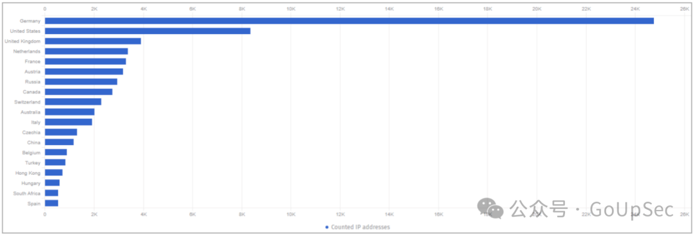

# 微软Exchange服务器曝出高危漏洞，近10万台服务器面临风险

<!-- vulwiki-editorial:start -->
## 校订与适用边界

- 适用前提：NTLM relay and relevant protection configuration; no precise builds
- 证据范围：News/statistics and patch overview, not reproduction

### 尚未解决的证据缺口

以下限制仍适用于后文历史材料；相关版本、结果或修复结论不能据此视为已验证：

- CVE/date/source reference missing from metadata
- Title/global count blends confirmed28500 and potentially vulnerable68500; preserve distinction and as-of2024-02-19 date
- March7 deadline attributed to Microsoft without link; verify whether CISA-specific applicability
- Patch text covers2019CU14 but no2016 remediation or Extended Protection prerequisites
- Remove repeated summary/statistics and promotional footer

本页为文本校订，未执行代码、PoC 或目标请求；原图仅保留引用，未据此确认复现成功。
<!-- vulwiki-editorial:end -->

## 技术正文与历史材料

 安全内参   2024-02-20 17:13  
  
**关注我们**  
  
  
**带你读懂网络安全**  
  
  
  
  
微软Exchange服务器近日曝出高危漏洞，编号为CVE-2024-21410，该漏洞严重威胁到全球大量邮件服务器的安全，目前已经有黑客开始积极野外利用。  
  
  
据悉，该漏洞影响了全球近9.7万台Exchange服务器，这些服务器广泛用于企业环境，提供邮件、日历、联系人管理和任务管理等服务。攻击者利用该漏洞可以提升权限，访问敏感数据，甚至将服务器作为跳板进行进一步攻击。  
  
  
微软宣称于2月13日修复了该漏洞，当时该漏洞已被作为零日漏洞利用。但是，根据本周一威胁监控服务Shadowserver的扫描结果，目前全球仍有大约9.7万台Exchange服务器易受攻击。  
  
  
据Shadowserver统计，在总共9.7万台服务器中，估计有6.85万台服务器的易受攻击状态取决于管理员是否应用了缓解措施，其余2.85万台服务器被确认容易受到CVE-2024-21410的攻击。  
  
  
  
  
  
受影响最严重的国家是德国（22,903例）、美国（19,434例）、英国（3,665例）、法国（3,074例）、奥地利（2,987例）、俄罗斯（2,771例）、加拿大（2,554例）和瑞士（2,119例），中国也有超过1000台服务器在线暴露。  
  
  
  
  
**漏洞详情：**  
  
- 漏洞编号：CVE-2024-21410  
  
- 漏洞等级：严重（Critical）  
  
- 影响版本：Exchange Server 2019和Exchange Server 2016  
  
- 漏洞类型：权限提升（Privilege Escalation）  
  
- 攻击方式：NTLM中继攻击  
  
  
  
  
  
  
**目前情况：**  
  
- 微软已于2月13日发布补丁修复该漏洞，但该漏洞已被作为零日漏洞利用。  
  
- 目前已确认约28,500台服务器存在漏洞，另外68,500台服务器的安全性取决于管理员是否实施了缓解措施。  
  
- 德国、美国、英国等多个国家受到影响严重。  
  
  
  
  
  
  
**如何修复：**  
  
- 系统管理员应尽快安装Exchange Server 2019的累积更新14(CU14)，其中包含NTLM中继保护功能。  
  
- 微软建议在3月7日之前应用补丁或停止使用Exchange服务器。  
  
  
  
  
**安全建议：**  
  
- 定期更新软件到最新版本。  
  
- 启用防火墙等安全措施。  
  
- 限制未经授权的访问。  
  
- 定期进行安全扫描和漏洞评估。  
  
  
  
  
  
  
**额外信息：**  
  
- 漏洞详情和补丁下载地址可前往微软官方网站查询。  
  
- 美国网络安全和基础设施安全局(CISA)将该漏洞列入其已知被利用漏洞目录。  
  
  
  
  
**推荐阅读**  
- [网安智库平台长期招聘兼职研究员](http://mp.weixin.qq.com/s?__biz=MzI4NDY2MDMwMw==&mid=2247499450&idx=2&sn=2da3ca2e0b4d4f9f56ea7f7579afc378&chksm=ebfab99adc8d308c3ba6e7a74bd41beadf39f1b0e38a39f7235db4c305c06caa49ff63a0cc1d&scene=21#wechat_redirect)  
  
  
- [欢迎加入“安全内参热点讨论群”](https://mp.weixin.qq.com/s?__biz=MzI4NDY2MDMwMw==&mid=2247501251&idx=1&sn=8b6ebecbe80c1c72317948494f87b489&chksm=ebfa82e3dc8d0bf595d039e75b446e14ab96bf63cf8ffc5d553b58248dde3424fb18e6947440&token=525430415&lang=zh_CN&scene=21#wechat_redirect)  
  
  
  
  
  
  
文章来源：GoUpSec  
  
  
点击下方卡片关注我们，  
  
带你一起读懂网络安全 ↓  
  
  
  
  

---

> 来源：gelusus/wxvl（微信公众号漏洞文章自动归档，原文见文首链接）
