# 【超详细】Microsoft Exchange 远程代码执行漏洞复现【CVE-2020-17144】

<!-- vulwiki-editorial:start -->
## 校订与适用边界

- 适用前提：Authenticated; Windows2008R2SP1/Exchange2010;RU31 ambiguously listed
- 证据范围：Distinct installation failure notes, but exploit commands and results only screenshots; tool/environment gated by public-account reply

### 尚未解决的证据缺口

以下限制仍适用于后文历史材料；相关版本、结果或修复结论不能据此视为已验证：

- Impact lists RU31 while same text appears in setup next to 'download update protection'; affected/fixed ambiguity
- No reproducible textual PoC or direct code link; success assertion screenshot-dependent
- Overstates persistence as forever and comparative severity without evidence
- Repetitive setup commands and sizeable promotional footer; distinguish tested build from entire impact range

本页为文本校订，未执行代码、PoC 或目标请求；原图仅保留引用，未据此确认复现成功。
<!-- vulwiki-editorial:end -->

## 技术正文与历史材料

<meta name="referrer" content="no-referrer"/>

> 本文由 [简悦 SimpRead](http://ksria.com/simpread/) 转码， 原文地址 [mp.weixin.qq.com](https://mp.weixin.qq.com/s/sIKHBQDSZDxuk1difdcORw)

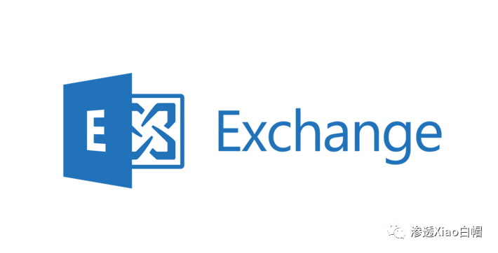  

********

**0x01 前言**

**在微软最新发布的 12 月安全更新中公布了一个存在于 Microsoft Exchange Server2010 中的远程代码执行漏洞（CVE-2020-17144），官方定级 Important。漏洞是由程序未正确校验 cmdlet 参数引起。经过身份验证的攻击者利用该漏洞可实现远程代码执行。  
该漏洞和 CVE-2020-0688 类似，也需要登录后才能利用，不过在利用时无需明文密码，只要具备 NTHash 即可。除了常规邮件服务与 OWA 外，EWS 接口也提供了利用所需的方法。漏洞的功能点本身还具备持久化功能，在不修复漏洞的情况下将永远存在，其危害性和隐蔽性远大于 CVE-2020-0688。**  

0x02 环境搭建

Windows 2008 R2 SP1 安装 Exchange Server 2010 提前确定一下先决条件

```
AD域环境，域和林的功能级别必须是windows server 2003 或更高
.NET Framework 3.5.1 SP1IIS及其多个角色服务
HTTP代理上的RPC
AD  DC和AD  LDS工具
应用程序服务器
Microsoft Filter Pack
```

```
import-Module ServerManager
```

**1、安装 AD 域环境**

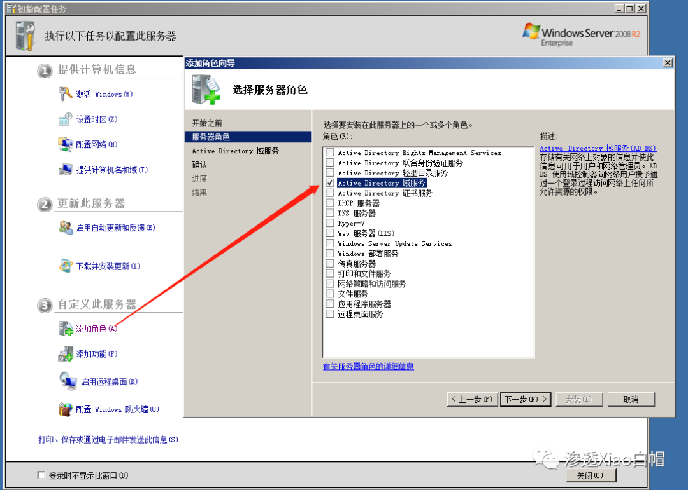

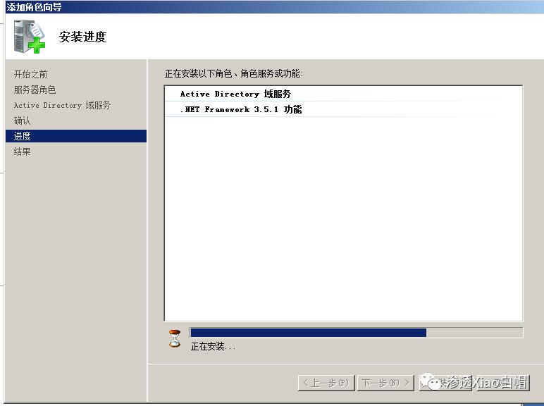

安装完成后点击如下操作

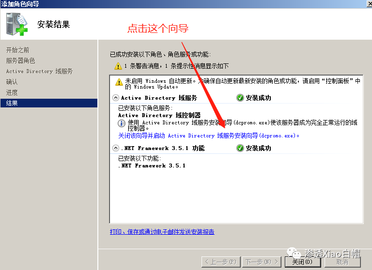

**go on**  

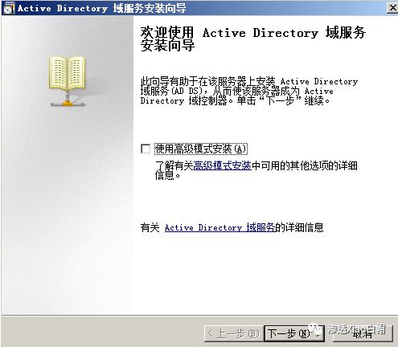

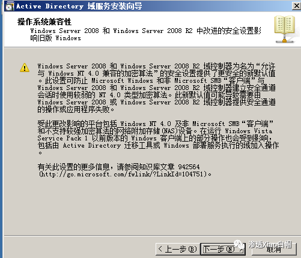

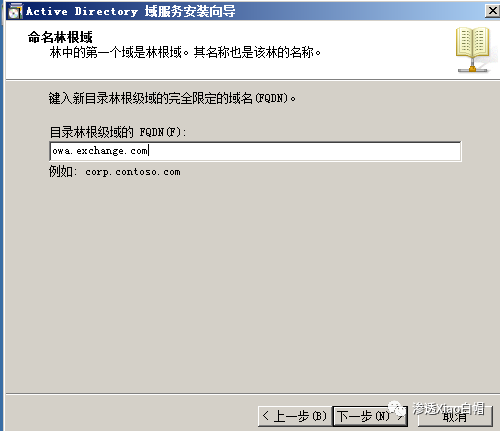

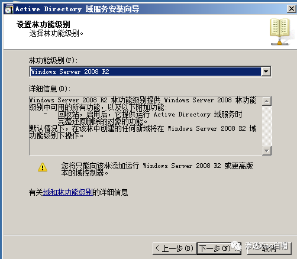

这里选择 “是”

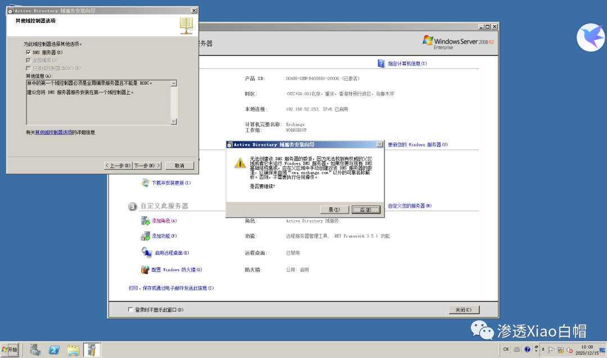

**go on**  

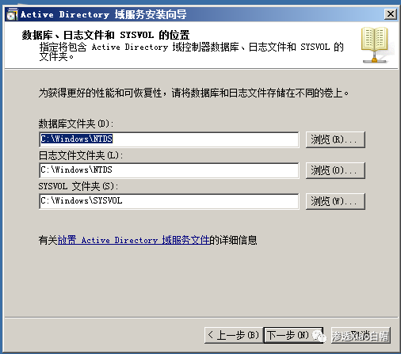

**设置密码**  

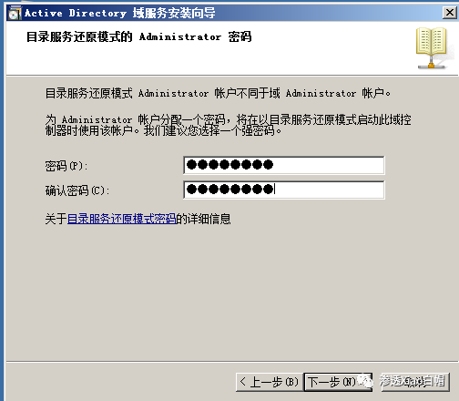 

**然后一直下一步！直到安装完成**

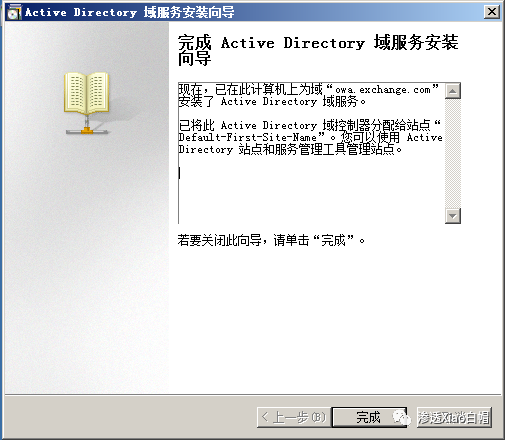

**2、安装. NET Framework 3.5.1 、IIS 及其多个角色服务**

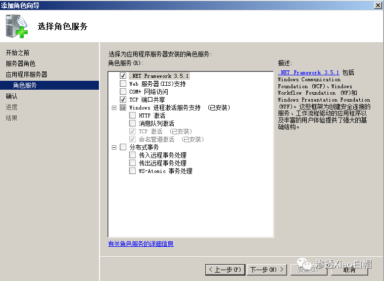 **默认即可  
**

**选中如下图所示的所有 Exchange 必须的角色服务，然后下一步**

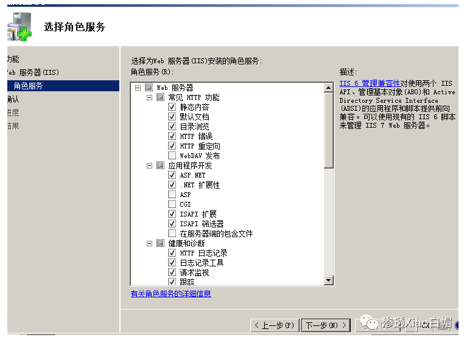

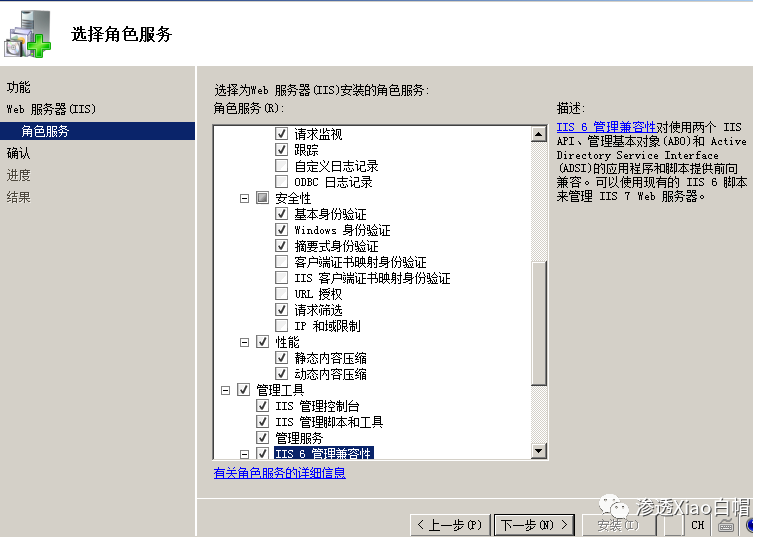

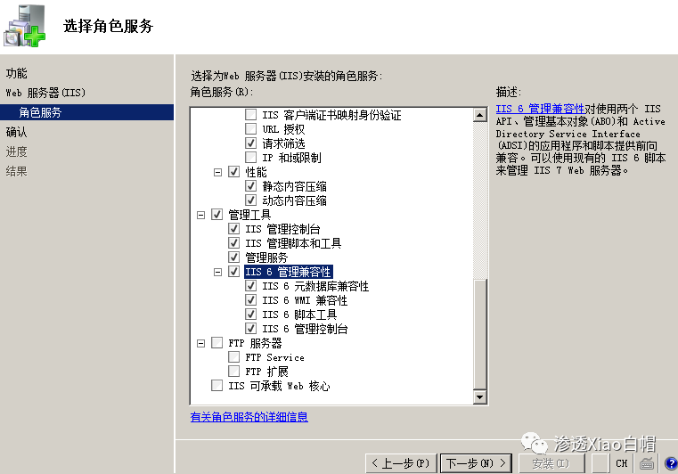

```
Add-WindowsFeature NET-Framework,RSAT-ADDS,Web-Server,Web-Basic-Auth,Web-Windows-Auth,Web-Metabase,Web-Net-Ext,Web-Lgcy-Mgmt-Console,WAS-Process-Model,RSAT-Web-Server,Web-ISAPI-Ext,Web-Digest-Auth,Web-Dyn-Compression,NET-HTTP-Activation,RPC-Over-HTTP-Proxy -Restart
```

**3、安装 HTTP 代理上的 RPC**

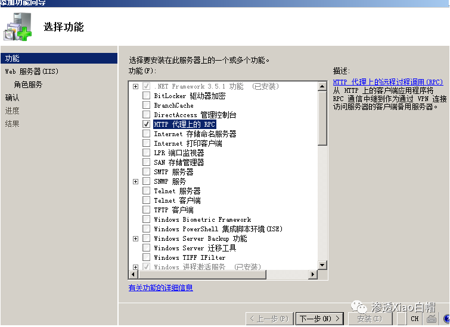

**4、安装 AD  DS 和 AD LDS 工具**

```
Set-Service NetTcpPortSharing -StartupType Automatic
```

```
Microsoft Exchange Server 2010 Service Pack 3 Update Rollup 31
```

```
下载升级进行防护
```

**没截图. jpg**


后台可以直接回关键字 "**Exchange**" 获取  

```
7、先决条件准备完毕开始安装Exchange 2010
```

```
选择典型安装
```

**go on**  

```
点击安装等待一会没有问题是这个酱紫的
```

```
小编我就不是那么顺利：客户端访问角色失败，没有截图在网上找一个
```

```
解决办法：
```

登录 Windows Server 2008，打开 powershell（就在任务栏上），输入：

```
import-Module ServerManager
```

接着输入：

```
Add-WindowsFeature NET-Framework,RSAT-ADDS,Web-Server,Web-Basic-Auth,Web-Windows-Auth,Web-Metabase,Web-Net-Ext,Web-Lgcy-Mgmt-Console,WAS-Process-Model,RSAT-Web-Server,Web-ISAPI-Ext,Web-Digest-Auth,Web-Dyn-Compression,NET-HTTP-Activation,RPC-Over-HTTP-Proxy -Restart
```

安装完成后在 powershell 输入：

```
Set-Service NetTcpPortSharing -StartupType Automatic
```

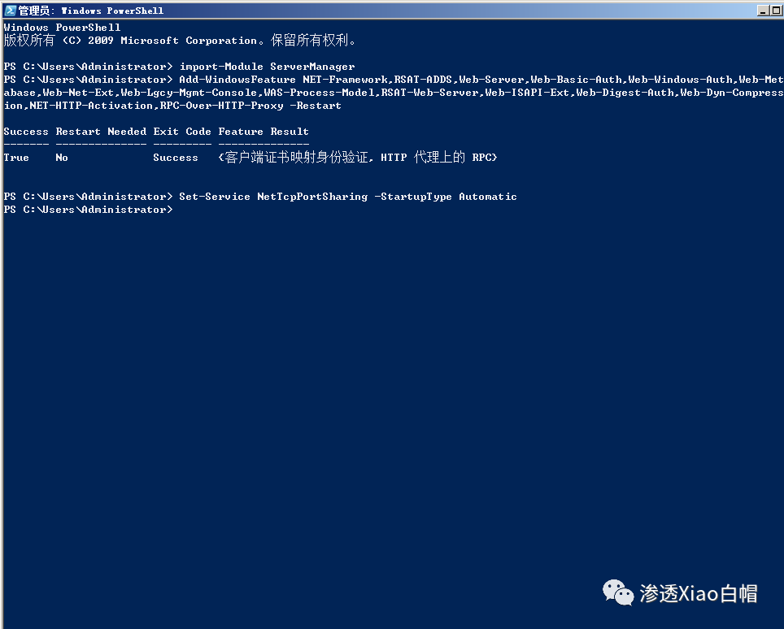

这就 OK 了，访问本地如下

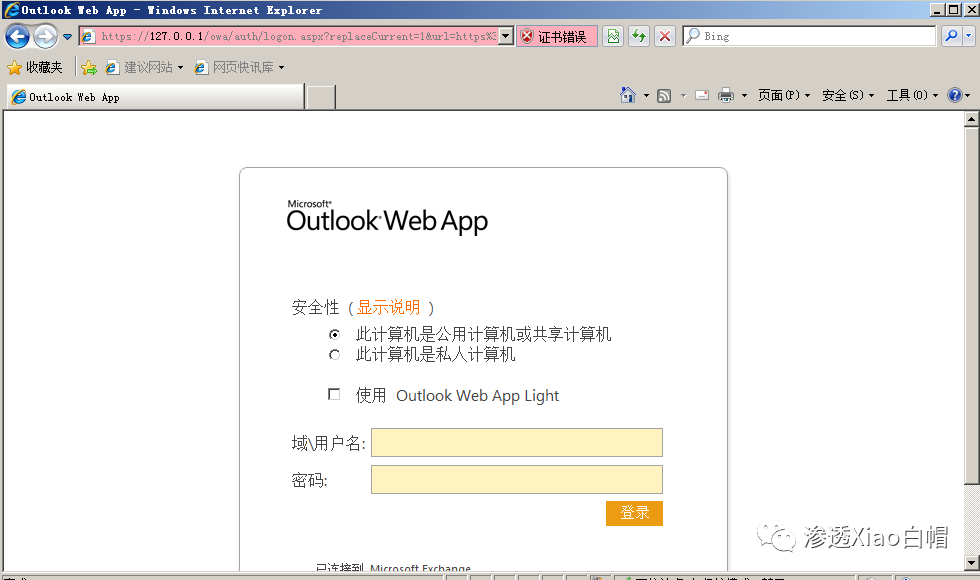

**0x03 漏洞复现**

**真的是搞环境两小时，复现两分钟**

**直接拿出 exp**

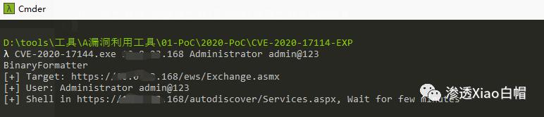

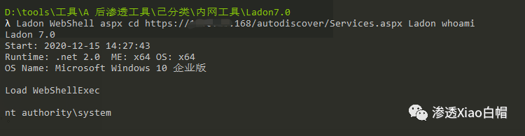

权限到手。。。天下我有


**0x04 影响版本**

```
Microsoft Exchange Server 2010 Service Pack 3 Update Rollup 31
```

**0x05 解决方案**

```
下载升级进行防护
```

_**回复 "**__**Exchange**__**" 可直接获取环境**_  

**【往期推荐】**  

[未授权访问漏洞汇总](http://mp.weixin.qq.com/s?__biz=MzI1NTM4ODIxMw==&mid=2247484804&idx=2&sn=519ae0a642c285df646907eedf7b2b3a&chksm=ea37fadedd4073c87f3bfa844d08479b2d9657c3102e169fb8f13eecba1626db9de67dd36d27&scene=21#wechat_redirect)

[【内网渗透】内网信息收集命令汇总](http://mp.weixin.qq.com/s?__biz=MzI1NTM4ODIxMw==&mid=2247485796&idx=1&sn=8e78cb0c7779307b1ae4bd1aac47c1f1&chksm=ea37f63edd407f2838e730cd958be213f995b7020ce1c5f96109216d52fa4c86780f3f34c194&scene=21#wechat_redirect)  

[【内网渗透】域内信息收集命令汇总](http://mp.weixin.qq.com/s?__biz=MzI1NTM4ODIxMw==&mid=2247485855&idx=1&sn=3730e1a1e851b299537db7f49050d483&chksm=ea37f6c5dd407fd353d848cbc5da09beee11bc41fb3482cc01d22cbc0bec7032a5e493a6bed7&scene=21#wechat_redirect)  

[记一次 HW 实战笔记 | 艰难的提权爬坑](http://mp.weixin.qq.com/s?__biz=MzI1NTM4ODIxMw==&mid=2247484991&idx=2&sn=5368b636aed77ce455a1e095c63651e4&chksm=ea37f965dd407073edbf27256c022645fe2c0bf8b57b38a6000e5aeb75733e10815a4028eb03&scene=21#wechat_redirect)  

[【超详细】Fastjson1.2.24 反序列化漏洞复现](http://mp.weixin.qq.com/s?__biz=MzI1NTM4ODIxMw==&mid=2247484991&idx=1&sn=1178e571dcb60adb67f00e3837da69a3&chksm=ea37f965dd4070732b9bbfa2fe51a5fe9030e116983a84cd10657aec7a310b01090512439079&scene=21#wechat_redirect)

[【超详细】CVE-2020-14882 | Weblogic 未授权命令执行漏洞复现](http://mp.weixin.qq.com/s?__biz=MzI1NTM4ODIxMw==&mid=2247485550&idx=1&sn=921b100fd0a7cc183e92a5d3dd07185e&chksm=ea37f734dd407e22cfee57538d53a2d3f2ebb00014c8027d0b7b80591bcf30bc5647bfaf42f8&scene=21#wechat_redirect)  

[【奇淫巧技】如何成为一个合格的 “FOFA” 工程师](http://mp.weixin.qq.com/s?__biz=MzI1NTM4ODIxMw==&mid=2247485135&idx=1&sn=f872054b31429e244a6e56385698404a&chksm=ea37f995dd40708367700fc53cca4ce8cb490bc1fe23dd1f167d86c0d2014a0c03005af99b89&scene=21#wechat_redirect)
---------------------------------------------------------------------------------------------------------------------------------------------------------------------------------------------------------------------------------------------------

_**走过路过的大佬们留个关注再走呗**_

**往期文章有彩蛋哦******


---

> 来源：MrWQ/vulnerability-paper（https://github.com/MrWQ/vulnerability-paper）
