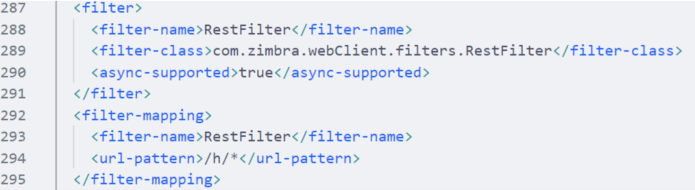
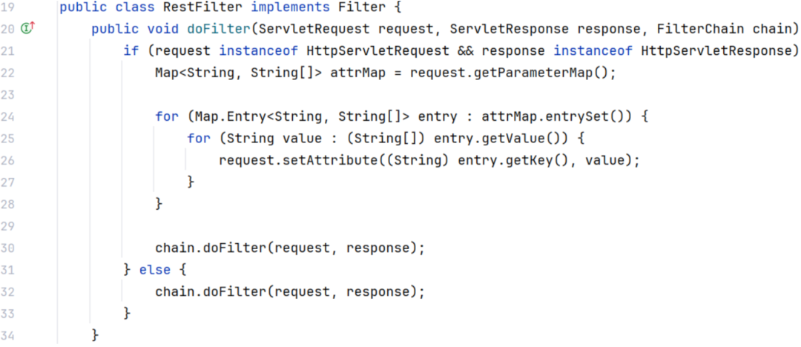
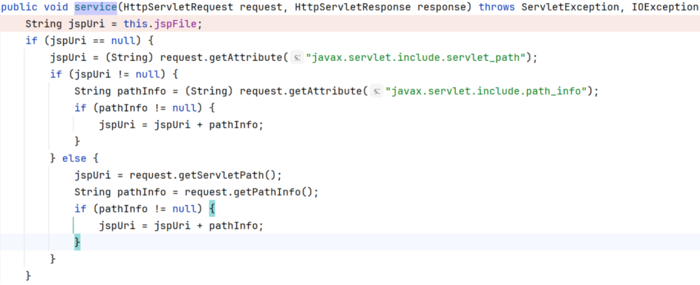
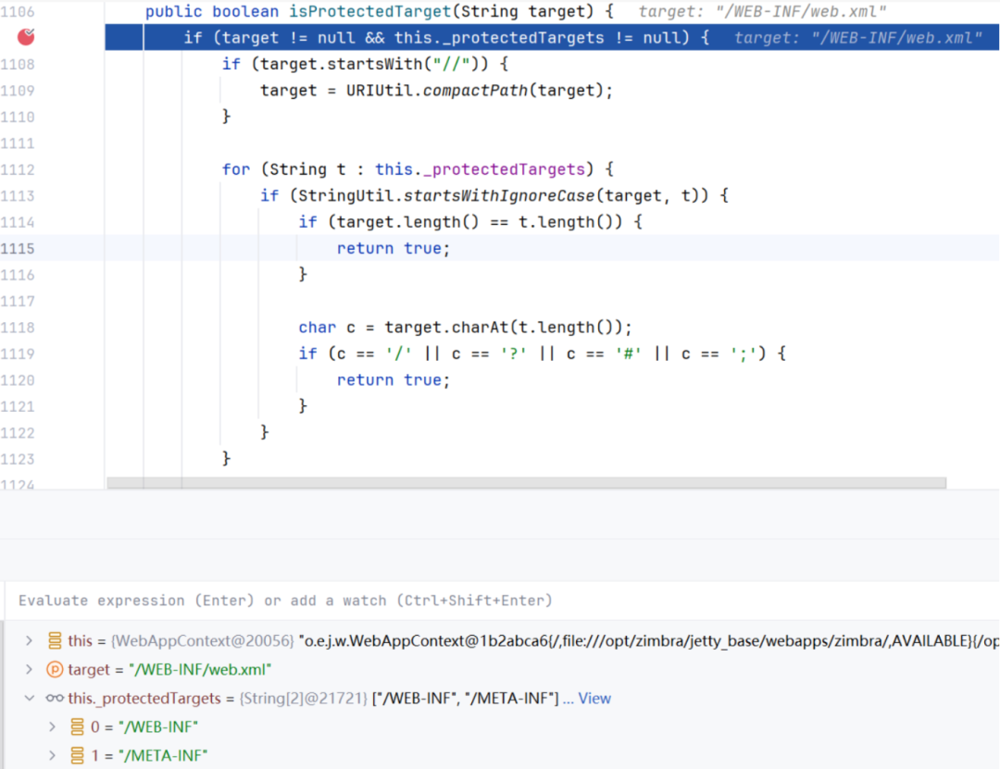
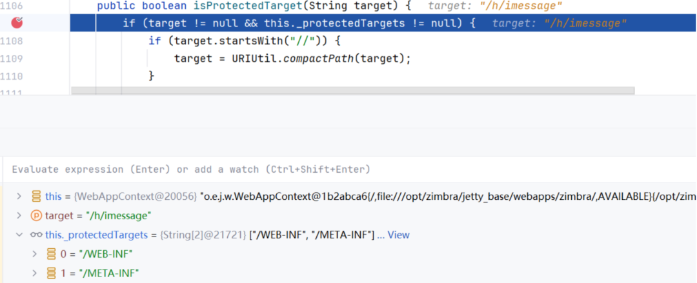
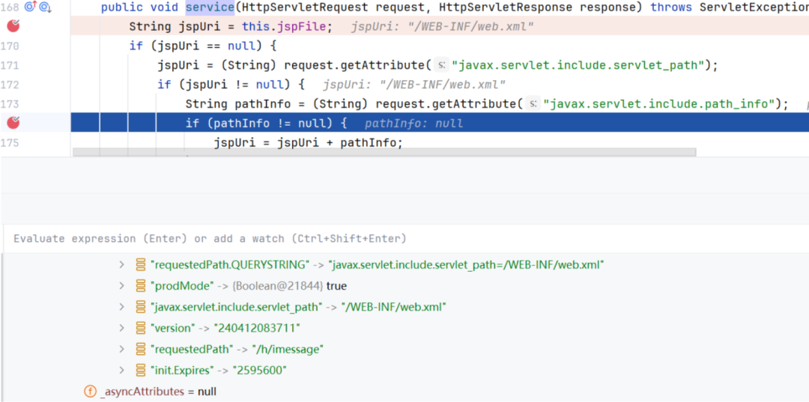
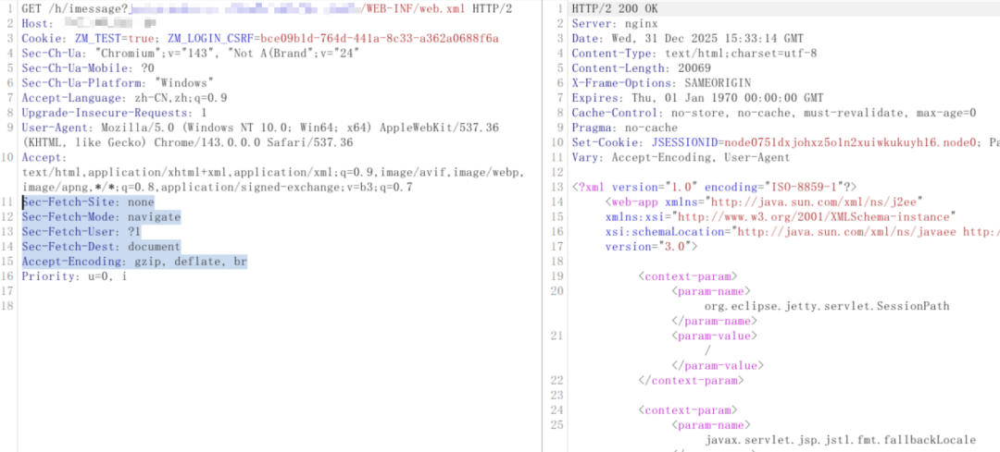

# 浅析 CVE-2025-68645 Zimbra 属性覆盖导致本地文件包含漏洞

<!-- vulwiki-editorial:start -->
## 校订与适用边界

- 适用前提：No auth per article; /h routes and RestFilter active; read limited to application WebRoot; version absent
- 证据范围：Clear request-attribute override to include.servlet_path chain and protected resource bypass; key requests/results only images

### 尚未解决的证据缺口

以下限制仍适用于后文历史材料；相关版本、结果或修复结论不能据此视为已验证：

- No affected/fixed versions or patch references
- Author says 'should coincide' with reported CVE; verify identity rather than treat as authoritative mapping
- Collapsed XML/Java formatting and fragmented inline identifiers reduce readability
- Do not widen WebRoot disclosure to arbitrary OS file read or RCE
- Extract textual reproduction/evidence from images with authorization and availability checks

本页为文本校订，未执行代码、PoC 或目标请求；原图仅保留引用，未据此确认复现成功。
<!-- vulwiki-editorial:end -->

## 技术正文与历史材料

原创 KCyber
                    KCyber  自在安全   2026-01-03 02:04  
  
   
  
   
  
近日 Zimbra  
 披露了一个本地文件包含漏洞 CVE-2025-68645  
 ，从公开信息看应该与前期朋友分享给我的一个漏洞撞了，下面就将简要分析过程分享给大家。该漏洞源于 RestFilter  
 过滤器对参数处理不当，导致未经身份认证的用户可以构造恶意请求，读取服务器 WebRoot  
 目录下的敏感文件。  
## RestFilter  
  
Zimbra  
 使用Jetty  
作为底层Web  
容器。在Zimbra  
和ZimbraAdmin  
这两个应用的web.xml  
中均可以找到RestFilter  
配置，该Filter  
匹配/h/*  
 请求：  
  
  
  
  
查看 com.zimbra.webClient.filters.RestFilter  
 实现代码，存在非常明显的 request  
 属性覆盖过程，即请求参数的值将会被复制给同名的属性：  
  
  
  
  
那么此处的属性覆盖是否可以利用呢？  
## JspServlet  
  
继续查看 web.xml  
 ，发现多个 /h/*  
 请求被定义在 jsp-config  
 中，对应处理的 Servlet  
 类为 org.apache.jasper.servlet.JspServlet  
 ：  
```
<jsp-config>    <jsp-property-group>      <url-pattern>/h/changepass</url-pattern>      <url-pattern>/h/imessage</url-pattern>      <url-pattern>/h/postLoginRedirect</url-pattern>      <url-pattern>/h/printcalls</url-pattern>      <url-pattern>/h/printcalendar</url-pattern>      <url-pattern>/h/printvoicemails</url-pattern>      <url-pattern>/h/printappointments</url-pattern>      <url-pattern>/h/rest</url-pattern>      <url-pattern>/h/printcontacts</url-pattern>      <url-pattern>/h/printconversations</url-pattern>      <url-pattern>/h/printmessage</url-pattern>      <url-pattern>/h/printtasks</url-pattern>      <url-pattern>/h/viewimages</url-pattern>      <url-pattern>/modern/</url-pattern>    </jsp-property-group>  </jsp-config>
```  
  
在 JspServlet  
 中，当从 request  
 中提取 javax.servlet.include.servlet_path  
 属性非空时，url  
 将被赋值为该属性的值：  
  
  
  
  
  
很容易想到 RestFilter  
 和 JspServlet  
 组合起来存在被利用的可能性。  
## 组合实现文件包含  
  
我们知道 Jetty  
 正常情况下无法直接访问类似 /WEB-INF/web.xml  
 的文件资源，原因是 Jetty  
 在 Handler  
 层会对 /WEB-INF  
 和 /META-INF  
 的访问进行拦截，处理代码位于 org.eclipse.jetty.server.handler.ContextHandler.doHandle  
 ，该函数将调用 isProtectedTarget  
 判断请求是否属于被保护对象：  
```
public void doHandle(String target, Request baseRequest, HttpServletRequest request, HttpServletResponse response) throws IOException, ServletException {    DispatcherType dispatch = baseRequest.getDispatcherType();    boolean new_context = baseRequest.takeNewContext();    try {        if (new_context) {            this.requestInitialized(baseRequest, request);        }        if (dispatch != DispatcherType.REQUEST || !this.isProtectedTarget(target)) {            this.nextHandle(target, baseRequest, request, response);            return;        }        baseRequest.setHandled(true);        response.sendError(404);    } finally {        if (new_context) {            this.requestDestroyed(baseRequest, request);        }    }}
```  
  
  
  
  
回顾 RestFilter  
 和 JspServlet  
 的处理逻辑可知，如果将两者结合起来就可以绕过上述检查机制，从而实现对 /WEB-INF  
 等限制目录的访问：  
  
  
  
  
  
  
  
前面已经提到，Zimbra  
 和 ZimbraAdmin  
 都配置了 RestFilter  
 ，因此这两个接口均可以实现 WebRoot  
 目录下的文件包含。读取 /WEB-INF/web.xml  
 过程如下：  
  
  
  
  
   
  
由于传播、利用此文档提供的信息而造成任何直接或间接的后果及损害，均由使用本人负责，公众号及文章作者不为此承担任何责任。  
  
   
  
  
  


---

> 来源：gelusus/wxvl（微信公众号漏洞文章自动归档，原文见文首链接）


## 2026-10-03 公开验证资料补充：RestFilter 文件包含

CVE CNA 将本问题映射到 ZCS 10.0/10.1 Classic UI 的 RestFilter。Zimbra Security Center 分别把修复列入 10.0.18、10.1.13；不能扩成任意系统路径读取，也不能与 EWS SOAP XXE（CVE-2026-33371）合并。

ProjectDiscovery 固定模板的输入是 `/h/rest?javax.servlet.include.servlet_path=/WEB-INF/web.xml`，请求不携带认证信息。其结果判据为 HTTP 200，且正文同时含 `<?xml version`、`web-app>`、`Zimbra`。这是受保护 WebRoot 文件内容判据；单独 200 或页面指纹均不够。模板还给出其他 `/h/` 路径，完整列表见固定来源，不从未查看的旧截图补写响应。

这补齐旧文只有图片的请求/结果判据。静态检查未发现模板中有命令执行、上传、安装依赖或第三方回连；请求仍可能泄露应用配置并留下日志。没有执行模板、访问目标或把来源判据写成本库实测结果。

### 本补充的公开来源与读取范围

- <https://raw.githubusercontent.com/CVEProject/cvelistV5/main/cves/2025/68xxx/CVE-2025-68645.json>（CNA字段摘读；ADP及其他字段不计全文；SHA-256 `0cb6730089707981a7795e533a97d228e32991a76ac480d81a7789e3c96968d8`）
- <https://raw.githubusercontent.com/projectdiscovery/nuclei-templates/9e93c63782dbb2b6160e068710d6240f418a3ed6/http/cves/2025/CVE-2025-68645.yaml>（固定代码全文静态阅读；SHA-256 `c0037b1db4979f283b4fa8367ef10887eef246ff14d47a9bdf9572be8c4333d1`）
- <https://wiki.zimbra.com/wiki/Security_Center>（仅10.0.18/10.1.13及68645相关公告段落；SHA-256 `967c8d8bb4dd610b642415e52c132714853f9436f044dbc9e5e6477c49d948e8`）
